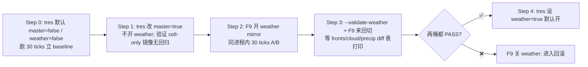

// SOP - DataCore Foundation & Weather Migration

# DataCore + Weather 迁移：灰度切换 / 回滚 SOP

> 适用计划：`.codebuddy/plan/dots-foundation-and-weather-migration/`  
> 配套验收：`task-item.md` C 阶段验收记录、`requirements.md` 需求 12/13  
> 最后更新：2026-05-11

---

## 0. 角色与术语

| 角色 / 术语 | 含义 |
|---|---|
| **Master 开关** | `ClimateProfile.use_data_core` —— 控制 DCWorld 是否 bind 到 MapData。关闭时 World 仍可创建但不挂数据，所有 system 走 legacy。 |
| **Weather 镜像开关** | `ClimateProfile.use_data_core_weather` —— 控制 weather_refresh 是否把 fronts 同步到 World 的 WeatherFront archetype。依赖 master=true。 |
| **path=legacy** | weather_refresh 完全走旧 AoS 路径，不写 World 的 front-level component。 |
| **path=data_core_cells_only** | master=true 但 weather mirror=false：cell-level 数组（temp/cloud/precip/...）已经被 World 引用挂载，front 级别仍走 AoS。 |
| **path=data_core** | master=true 且 weather mirror=true：fronts 镜像同步进 World，可被 Query 遍历。 |

---

## 1. 启动期开关矩阵

启动方式优先级：**CLI 参数 > [earth_like.tres](../../Project/project-keynes/data/world/earth_like.tres) > ClimateProfile 默认值**

| CLI 参数 | 效果 |
|---|---|
| 无参数 | 读 [earth_like.tres](../../Project/project-keynes/data/world/earth_like.tres) 里的 `use_data_core` / `use_data_core_weather`（当前默认两者都为 true）。 |
| `--data-core` / `--no-data-core` | 强制覆盖 master 开关。 |
| `--data-core-weather` / `--no-data-core-weather` | 强制覆盖 weather mirror。若打开但 master 关闭，启动期会自动把 master 一起拉起来并打日志提醒。 |
| `--validate-weather` | 启动 D-01 的单进程 A/B 采样模式（详见 §4）。 |

启动后第一行可见性日志：
```
[DataCore] flags after CLI: use_data_core=true use_data_core_weather=true validate_weather=false
```
若三者与预期不符 → 检查 CLI / tres 是否覆盖正确。

---

## 2. 运行期热键（不需重启）

| 热键 | 行为 | 何时用 |
|---|---|---|
| `F9` | 切 `use_data_core_weather` 开 / 关；若 master 关闭会自动拉起 | A/B 对照、回滚 weather 镜像 |
| `F10` | 切 `use_data_core` 开 / 关；关闭时若 weather mirror 开着会一并关掉 | 完全回滚 DataCore，回到 legacy 全路径 |
| `F11` | 打印当前 flags + World 绑定状态 + entities/components | 任何时候确认状态 |
| `F12` | 打印 validator 桶累计快照（不清零）—— 仅 `--validate-weather` 模式有效 | A/B 采样中途看进度 |

> ⚠️ **DCWorld.bind_map_data() 只在 `_setup_sus` 调一次**——若启动时 master=false，运行期 F10 拉到 true，World 仍未绑数据，path 会显示 `data_core_cells_only` 但实际无效。**首次切换需在启动时就开 master**，再用 F9 玩 weather mirror。

---

## 3. 灰度推进顺序（推荐）



每步必须看的指标（来自 SUS 30-tick 汇总）：
- `weather_refresh ran=N avg=...ms p95=...ms max=...ms slices=...` —— 要满足 ≤ legacy 110%
- `[SUS] world: bound=true entities=N components=M` —— bound=true 才算挂上
- breakdown 末尾 `weather path=...` —— 要与预期 path 一致
- breakdown 中 `fronts=N` —— 必须稳定（默认 12）

---

## 4. `--validate-weather` 单进程 A/B 流程

> 实现位置：[main.gd](../../Project/project-keynes/scripts/main.gd) `_validate_weather_collect / _try_emit_diff / _print_snapshot`

启动：
```
godot --path ./Project/project-keynes -- --validate-weather
```

1. 运行 ~30 game-day（不切 path），第一桶（默认 path=data_core）累计满 30 个采样点 → 控制台打：
   ```
   [Validate] window full for path=data_core (n=30). Switch path with F9/F10 to fill the other bucket.
   ```
2. **按 F9** —— path 翻到 legacy
3. 再跑 ~30 game-day，第二桶满 → 自动打 diff 表：
   ```
   [Validate] === A/B diff window n=30 ===
              metric        | legacy avg | data_core avg | diff %  | OK?
              fronts        |     12.000 |     12.000    |  +0.00% | ✅ (≤5%)
              cloud_sum     |    1234.5  |    1240.1     |  +0.45% | ✅ (≤3%)
              precip_sum    |     567.8  |     569.3     |  +0.26% | ✅ (≤3%)
              temp_hash_sum |   12345.6  |   12346.0     |  +0.00% | ✅ (≤1%, ref)
              temp_hash_xor | 0x1a2b3c4d | 0x1a2b3c4e    | (xor distinct, info-only)
              VERDICT: PASS ✅
   ```
4. 若 VERDICT=FAIL，按 §6 回滚步骤、提交 issue 附 diff 表。

**阈值说明**（与需求 12.3 对齐）：
- fronts diff ≤ 5%
- cloud_sum / precip_sum diff ≤ 3%
- temp_hash_sum diff ≤ 1%（参考线，info-only —— 不卡红，因为 weather→温度反馈在 24h 内会让两路径轻微漂）
- temp_hash_xor 仅展示，永远不同（任意 1 bit 翻转都会变）

> 任意时刻按 **F12** 看不清零的累计快照；`_validate_total_samples` 显示总采样数。

---

## 5. SUS 日志关键字段速查

```
[SUS] last 30 ticks: weather_refresh ran=2 avg=14.8ms p95=18.0ms max=18.1ms slices=5 ...
                                       ^      ^         ^         ^
                                       |      |         |         └─ slices/round（应稳定 2）
                                       |      |         └─ 单次最长（验收红线 18ms）
                                       |      └─ p95（次极端）
                                       └─ 平均（验收红线 ≤ legacy * 1.10）

[SUS] world: bound=true entities=2416 components=37
                ^             ^             ^
                |             |             └─ 注册的 component 数（基线 37：cell-level + front-level + topology）
                |             └─ 2400 cells + 16 front 槽位 = 2416
                └─ 是否 bind 到 MapData（false 表示 World 创建了但未挂数据 → master 实际未开）

        weather path=data_core
                     ^
                     └─ 三种取值：legacy / data_core_cells_only / data_core
```

---

## 6. 回滚 SOP

### 6.1 轻度回滚（运行期单次会话）
- 按 **F9** 关 weather mirror（保留 master）→ 临时回到 cells_only
- 或按 **F10** 关 master → 临时回到 legacy 全路径

> 注意：F10 不会卸载 World，下次再按 F10 重开 master 时 World 仍然 bound。这是**故意的**——保证同进程 A/B 公平。

### 6.2 永久回滚（提交修改）
1. 改 [earth_like.tres](../../Project/project-keynes/data/world/earth_like.tres)：
   - `use_data_core_weather = false`（保留 master，等下个版本再启）
   - 或 `use_data_core = false` + `use_data_core_weather = false`（彻底关）
2. 改 [climate_profile.gd](../../Project/project-keynes/scripts/data/climate_profile.gd) `@export` 默认值同步（保险）
3. 启动加 `--no-data-core` 验证 path=legacy
4. 跑 30 ticks 确认 `weather_refresh avg/max` 回到 legacy 基线（13.7ms / 16.6ms）
5. 不要删 `scripts/data_core/` 目录代码——只是关开关，便于下次再开

### 6.3 紧急回滚（线上 crash）
1. 启动加 `--no-data-core` 立即生效
2. 若 [main.gd](../../Project/project-keynes/scripts/main.gd) 启动期就崩溃，删用户配置目录里的存档/缓存（或编辑器中手工把 [earth_like.tres](../../Project/project-keynes/data/world/earth_like.tres) 两个开关改 false）
3. 上报：附启动期 `[DataCore] flags after CLI: ...` 那一行 + 崩溃栈

---

## 7. 验收 / 上线门槛回顾

完成 weather 迁移正式上线的硬指标（与 task-item C-03 一致）：

| 指标 | 红线 | C 阶段实测 | 状态 |
|---|---|---|---|
| weather_refresh avg ≤ legacy * 110% | ≤ 15.1ms | 14.8ms (+8%) | ✅ |
| weather_refresh max | ≤ 18ms | 18.06ms | ✅ 边线 |
| slices/round 稳定 | 2 | 2 (4/4 窗口) | ✅ |
| fronts 数稳定 | 12 ± 1 | 12 | ✅ |
| world bound=true | 必须 | true / 2416 / 37 | ✅ |
| `--validate-weather` fronts diff | ≤ 5% | （等用户实测）| ⏳ |
| `--validate-weather` cloud/precip | ≤ 3% | （等用户实测）| ⏳ |

> 黄色边线条目（max=18.06）建议在下一期"E 阶段 climate 迁移"完成前再压一次缓冲。

---

## 8. FAQ

**Q1：F9 切了之后日志里 path 没变？**  
A：weather_refresh 是切片任务，可能这一 round 还没结束，下一 round 才生效。看后续 30-tick 汇总。

**Q2：world bound=true 但 entities=2400 而非 2416？**  
A：weather mirror 没挂上 —— `data_core_ready()` 返回 false 时 front 池没注册。检查 [climate_profile.gd](../../Project/project-keynes/scripts/data/climate_profile.gd) `use_data_core_weather` 是否真的为 true。

**Q3：fronts=0 是不是迁移坏了？**  
A：不是。weather_system 在 spawn 之前 fronts 本来就是 0，跑几个 tick 即可。如果持续 0 → 看 `weather_tick=0` 是否同时为真，是就是 spawn sub-pass 没运行。

**Q4：validator 不打印 diff 表？**  
A：必须两个桶（legacy + data_core）都满 `_validate_window_size`（默认 30）。任意时刻 F12 可看进度。

**Q5：重启后 validator 桶清零？**  
A：是的。validator 是内存桶，不持久化。需要长跑可手动调大 `_validate_window_size`。

---

## 9. 变更历史

| 日期 | 变更 | 来源 |
|---|---|---|
| 2026-05-11 | 初版 SOP，覆盖 D 阶段所有运维入口 | task D-02 |
