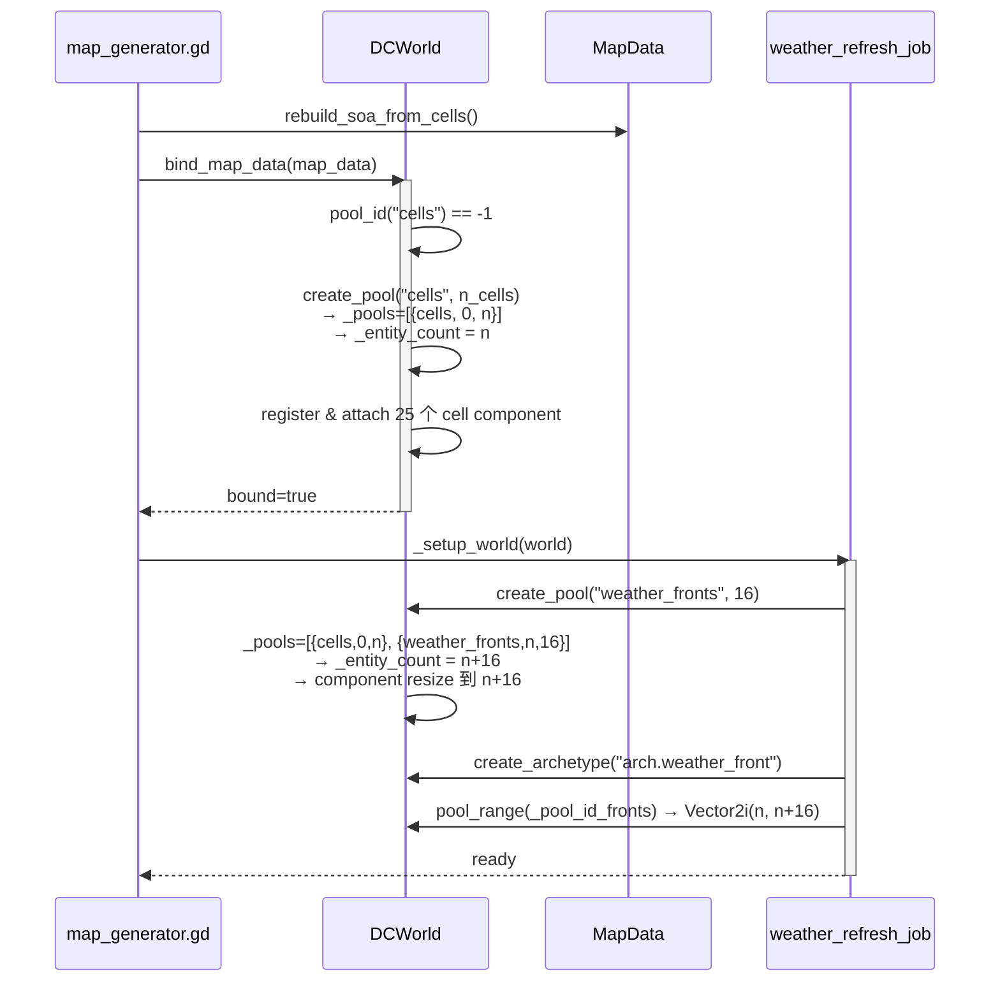
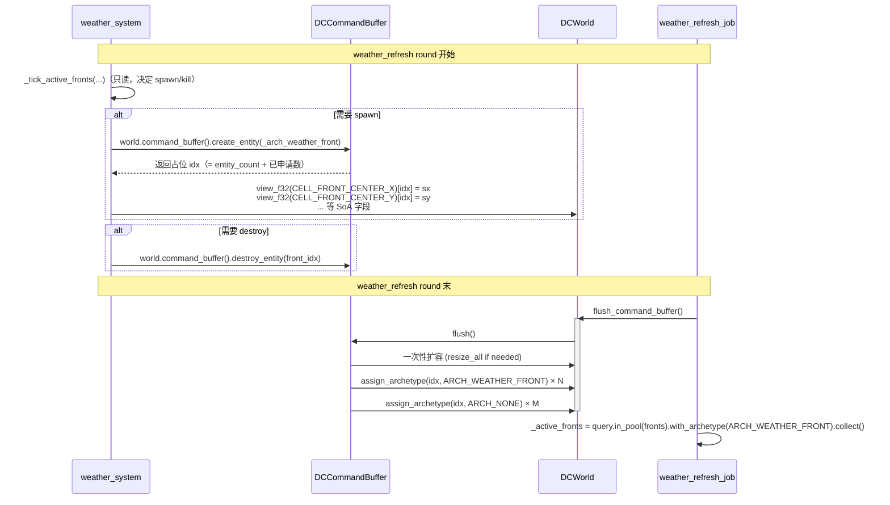

# Architecture：DOTS I2 — Pool + ECB

> 本文档记录 I2.A（多 Pool API）+ I2.B（CommandBuffer 实战化）的具体设计与
> 实施细节。**与上游 [`dots-roadmap-to-gdextension/architecture.md`](../dots-roadmap-to-gdextension/architecture.md) 的关系**：
> 本文档是 I2 阶段 **GDScript 实现的具体落点**，所有 API 形状必须与上游
> §4 中"DCWorldExt C++ 类结构"100% 同形，确保 I3.A 阶段 C++ 镜像零返工。

---

## 1. 数据结构变更

### 1.1 DCWorld 新增字段

```gdscript
# world.gd
# 多 Pool 注册表（I2.A 新增）
var _pools: Array = []                          # Array[Dictionary]：{ name, start, count }
var _pool_by_name: Dictionary = {}              # StringName → pool_id (int)
const _POOL_NONE: int = -1
```

**约束**：
- `_pools` 严格按 create 顺序记录，**不允许中途插入**（保证 idx 段单调递增）
- pool 之间**没有空洞**：第 N 个 pool 的 `start = sum(前 N-1 个 pool 的 count)`
- 删除 pool 不在本 plan 范围（增加方法但不实现 destroy_pool）

### 1.2 DCWorld 新增 API

```gdscript
# I2.A.1 — Pool 注册
func create_pool(name: StringName, capacity: int) -> int:
    # 1) 幂等：同名 pool 已存在直接返回既有 id
    if _pool_by_name.has(name):
        var existing_id: int = int(_pool_by_name[name])
        var existing: Dictionary = _pools[existing_id]
        if int(existing["count"]) != capacity:
            push_warning("[DCWorld] create_pool('%s'): existing capacity=%d != requested=%d, returning existing id"
                % [String(name), int(existing["count"]), capacity])
        return existing_id
    # 2) 新建：start = 当前 _entity_count；count = capacity
    var start: int = _entity_count
    var pool_id: int = _pools.size()
    _pools.append({ "name": name, "start": start, "count": capacity })
    _pool_by_name[name] = pool_id
    # 3) 拉伸 entity_count；component resize 由 create_entities 内部处理
    create_entities(start + capacity)
    return pool_id


func pool_range(pool_id: int) -> Vector2i:
    if pool_id < 0 or pool_id >= _pools.size():
        push_error("[DCWorld] pool_range: invalid pool_id=%d" % pool_id)
        return Vector2i(-1, -1)
    var p: Dictionary = _pools[pool_id]
    return Vector2i(int(p["start"]), int(p["start"]) + int(p["count"]))


func pool_id(name: StringName) -> int:
    return int(_pool_by_name.get(name, -1))


func pool_count() -> int:
    return _pools.size()
```

### 1.3 DCQuery 新增 API

```gdscript
# query.gd — I2.A.2
func in_pool(pid: int) -> DCQuery:
    if _world == null:
        return self
    var rng: Vector2i = _world.pool_range(pid)
    if rng.x < 0:
        # 非法 pool_id：把范围设为空段，遍历时一次都不进 callback
        _range_begin = 0
        _range_end = 0
        return self
    _range_begin = rng.x
    _range_end = rng.y
    return self
```

**与现有 `with_range` 的关系**：`in_pool` 实现就是"查表 + 设 range"，因此与 `with_range`
共用 `_range_begin/_range_end` 字段，**后调用者覆盖前者**（链式调用语义直观）。

### 1.4 bind_map_data 自动建 cells pool

```gdscript
# world.gd — I2.A.4
func bind_map_data(map_data) -> void:
    # ... 原有前置校验 ...
    var n: int = map_data.cell_count()
    
    # ★ 新增：自动建 cells pool（在 _entity_count 设置之后、register 之前）
    var existing_cells_pid: int = pool_id(&"cells")
    if existing_cells_pid >= 0:
        # 调用方手动 create 过；校验容量
        var existing: Dictionary = _pools[existing_cells_pid]
        if int(existing["count"]) != n:
            push_error("[DCWorld] bind_map_data: existing 'cells' pool capacity=%d != cell_count=%d"
                % [int(existing["count"]), n])
            return
    else:
        # 自动建池：会顺带把 _entity_count 拉到 n
        create_pool(&"cells", n)
    # 兼容旧路径：如果是首次 bind 且没有 pool，create_pool 已经设置 _entity_count = n
    _entity_count = n  # 保险（首次 bind 时多余但无害；后续 bind 时刷新）
    
    # ... 原有 component 注册逻辑不变 ...
```

**关键点**：`create_pool` 会调 `create_entities(start + capacity)`，对所有非 external_ref 的 component 同步 resize。external_ref（即 MapData 挂入的）在后续 `_bind_register_and_attach` 阶段挂入引用，不会被错误 resize。

---

## 2. 时序图

### 2.1 I2.A 启动顺序（多 pool 注册）



### 2.2 I2.B Spawn/Destroy 走 ECB



---

## 3. 改造点清单

### 3.1 新增 / 修改文件

| 文件 | 改动类型 | 内容 |
|---|---|---|
| [`world.gd`](../../Project/project-keynes/scripts/data_core/world.gd) | 修改 | + create_pool / pool_range / pool_id / pool_count；bind_map_data 自动建 cells pool |
| [`query.gd`](../../Project/project-keynes/scripts/data_core/query.gd) | 修改 | + in_pool 链式 API |
| [`weather_refresh_job.gd`](../../Project/project-keynes/scripts/simulation/sus/jobs/weather_refresh_job.gd) | 修改 | 改用 create_pool / in_pool；flush_command_buffer 调用入口 |
| [`weather_system.gd`](../../Project/project-keynes/scripts/weather/weather_system.gd) | 修改 | _spawn_random_front / _spawn_emergent_front / 死亡回收循环走 ECB |
| [`weather_refresh_job.gd::_sync_fronts_to_world`](../../Project/project-keynes/scripts/simulation/sus/jobs/weather_refresh_job.gd) | 修改 | 移除 assign_archetype 部分；保留数据写入部分（I2.B.3 分两步）|

### 3.2 不修改的文件（保持向后兼容）

| 文件 | 原因 |
|---|---|
| [`command_buffer.gd`](../../Project/project-keynes/scripts/data_core/command_buffer.gd) | 现有实现已满足需求，I2.B 只是"开始用"，不修改 |
| [`component_ids.gd`](../../Project/project-keynes/scripts/data_core/component_ids.gd) | ARCH_CELL / ARCH_WEATHER_FRONT 已注册 |
| [`map_generator.gd`](../../Project/project-keynes/scripts/geography/map_generator.gd) | 调 bind_map_data 即可，pool 由 bind 内部自动建 |
| `climate_*_job.gd` | climate 全部走 cells pool（默认 [0, n) 等价），无需修改 |

### 3.3 风险点：weather_system 的 `_active_fronts` 双语义

`_active_fronts: Array[WeatherFront]` 当前承担两个语义：
1. **真值**：weather 内部 advance / decay / orographic 等逻辑直接写它
2. **缓存**：sync_fronts_to_world 把它镜像到 World 的 SoA

I2.B 的策略：
- **真值不变**：`_active_fronts` 仍是 weather_system 内部 advance 等逻辑的真值
- **同步方式变**：spawn/destroy 时往 ECB 提交指令；flush 后由 weather_refresh_job 重建一份"World 视角的 active list"，与 `_active_fronts` **形成镜像**
- **数据通道**：每个 round 末，`_sync_fronts_to_world` 把 `_active_fronts` 的当前数据写入 SoA（保留），但不再写 archetype 标记位（已由 ECB 处理）

**为什么不一步到位把 `_active_fronts` 也消除？**
答：那是 I3 GDExtension 的范畴 —— 当 hot loop 全部 C++ 化后，`_active_fronts`
GDScript 实例数组本身就没人读了，自然消亡。本 plan 不做（避免重蹈 P0-② 覆辙：
GDScript 路径下 SoA 索引比 AoS field 慢）。

---

## 4. 验收检查表

### 4.1 单元行为

- [ ] `create_pool` 幂等：同名重复调用返回相同 pool_id
- [ ] `create_pool` 容量校验：同名不同容量 push_warning
- [ ] `pool_range` 非法 id：返回 `Vector2i(-1,-1)` + push_error
- [ ] `in_pool` 非法 id：遍历空段（callback 一次都不调用）
- [ ] `in_pool + with_archetype`：取交集
- [ ] bind_map_data 自动建 cells pool：pool_count() == 1
- [ ] bind 后再 create_pool("weather_fronts", 16)：pool_count() == 2 且 entity_count = cell_n + 16

### 4.2 集成行为

- [ ] F11 切换 climate path 仍工作
- [ ] F9 切换 weather path 仍工作
- [ ] F12 SnapshotProbe 输出新增 pool 行
- [ ] 30-day --validate-weather 通过（front 直方图无统计差异）
- [ ] SUS 30-tick 数字（climate / weather / ocean / sea_ice）±2%

### 4.3 性能红线

- [ ] `weather_refresh` avg ±2%
- [ ] `refresh_climate_daily` avg ±2%
- [ ] `flush_command_buffer` 单次开销 < 0.05ms（debug log 验证）

---

## 5. 决策日志

- **2026-05-11**：本 plan 创建。范围确定为 I2.A + I2.B，剔除 P2-⑤ archetype 物理重排和 transport_anomaly SoA 化（详见上游 architecture.md §8 决策日志条目）。
- **2026-05-11**：API 形状决策 —— `create_pool` 顺带拉伸 `_entity_count`，而非要求调用方先 create_entities 再 create_pool；理由：调用方零侵入，与上游 `bind_map_data` 自动建 cells pool 的语义一致。
- **2026-05-11**：`_active_fronts` 不消除决策 —— 保留 GDScript 端 AoS 实例数组作为 weather 内部逻辑的"真值"，spawn/destroy 走 ECB 改的是"World 端的 archetype 标记"，两者形成镜像；彻底消除留给 I3.C-4 GDExtension 阶段，避免 P0-② 覆辙。
