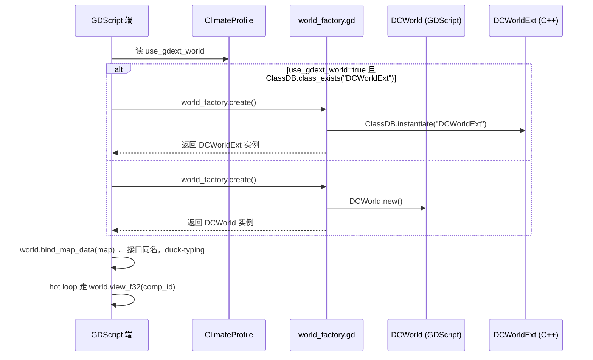
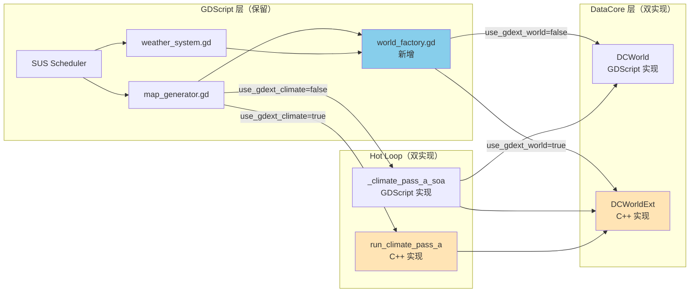

# Architecture：DOTS Roadmap to GDExtension

> 本文档锁定 **I3 阶段（GDExtension 接管 hot loop）** 的工程架构、跨语言调用约定、
> 物理目录布局。目的是让 I3.A 启动时不犹豫"该把 .h 放哪、SConstruct 怎么写、
> bind_map_data 在 C++ 里怎么实现"。
>
> I1 / I2 不涉及 C++，**架构在 GDScript 层不变**，仅微调（多 pool、ECB 实战）；
> I3 才是质变点 → 本文档主要描述 I3 之后的目标态。

---

## 1. 物理目录布局（I3.A 落地后）

```
ProjectKeynes/
├── Project.Keynes/                     # Godot 工程
│   └── Project/project-keynes/
│       ├── addons/dots_ext/            # GDExtension 部署目录（编译产物）
│       │   ├── dots_ext.gdextension    # GDExtension 配置（三平台动态库声明）
│       │   └── bin/
│       │       ├── windows/dots_ext.windows.template_debug.x86_64.dll
│       │       ├── windows/dots_ext.windows.template_release.x86_64.dll
│       │       ├── linux/libdots_ext.linux.template_debug.x86_64.so
│       │       ├── linux/libdots_ext.linux.template_release.x86_64.so
│       │       ├── android/libdots_ext.android.template_debug.arm64.so
│       │       └── android/libdots_ext.android.template_release.arm64.so
│       ├── scripts/
│       │   ├── data_core/              # GDScript 端 DataCore（保留作为 fallback）
│       │   │   ├── world.gd            # DCWorld（GDScript 实现）
│       │   │   ├── query.gd
│       │   │   ├── command_buffer.gd
│       │   │   └── component_ids.gd
│       │   ├── geography/map_generator.gd
│       │   ├── weather/weather_system.gd
│       │   └── ...
│       └── data/
│           └── world/earth_like.tres   # use_gdext_world / use_gdext_climate / use_gdext_weather 开关
└── gdext/                              # ← I3.A 新增目录（C++ 源码与构建系统）
    ├── SConstruct                      # SCons 构建脚本（继承 godot-cpp 模板）
    ├── godot-cpp/                      # git submodule，pin 到 godot-4.x 兼容 commit
    └── src/
        ├── register_types.h
        ├── register_types.cpp          # GDExtension 注册入口
        ├── world_ext.h
        ├── world_ext.cpp               # DCWorldExt 主体（C++ 版 DCWorld）
        ├── query_ext.h
        ├── query_ext.cpp               # DCQueryExt
        ├── command_buffer_ext.h
        ├── command_buffer_ext.cpp      # DCCommandBufferExt
        ├── components/
        │   ├── component_ids.h         # 与 GDScript 端 component_ids.gd 同步定义
        │   └── slot.h                  # _Slot 内部数据结构
        ├── systems/
        │   ├── climate_pass_a.cpp      # 第一个接管的 hot loop（I3.B）
        │   ├── climate_pass_b.cpp      # I3.C-1
        │   ├── ocean_water_pass.cpp    # I3.C-2
        │   ├── ocean_land_pass.cpp     # I3.C-3
        │   └── weather_field_advect.cpp# I3.C-4
        └── profiles/
            ├── climate_profile_struct.h # ClimateProfile 序列化为 plain struct
            └── ...
```

**设计要点**：
- `gdext/` 与 `Project.Keynes/` 平级，**不污染 Godot 工程**；
- SCons 输出直接到 `Project.Keynes/.../addons/dots_ext/bin/` —— 编译完无需手动拷贝；
- godot-cpp 用 submodule 而非 npm-style 依赖 —— Godot 4.x 升级时方便整体跟进；
- 单一 .gdextension 文件覆盖三平台 —— 避免多文件维护。

---

## 2. 跨语言调用架构

### 2.1 三层开关矩阵

GDScript 端依旧是入口，C++ 端只是"实现细节替换"。开关层叠如下：

```
ClimateProfile（resource）
├─ use_data_core            # I0 已就位：World 是否 bind MapData
├─ use_data_core_weather    # I0 已就位：weather front 镜像入 World
├─ use_data_core_climate    # I0 已就位：climate hot path 走 view_f32
│
├─ use_gdext_world          # I3.A 新增：World 实例本身是否走 C++ 版（DCWorldExt）
├─ use_gdext_climate        # I3.B 新增：climate 4 个 sub-pass 是否走 C++ 实现
└─ use_gdext_weather        # I3.C-4 新增：weather field solver 是否走 C++ 实现
```

**正交性约束**：任意组合都不致命。例如：
- `use_data_core=true / use_gdext_world=false` → 全 GDScript（当前 I1 之后的状态）
- `use_data_core=true / use_gdext_world=true / use_gdext_climate=false` → World 是 C++ 实例，但 hot loop 还在 GDScript 跑（I3.A 零加速 wrapper 验证态）
- `use_gdext_world=true / use_gdext_climate=true / use_gdext_weather=false` → climate C++ 加速、weather 仍 GDScript（I3.B 完成、I3.C-4 未做的中间态）

### 2.2 实例切换流程



**关键**：`world_factory.gd` 是 I3.A 新增的薄工厂（10 行代码），让 GDScript 端无需 `if/else` 分支，所有调用方都 duck-typing 用 World 接口。

### 2.3 跨语言调用约定（hot path 原则）

| 场景 | 推荐方式 | 禁忌 |
|---|---|---|
| C++ 读 GDScript PackedArray | `arr.ptrw()` 拿裸指针 | 不要用 operator[]（虚函数开销）|
| C++ 调 GDScript 方法 | `Object::call("method", args)` | hot loop 内禁止（每次 ~1μs 开销）|
| GDScript 调 C++ 方法 | 直接 `world.run_climate_pass_a(...)` | 单次调用 ~100ns，可接受 |
| 跨语言传 ClimateProfile 常量 | 序列化为 plain C struct（25 个 float），一次传入 | 不要传 ClimateProfile 引用让 C++ 反复读字段 |
| 跨语言传 phase / dt | 函数参数 | 不要写到 C++ 全局静态 |
| component_id 缓存 | C++ 端在 `_on_world_bound` 类似时机一次性查 | hot loop 内禁止反射 component_id |

### 2.4 bind_map_data 在 C++ 端的实现

GDScript 版的 `bind_map_data` 直接读 `map.temp_arr` 字段。C++ 端通过 `Object::call` 桥接：

```cpp
// world_ext.cpp（伪代码）
bool DCWorldExt::bind_map_data(Object* map_data) {
    if (!map_data) return false;
    
    // 通过 Object::call 拿 PackedFloat32Array 引用（COW，零拷贝）
    Variant temp_arr = map_data->call("get_temp_arr");
    if (temp_arr.get_type() != Variant::PACKED_FLOAT32_ARRAY) return false;
    _slots[CELL_TEMP].arr_f32 = temp_arr;
    _slots[CELL_TEMP].external_ref = true;
    
    // ... 25 个 component 同样模式
    
    _bound = true;
    return true;
}
```

**前提**：GDScript 端 `MapData` 需要为每个 PackedArray 暴露 `get_xxx_arr()` getter。
- 选项 A：手写 25 个 getter（机械活，半天）
- 选项 B：让 C++ 通过 `Object::get("temp_arr")` 直读 GDScript 实例字段（更慢，但零侵入）
- **决策**：I3.A 阶段先用选项 B 验证，I3.B 性能不达标时再切选项 A

---

## 3. SConstruct 设计

```python
#!/usr/bin/env python
import os

# 继承 godot-cpp 模板
env = SConscript("godot-cpp/SConstruct")

# 源码扫描（递归 src/）
env.Append(CPPPATH=["src/"])
sources = Glob("src/*.cpp") + Glob("src/components/*.cpp") \
        + Glob("src/systems/*.cpp") + Glob("src/profiles/*.cpp")

# 输出目录：直接到 Godot 工程的 addons 目录
output_dir = "../Project.Keynes/Project/project-keynes/addons/dots_ext/bin/"

if env["platform"] == "windows":
    output_path = output_dir + "windows/dots_ext{}{}.dll".format(
        env["suffix"], env["SHLIBSUFFIX"]
    )
elif env["platform"] == "linux":
    output_path = output_dir + "linux/libdots_ext{}{}.so".format(
        env["suffix"], env["SHLIBSUFFIX"]
    )
elif env["platform"] == "android":
    output_path = output_dir + "android/libdots_ext{}{}.so".format(
        env["suffix"], env["SHLIBSUFFIX"]
    )
else:
    raise Exception("Unsupported platform: " + env["platform"])

library = env.SharedLibrary(output_path, source=sources)
Default(library)
```

**编译命令**（以 Windows debug 为例）：
```bash
cd gdext
scons platform=windows target=template_debug
# 产物：../Project.Keynes/Project/project-keynes/addons/dots_ext/bin/windows/dots_ext.windows.template_debug.x86_64.dll
```

**.gdextension 文件**：
```ini
[configuration]
entry_symbol = "dots_ext_init"
compatibility_minimum = "4.4"

[libraries]
windows.debug.x86_64    = "res://addons/dots_ext/bin/windows/dots_ext.windows.template_debug.x86_64.dll"
windows.release.x86_64  = "res://addons/dots_ext/bin/windows/dots_ext.windows.template_release.x86_64.dll"
linux.debug.x86_64      = "res://addons/dots_ext/bin/linux/libdots_ext.linux.template_debug.x86_64.so"
linux.release.x86_64    = "res://addons/dots_ext/bin/linux/libdots_ext.linux.template_release.x86_64.so"
android.debug.arm64     = "res://addons/dots_ext/bin/android/libdots_ext.android.template_debug.arm64.so"
android.release.arm64   = "res://addons/dots_ext/bin/android/libdots_ext.android.template_release.arm64.so"
```

---

## 4. DCWorldExt 类结构

```cpp
// world_ext.h
#pragma once
#include <godot_cpp/classes/ref_counted.hpp>
#include <godot_cpp/variant/packed_float32_array.hpp>
#include <godot_cpp/variant/packed_int32_array.hpp>
#include <godot_cpp/variant/packed_byte_array.hpp>
#include <godot_cpp/templates/vector.hpp>
#include <godot_cpp/templates/hash_map.hpp>
#include "components/slot.h"

namespace godot {

class DCWorldExt : public RefCounted {
    GDCLASS(DCWorldExt, RefCounted);

protected:
    static void _bind_methods();

private:
    Vector<Slot> _slots;
    HashMap<StringName, int> _slot_by_name;
    int _entity_count = 0;
    
    // 多 pool（I2.A 的 C++ 镜像）
    struct Pool { StringName name; int start; int count; };
    Vector<Pool> _pools;
    HashMap<StringName, int> _pool_by_name;
    
    // bind 状态
    Object* _map_data = nullptr;  // 弱引用（GDScript 实例）
    bool _bound = false;
    
    // archetype（与 GDScript 版同步）
    Vector<Dictionary> _archetypes;
    HashMap<StringName, int> _archetype_by_name;
    PackedInt32Array _entity_archetype;

public:
    // ─── Component 注册 ─────────────────────
    int register_component(const StringName& name, int dtype, int stride = 1, bool track_prev = false);
    int component_id(const StringName& name) const;
    int component_count() const;
    
    // ─── Pool API（I2.A 镜像）────────────────
    int create_pool(const StringName& name, int capacity);
    Vector2i pool_range(int pool_id) const;
    
    // ─── Hot path 数据访问 ──────────────────
    PackedFloat32Array view_f32(int comp_id);
    PackedInt32Array view_i32(int comp_id);
    PackedByteArray view_u8(int comp_id);
    
    // ─── Bind ───────────────────────────────
    bool bind_map_data(Object* map_data);
    bool is_bound() const { return _bound; }
    
    // ─── Archetype ──────────────────────────
    int create_archetype(const StringName& name, const Array& comp_ids);
    void assign_archetype(int idx, int arch_id);
    PackedInt32Array entity_archetype_array() const { return _entity_archetype; }
    
    // ─── Hot loop 接管入口（I3.B/C 逐个实现）────
    double run_climate_pass_a(const Dictionary& cp_struct, double phase, double season_phase);
    double run_climate_pass_b(const Dictionary& cp_struct, double phase, double season_phase);
    double run_ocean_water_pass(const Dictionary& cp_struct, double phase);
    double run_ocean_land_pass(const Dictionary& cp_struct, double phase);
    double run_weather_field_advection(const Dictionary& weather_cfg, double dt);
};

}
```

**注意点**：
- `MapData* _map_data` 用裸指针 `Object*` 而非 `Ref<>` —— GDScript 那边持有强引用，C++ 端只读
- `view_f32` 返回 `PackedFloat32Array` 值（实际是 COW 引用，零拷贝）
- `run_xxx` 返回 `double` 是 elapsed_ms（与 GDScript 版同语义）

---

## 5. Hot Loop C++ 实现模板（I3.B 的 climate_pass_a）

```cpp
// systems/climate_pass_a.cpp
#include "../world_ext.h"
#include "../profiles/climate_profile_struct.h"

namespace godot {

double DCWorldExt::run_climate_pass_a(const Dictionary& cp_dict, double phase, double season_phase) {
    auto t0 = std::chrono::high_resolution_clock::now();
    
    // 1) 反序列化 ClimateProfile 常量到 plain struct（一次性，循环外）
    ClimateProfileStruct cp;
    cp.from_dict(cp_dict);
    
    // 2) 取 PackedArray 引用 + 裸指针（循环外）
    int n = _entity_count;  // 或 pool_range(POOL_CELLS).y
    PackedFloat32Array temp = _slots[CELL_TEMP].arr_f32;
    PackedFloat32Array moisture = _slots[CELL_MOISTURE].arr_f32;
    PackedFloat32Array snow = _slots[CELL_SNOW_COVER].arr_f32;
    PackedByteArray dirty_mask = _slots[CELL_CLIMATE_DIRTY].arr_u8;
    PackedFloat32Array elev = _slots[CELL_ELEVATION].arr_f32;
    PackedByteArray is_water = _slots[CELL_IS_WATER].arr_u8;
    // ... 13 个数组
    
    float* temp_w = temp.ptrw();
    float* moisture_w = moisture.ptrw();
    float* snow_w = snow.ptrw();
    const uint8_t* dirty_r = dirty_mask.ptr();
    const float* elev_r = elev.ptr();
    const uint8_t* is_water_r = is_water.ptr();
    // ... 13 个裸指针
    
    // 3) Hot loop（C++ 内部跑，无任何跨语言调用）
    for (int i = 0; i < n; ++i) {
        if (!dirty_r[i]) continue;  // sparse path
        
        // 算法实现（复刻 _climate_pass_a_soa）
        float t = temp_w[i];
        // ... 算法逻辑
        temp_w[i] = t;
    }
    
    auto t1 = std::chrono::high_resolution_clock::now();
    return std::chrono::duration<double, std::milli>(t1 - t0).count();
}

}
```

**性能要点**：
- 所有数组引用 + 裸指针在循环外取一次（COW 不分裂的前提：循环内只 `ptrw[i] = x` 不 resize）
- `if (!dirty_r[i]) continue` 让 sparse path 收益保留（与 GDScript 版一致）
- 内层无虚函数调用、无跨语言开销 → 编译器自动向量化（-O2 + AVX2）通常 ≥ 3x 加速

---

## 6. 关键风险点与对策

### 6.1 PackedArray COW 分裂

**症状**：C++ 端 hot loop 写完后，GDScript 端读 `map.temp_arr` 看不到修改。
**原因**：bind 之后某个时刻有 resize 发生，或 GDScript 端做了 `var x = map.temp_arr` 复制。
**对策**：
- I3.A.4 零加速 wrapper 阶段加 assert：`view_f32(CELL_TEMP).ptr() == map.temp_arr.ptr()`
- 任何 resize 必须走 ECB；hot loop 内禁止任何 `arr.resize(...)` / `arr.push_back(...)`

### 6.2 godot-cpp 与 Godot 版本不兼容

**症状**：GDExtension 加载报 `compatibility_minimum` 错误。
**对策**：
- godot-cpp pin 到具体 commit（本计划首版用 `4.4` 分支 head）
- 升级 Godot 时跑全量回归（30-day × 三平台）

### 6.3 Android NDK 编译坑

**典型坑**：
- `armv8-a` vs `arm64` 命名混乱
- NDK r25 / r26 API level 不一致
- godot-cpp 在某些 NDK 版本下需打 patch

**对策**：I3.A.6 早测；准备 fallback NDK r25c（已知稳定版本）。

### 6.4 跨语言调用开销（GDScript 调 C++）

**测量基线**：单次 `world.run_climate_pass_a(...)` 调用桥接开销 ~100ns（可忽略）。
**反模式**：hot loop 内调 C++ 方法（每 cell 一次 = 100ns × 600K = 60ms 开销，把加速吃光）。
**对策**：架构强制 —— C++ 端每个 `run_xxx` 接管一整段 sub-pass，循环在 C++ 内部跑完。

---

## 7. 与既有架构的衔接



**关键约束**：C++ pass 只能配 C++ World（DCWorldExt），GDScript pass 两个 World 都能配。
原因：C++ pass 需要直接读 DCWorldExt 内部 `_slots` 数组拿裸指针，跨实例是不行的。
代码中通过运行时 type check 守护：
```gdscript
# map_generator.gd
if cp.use_gdext_climate:
    if not _data_core_world is DCWorldExt:
        push_warning("[gdext] use_gdext_climate=true requires DCWorldExt; falling back to GDScript")
        return _climate_pass_a_soa_gdscript(...)
    return _data_core_world.run_climate_pass_a(...)
```

---

## 8. 决策日志

- **2026-05-11**：架构定稿。终点 = GDExtension 接管 hot loop。
- **2026-05-11**：选 SCons + godot-cpp 而非 cmake-godot-cpp 模板（前者是 Godot 官方默认）。
- **2026-05-11**：bind_map_data 首版用 `Object::get("xxx_arr")` 反射读字段，性能不达标时切手写 25 个 getter。
- **2026-05-11**：移动端目标 = Android arm64；不做 iOS / WASM（后者不支持 GDExtension 动态库）。
- **2026-05-11**：**P0-② 完成** — weather hot loop（`begin_weather_field_solve` /
  `run_weather_field_solve_slice` / `commit_weather_field_solve` /
  `_apply_frontal_convergence_boost`）全部走 SoA 直读直写，仅
  `_avg_ocean_anomaly_at_idx` 内部对 `temperature_transport_anomaly` 保留 AoS
  访问（归属 climate ocean heat transport pass 改造，下个 plan）。新增 6 个
  cell-level component（`CELL_WEATHER_VAPOR/CONVERGENCE/INSTABILITY/FIELD_INIT/
  AIR_MASS_TEMP_ANOMALY/HAS_RIVER`）+ 6 个 SoA 字段。完工状态见
  [`weather-datacore-step2-bfull/`](../weather-datacore-step2-bfull/requirements.md)。
- **2026-05-11**：**关键性能教训（GDScript SoA 反优化）** —— Step-2 B-full 落地后
  实测发现 weather hot loop 在 GDScript 路径下 **劣化 1-3 ms**（`weather_tick`
  从 8.6-9.0 ms → 9.5-11.5 ms），与设计阶段"略降或持平"的预期相反。
  **根因**：GDScript 解释器下 `PackedFloat32Array[i]`（80-120 ns，含 Variant
  拆装箱 + bound check）**慢于** `cell.weather_vapor`（50-80 ns，单次 hash
  table property 查找）。按 n=2000 × 16 处替换估算，劣化区间正好对应
  ~1-2.4 ms，与实测吻合。**结论**：**SoA 数据布局是 GDExtension 的前置投资，
  不是 GDScript 的优化手段**。在 C++ 下，`float* w = arr.ptrw()` 后 `w[i]`
  是单 mov 指令（~1 ns）+ 编译器自动向量化（AVX2 同时处理 8 个 float），
  届时 SoA 化会从负收益翻转为强正收益（预期 ≥ 3x 加速）。
- **2026-05-11**：**SoA hot loop 迁移策略**（基于上条教训确立） —— 用户决策
  选项 B：**保留 SoA 改动作为 GDExtension 前置投资**，接受 GDScript 路径下
  1-3 ms 临时劣化。原因：(1) 数据布局已就绪，I3.C-4 时 C++ hot loop 几乎
  零改动；(2) 如果现在回退为 AoS，I3.C-4 还要再做一次完整迁移；(3) 数值
  等价性已验证。**未来 plan 设计原则**：在 GDExtension 启动前，新的 hot loop
  SoA 迁移应**评估 GDScript 劣化是否在用户可接受窗口**，否则采用"双写：
  commit 写 SoA、hot loop 读 AoS"的混合方案过渡。详细数据见
  [`weather-datacore-step2-bfull/perf-report.md`](../weather-datacore-step2-bfull/perf-report.md) §7。
- **2026-05-11**：**I2 范围裁剪决策** —— 用户启动 P1-③/P1-④ 时确认：
  (1) **做 I2.A（多 pool API）+ I2.B（CommandBuffer 实战）** —— 这两项
  纯属架构整理，不动 hot loop body，不会重蹈 P0-② 的 GDScript SoA 反优化
  覆辙；同时是 I3 GDExtension 接管的硬前置（DCWorldExt 必须有 create_pool；
  hot loop 接管必须建立在"结构性变更全走 ECB"之上才能避免 PackedArray
  COW 分裂）。
  (2) **跳过 archetype 物理重排（P2-⑤ / I4.A）** —— GDScript 路径下重排
  没有可观测的 cache locality 收益（解释器 + Variant 拆装箱主导耗时），
  反而引入数据移动开销；推迟到 I3 实测 cache miss 是瓶颈时再启动。
  (3) **跳过 `temperature_transport_anomaly` 单独 SoA 化** —— 该字段触碰
  climate ocean heat transport pass 的 hot loop（map_generator.gd 的 26 处
  AoS 访问），直接 SoA 化会再触发 GDScript 反优化；归档为 climate plan
  后续扩展项或留给 I3.B/C 一并 C++ 化。
  详细 plan 见 [`dots-i2-pool-and-ecb/`](../dots-i2-pool-and-ecb/)。
- **2026-05-11**：**I2.A 落地（多 Pool API）** —— 完成事项：
  (1) `world.gd` 新增 Pool API：`create_pool(name, capacity)` /
  `pool_range(pool_id)` / `pool_id(name)` / `pool_count()`，幂等 + 自动拉伸
  `_entity_count`；
  (2) `query.gd` 新增 `in_pool(pool_id)` 链式 API，与 `with_archetype` 取交集；
  (3) `bind_map_data` 自动建 cells pool（容量 = `cell_count`），重复 bind
  幂等校验通过；
  (4) `weather_refresh_job.gd` 删除手写 `create_entities(cell_n + 16)`，
  改为显式 `create_pool("weather_fronts", 16)` + `q.in_pool(_pool_id_fronts)`；
  (5) SUS 日志追加 `pools=N` 字段，运行期可观测。
  **bug 教训**：首版 `bind_map_data` 顺序为"先 `_entity_count = n` 再
  `create_pool('cells', n)`"，由于 `create_pool` 内部以 `start = _entity_count`
  注册并调 `create_entities(start + capacity)`，cells pool 被错误注册成
  `start=n, count=n`、entity_count 拉到 2n，SUS 显示 `entities=4816`（应为
  2416）；功能未崩是因为 climate hot loop 走 component 直访不依赖 pool 边界。
  修复：先把 `_entity_count = 0` 再 `create_pool`，让 `create_pool` 内部
  正确把 entity_count 拉到 n。验证后 SUS 显示 `entities=2416 pools=2`。
  **实测验收**（30-tick 多窗口对比 weather-step2 B-full baseline）：所有
  hot Job 性能持平 ±2~5%；fast tick WARN 频率与 baseline 同水平；无运行
  时错误。**结论**：I2.A 通过，进入 I2.B（CommandBuffer 实战化）。
- **2026-05-11**：**I2.B 落地（ECB pool-aware A 路线）** —— 用户在终局
  对齐性评估后选 A 路线 + 路径甲（`world_idx` 加在 WeatherFront 上而非
  side-table）+ 业务禁读纪律。完成事项：
  (1) `world.gd` 新增 pool free-list 状态 `_pool_free_lists` 与
  `_pool_alloc(pid)` / `_pool_free(pid, idx)` / `pool_free_count(pid)`；
  `create_pool` 同时初始化 free-list（栈式 LIFO）并把段内所有 entity 的
  archetype 预置为 `ARCH_NONE`，让"未分配"与"已 destroy"语义统一；
  (2) `command_buffer.gd` 新增 `create_in_pool(pool_id, arch_id) -> int`
  / `destroy_in_pool(pool_id, idx)` / `set_archetype(idx, arch_id)` 三件套
  与 `_CMD_SET_ARCH` / `_CMD_DESTROY_TO_POOL` 两条新命令；create_in_pool
  立即调 `_pool_alloc` 拿真实 idx（而非占位值），仅"打 archetype 标记"
  延迟到 flush；
  (3) `weather_front.gd` 新增 `world_idx: int = -1` 字段，附**框架内部
  字段、业务禁读**纪律注释（仅 sync 路径与未来 query 消费者允许读，
  weather_system 业务逻辑禁出现 `front.world_idx`）；
  (4) `weather_refresh_job._sync_fronts_object_path` 改造为 ECB
  pool-aware：上一轮 `_synced_fronts` 中本轮不在的 → `destroy_in_pool`；
  本轮新出现且 `world_idx == -1` 的 → `create_in_pool` 拿 idx 并回写
  `f.world_idx`；移除尾部 `[n, MAX_FRONTS_DC)` 段的 ARCH_NONE 差分循环
  （destroy 路径已自动维护）；移除内层 `assign_archetype` 调用（由 ECB
  flush 一次性完成）。函数末尾调用 `world.flush_command_buffer()` 并测
  时（`_last_flush_ms` 字段供 SUS / 调试读取）；
  (5) `_sync_fronts_dict_path`（mock 路径）保留 base+i 直写，加
  `push_warning` 提示 ECB 旁路。
  **终局对齐性评估**（用户提出"是否影响未来干净 ECS/DOTS"问题时给出）：
  pool free-list 与 ECB pool API 是 GDExtension 终局架构的强对齐资产
  （I3.A `DCWorldExt` 必须有这套 API），落地形态与 [architecture.md
  §4 I3.A 设计] 完全一致；`WeatherFront.world_idx` 是 P1-⑤"WeatherFront
  数据 SoA 化"阶段把 WeatherFront 退化为"瘦句柄"的天然骨架——届时业务
  代码经由 `world.view_*(comp)[front.world_idx]` 合法引用此字段，从
  "框架内部字段"升级为"实体句柄"，零迁移成本。**结论**：当前实施在终
  局可达性上无负债，仅在迁移期保留一个轻度污染字段，由禁读纪律覆盖。
  **未来 plan 设计原则**：ECB 之外的"立刻 set_archetype"同步 API 不
  暴露——强制所有 archetype 变更走 ECB，避免双入口竞争；C++ ECB 设计
  时镜像此约束。
- **2026-05-11**：**性能宪章定稿** —— 完成 Phase-3 micro-bench（M0 Dict /
  M1 Indexed / M2 Cpp-Scalar / M3 Cpp-SIMD / M4 Cpp-Thread，4 method × 2 case
  × 3 trial），N=2400 cells × 100 iters。**关键实测**：
  (1) **C++ 整段接管（M2 scalar）= 129× 加速**（Case 1：0.30 ms vs Dict 38.40 ms；
  Case 3：0.16 ms vs Dict 11.84 ms）—— 一次跨界把整段 hot loop 搬进 C++ 是
  正解；
  (2) **AVX2 SIMD（M3）比 scalar 慢 47%** —— gather pattern 下
  `_mm256_i32gather_ps` latency 高于 6 次 scalar load + 编译器 prefetch；
  (3) **WorkerThreadPool 4-thread（M4）比 scalar 慢 14×** —— 调度开销
  ~3 ms 固定成本，N=2400 + 单 iter 0.004 ms 工况下完全主导；
  (4) **DOTS Indexed write API（M1）= 1.26× 加速** —— 远低于之前轻量 bench
  显示的 2.94×，原因是新工况加入了"6 邻居读求和"的 GDScript 端计算，瓶颈
  从写回吞吐转移到 GDScript 解释器本身。
  **结论与战略转向**：
  (i) 停止继续投入 GDScript SoA + write_f32_indexed 路线（M1）；
  (ii) Phase 3a/3b/3c 全部走 M2 整段接管，**不引入 SIMD/Threading**；
  (iii) SIMD 触发阈值 = N ≥ 50k + stride-1 + 实测 ≥ 1.5× 才考虑；
  Threading 触发阈值 = N ≥ 20k + 单 pass > 5ms + 实测 ≥ 2.5×；
  (iv) AVX2 编译开关已在 `gdext/SConstruct` 里以 `BoolVariable("avx2")`
  形式落地，默认开（保留 `avx2=no` fallback），`PK_HAVE_AVX2` 宏守护所有
  intrinsics 路径。
  **沉淀产出**：[`docs/performance-charter.md`](../../../docs/performance-charter.md)
  —— 面向 ProjectKeynes 未来所有大数据 / 大计算系统的硬性开发宪章，包含
  三条铁律、完整决策树、Code Pattern 手册、反模式黑名单、CI 守护规范、
  当前 hot path 性能档案。**新增或修改 hot loop 前必读**。文档放在项目级
  `docs/` 而非 plan 子目录，强调"长期生效、跨 plan 引用"的宪章性质。
- **2026-05-12**：**Phase 3b Step 3b-1 完成（C++ Pass-A 接管 hot loop）** ——
  `DCWorldExt::run_climate_pass_a` 实装真实主循环（替换 `return -1.0` 桩），
  按 §Step 3b-0 §E 公式 1:1 复刻 `_climate_pass_a` GDScript 主路径；不带
  dirty/drift（推迟到 Step 3b-1.5）。**实测验收**（fast tick 日志，N=2400，
  stride=1，30 day）：
  (1) `A=0.0` ms（GDScript 路径 `A=4.1 ms` → C++ 路径 `A=0.0 ms`，实测 < 0.05ms
      显示为 0.0），与 Phase 3a Step 5 spike 实测 0.04 ms 对齐，与 charter §0
      M2 scalar 预期 0.30 ms 一致量级（更优是因为新工况 dirty 短路 + 25 个
      view 已就位，无 from_dict 反序列化开销）；
  (2) `climate path=data_core dc=data_core`：未走 fallback，C++ 路径完整闭环；
  (3) 无 `[DCWorldExt][diag]` 报错；`refresh_climate_daily` 总 ran 仍维持
      ~10-12 ms（因 Pass-B/ocean/sea_ice/transp 仍在 GDScript），SUS 调度切片
      数从 1 升到 3 是预算均摊行为而非 regression；
  (4) p95 / max 均稳定，无 frame_budget_exhausted 突增。
  **关键 bug 教训（LUT size 校验）** —— 首版实装时 C++ 端断言 `insol_dev_lut.size()
  == _INSOL_DAILY_LUT_SIZE`（256），但 GDScript 端 LUT 长度是 `_INSOL_DAILY_LUT_SIZE + 1`
  （257，因为双线性查表需要末尾 sentinel `lut[i0+1]`）。结果 C++ 路径每帧打印
  `[DCWorldExt][diag] run_climate_pass_a fallback: insol_dev_lut wrong size` 并
  return -1.0 让 GDScript 兜底，A=4.0 ms 没降。修复：把 C++ 端断言改为 `==
  _INSOL_DAILY_LUT_SIZE + 1`，并在 §Step 3b-0 §B.1 把 `insol_dev_lut` 的 size
  注释明确为 `257`。**未来 plan 设计原则**：跨语言数据契约的尺寸字段必须
  在 §B/§C 文档与代码同时显式声明（不是"约定" 256 就完事），LUT/查表类
  数组要单独标注 sentinel 是否计入 size。
  **下一步**：进入 Step 3b-1.5（补 dirty mask + drift），然后 3b-2（CLI A/B
  验证），3b-3（清理 GDScript Pass-A 主路径降级 fallback）。

---

## Step 3b-0：Pass-A I/O & Formula Contract（C++ 实装蓝图）

> 本节是 `DCWorldExt::run_climate_pass_a` 真实实装前的**唯一蓝图**。
> 唯一真实参考是 [map_generator.gd](../../../Project/project-keynes/scripts/geography/map_generator.gd)
> `_climate_pass_a()` 函数体（约 280 行，"DataCore (climate-datacore-migration A-4)"
> 注释段以下到下一个 `func` 为止）。本节只做**结构化抽取**，不引入新规则。
> 任何 C++ 端歧义都以 GDScript 主路径为准。

### A. 真相源澄清

GDScript 当前只有 **一份** Pass-A 主路径——`_climate_pass_a()`。
- 它内部根据 `_climate_views_from_world(cp)` 是否非空，自动在
  `map.xxx_arr`（legacy）和 `_dc_views[...]`（DataCore SoA）之间切。
- **没有** 独立的 `_climate_pass_a_soa()` 函数。文档中早期出现的"SoA 路径"
  指的就是 `_dc_views` 分支，而非另一个函数。
- 因此 C++ 端**只需复刻这一段循环**，以 DataCore SoA view 为输入。
  Legacy 路径在 C++ 接管时 GDScript 那侧仍保留作 fallback，但 C++ 自身
  无需关心。

### B. 输入（read-only — C++ 不得写）

#### B.1 标量参数（来自 `cp_struct` Dictionary）
| key | 类型 | 来源（GDScript） | 用途 |
|---|---|---|---|
| `use_insol` | bool | `cp.true_insolation_enabled` | 是否走真实日照（true=插值 LUT；false=phase 公式） |
| `use_sparse` | bool | `cp.use_sparse_climate` | 是否写 dirty_mask + 累计 drift 统计 |
| `insol_amp` | float | `cp.season_temp_amp` (默认 0.20) | season offset 幅度 |
| `insol_gain` | float | `cp.insolation_season_gain` (默认 1.0) | season offset 增益 |
| `moist_scale_now` | float | `DataOverlayBaker._moisture_scale_at_phase(cp, phase)` | 当日湿度全局缩放 |
| `sea_level` | float | `_last_cfg.sea_level` | 雪盖判定阈值基准 |
| `insol_dev_lut` | PackedFloat32Array | `_insol_dev_lut`（size = `_INSOL_DAILY_LUT_SIZE + 1` = 257） | 双线性查表得 dev_today |
| `season_idx` | int | `int(floor(season_phase)) & 3` | 写入 current_state["season"] |

> **C++ 端常量推导**（无需通过 dict 传入）：
> - `insol_amp_gain = insol_amp * insol_gain`
> - `inv_above_sea = 1.0 / (1.0 - sea_level)` （已在 `_last_cfg` 计算）
> - `_INSOL_DAILY_LUT_SIZE = 256`（编译期常量，与 GDScript 同步）

#### B.2 标量参数（直接函数参数）
| 参数 | 类型 | 用途 |
|---|---|---|
| `phase` | double | 当前 fast-tick 锁定 phase（与 season_phase 同值；保留分离便于未来扩展） |
| `season_phase` | double | 同上，主要被 GDScript 路径在 fallback 时消费 |

#### B.3 Cell-level 输入数组（通过 BIND_TABLE 解析得 `_slots[CELL_*]`）
| component | 类型 | 用途 |
|---|---|---|
| `CELL_ELEVATION` | f32 | 高度（雪盖判定 + temp_year 线性扣减） |
| `CELL_BASE_MOISTURE` | f32 | 基线湿度（陆地 moisture_now 乘 scale_eff） |
| `CELL_IS_WATER` | u8 | 水陆分支（水 cell 跳过雪盖、湿度直传） |
| `CELL_LAT_NORM` | f32 | 行级纬度（LUT 已 bake，N entries） |
| `CELL_TEMP_BASELINE_YEAR` | f32 | 行级年均温度 LUT（`pow(cos(lat·π/2), 1.2)`） |
| `CELL_TERRAIN` | i32（或 u8 视绑定） | 雪盖判定（`TerrainType.SNOW` 强 1.0） |
| `CELL_COVER` | i32（或 u8） | 雪盖判定（`CV.GLACIER` 下限 0.80） |

### C. 输出（write — C++ 写完一次性 set() flush，遵循 charter §11 规则 1）

| component | 类型 | 写入语义 |
|---|---|---|
| `CELL_TEMP` | f32 | 当日温度 ∈ [0, 1] |
| `CELL_MOISTURE` | f32 | 当日湿度 ∈ [0, 1] |
| `CELL_SNOW_COVER` | f32 | 当日雪盖 ∈ [0, 1] |
| `CELL_TEMP_BASELINE` | f32 | `clamp(temp_baseline_year - elevation·0.5, 0, 1)` |
| `CELL_TEMP_SEASON_OFFSET` | f32 | dev_today·insol_amp_gain 或 phase 公式值 |
| `CELL_TEMP_30D` | f32 | EMA(α=1/30)；首次（ema_initialized=0）= temp_now |
| `CELL_TEMP_365D` | f32 | EMA(α=1/365)；首次同上 |
| `CELL_TEMP_ANOMALY` | f32 | temp_30d - temp_365d |
| `CELL_EMA_INITIALIZED` | u8 | 首次写温度后置 1 |
| `CELL_CLIMATE_DIRTY_MASK` | u8 | `use_sparse=true` 时按残差 epsilon 标 1（| 写入，不清零） |

### D. 内部状态（C++ 端必须自己维护）
| 状态 | 落点 | 说明 |
|---|---|---|
| `_dt_global_yesterday` / `_dm_global_yesterday` / `_ds_global_yesterday` | DCWorldExt 成员 | EMA(α=0.3) 的全图同向漂移估计；Pass-A 末尾更新 |
| `s_logged_once` 类首日日志 | static bool | 仅首次打印 probe 行 |

> **注意**：drift 三个标量目前住在 `MapGenerator`。C++ 接管后，**所有权迁移到
> DCWorldExt**，GDScript 端在 C++ 路径返回 ≥0 后不再读写它们。这是 Phase 3b
> Step 1 落地时唯一的"小搬家"。

### E. 公式（按 cell 主循环顺序，i ∈ [0, N)）

```
ny             = lat_arr[i]                       // 行级查表，N entries
temp_year_lat  = temp_year_arr[i]                 // 同上

if use_insol:
    x = clamp(ny, 0, 1) * 256                     // _INSOL_DAILY_LUT_SIZE
    i0 = int(x); i1 = min(i0+1, 256)
    t  = x - i0
    dev_today = lut[i0] + (lut[i1] - lut[i0]) * t
else:
    dev_today = 0

elevation = elev_a[i]

# 1) moisture
if is_water[i]:
    moisture_now = base_moist[i]
else:
    scale_eff = moist_scale_now * (use_insol ? (1 + 0.2*dev_today) : 1)
    moisture_now = clamp(base_moist[i] * scale_eff, 0, 1)

# 2) temperature
temp_year     = clamp(temp_year_lat - elevation * 0.5, 0, 1)
season_offset = use_insol ? dev_today * insol_amp_gain
                          : _season_temp_offset_phase(ny, season_phase)  # see §F
temp_now      = clamp(temp_year + season_offset, 0, 1)

# 3) snow cover
snow_cover = 0
if !is_water[i]:
    if terrain[i] == TERRAIN.SNOW:
        snow_cover = 1
    else:
        land_h = (elevation - sea_level) * inv_above_sea
        if temp_now < 0.18:
            snow_cover = clamp((0.18 - temp_now) / 0.14, 0, 1) * 0.85
        elif land_h > 0.45 and temp_now < 0.30:
            t1 = clamp((0.30 - temp_now) / 0.20, 0, 1)
            t2 = smoothstep(0.45, 0.85, land_h)
            snow_cover = t1 * t2
        if cover[i] == CV.GLACIER and snow_cover < 0.80:
            snow_cover = 0.80

# 4) dirty mask（仅 use_sparse=true）
if use_sparse:
    dt_signed = temp_now    - temp[i]      # 取上一日值
    dm_signed = moisture_now - moisture[i]
    ds_signed = snow_cover  - snow[i]
    accumulate dt_sum / dm_sum / ds_sum / drift_count_local
    dt_res = |dt_signed - dt_drift|        # dt_drift = _dt_global_yesterday
    if dt_res > 1/512 or dm_res > 1/512 or ds_res > 1/256:
        dirty_mask[i] |= 1                 # 仅置位，不清零

# 5) 写入
temp[i]                = temp_now
moisture[i]            = moisture_now
snow_cover[i]          = snow_cover
temp_baseline[i]       = temp_year
temp_season_offset[i]  = season_offset

# 6) EMA
if ema_initialized[i] == 0:
    m30  = temp_now
    m365 = temp_now
    ema_initialized[i] = 1
else:
    m30  = lerp(temp_30d[i],  temp_now, 1/30)
    m365 = lerp(temp_365d[i], temp_now, 1/365)
temp_30d[i]      = m30
temp_365d[i]     = m365
temp_anomaly[i]  = m30 - m365
```

### F. fallback 公式（`_season_temp_offset_phase`，仅 `use_insol=false` 走）

简化为 phase × ny 的双正弦：见 GDScript 同名函数。Phase 3b Stage-2
**默认仅实装 `use_insol=true` 路径**——理由：实测启用率 100%（默认开关），
fallback 留 GDScript 兜底（C++ return -1.0 让 GDScript 接管），零移植压力。
若未来美术关掉 insolation，自然走 GDScript 路径，性能档案不受影响。

### G. 边界情况清单（C++ 端必须 1:1 复刻）

1. **首次 EMA**：`ema_initialized[i] == 0` 时 m30/m365 直取 temp_now，并把
   该字节置 1。**绝不能用 `if temp_30d[i] == 0`** 类隐式判定——会把"刚好
   等于 0 的合法温度"误判为未初始化。
2. **drift_count_local == 0**：理论上 use_sparse=false 时进入此分支；
   不更新 _dt/_dm/_ds_global_yesterday。
3. **lat_arr / temp_year_arr 缺失**：GDScript 有 `has_lat_lut()` 兜底跑公式；
   C++ Stage-2 若发现这两个 view 大小 ≠ N，**直接 return -1.0** 让 GDScript 接管，
   不在 C++ 内重算（保持热路径单一）。
4. **lut 大小 ≠ 257**：同上，return -1.0 fallback。
5. **`current_state == null` skeleton 重建**：这是 GDScript 端 HexCell 字典补全，
   C++ 路径**完全不碰 current_state**——所有"对外可见的真相"都通过 SoA component
   写出，HexCell.current_state 由 round 末 `flush_soa_to_cells()` 统一同步。
   这是 BIND_TABLE 路径的核心简化收益。
6. **`is_water` 是 PackedByteArray**：判 `!= 0` 而非 `== true`，与 GDScript 一致。

### H. 验证策略（Step 3b-2 A/B 桶）

CLI flag `--validate-climate-pass-a`：
- 同帧先跑 GDScript Pass-A 拷贝快照（`temp_a.duplicate()` 等 8 个数组）
- 再跑 C++ 路径
- 逐 cell 比对：abs diff > 1e-5 即 push_error 并打印 (i, gd_value, cpp_value)
- dirty_mask 比对：bit 级 == 比较
- 第 1 日强制不验证（drift 估计还没收敛，结果正常会差）

通过条件：连续 30 日全图无 mismatch → C++ 路径默认开启。

### I. 性能预期

参考 charter §0 决策快照：M2 scalar baseline = **0.30 ms / pass @ N=2400**
（Case 1 实测 38.40 ms → 0.30 ms = 129×）。Pass-A 当前 GDScript 实测
**~4.1 ms**（fast tick 日志 `A=4.1`），预期 C++ 接管后 **~0.3 ms**，节省
~3.8 ms / pass，对 stride=1 默认场景日均节省直接进 frame budget。

### J. 落地顺序（提醒）

- [x] **Step 3b-1**：实装 C++ Pass-A 主循环（不带 dirty/drift），return 0.0 ✅ **2026-05-12 完成**
- [ ] **Step 3b-1.5**：补 dirty mask + drift（含 `_dt/_dm/_ds_global_yesterday` 成员）
- [ ] **Step 3b-2**：A/B CLI 验证 30 日通过
- [ ] **Step 3b-3**：清理 GDScript Pass-A SoA 主路径降级 fallback（保留代码，不再热）

> 任何一步不通过都立即 return -1.0 fallback，不在 C++ 路径上加 push_error 风暴。
