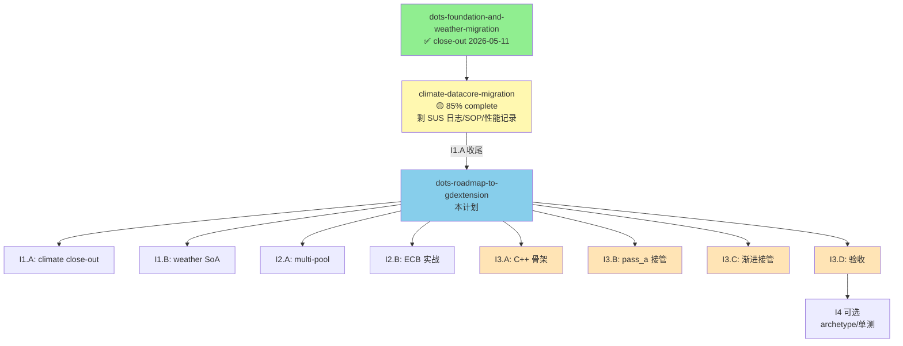

# DOTS Roadmap to GDExtension：需求规格

> 本计划是 ProjectKeynes 类 DOTS 数据架构演进的**总路线图**，
> 终点是 **GDExtension (C++) 接管 hot loop**，让大数据量 / 高计算量场景具备性能跃迁能力。
>
> **前置已完成**：
> - [`dots-foundation-and-weather-migration`](../dots-foundation-and-weather-migration/) ✅（DCWorld + bind_map_data + weather front 镜像，2026-05-11 close-out）
> - [`climate-datacore-migration`](../climate-datacore-migration/) 🟡（核心代码已上线 ~85%，剩 SUS 日志 path 标识、SOP 落盘、性能验收记录；CLI 已 WONTFIX）
>
> **本计划的差异化定位**：
> 不再是"单点迁移"，而是按 3 个迭代梯次**直达 GDExtension**。每个梯次都是为 GDExtension 铺路，
> 不做无关锦上添花。

---

## 0. 上下文与基础事实（侦察结论）

### 0.1 已就位能力（无需重做）

| 能力 | 状态 | 来源 |
|---|---|---|
| `DCWorld` + 25 cell-level component 注册 + bind_map_data | ✅ | dots-foundation 任务 1~4 |
| `DCQuery` + `for_each_index` hot loop API | ✅ | 同上 任务 3 |
| `DCCommandBuffer`（API 已就位，仅最小实现）| ✅ API / 🟡 实战 | dots-foundation 任务 5 |
| `Archetype` 标记位（逻辑分组，无物理重排）| ✅ | dots-foundation 任务 6 |
| Weather front 池（cell pool 尾后段 [N, N+max_fronts) ）| ✅ | dots-foundation 任务 8 |
| weather `sync_fronts_to_world` AoS→SoA **单向镜像** | ✅ | weather-migration B 阶段 |
| Climate 4 个 SoA sub-pass 取数入口走 view_f32 | ✅ | climate-migration A 阶段 |
| F9（weather path）/ F11（climate path）热键 | ✅ | weather D-02 / climate C-1 |
| SUS 日志 `path=...` 标识（weather 已加 / climate 待加）| 🟡 | climate B-1 是本路线图 I1 收口项 |
| F12 SnapshotProbe（双路径采样）| ✅ | weather A-04 |

### 0.2 现存问题清单（review 提出的 6 项）

| ID | 问题 | 严重度 | 路线图归属 |
|---|---|---|---|
| P0-① | climate hot path 仍走 `map.xxx_arr` 直接字段 | 高 | ✅ climate plan 已解决（85%）+ I1.A 收尾 |
| **P0-②** | **WeatherSystem 内部仍是 AoS（WeatherFront 实例数组）** | **高** | **I1.B（核心攻坚）** |
| P1-③ | DCWorld 单一扁平 entity 池，未来加 unit/army/economy 失控 | 中 | I2.A |
| P1-④ | CommandBuffer 仅 API 就位、front spawn/destroy 没真用 ECB | 中 | I2.B |
| P2-⑤ | Archetype 仅标记位、无物理 chunk 重排 | 低 | I4（可选）|
| P2-⑥ | DataCore 模块缺单元测试、无 GDExtension 演示 | 低 | I4（可选）|

### 0.3 终极目标的本质判断

**为什么"hot path 走 view_f32"是 GDExtension 的前置条件？**

GDScript 端 `_world.view_f32(comp_id)` 在 C++ 层等价于"把 Godot 的 PackedFloat32Array 内部裸指针抛出去"。
未来 C++ 实现 `DCWorldExt`（继承 `RefCounted` 注册到 GDExtension）时，可以做到：

```cpp
// 伪代码
PackedFloat32Array DCWorldExt::view_f32(int cid) {
    return slots[cid].arr_f32;  // COW 引用计数 +1，零拷贝
}

// hot loop 在 C++ 内部跑（GDScript 看不见）
void DCWorldExt::run_climate_pass_a(/*...*/) {
    PackedFloat32Array temp = slots[CELL_TEMP].arr_f32;
    float* temp_w = temp.ptrw();  // 裸指针，C++ for 循环
    for (int i = 0; i < n; ++i) {
        temp_w[i] = /* 算法 */;
    }
}
```

**关键约束**：
- GDScript 端**继续保留** `_climate_pass_a_soa` 函数作为 fallback / 调试路径（双实现并存）
- C++ 端不持有 `MapData` 引用，只通过 World 访问数据（World 是唯一桥梁）
- 调用约定：`world.run_climate_pass_a(cp_struct, phase, ...)` —— GDScript 把所有热参数打成 struct 传一次，C++ 内部跑完一整个 sub-pass

**因此前置条件是**：
1. ✅ World 已经持有所有 hot path 数据的引用（cell-level done; front-level half-done）
2. 🟡 hot path 内层循环不依赖 `HexCell` AoS 实例（climate done; weather TODO）
3. ❌ 多 entity pool 在 World API 层显式建模（**未做**，当前是单池 + offset）
4. ❌ CommandBuffer 实战化（结构性变更全走 ECB，hot loop 内禁止 resize）

I1/I2/I3 三个迭代正是按"补齐前置条件 → 接管"的顺序排列。

---

## 1. 迭代蓝图（顶层规划）

### Iteration 1：Hot Path 数据通道收口（1 周）

**目标**：让 climate + weather 两大 hot path 100% 走 view_f32，**为 GDExtension 提供"统一数据通道"**

| Sub-iter | 内容 | 预估 | 难度 |
|---|---|---|---|
| **I1.A** | climate plan 工程化收尾（SUS 日志 path 标识 + 性能验收记录 + SOP §3a/§6a 落盘） | 1 天 | 低 |
| **I1.B** | **Weather 内部 AoS→SoA 化**（WeatherFront 字段拆 PackedArray，hot loop 走 view_f32，弃用 sync_fronts_to_world 单向镜像） | 4~5 天 | **高** |

### Iteration 2：架构债务清理（1 周）

**目标**：多 entity pool + CommandBuffer 实战化，**让 GDExtension 一次到位不返工**

| Sub-iter | 内容 | 预估 | 难度 |
|---|---|---|---|
| **I2.A** | 多 entity pool 架构（`World.create_pool(name, capacity) -> pool_id`，cell pool / front pool 物理分离） | 3 天 | 中 |
| **I2.B** | CommandBuffer 接管 front spawn/destroy 全链路（弃用 weather_system 的 free-list 手工管理） | 2 天 | 中 |

### Iteration 3：GDExtension 接管 Hot Loop（2~3 周，**核心目的**）

**目标**：C++ 接管 climate + weather field 的 hot loop，实测 ≥3x 加速

| Sub-iter | 内容 | 预估 | 难度 |
|---|---|---|---|
| **I3.A** | C++ 骨架（SCons 编译 + GDExtension 注册 + DCWorldExt 镜像 + Windows/Linux/Android 三平台 CI） | 4~5 天 | **高** |
| **I3.B** | 第一个 hot loop 接管：`climate_pass_a_soa` C++ 版（baseline 3x 验收）| 3~4 天 | 中 |
| **I3.C** | 渐进接管：`pass_b` / `ocean_water` / `ocean_land` / `weather_field_solver` | 5~6 天 | 中 |
| **I3.D** | 性能验收 + 跨平台回归 + close-out | 2~3 天 | 中 |

### Iteration 4：可选锦上添花（1 周）

**目标**：根据 I3 实测瓶颈决定是否做；不做也不影响主线

| Sub-iter | 内容 | 触发条件 |
|---|---|---|
| **I4.A** | Archetype 物理重排（chunk 化、cache locality 优化） | 如果 I3 实测 cache miss 是瓶颈 |
| **I4.B** | DataCore 单元测试 + GDExtension 演示场景 | 如果团队扩张需要工程化收口 |

---

## 2. EARS 验收标准（按迭代分组）

### I1.A — Climate 工程化收尾

#### Story I1.A.1：SUS 日志输出 climate path 标识

- WHEN SUS 30-tick 汇总日志输出 `refresh_climate_daily ran=...` 行时，THEN 行末 SHALL 追加 ` path=<legacy|data_core>`
- WHEN 单 round 完成的 partial breakdown（`A=4.1 B=5.8 ocean=6.9 ...`）输出时，THEN 行末 SHALL 同样追加 ` path=...`
- THE 日志格式 SHALL 与 weather `path=` 字段保持一致（便于 grep / 脚本聚合）

#### Story I1.A.2：4 窗口性能对比记录到 task-item.md

- THE [`climate-datacore-migration/task-item.md`](../climate-datacore-migration/task-item.md) §B 阶段验收记录 SHALL 填入 4 个 30-tick 窗口的实测数据（avg / max / sub-pass breakdown）
- THE DataCore 路径 avg SHALL ≤ Legacy avg × 105%（红线）
- THE DataCore 路径 max SHALL ≤ Legacy max × 108%
- IF 红线不通过，THEN SHALL 进入 climate plan 的 B-4 优化项

#### Story I1.A.3：SOP 落盘

- THE [`dots-foundation-and-weather-migration/SOP.md`](../dots-foundation-and-weather-migration/SOP.md) SHALL 增补 §3a "Climate 灰度推进流程" + §6a "Climate 回滚"
- THE SOP §3a SHALL 含 mermaid 流程图（默认 off → 灰度 on → 性能验收 → tres 默认 on）
- THE SOP §6a SHALL 列两档回滚（F11 运行期 / tres 永久），CLI 已 WONTFIX 不在 SOP 描述

#### Story I1.A.4：climate plan close-out

- WHEN I1.A.1 + I1.A.2 + I1.A.3 全部完成，THEN climate-datacore-migration 计划 SHALL 标记 ✅ close-out
- THE close-out 标记 SHALL 写在 [`climate-datacore-migration/task-item.md`](../climate-datacore-migration/task-item.md) 末尾，记录完成日期

---

### I1.B — Weather 内部 SoA 化（核心攻坚）

> 本节是整个 I1 迭代的难点。weather_system.gd 是 105KB 单文件，有 ~7 个 hot 函数走 AoS。

#### Story I1.B.1：WeatherFront SoA 字段化

- WHEN weather front 扩容到 `max_active_fronts` 时，THEN World SHALL 注册 8 个 front-level F32 component（center_x/center_y/radius/intensity/age/lifetime/heading/speed）+ 1 个 U8 component（kind）+ 1 个 I32 component（archetype_link）
- THE WeatherFront 类（`scripts/weather/weather_front.gd`）SHALL 保留作为"读取访问器"语义，但**所有写操作**（advance_one_day、apply_age_decay 等）SHALL 改为操作 World 的 PackedArray
- WHEN `cp.use_data_core_weather = true` 时，THEN `_active_fronts` 的"AoS 实例数组"SHALL 退化为只读视图（spawn 阶段才生成实例，hot path 不再访问实例）
- IF `use_data_core_weather = false`，THEN 走 legacy AoS 路径（保留作为 fallback / 调试）

#### Story I1.B.2：弃用 sync_fronts_to_world 单向镜像

- WHEN I1.B.1 完成，THEN `weather_refresh_job._sync_fronts_to_world` 函数 SHALL 标记为 deprecated 并在 6 个月后删除
- WHEN front 字段在 hot loop 内被写入时，THEN World 的 PackedArray SHALL 直接被修改（不再需要 commit 末的镜像复制）
- THE 现有"用 World 数据驱动 GPU uniform pack"（`pack_to_uniforms`）SHALL 直接消费 World 的 view_f32 引用，不再走 WeatherFront 实例中转

#### Story I1.B.3：weather hot 函数迁移清单

以下 7 个函数 SHALL 改造为 hot loop 走 view_f32：

| 函数 | 文件 | 当前实现 | 迁移后 |
|---|---|---|---|
| `WeatherFront.advance_one_day` | weather_front.gd | `self.center += self.velocity * dt` | view_f32 PackedArray index 写 |
| `WeatherSystem._step_active_fronts` | weather_system.gd | `for f in _active_fronts: f.advance(...)` | `for_each_index over query.with_archetype(ARCH_FRONT)` |
| `WeatherSystem._apply_field_advection` | weather_system.gd | 已是 PackedArray | 仅切换 `world.view_f32` 入口（小改）|
| `WeatherSystem._compute_emergent_coupling` | weather_system.gd | 混合 | 全 view_f32 |
| `WeatherSystem.pack_to_uniforms` | weather_system.gd | `f.center.x / f.radius` | view_f32 索引读 |
| `WeatherSystem._spawn_front` | weather_system.gd | `_active_fronts.append(WeatherFront.new())` | CommandBuffer.create_entity（依赖 I2.B；本迭代先用 World.assign_archetype 直写）|
| `WeatherSystem._destroy_front` | weather_system.gd | `_active_fronts.remove_at(i)` | World.assign_archetype(idx, ARCH_NONE)（依赖 I2.B）|

#### Story I1.B.4：行为对照测试

- THE 迁移过程 SHALL 启用 `--validate-weather` 模式做 30-day A/B 对照
- THE legacy 路径 vs DataCore 路径的 weather field grid（temp / moisture / pressure 三层）逐 cell L2 误差 SHALL ≤ 1e-5
- THE active_fronts 数量 / 平均寿命 / 平均强度的 30-day 直方图 SHALL 完全一致（无统计性差异）

#### Story I1.B.5：性能验收

- THE 迁移后 `weather_refresh` avg SHALL ≤ legacy 路径 × 110%（与 dots-foundation 时验收红线一致）
- THE 迁移后 `weather_refresh` max SHALL ≤ legacy 路径 × 115%
- IF 红线不通过，THEN 优先排查"循环内反射 component_id"等已知踩坑（参考 climate B-4）

---

### I2.A — 多 entity pool 架构

#### Story I2.A.1：World 提供 pool API

- THE `DCWorld` SHALL 提供 `create_pool(name: StringName, capacity: int) -> pool_id: int`
- THE `DCWorld` SHALL 提供 `pool_range(pool_id) -> Vector2i`（返回 [start_idx, end_idx)）
- THE 现有"扁平 entity 池 + offset"机制（cell pool [0, N) + front pool [N, N+max_fronts)）SHALL 改造为"两个显式 pool 各占独立 idx 段"
- THE `query.in_pool(pool_id)` SHALL 在迭代时按 pool 范围过滤

#### Story I2.A.2：迁移现有调用方

- THE [`map_generator.gd._setup_sus`](../../scripts/geography/map_generator.gd) SHALL 改为：先 `world.create_pool("cells", n_cells)` → 再 `world.bind_map_data(map)`
- THE weather_system 初始化 SHALL 改为：`world.create_pool("weather_fronts", max_active_fronts)` 后才 spawn front
- THE 所有 hot loop SHALL 通过 `query.in_pool(POOL_CELLS)` / `query.in_pool(POOL_WEATHER_FRONTS)` 显式声明遍历范围

#### Story I2.A.3：行为零回归

- WHEN I2.A 完成，THEN climate / weather 所有现有 SUS 日志数字 SHALL 与 I2.A 之前的 baseline 持平（±2%）
- THE pool 注册顺序 SHALL 与现有 idx 段一致（cells 先 + fronts 后），保证 weather 已有 archetype 标记位不失效

---

### I2.B — CommandBuffer 实战化

#### Story I2.B.1：front spawn/destroy 走 ECB

- WHEN weather_system 想生成 front 时，THEN SHALL 调用 `world.command_buffer().create_entity(ARCH_WEATHER_FRONT)` 而非直接 append `_active_fronts`
- WHEN 销毁 front 时，THEN SHALL 调用 `world.command_buffer().destroy_entity(idx)`（首版仅打 ARCH_NONE 标记）
- THE flush 时机 SHALL 由 SUS 调度器在 round 末统一调用 `world.flush_command_buffer()`（确保 hot loop 中无任何 resize）

#### Story I2.B.2：CommandBuffer 增强（按需扩容）

- WHEN ECB 的 create_entity 累积条数超过当前 pool 容量时，THEN World SHALL 按 1.5x 增长扩容对应 pool 的所有 component
- THE 扩容操作 SHALL 在 `flush_command_buffer` 内一次性完成（避免 hot loop 内多次 resize 导致 PackedArray COW 分裂）
- THE 扩容触发 SHALL 打印 INFO 日志：`[DCWorld] pool '%s' grew %d → %d`，便于调优 capacity

#### Story I2.B.3：weather _front_pool free-list 弃用

- WHEN I2.B.1 + I2.B.2 完成，THEN weather_system 的 `_front_free_indices` PackedInt32Array 手工 free-list SHALL 被 World pool 内的 archetype 标记位替代
- THE 现有 `_active_fronts` Array SHALL 仅作"快速 iter"缓存，长度由 `query.with_archetype(ARCH_FRONT).size()` 推导

---

### I3.A — GDExtension C++ 骨架

#### Story I3.A.1：SCons 工程结构

- THE 仓库根 SHALL 增加 `gdext/` 目录，含：
  - `gdext/SConstruct`（继承 godot-cpp 模板）
  - `gdext/src/world_ext.h` / `world_ext.cpp`（DCWorldExt 主体）
  - `gdext/src/register_types.cpp`（GDExtension 注册入口）
  - `gdext/godot-cpp/`（git submodule，pin 到 Godot 4.4 兼容版本）
- THE 编译产物 SHALL 输出到 `Project/project-keynes/addons/dots_ext/bin/<platform>/`
- THE `Project/project-keynes/addons/dots_ext/dots_ext.gdextension` SHALL 配置三平台动态库路径（windows.x86_64 / linux.x86_64 / android.arm64）

#### Story I3.A.2：DCWorldExt 镜像 GDScript API

- THE `DCWorldExt` C++ 类 SHALL 注册以下方法（与 GDScript 版 DCWorld 同签名）：
  - `register_component(name, dtype, stride, track_prev) -> int`
  - `component_id(name) -> int`
  - `view_f32(comp_id) -> PackedFloat32Array`
  - `view_u8(comp_id) -> PackedByteArray`
  - `view_i32(comp_id) -> PackedInt32Array`
  - `bind_map_data(map_data: Object) -> bool`（通过 Object::call 桥接 MapData getter）
  - `create_pool(name, capacity) -> int`
- THE GDScript 端切换 C++ 版本 SHALL 仅靠一个开关：`ClimateProfile.use_gdext_world = true`，无需改其他调用代码
- THE 行为 SHALL 与 GDScript 版 100% 等价（先做"零加速 wrapper"验证桥接正确，再上算法接管）

#### Story I3.A.3：跨平台 CI

- THE Windows MSVC 构建 SHALL 通过（用户主开发环境）
- THE Linux GCC 构建 SHALL 通过（CI 用）
- THE Android NDK arm64 构建 SHALL 通过（移动端目标）
- THE 缺一即不允许进入 I3.B（移动端是终极性能受益场景，必须早测）

---

### I3.B — 第一个 hot loop C++ 接管：climate_pass_a

#### Story I3.B.1：C++ 算法迁移

- THE `DCWorldExt::run_climate_pass_a(cp_struct, phase, season_phase) -> float` SHALL 用 C++ 复刻 [`map_generator.gd._climate_pass_a_soa`](../../scripts/geography/map_generator.gd) 算法
- THE 算法常量 SHALL 通过 `ClimateProfile` 序列化为 plain struct 一次性传入（避免 hot loop 内回调 GDScript）
- THE 内层循环 SHALL 用 `float* ptr = arr.ptrw()` 裸指针访问，禁止用 PackedFloat32Array operator[]
- THE C++ 实现 SHALL 与 GDScript 版的逐 cell 数值误差 ≤ 1e-6（FMA 顺序差异允许）

#### Story I3.B.2：性能验收

- THE C++ 版 `climate_pass_a` 实测耗时 SHALL ≤ GDScript 版 × 33%（即至少 3x 加速）
- THE 整个 `refresh_climate_daily` 6 段切片 avg SHALL 因此降至 ≤ legacy × 70%（pass_a 占大头）
- IF 加速比 < 3x，THEN 优先排查 `view_f32` 是否触发 PackedArray COW、循环内是否回调 GDScript

#### Story I3.B.3：行为对照

- THE 启用 `--validate-climate-cpp` 模式（本路线图新增）SHALL 跑 30-day A/B 对照（GDScript path vs C++ path）
- THE 整图 temperature L2 误差 SHALL ≤ 1e-5
- THE 30-day average / max / variance 三个统计量 SHALL 与 GDScript 版完全一致

---

### I3.C — 渐进接管 4 个 hot loop

#### Story I3.C.1：climate 剩余 sub-pass

- THE `climate_pass_b_soa` / `ocean_water_pass_soa` / `ocean_land_pass_soa` SHALL 按 I3.B 同模式 C++ 化
- THE 每个 sub-pass C++ 化 SHALL 独立验收（同 I3.B.2 红线 + I3.B.3 行为对照）
- THE 全部完成后 `refresh_climate_daily` 总耗时 SHALL 降至 legacy × 30~40%

#### Story I3.C.2：weather field solver

- THE `WeatherSystem._apply_field_advection` SHALL C++ 化（advection / diffusion / source-sink 三段循环）
- THE 加速比 SHALL ≥ 3x
- THE GPU uniform pack 阶段（`pack_to_uniforms`）SHALL 暂保留 GDScript（数据量小，不是热点）

---

### I3.D — 性能验收 + 跨平台回归 + close-out

#### Story I3.D.1：综合性能基线

- THE 在 earth_like preset / 1024×606 网格规模下，C++ 全开 vs GDScript 全开的 daily-tick 总耗时对比 SHALL 有 4 个独立 30-tick 窗口实测数据
- THE 综合加速比 SHALL ≥ 2.5x（保守目标，考虑非 hot path 仍是 GDScript）
- THE 移动端（Android arm64）实测 SHALL 单独抓一组数据，验证不退化

#### Story I3.D.2：跨平台回归

- THE Windows / Linux / Android 三平台 SHALL 各跑一次 30-day 烟测
- THE 三平台数值结果 SHALL 一致（除 FMA 顺序导致 ≤ 1e-6 误差外）

#### Story I3.D.3：路线图 close-out

- WHEN I3.A~I3.D 全部完成，THEN dots-roadmap-to-gdextension 计划 SHALL 标记 ✅ close-out
- THE 后续如需做 I4 SHALL 开新计划目录

---

## 3. 非功能需求

### 3.1 性能（综合红线）

| 阶段 | 综合加速目标（vs 当前 GDScript baseline）| 备注 |
|---|---|---|
| I1 完成 | 持平 ±5% | 仅打通数据通道 |
| I2 完成 | 持平 ±5% | 架构债务清理 |
| I3.B 完成 | climate_pass_a 单段 ≥ 3x | 第一个 hot loop |
| I3.C 完成 | climate 整体 ≥ 2x；weather field ≥ 2x | 主力 hot path |
| I3.D 完成 | 整 daily-tick 综合 ≥ 2.5x | 终极目标 |

### 3.2 可移植性

- THE 所有 GDScript 端代码 SHALL 在 C++ 不可用时（gdext 编译失败 / 未部署）自动 fallback 到 GDScript 实现
- THE `use_gdext_world` 开关 SHALL 与现有 use_data_core / use_data_core_weather / use_data_core_climate 三层开关正交（任一组合都不致命）

### 3.3 可观测性

- THE SUS 日志 SHALL 在 I3 阶段增加 `engine=<gdscript|cpp>` 字段（与现有 `path=` 字段并列）
- THE F12 SnapshotProbe SHALL 同时支持 GDScript / C++ 两条路径采样（无需新增热键）

### 3.4 风险与回滚

| 风险 | 缓解 |
|---|---|
| I1.B weather SoA 化引入数值回归 | `--validate-weather` 30-day 对照 + 红线收紧（L2 ≤ 1e-5）|
| I2.A pool 改造破坏 weather archetype 标记 | I2.A.3 红线"既有 SUS 数字 ±2%"+ 单元测试覆盖 |
| I3.A SCons 工程跨平台坑（Windows MSVC / Android NDK）| 三平台 CI 早测；缺一不进 I3.B |
| C++ 加速比不达 3x | I3.B.2 红线 + 失败时回退 GDScript（`use_gdext_world=false`）|
| GDExtension API 变更（Godot 4.x 升级）| godot-cpp pin 在具体 commit；升级时跑全量回归 |
| 团队中无人能维护 C++ | I4.B 单元测试 + 文档（可选）|

---

## 4. 不在本计划范围内（明确排除）

| 项目 | 理由 |
|---|---|
| ocean_currents（OceanCurrentsJob）C++ 化 | 独立 SUS Job，刷新周期 240 day，不是 hot path；未来需要时单独立项 |
| sea_ice_atlas_upload C++ 化 | GPU 上传，瓶颈在 VRAM 带宽不在 CPU |
| 多线程 / Job System | 当前 SUS 单线程足够；未来真正成为瓶颈再说 |
| SIMD / AVX2 显式向量化 | I3.B 验收 3x 加速通常 -O2 + 自动向量化已足够；不达标再手写 |
| 网络同步 / 多人 | 本路线图纯单机；DataCore 数据布局对网络同步友好但不在范围内 |
| 替换 Godot Hex tilemap 渲染层 | 渲染瓶颈是 GPU shader，不在 DataCore 范围 |

---

## 5. 验收门槛（出口标准）

完成本路线图需同时满足：

1. ✅ I1.A 完成 → climate plan close-out
2. ✅ I1.B 完成 → weather hot path 100% 走 view_f32（无 AoS hot loop）
3. ✅ I2.A 完成 → World 多 pool API 落地，所有调用方迁移完成
4. ✅ I2.B 完成 → CommandBuffer 接管所有结构性变更
5. ✅ I3.A 完成 → C++ 骨架在三平台编译通过
6. ✅ I3.B + I3.C 完成 → 4 个 hot loop（climate 3 段 + weather field 1 段）C++ 接管
7. ✅ I3.D §3.1 综合加速 ≥ 2.5x 过线
8. ✅ 三平台（Windows / Linux / Android）30-day 烟测无回归

---

## 6. 时间预估

| 迭代 | 预估 | 累计 |
|---|---|---|
| I1.A：climate 收尾 | 1 天 | 1 天 |
| I1.B：weather SoA | 4~5 天 | 5~6 天 |
| I2.A：多 pool | 3 天 | 8~9 天 |
| I2.B：ECB 实战 | 2 天 | 10~11 天 |
| I3.A：C++ 骨架 | 4~5 天 | 14~16 天 |
| I3.B：pass_a 接管 | 3~4 天 | 17~20 天 |
| I3.C：渐进接管 | 5~6 天 | 22~26 天 |
| I3.D：验收 close-out | 2~3 天 | 24~29 天 |
| **合计** | **~5~6 周** | — |

> I4（可选）按 1 周追加，但需在 I3.D 结束后根据实测瓶颈决定是否启动。

---

## 7. 与既有计划的衔接


