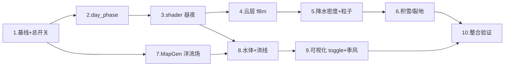

# 实施计划 — 画面表现系统性优化

> 需求文档：`.codebuddy/plan/visual-presentation-overhaul/requirements.md`
> 代码工程根：`Project/project-keynes/`
> 核心硬约束（来自需求文档《关键决策记录》）：风格化 PBR · 1 季 = 1 昼夜 · 洋流数据来自逻辑层 · 性能基线必采

---

- [ ] 1. **性能基线采样与总开关接入**
   - 在 `scripts/main.gd` 的 `@export` 中新增 5 个总开关：`visual_quality: int = 2`、`day_night_enabled: bool = true`、`water_effect_enabled: bool = true`、`ocean_current_enabled: bool = false`、`extreme_weather_ground_effect_enabled: bool = true`，并串联到 `HexRenderer` / `WeatherLayer` 的材质 `set_shader_parameter`
   - 在 `scripts/rendering/hex_renderer.gd` 中新增一个轻量级 `PerfSampler`：稳态 30 秒窗口内统计平均帧时间与 P95，输出到 `print_rich` 日志与调试面板（供基线 / 优化前 / 优化后三次对齐）
   - 先以"所有开关关闭"采一次基线；以"所有开关开启 + 占位 shader"采第二次，产出两份数据作为后续任务的量化参照
   - _需求：6.1, 6.2, 6.3, 关键决策 4_

- [ ] 2. **WorldClock 扩展 `day_phase` + 昼夜时间通道**
   - 在 `scripts/world_clock.gd` 中新增派生属性 `day_phase: float`，公式 `fposmod(current_day + day_fraction, days_per_season) / days_per_season`（`day_fraction` 为当前日内累积 Δt 归一化），并暴露节流参数 `day_phase_emit_step: float = 0.005`
   - 新增信号 `day_phase_changed(day_phase: float)`；仅当上次发射后 phase 累计变化 ≥ `day_phase_emit_step` 时才发射，暂停时冻结但不清空，x5/x20 倍速下自动走节流
   - 在 `scripts/main.gd` 连接该信号，写入 `world_map.gdshader` 与 `weather_overlay.gdshader` 的 `day_phase` uniform；同时扩展 `UI/TopBar/TimeLabel` 文本为 `"Y%d D%d %s %02d:00"`
   - _需求：3.1, 3.2, 3.6, 3.7, 3.8, 6.7_

- [ ] 3. **`world_map.gdshader` 风格化 PBR 昼夜着色**
   - 在 shader 顶部新增 uniform：`day_phase`、`day_night_enabled`、`night_brightness_min: float = 0.35`、`night_brightness_max: float = 0.55`
   - 实现 `get_sun_dir(day_phase)` 与 `get_sky_tint(day_phase)`：4 个关键时相（日出 0.0 / 正午 0.25 / 日落 0.5 / 午夜 0.75）间做 `smoothstep` 插值，色温曲线为艺术化手调（暖橙 → 白 → 暖橙 → 冷蓝）
   - 对地表 albedo 应用 `NdotL` 调制 + 菲涅尔柔边 + 粗糙度控制的方向光高光（风格化 PBR：保留物理光照流程但幅度艺术化），夜晚整体亮度压到白天的 `[0.35, 0.55]`
   - `day_night_enabled == false` 时完全短路回原有着色路径，保证可回退
   - _需求：3.3, 3.4, 3.5, 6.2, 关键决策 1_

- [ ] 4. **`weather_overlay.gdshader` 多层 fBm 云 + 形状一致阴影**
   - 新增 uniform：`cloud_wind_dir: vec2[per-front]`、`cloud_coverage: float`、`cloud_darkness: float`、`weather_overlay_quality: int`
   - 替换现有 radial-fade：以 2 个 octave 的 fBm 噪声（采样 `noise_tex`，偏移由 `world_time` × 风向驱动）生成云密度场，`smoothstep` 门限形成不规则软边；云层颜色与 alpha 均随 `front.intensity` 连续变化
   - 在同一 pass 中用同一张噪声输出两份：一份是云层本身，一份是地面阴影（alpha 更低、向风下游偏移 `shadow_offset`），替代现在绑定 front 圆心的硬圆阴影
   - `weather_overlay_quality == 0` 退化为单层圆盘；`== 2` 启用完整 2 octave fBm
   - _需求：1.1, 1.2, 1.3, 1.4, 1.5, 1.6_

- [ ] 5. **`WeatherLayer` 降水密度制 + 极端天气粒子强化**
   - 修改 `scripts/rendering/weather_layer.gd` 的粒子发射：把 `amount = 80` 改为 `amount = clamp(base_density * PI * radius², MIN, MAX)`，RAIN/STORM/MONSOON 的覆盖区域内均匀密集降雨
   - STORM 类型在 `_process` 中按 `world_time` 驱动 < 1Hz 的闪电亮斑（通过 modulate 短暂抬升 overlay 的 `storm_flash` uniform，持续 80~120ms）
   - HEATWAVE 类型开启 overlay 的 `heatwave_distortion` 分支（shader 内 UV 抖动幅度 ≤ 2 px，强度随 `front.intensity` 缩放）
   - `_active_count == 0` 的快路径保持不变：整层 invisible + 停止 process
   - 粒子/噪声时间推进受 `WorldClock.paused` 门控
   - _需求：2.1, 2.2, 2.5, 2.6, 6.4_

- [ ] 6. **地表极端天气反馈（积雪 / 裂地）**
   - 在 `world_map.gdshader` 中新增 uniform `blizzard_mask_tex`（低分辨率 R8 纹理，由 `WeatherLayer` 每次 BLIZZARD 激活/衰减时重打包）与 `drought_mask_tex`
   - BLIZZARD：在 mask > 0 的像素叠加白色 albedo，权重受**坡度**（来自已有高度梯度）和**植被密度**（`vegetation_type`）调制——平地/低植被高权重，陡坡/森林内部低权重
   - DROUGHT：在 mask > 0 的像素做"色相偏黄枯化 + 裂纹噪声"叠加（复用 `noise_tex` 做 cracked-earth 纹理）
   - 在 `scripts/rendering/weather_layer.gd` 中实现 `_rebuild_climate_masks()`，仅在 front 列表变化时重烘焙两张 mask 纹理，避免每帧 CPU 成本
   - 受 `extreme_weather_ground_effect_enabled` 总开关控制
   - _需求：2.3, 2.4, 6.1, 6.2_

- [ ] 7. **MapGenerator 新增"洋流向量场"逻辑层字段（前置任务）**
   - 在 `scripts/hex_cell.gd` 新增字段 `ocean_current: Vector2 = Vector2.ZERO`
   - 在 `scripts/map_generator.gd` 的海洋生成末尾新增一个 `_compute_ocean_currents()` pass：基于"风应力（`WindBelt.wind_at` 年平均）+ 海岸偏转 + 纬度带边界"给每个 `is_water == true` 的 cell 写入归一化方向和 0~1 强度；陆地 cell 保持零向量
   - 在 `scripts/world_data.gd` 暴露一个打包接口 `get_ocean_current_field() -> PackedVector2Array`，供渲染层纹理化
   - 不改动现有高度/温度/湿度/植被生成（需求显式非目标），仅在其之后增补一个新 pass
   - _需求：5.1, 5.9, 关键决策 3_

- [ ] 8. **水体独立着色分支 + 洋流流线**
   - 在 `world_map.gdshader` 中新增独立 water 分支：依 `LF.DEEP_OCEAN / OCEAN / COAST / LAKE / RIVER` 分层基底色（深度梯度）、基于 `world_time` 的 `fbm` 波浪法线扰动、与 `day_phase` 联动的粼光高光（白天暖白 / 夜晚冷蓝月光）
   - 海岸带：根据"到最近陆地距离"（可用 `map_baker` 烘焙阶段的 sdf 近似，若无则用 3×3 邻域采样近似）叠加正弦相位调制的浪花白边
   - LAKE 波纹幅度/波速 ≈ OCEAN 的 1/2；RIVER 色与下游水体做平滑过渡
   - 新增 uniform `ocean_current_tex`（由 `HexRenderer` 把 `WorldData.get_ocean_current_field()` 编码为 RG16F 纹理上传）；water 分支按该方向 scroll 一张 `noise_tex` 生成"缓慢流动的海水"流线纹理
   - BLIZZARD 覆盖水面时叠加薄冰效果（偏白 + 波纹幅度减半）
   - 受 `water_effect_enabled` 与 `ocean_current_enabled` 两个总开关分别控制；不引入新贴图 upload（复用 `noise_tex`）
   - _需求：4.1, 4.2, 4.3, 4.4, 4.5, 4.6, 4.7, 4.8, 5.2, 5.3, 关键决策 3_

- [ ] 9. **洋流/风带可视化 toggle + 季风陆地风纹 + 季风平滑反转**
   - 在 `scripts/main.gd` 绑定一个快捷键（如 `F6`）切换 `ocean_current_debug` uniform（0 = 低对比流线，1 = 高对比带箭头感流向图）；UI 顶栏加一个小按钮
   - water 分支根据 `ocean_current_debug` 切换流线对比度；风带可视化开启时，水面流线方向由"per-cell 洋流方向"主导，低纬度信风/中纬度西风/极地东风带自然呈现不同流向
   - 在 overlay shader 中为 MONSOON 类型 front 新增陆地区域的"风吹流线"分支（不新增粒子节点，复用 overlay quad），方向来自 `WindBelt.wind_at(ny, season_phase)`
   - 在 shader 内对 `season_phase` 邻域做 `smoothstep` 插值两个相邻季节的 `WindBelt.wind_at` 结果，保证季风反相边界 1~2 日内平滑反转而非 180° 硬跳变
   - 低端退化：`ocean_current_enabled == false` 时 water 分支直接跳过流线采样
   - _需求：5.4, 5.5, 5.6, 5.7, 5.8_

- [ ] 10. **整合验证、性能回归与退化路径**
   - 对齐任务 1 的基线：在 `cells=2400` 默认地图上稳态跑 30 秒，比较三组数据（基线 / 全开 / 全关），确认"全开"帧时间 ≤ 基线的 130%；若超标，将 `visual_quality` 强制降到 1，并在 shader 中以 `#if` 风格 uniform 分支关闭高成本特性（fBm 降为 1 octave、水体法线采样频次减半等）
   - 单独验证"全关"时画面与优化前完全一致（回退路径有效）
   - 逐模块关闭其中一个 `@export` 开关，确认模块可独立隔离不影响其他特性（回归测试 Matrix：6 个开关 × 开/关）
   - 更新 `.codebuddy/plan/visual-presentation-overhaul/` 下新增一份 `perf-report.md` 汇总三组基线数据与实测 FPS
   - _需求：6.2, 6.3, 6.4, 6.5, 6.6, 关键决策 4_

---

## 任务依赖关系

- **并行机会**：任务 2（WorldClock）与任务 7（MapGenerator 洋流）互相独立，可并行
- **Shader 写入顺序**：任务 3 → 4 → 6 → 8 必须顺序修改 `world_map.gdshader` 与 `weather_overlay.gdshader`，避免合并冲突
- **最终门禁**：任务 10 必须通过 130% 性能上限才算整体完成
