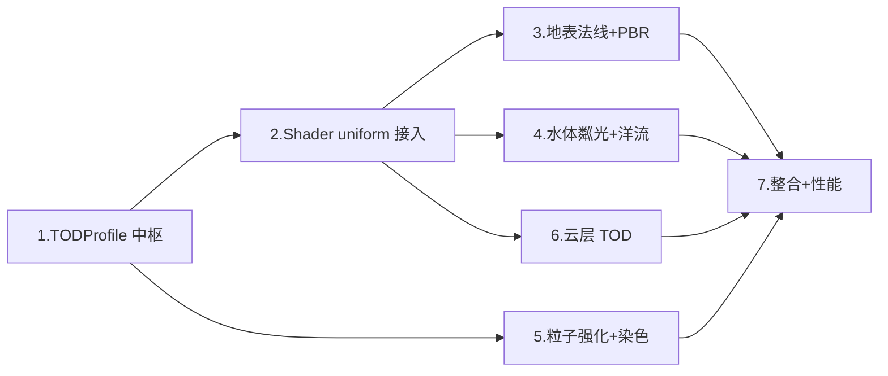

# 实施计划 — 画面表现第二轮深化（Visual Presentation Pass 2）

> 需求文档：`.codebuddy/plan/visual-presentation-pass2/requirements.md`
> 代码工程根：`Project/project-keynes/`
> 核心硬约束：**风格化 PBR · 1 季 = 1 昼夜 · TOD 单一来源 · 帧时间 ≤ 上一轮 110%**

---

- [ ] 1. **新建 `TODProfile` 全局光照中枢（单一来源）**
   - 新建 `scripts/tod_profile.gd`：定义 `class_name TODProfile`，暴露只读字段 `sun_dir: Vector3`、`sun_color: Color`、`ambient_color: Color`、`sky_tint: Color`、`exposure: float`、`night_factor: float`
   - 实现 `recompute(day_phase: float, day_night_enabled: bool)` 方法：内部按 `daylight_ratio` 曲线把 `day_phase` 重映射为"光照相位"（白天段 `[0.08, 0.73]`、夜晚段 `[0.80, 1.0] ∪ [0.0, 0.03]`、其余为过渡带），再对 4 个关键时相（日出 / 正午 / 日落 / 午夜）做 `smoothstep` 插值
   - 定义信号 `tod_changed(profile: TODProfile)`；接入 `WorldClock.day_phase_changed` 作为触发源，透传节流（不再自行节流）
   - `day_night_enabled == false` 时强制输出永昼参数（`sun_dir=(0.4,-0.7,0.6)`、`sun_color=白`、`night_factor=0`）
   - 在 `scripts/main.gd` 暴露 `@export var daylight_ratio: float = 0.65`、`@export var night_factor_min: float = 0.55`、`@export var night_factor_max: float = 0.72`、`@export var tod_exposure: float = 1.0`，并在启动时注入 `TODProfile`；`night_factor_min < 0.35` 时 `push_warning`
   - _需求：1.1, 1.2, 1.5, 2.1, 2.2, 2.3, 2.4, 2.5, 2.6_

- [ ] 2. **Shader 接入 TOD uniform（新增，不删 `day_phase`）**
   - 在 `shaders/world_map.gdshader` 顶部新增 uniform：`tod_sun_dir: vec3`、`tod_sun_color: vec3`、`tod_ambient_color: vec3`、`tod_night_factor: float`、`tod_exposure: float`；保留旧 `day_phase` 仅供"粼光相位 / 云移相位"等动画用途
   - 在 `shaders/weather_overlay.gdshader` 同步新增上述 4 个 TOD uniform
   - 在 `scripts/rendering/hex_renderer.gd` 新增 `apply_tod(profile)` 方法：把 6 个字段写入 `world_map.gdshader` 的 uniform；`scripts/rendering/weather_layer.gd` 新增对应方法写入 overlay shader
   - 在 `scripts/main.gd` 连接 `TODProfile.tod_changed` → `HexRenderer.apply_tod` + `WeatherLayer.apply_tod`；首帧必须显式推一次初值，避免 shader 读到 0
   - _需求：1.3, 1.4, 3.4, 6.1, 7.4_

- [ ] 3. **`world_map.gdshader` 高度图法线 + NdotL/NdotH 风格化 PBR**
   - 在 fragment 阶段封装函数 `compute_terrain_normal(uv, texel, quality) -> vec3`：`quality >= 1` 用 Sobel 3×3（8-tap）、`quality == 0` 退化为现有 4-tap 中心差分
   - 用 `NdotL = max(dot(N, tod_sun_dir), 0)` 计算漫反射，替代当前 `hillshade` 双光源色板乘法分支（`hillshade_strength` 保留为艺术化曝光控制）
   - 计算半向量 `H = normalize(tod_sun_dir + view_dir)`，`NdotH` 做 Blinn-Phong 高光；`roughness` 按 `biome` 查表（雪/冰 `0.2` 光滑、沙 `0.6`、森林 `0.85` 粗糙）
   - 平地退化：`|∇h| < epsilon` 时跳过方向光，只做 `albedo × (tod_ambient_color + tod_sun_color × 0.3)`
   - 最终输出乘 `tod_exposure` 并做艺术化 tonemap（`x / (x + 1)` 即可）
   - `day_night_enabled == false` 仍保留法线与方向光，日光方向来自 TOD 永昼值
   - _需求：3.1, 3.2, 3.3, 3.4, 3.5, 3.6_

- [ ] 4. **水体深浅梯度 + 全海域粼光 + 洋流全覆盖**
   - 在 `world_map.gdshader` 水体分支新增 `distance_to_shore` 近似：以 5×5 邻域采样 `height_tex`，数周围 `< sea_level` 的比例作为"离岸度"，`COAST → OCEAN → DEEP_OCEAN` 用三段 `smoothstep` 做深浅蓝过渡
   - 水面法线：程序化生成 `N_water = normalize(noise_grad(uv * sparkle_freq + world_time * sparkle_speed))`，`NdotH` 做高频粼光高光；粼光相位走 `world_time`，不读 TOD（`day_phase` 仅用于动画相位）
   - 粼光色：`sparkle_color = mix(warm_white, cool_moon_blue, tod_night_factor)`，夜晚幅度压为 `0.5`、频率减半（形成"月光鳞片"）
   - 洋流流线：把当前 `ocean_current_tex` 的 scroll 振幅放大、噪声频率降低，使 DEEP_OCEAN 也能看到缓动流线；`ocean_current_debug == 1` 时对比度再 ×1.8
   - 新增 `@export water_sparkle_enabled: bool = true` 开关（`main.gd`）；`water_effect_enabled == false` 回退到简单深浅色
   - _需求：4.1, 4.2, 4.3, 4.4, 4.5, 4.6, 7.5_

- [ ] 5. **雨雪粒子视觉强化 + TOD 染色**
   - 修改 `scripts/rendering/weather_layer.gd`：RAIN/STORM/MONSOON 的 `amount_min` 从 80 → 180，按"覆盖面积 × 密度"动态计算；BLIZZARD 的 `amount_min` → 120
   - 雨丝粒子：`scale = Vector2(1, 3)` 细长椭圆、`modulate = Color(0.85, 0.88, 0.96, 0.75)`、`BLEND_MODE_ADD`；方向由 `WindBelt.wind_at` 驱动，使雨丝呈 15°~30° 倾斜（`direction` + `initial_velocity` 一起调整）
   - 雪花粒子：`scale_amount_min/max = 0.5/1.4` 随机化、速度减半、水平方向分量 = `WindBelt.wind_at * 0.4`
   - 粒子 `modulate` 在 `apply_tod()` 时重算：`base_color * tod_sun_color * (1 - 0.5 * tod_night_factor)`
   - STORM 闪电：`_process` 内 2~4 秒 `randf_range` 触发一次，持续 80~120ms，期间把 `overlay_material` 的 `storm_flash` uniform 抬升至 0.6
   - 新增 `@export rain_density_boost_enabled: bool = true`；`visual_quality == 0` 时粒子数减半且 `BLEND_ADD → BLEND_MIX`
   - _需求：5.1, 5.2, 5.3, 5.4, 5.5, 5.6_

- [ ] 6. **`weather_overlay.gdshader` 云层接入 TOD + 云阴影压暗**
   - 云色输出改为 `cloud_base * tod_sun_color * (1 - 0.6 * tod_night_factor) + tod_ambient_color * 0.3`，去掉任何自行从 `day_phase` 派生色温的代码（只保留 `day_phase` 做云移动相位）
   - STORM 类型 front：`cloud_base *= 0.7`（乌云）；闪电亮斑保持 `vec3(1.0)` 不乘 TOD（发光源）
   - BLIZZARD + `tod_night_factor > 0.5`：云底色叠加 `vec3(0.6, 0.9, 0.85) * 0.2`（极光暗示）
   - 云阴影（地面投影层）的 `modulate.a *= (1.0 - tod_night_factor * 0.8)`——夜晚云阴影几乎隐形
   - 新增 `@export cloud_tod_tint_enabled: bool = true`；关闭时 shader 直接用上一轮的 `day_phase` 逻辑（双轨并行，保证回退）
   - _需求：6.1, 6.2, 6.3, 6.4, 6.5, 6.6_

- [ ] 7. **整合验证、性能回归与文档归档**
   - 对齐上一轮 `perf-report.md`：在 `cells=2400` 默认地图稳态跑 30 秒，采三组「上一轮全开」/「本轮全开」/「本轮全关」；确认本轮全开平均帧时间 ≤ 上一轮 110%、P95 ≤ 上一轮 115%
   - 若超标：自动把 `visual_quality` 降到 1、shader 内关闭"高频粼光"（`sparkle_freq` 减半）与"8-tap Sobel"（退 4-tap）
   - 单开关回归矩阵：逐个切换 `daylight_ratio` / `tod_exposure` / `water_sparkle_enabled` / `rain_density_boost_enabled` / `cloud_tod_tint_enabled` / `day_night_enabled`，验证每个开关都能独立隔离、不破坏其他模块；`day_night_enabled == false` 时视觉须与上一轮全关一致
   - 写入 `.codebuddy/plan/visual-presentation-pass2/perf-report.md`：三组对照数据 + 单开关矩阵结果 + 对 R1/R2 风险的实测结论
   - _需求：7.1, 7.2, 7.3, 7.4, 7.5, 7.6_

---

## 任务依赖关系

- **前置瓶颈**：任务 1 + 2 是所有后续任务的公共依赖，必须先完成
- **可并行段**：任务 3 / 4 / 5 / 6 之间互相独立（分别动地表、水体、粒子、云层），可同步推进
- **最终门禁**：任务 7 的三组对照 + 单开关矩阵必须全部通过

## 新增 `@export` 开关清单（供 `main.gd` 集中管理）

| 开关 | 默认 | 作用范围 |
|------|------|---------|
| `daylight_ratio` | `0.65` | TOD 曲线（任务 1） |
| `night_factor_min` | `0.55` | TOD 夜晚亮度下限（任务 1） |
| `night_factor_max` | `0.72` | TOD 夜晚亮度上限（任务 1） |
| `tod_exposure` | `1.0` | 全局曝光（任务 1/3） |
| `water_sparkle_enabled` | `true` | 水面粼光（任务 4） |
| `rain_density_boost_enabled` | `true` | 粒子密度提升（任务 5） |
| `cloud_tod_tint_enabled` | `true` | 云层 TOD 染色（任务 6） |

（`day_night_enabled` / `water_effect_enabled` / `ocean_current_enabled` / `extreme_weather_ground_effect_enabled` / `visual_quality` 沿用上一轮，不新增）
