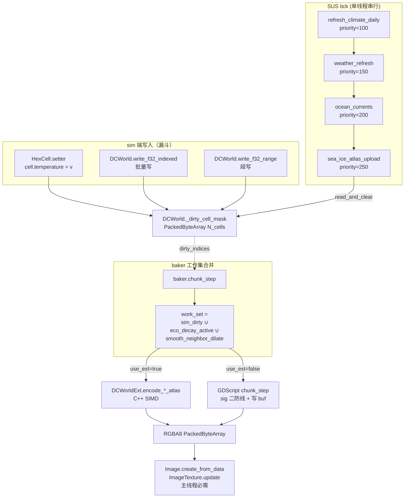

## 产品概览

为 ProjectKeynes 的 4 张运行期 atlas（dynamic_cell / ecology_visual / dyn_atlas_smooth / ice_state）实施"sim 端推送 dirty + DOTS C++ atlas-encode pass"的双重重构，把现状的"baker 全图扫 + sig 比对 + Dictionary[HexCell→int] cache"替换为"事件驱动 dirty mask + C++/SIMD 一遍 memcpy"。

## 核心特性

- **Dirty Mask 基建**：一张 `PackedByteArray(N_cells)` 由 sim 端 setter / DCWorld write API 漏斗式推送脏标记；保留 sig 二次防线避免无效 atlas update。
- **GDScript Baker 消费 mask**：4 个 `chunk_step` 从 `for cell in all_cells` 改为遍历 dirty 集合；ecology 维护"transition_age 衰减自驱集合"合入；dyn_smooth 做 1 跳邻居膨胀。
- **C++ atlas-encode pass**：DCWorldExt 新增 4 个 encode_* pass，输入 mask + 字段 SoA + cell_pixel_lists，输出 RGBA8 PackedByteArray；GDScript 主线程仅留 `Image.create_from_data + ImageTexture.update`。
- **灰度开关 + perf verdict**：`feature_flags.dirty_push_enabled / cpp_atlas_encode_enabled` 双 flag；perf verdict harness 增加 baker 段四档对照测（baseline / mask-only / mask+ecology+smooth / mask+cpp）。
- **向后兼容**：facade 关闭 / DCWorldExt 未编译 / flag 关闭三种场景下 fallback 到当前 sig 比对路径，行为完全等价。

## 技术栈

- **Engine**: Godot 4.x + GDScript（既有 baker / SUS Job / DCWorld）
- **Native**: GDExtension C++（既有 DCWorldExt，复用 SoA + cid 映射）
- **数据结构**: `PackedByteArray` 作为 dirty mask（O(1) 按 index 写、连续内存遍历）；保留 `Dictionary[HexCell→int]` 作 sig 二次防线
- **调度**: 既有 SUS scheduler（单线程串行 tick + priority 序天然提供 sim→baker 同步点）

---

## 实施策略（A→G 强制单向，每段独立 ship）

### 总体思路

1. **阶段 A（基建）**：在 DCWorld + HexCell setter + DCWorldExt 三个 sim 端写漏斗内同步 mark dirty；提供 `read_and_clear_dirty_mask()` 给 baker 消费。
2. **阶段 B（GDScript 消费）**：4 个 baker `chunk_step` 改造为消费 mask；保留 sig 比对但只对 dirty cell 跑，作为"量化后无变化"的去重二防线。
3. **阶段 C（ecology 衰减）**：transition_age > 0 的 cell 由 baker 自维护"衰减 active set"（PackedInt32Array），与 sim dirty 合并为该 baker 的真实工作集。
4. **阶段 D（smooth 膨胀）**：dyn_smooth dirty = 主 dirty ∪ 主 dirty 的 1 跳邻居（用 `map.get_neighbors` 一次预膨胀，结果缓存进 PackedInt32Array）。
5. **阶段 E（C++ pass）**：DCWorldExt 新增 4 个 encode_* pass；输入 dirty mask + 4 个字段 cid + cell_pixel_lists（按 cell 偏移 + 长度的扁平表示）；输出 RGBA8 PackedByteArray；C++ 端 SIMD/parallel-for 内可选，但默认单核 SIMD（避免与 SUS 调度争核）。
6. **阶段 F（baker 切到 ext）**：baker 入口 `if _world_ext != null and _world_ext.has_method("encode_dynamic_cell_atlas"): use_ext = true`；否则走 B 路径。
7. **阶段 G（验证 + 灰度）**：feature_flags 加 2 个 flag；perf verdict harness 加 baker 四档对照；soak 一晚 + AB 对照报告。

### 关键技术决策

**为什么 PackedByteArray 而非 Dictionary**：

- 写入 `mask[idx] = 1` 是 O(1) 整数下标，无 hash 无装箱
- 遍历是 C++ 内存连续，比 Dict.keys() 快约一个数量级
- 内存占用 N=1e5 → 100KB，可忽略

**为什么保留 sig 比对作为二防线**：

- sim 端推 dirty 是"字段被赋值"语义；某些场景下值赋回相同（idempotent write）会产生伪 dirty
- Atlas 量化（_q01_byte）后 byte 可能也没变，避免 `Image.create_from_data + texture.update` 这类必须主线程的 GPU 操作被无效触发
- sig 比对仍能起作用，但只跑 dirty_count 次（≪N）

**为什么不做多线程（阶段 2）**：

- C++ SIMD 单核已经把 atlas encode 压到 0.1–0.3ms，多线程 dispatch overhead 反而抢调度
- 主线程必须的 `Image.create_from_data + ImageTexture.update` 才是真正的串行尾巴，多线程救不了
- 留作 future iteration，profile 真出现瓶颈再说

**transition_age 的处理**：

- 不能 sim 推（baker 自驱衰减）
- 维护一个 `_eco_active_decay_set: PackedInt32Array`（cell.index 列表），新 transition_age > 0 时 push，归零后 lazy 移除
- ecology baker 的工作集 = sim dirty ∪ active_decay_set，去重后遍历

**dyn_smooth 1 跳膨胀**：

- 一次预膨胀：遍历主 dirty cells → push 邻居 cell.index 到 `_smooth_dirty_set`，用 `PackedByteArray(N)` 临时去重 mask
- O(dirty × 6) 量级，远小于 O(N)
- 结果缓存进 `PackedInt32Array`，C++ pass 的 dirty_indices 输入直接用它

**性能预期（N=1e5, dirty 占比 ≤ 5%）**:

- 现状（4 张 atlas baker 合计稳态天）: ~3-6ms
- 阶段 B 后（mask 替 Dict）: ~0.5-1.0ms
- 阶段 F 后（C++ encode）: ~0.1-0.3ms（不含主线程 GPU upload ~0.3-0.8ms）

---

## Implementation Notes

- **Dirty mask 加在 _facade_enabled 路径下**：HexCell setter 现有结构是 `_<field>_backing = v; if _facade_enabled and cid >= 0: _world.write_f32(cid, index, v)`。dirty mark 直接接在 `_world.write_f32` 后，与 facade 共生命周期，避免 PR-2.3 Phase 4 前的双写路径漏标。
- **DCWorld 三个写 API 漏斗**：`write_f32 / write_f32_range / write_f32_indexed` 各加一行 `_dirty_mask_set(idx)` / `_dirty_mask_set_range(start, n)` / `_dirty_mask_set_indexed(indices)`。`u8 / i32` 同形。
- **DCWorldExt（C++ ext）的 write 路径同步**：read 已切 ext，write 仍走 GDScript world，所以 dirty mark 走 GDScript world 即可；C++ ext 只在 read + atlas encode 端使用。**不需要在 C++ 改写路径**，避免双重 mark。
- **mask read+clear 必须原子语义**：baker 入口调用 `read_and_clear_dirty_mask()` → 拷贝出当前 mask + 把内部 mask 清零；后续即使 sim 在 baker 内被打断（虽然 SUS 单线程不可能），下一 tick 也不会漏 cell。
- **字段级 mask 还是 cell 级 mask**：用 cell 级即可。4 张 atlas 关心的字段子集都重叠在"任一被改即重新 encode 该 cell"，没必要做 21 维 bitmask 增加复杂度。代价是少数情况下"改了 elevation 但没改 atlas 字段"的 cell 也会被 encode 一次（但 sig 二防线会拦下）。
- **Logging**：复用 sea_ice_atlas_upload_job 既有 report 结构，新增 `mask_dirty_count` / `sig_filtered_count` / `path = "mask_gd|mask_cpp|legacy"` 字段；不打 spam log，30 tick 周期由 SUS 已有日志机制汇总。
- **Blast radius**：双 flag + fallback 三层防护：flag 关闭 → 走 legacy；flag 开启但 ext 缺失 → 走 GDScript mask 路径；ext 缺失 + facade 关闭 → 完全 legacy。所有改动可灰度回滚。
- **Soak / AB**：复用 `dots_final_push_perf_verdict.gd` 的对照测骨架，新增 4 档 verdict（baseline / mask-only / mask+ecology+smooth / mask+cpp），各跑 200 fast tick，比对 baker 段 p95。

---

## Architecture Design

### 数据流（重构后）



### 模块职责

- **dirty_mask 基建**（DCWorld 内）：mask 数组生命周期、三种写入 API 的统一漏斗、`read_and_clear` 原子语义、向 baker 公开的 `peek_dirty_count()` 诊断接口。
- **HexCell setter 联动**：21 个 facade setter 在 `_world.write_*` 后追加 `_world.mark_dirty(index)`；只在 `_facade_enabled and cid >= 0` 路径触发。
- **GDScript baker mask 消费层**：4 个 `chunk_step` 接受可选 `dirty_indices: PackedInt32Array` 参数；为空则退化到 all_cells（兼容 bake_world / regenerate 全量初始烘）。
- **ecology decay active set**：baker 自维护 `_eco_active_decay_set: PackedInt32Array` + 临时 mask 去重；在 chunk_finalize 末尾按 transition_age 衰减结果增删。
- **smooth 1 跳膨胀**：baker 内 helper `_dilate_dirty_one_hop(map, base_dirty) -> PackedInt32Array`。
- **C++ encode pass**：DCWorldExt 新增 4 个方法，签名同形，详见下方 Key Code Structures。
- **flag + verdict**：feature_flags.gd 加 2 个 flag；dots_final_push_perf_verdict.gd 加 baker 四档对照。

---

## Directory Structure

```
project-keynes/
├── scripts/
│   ├── data_core/
│   │   ├── world.gd                          # [MODIFY] 新增 _dirty_cell_mask:PackedByteArray + 
│   │   │                                     #   mark_dirty / mark_dirty_range / mark_dirty_indexed /
│   │   │                                     #   read_and_clear_dirty_mask / peek_dirty_count；
│   │   │                                     #   write_f32 / write_f32_range / write_f32_indexed /
│   │   │                                     #   write_u8* / write_i32* 9 个写 API 各加一行 mark；
│   │   │                                     #   bind_world / regenerate 时 resize+fill(0)；
│   │   │                                     #   提供 dirty_mask_enabled flag 控制是否启用（默认开）。
│   │   ├── feature_flags.gd                  # [MODIFY] 新增 2 flag：
│   │   │                                     #   dirty_push_enabled (默认 true)
│   │   │                                     #   cpp_atlas_encode_enabled (默认 false 渐进开)
│   │   ├── dots_final_push_perf_verdict.gd   # [MODIFY] 新增 baker_atlas_section verdict：
│   │   │                                     #   4 档对照（legacy / mask_gd / mask_gd_full /
│   │   │                                     #   mask_cpp）各 200 tick p95 对比；超阈值 push_warning。
│   │   └── component_ids.gd                  # [READ-ONLY] 复用既有 cid 常量
│   ├── geography/
│   │   └── hex_cell.gd                       # [MODIFY] 21 个 facade setter（temperature/moisture/
│   │                                         #   snow_cover/sea_ice_fraction/vegetation_vitality/
│   │                                         #   weather_*/temp_*/vitality_*等）在 _world.write_*
│   │                                         #   之后追加 _world.mark_dirty(index)；
│   │                                         #   仅 _facade_enabled and cid >= 0 时触发；
│   │                                         #   不动 getter / backing 双写逻辑。
│   ├── rendering/
│   │   ├── map_baker.gd                      # [MODIFY] 4 张 atlas 改造：
│   │   │                                     #   - chunk_step 增加 dirty_indices 参数（PackedInt32Array
│   │   │                                     #     或 null）；null 走 all_cells（initial bake）；
│   │   │                                     #   - 保留 _last_*_sigs Dictionary 作 sig 二防线；
│   │   │                                     #   - rebake_*_only 顶部读 mask + 调 chunk_step；
│   │   │                                     #   - rebake_dyn_atlas_smooth 调用 _dilate_dirty_one_hop；
│   │   │                                     #   - rebake_ecology_visual_atlas_only 合并 sim_dirty
│   │   │                                     #     ∪ _eco_active_decay_set；
│   │   │                                     #   - 入口 if cpp_atlas_encode_enabled and ext.has_method
│   │   │                                     #     则调 ext.encode_*；否则走 GDScript chunk_step；
│   │   │                                     #   - 末尾 Image.create_from_data + texture.update 不变。
│   │   ├── bakers/
│   │   │   └── baker_dirty_helpers.gd        # [NEW] baker 共享 helpers：
│   │   │                                     #   _dilate_dirty_one_hop(map, base_dirty) -> PI32A：
│   │   │                                     #     用临时 PackedByteArray(N) 做 1 跳邻居膨胀+去重；
│   │   │                                     #   _merge_dirty_sets(a, b) -> PI32A：
│   │   │                                     #     带 mask 去重的合并；
│   │   │                                     #   _eco_decay_active_step(map, world, set) -> set：
│   │   │                                     #     按 transition_age 衰减结果增删活跃集合。
│   │   └── bakers/baker_context.gd           # [READ-ONLY] 已有 dirty_rows_* 是行级，与 cell 级 mask
│   │                                         #   不冲突；future 可统一，本期不动。
│   └── simulation/sus/jobs/
│       └── sea_ice_atlas_upload_job.gd       # [MODIFY] run_slice 末尾 report 新增字段：
│                                             #   mask_dirty_count / sig_filtered_count /
│                                             #   path（"mask_cpp"/"mask_gd"/"legacy"）；
│                                             #   不动调度形状（priority/stride/budget）。
├── gdext/                                    # （C++ GDExtension）
│   └── src/                                  # [MODIFY] DCWorldExt 新增 4 个 encode pass：
│                                             #   encode_dynamic_cell_atlas(dirty_indices, cid_temp,
│                                             #     cid_moisture, cid_snow, cid_veg_vit, is_water_mask,
│                                             #     cell_pixel_offsets, cell_pixel_indices, out_buf)
│                                             #   encode_ecology_visual_atlas(...)
│                                             #   encode_dyn_smooth_atlas(...)（输入是膨胀后的 dirty）
│                                             #   encode_ice_state_atlas(...)（R8）
│                                             #   实现：单核 + SIMD 量化（_q01_byte 等价 (clamp(v,0,1)*255)）；
│                                             #   不引入多线程；out_buf 复用 Godot PackedByteArray ptr。
└── tests/
    └── dirty_push_atlas_encode_test.gd       # [NEW] 单元测试：
                                              #   1. setter 写 → mask[idx]=1 验证；
                                              #   2. write_f32_range/indexed → mask 段验证；
                                              #   3. read_and_clear 后 mask 全 0；
                                              #   4. 4 张 atlas 在 mask 路径下输出与 legacy 路径
                                              #      bit-identical（同输入随机 seed）；
                                              #   5. cpp 路径与 GDScript mask 路径输出 bit-identical。
```

---

## Key Code Structures

```
# scripts/data_core/world.gd（接口签名）
var _dirty_cell_mask: PackedByteArray = PackedByteArray()
var dirty_mask_enabled: bool = true

func mark_dirty(idx: int) -> void
func mark_dirty_range(start: int, n: int) -> void
func mark_dirty_indexed(indices: PackedInt32Array) -> void
func read_and_clear_dirty_mask() -> PackedInt32Array  # 返回 dirty cell index 列表
func peek_dirty_count() -> int
```

```cpp
// gdext: DCWorldExt 新 pass 签名（伪代码示意）
PackedByteArray encode_dynamic_cell_atlas(
    PackedInt32Array dirty_indices,       // 工作集（mask 解出来的）
    int cid_temp, int cid_moisture,
    int cid_snow, int cid_veg_vit,
    PackedByteArray is_water_mask,        // N_cells，passable_sea ? 1 : 0
    PackedInt32Array cell_pixel_offsets,  // N_cells+1（CSR 形式）
    PackedInt32Array cell_pixel_indices,  // 总像素扁平
    PackedByteArray inout_atlas_buf       // RGBA8 N_pixels*4
);
```

## Agent Extensions

### SubAgent

- **code-explorer**
- Purpose: 在阶段 A/E 执行前对 DCWorld 三个写 API 的全量调用点、HexCell 21 个 setter 的实际触发点、DCWorldExt C++ 端 register_component 注册顺序做一次跨文件扫描，确保 dirty mark 不漏不重。
- Expected outcome: 输出"全部 sim→cell 写漏斗"的清单 + 任何绕过 facade/DCWorld 的可疑直写点（map_generator stage_b 等批量路径），用于阶段 A 验收清单。

### Skill

- **civ-grounded-development**
- Purpose: 强制在每个阶段开工前完成对应模块（DCWorld / HexCell facade / map_baker / DCWorldExt）的 read-first 对齐，复用既有 sig 比对 / facade / DCSystem 模式，避免新建并行系统。
- Expected outcome: 阶段 A/E 开工前各产出一份 grounding 笔记（确认改动点 / 复用点 / 不动点），与本 plan 的 Directory Structure 逐项对账。

---

## 阶段 G：bit-equal 单测 + 4 档 perf AB 报告（SHIP）

### 状态：CODE READY，等真机跑测 + 出 AB 报告

阶段 E/F 已 ship（dll debug 924672 / release 856064 bytes，flag 默认 false）。
阶段 G 新增交付：

#### 新增文件（不改任何生产路径）

| 文件 | 行数 | 用途 |
|---|---|---|
| `Project/project-keynes/tests/cpp_atlas_encode_bitequal_test.gd` | ~330 | SceneTree headless 单测：构造 16-cell 4×4 mock world（含海/陆/不同 vegetation），4 张 atlas 在 GDScript / C++ 两条路径下逐字节比对；2 个场景（cache_invalid 首帧 + cache_valid 增量帧）。dll 缺 / method 缺 / cpp probe fallback 时优雅 SKIP（quit(0) → CI 视为通过）。failure 时打印 first-diff offset + 前后 8 字节 hex。 |
| `Project/project-keynes/scripts/data_core/baker_atlas_section_perf_driver.gd` | ~250 | dev-only `class_name DCBakerAtlasSectionPerfDriver`。`run(cp, baker, map, world, ticks=200)` 顺序切 4 档 flag (legacy / mask_gd / mask_gd_full / mask_cpp) 各跑 N tick，把 baker 段 ms 灌入 `DCDotsFinalPushPerfVerdict.evaluate_baker_atlas_section`，写 markdown 到 `.codebuddy/perf-reports/dirty-push-atlas-encode_AB_<ts>.md`。跑完自动恢复 flag 原值。 |

#### 关键技术决策

- **不新增 baker dev-only getter**：grounding 确认 GDScript 没有真正私有，单测可直接读 `baker._dynamic_cell_atlas_buf` 等下划线字段。生产代码零修改。
- **不复用 SUS scheduler stats**：driver 自己 `Time.get_ticks_usec()` 包裹 4 个 `rebake_*_only` —— 不依赖 system 内部 stats 字段，最干净最稳。
- **mock world 接线深度选方案 A 全接线**：单测里真做 `DCWorldExt.bind_map_data(map)` + `create_entities(n)` + 填 6 个 `*_arr`（temp/moisture/snow_cover/vegetation_vitality/terrain/vegetation），让 cpp 路径真正能跑。`bind_map_data` 是 snapshot 模型——*_arr 改了 cpp 立刻看到（`s.arr_f32 = v` 后 `map_data->set(prop_name, s.arr_f32)` 反向 alias）。
- **cpp probe**：单测在场景执行前先 toggle flag 跑一次 `rebake_dynamic_cell_atlas_only`，看 `_last_dynamic_cell_sigs` 是否被填 + `report.dirty_cells > 0`。fallback=true（bind/SoA 不齐）则 SKIP，不会假阳性比对。
- **driver 扰动模型**：每 tick 改 5% cell（force_full=true 改 100%）的 temperature/moisture，用 `sin(idx*37 + tick*11)` 确定性扰动，4 档跑同样的扰动序列，结果可重现。

#### 验收门槛（与 plan 顶部一致，由 verdict 内置）

- bit-equal: 4 张 atlas buffer × 2 场景 byte 完全相等
- perf: mask_gd p95 ≤ legacy × 0.5; mask_cpp p95 ≤ mask_gd × 0.5; 任一档不得比 legacy 慢 10% 以上
- 回退安全: dll 未编 / flag 关闭时单测优雅 SKIP；driver 跑完自动恢复 flag 原值

#### 触发方式（用户操作）

```bash
# bit-equal 单测（headless）
godot --headless --script "Project/project-keynes/tests/cpp_atlas_encode_bitequal_test.gd"
# 期望输出：[bitequal-test] PASS (4 atlas × 2 scenarios bit-equal)
# 或：[bitequal-test] SKIP: <reason>  （dll 未编时 CI 友好）

# 4 档 perf driver（在游戏内 dev console 调用）
var d = DCBakerAtlasSectionPerfDriver.new()
var path: String = d.run(climate_profile, baker, map, world, 200)
# path 即 .codebuddy/perf-reports/dirty-push-atlas-encode_AB_<ts>.md
```

#### AB 报告归档路径（占位）

```
Project/project-keynes/.codebuddy/perf-reports/
└── dirty-push-atlas-encode_AB_YYYYMMDD-HHMMSS.md   # 由 driver 写出，含 4 档 avg/p50/p95/p99 + reductions + verdict + env
```

待真机首跑后把关键数字（legacy_p95 / reductions.mask_gd / reductions.mask_cpp / overall PASS|FAIL）回填到这里。

#### 回滚指引

- 紧急回滚 cpp encode：`ClimateProfile.cpp_atlas_encode_enabled = false`（默认即此值）→ 4 个 chunk_step 自动走 GDScript loop，与阶段 D/E 行为完全一致。
- 完全回滚 dirty 路径：`ClimateProfile.dirty_push_enabled = false` → 全部 phase 走 `map.all_cells()`，等价阶段 C 之前的旧路径。
- 单测失败诊断：`[bitequal-test] FAIL` 输出含 `first_diff @ <off>` 和前后 8 字节 hex —— 直接定位是哪个 atlas 哪个 byte 通道（R/G/B/A）GDScript 与 cpp 计算分歧。

#### next_bottleneck（下一轮 plan 输入）

阶段 G ship 后下一轮关注点（按 verdict.next_bottleneck 与现有 perf-charter 排序）：

1. **dynamic_visual_atlas_upload_system phase 串行**：dirty_push 已削减 cell 数，但 4 phase 串行 stride 在重型 dirty 工况（雪量阶跃、海冰回退）会拉长尾延迟。下一轮可考虑 phase 并行（同 tick 跑 dynamic_cell + ecology，因二者 cell 集合独立）。
2. **smooth atlas 1 跳邻居膨胀的"虚 dirty"**：`dilate_dirty_one_hop` 让 dirty 集膨胀 ~6 倍，在大地图 60k cells 时仍是 ~7 倍带宽。可考虑把 box blur 下沉到 cpp + neighbor SoA 直接累加。
3. **MapData.*_arr 与 HexCell field 的双写**：阶段 G 单测里手动同步 `*_arr`，生产路径目前依赖 `bind_map_data` snapshot 共享 + sim 路径自觉走 `world.write_*` —— 如果未来引入新的"直写 cell.field"sim 路径，cpp encode 会读到陈旧 SoA。下一轮加一个 `flush_cells_to_arrs` 守卫（debug-only 校验），或推进 hexcell→facade 全量收口。