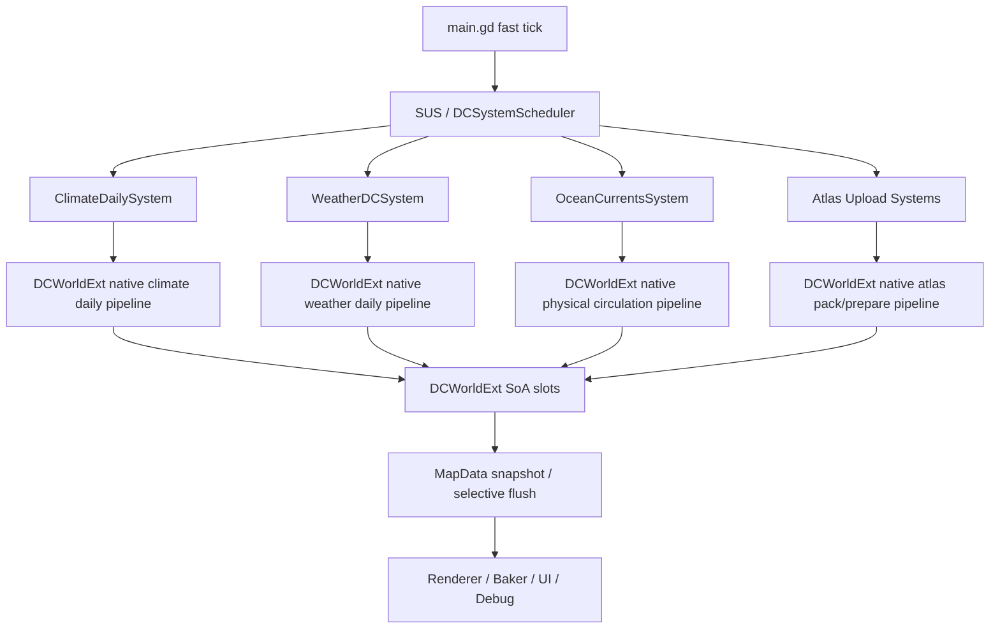

## User Requirements

用户希望为当前项目的完全数据导向重构制定一套详细、彻底、规范、可分阶段落地的优化方案，重点解决现有每日模拟性能日志中暴露的长尾、跳过、过度切片和重复计算问题。

## Product Overview

方案面向世界每日推进、气候、天气、洋流、季节刷新、枚举图集、海冰图集等核心模拟链路，目标是让高频计算更集中、更稳定、更可验证，并减少跨系统等待、重复扫描、过度刷新和调度饥饿。

## Core Features

- 合并每日模拟中可连续执行的计算阶段，降低多阶段切片造成的延迟。
- 优化气候、天气、洋流、图集刷新等核心任务的执行顺序和预算策略。
- 引入稀疏更新机制，避免每天全图重复扫描稳定单元格。
- 建立性能基线、正确性验证、回滚开关和分阶段发布流程。
- 保留现有视觉与数值行为一致性，确保优化后地图表现、天气前线、洋流、海冰和图集输出不发生不可控漂移。

## Tech Stack Selection

- **现有项目栈**：Godot 4.x、GDScript、GDExtension C++、godot-cpp、SCons、PackedArray SoA、DataCore/DCWorld/DCWorldExt、SUS/DCSystem 调度体系。
- **构建约束**：`gdext/SConstruct` 已确认会编译 `src/*.cpp`、`src/components/*.cpp`、`src/systems/*.cpp`、`src/profiles/*.cpp`，并支持 Windows x86_64 AVX2 开关，因此新增 C++ 系统模块应优先放入 `gdext/src/systems/`。
- **复用原则**：优先复用现有 `DCWorldExt` 已绑定方法，例如 `run_stage_b_pass`、`run_weather_refresh_daily_pass`、`run_ocean_field_rasterize`、`run_sea_ice_atlas_prepare`、`run_physical_circulation_pass`、`run_slp_field_pass`、`run_psi_solver_pass`，避免重复造轮子。
- **执行模型**：GDScript 保留配置、调度、UI、回退和诊断职责；热循环、批量 SoA 写入、稀疏索引遍历、合并管线执行下沉到 GDExtension C++。

## Implementation Approach

### 总体策略

采用“先护栏、再接线、再合并、再下沉、最后收敛调度”的方案。先固定现有 30/90/200/300 tick 性能窗口和 SAME_SOURCE A/B 正确性基线，然后逐步把已经存在但未完全接入的 C++ 合并路径变成默认路径，最后把仍在 GDScript 中拆散执行的 hot loops 合并为领域级 native pipeline。

### 核心技术决策

1. **从微切片调度转向领域事务调度**

- 当前 `sim_frame_budget_ms=1.0` 且 `sim_strict_budget_enabled=true`，导致大量 `strict_budget_one_job` 和 `frame_budget_exhausted`。
- 优化目标不是无脑扩大预算，而是让 SUS 调度更少、更粗、更可预测：每个 tick 尽量运行“气候 round、天气 daily、洋流刷新、图集上传”这类完整事务，而不是多个零散子 pass。
- 建议引入 profile 化预算：开发验证用 1ms 严格预算，正常快速模拟用 2ms 或动态预算，长尾任务用 debt/age 提升优先级。

2. **C++ Mode-B 数据所有权优先**

- 以 `DCWorldExt` slots 作为热数据权威，GDScript `MapData` 用于外部消费者快照、渲染、编辑器和回退。
- 所有热循环禁止 per-cell `Variant`、`Dictionary`、`Object.get/set`。
- 每个 native pass 只在入口解析一次 knobs，缓存 slot id、数组指针、常量表和邻居表。

3. **最大化合并计算，减少 GD↔CPP 往返**

- Weather：优先接通已有 `run_weather_refresh_daily_pass`，把 field solve、distribute、summary、cyclone wake、stage_b 合成一次 native 调用。
- Climate：新增或完善 daily climate round native pipeline，把 pass_a、pass_b、ocean water、ocean land、sea_ice、transpiration 在 C++ 内按依赖顺序执行，输出统一 breakdown。
- Ocean：优先使用 `run_physical_circulation_pass` 或 SLP/WIND/PSI 合并路径，之后接 `run_ocean_field_rasterize`，减少 solver 与 rasterize 之间的中间 GDScript 回写。
- Atlas：将 enum atlas pack、sea ice atlas prepare/pack 尽量变成 C++ 端批处理，GDScript 仅负责纹理上传和脏区策略。

4. **稀疏更新作为第二增长曲线**

- 当前日志显示 `dirty=1.00 visited=1.00`，说明气候仍在 full path。
- 先保证 full path native 化稳定，再引入 dirty index list。
- dirty ratio 低于阈值时走 indexed sparse kernel；高于阈值或季节切换时自动回退 full sweep。
- 目标复杂度：full path 为 O(N)，sparse path 为 O(D * neighbor_count)，其中 D 为 dirty cell 数。

5. **所有优化都必须 feature flag 化**

- 每个合并路径保留独立 flag、verify flag、fallback reason、first-run log。
- 出现 precondition mismatch、数组长度不一致、slot 缺失、数值漂移超阈值时自动回退 GDScript 或已验证旧 C++ 路径。

### 性能目标

基于用户给出的 2400 cells 性能日志，建议目标如下：

- SUS 稳态 p95：从约 4.3ms 降到 2.0ms 以内。
- SUS 稳态 max：历史 warmup 样本滚出后控制在 4.0ms 以内。
- `refresh_climate_daily`：单 round 尽量 1 到 2 tick 完成，单 tick p95 控制在 1.2ms 左右。
- `weather_refresh`：接通 daily native pipeline 后 p95 控制在 0.5ms 到 0.8ms。
- `ocean_currents`：通过 physical circulation native 合并和 rasterize native 化，将 p95 从 3.5ms 到 4.1ms 降到 1.5ms 以内。
- `enum_atlas_upload`：pack native 化后 p95 控制在 1.0ms 以内。
- `over_1ms_count_300`：在 1ms 严格 profile 下显著下降；在 2ms normal profile 下应接近 0 或只由上传类任务触发。

## Implementation Notes

- 不直接覆盖当前已修改的 GDExtension 二进制产物；源码调整后统一通过 `gdext/SConstruct` 构建，避免把手工编译中间状态混入方案。
- 现有日志中 `stage_b/combined` 已出现 DEBUG 调用，说明运行时 profile 可能覆盖了 `climate_profile.gd` 默认值；执行时必须以实际 resource 配置和 first-run gate log 为准，而不是只看默认导出值。
- `gdext/src/systems/` 当前可作为新增 native pipeline 模块目录；`world_ext.h/.cpp` 保留 Godot 绑定层和少量 orchestration，不再继续无限膨胀单文件 kernel。
- 所有 C++ pass 返回结构必须包含 `elapsed_ms`、`fallback/reason`、分段 breakdown、处理 cell/pixel 数、关键输出长度，用于 main/SUS 日志直接归因。
- 稀疏路径必须提供 full fallback，并保留季节切换、存档加载首日、每 N 日 full sweep 的现有安全语义。
- 日志避免每 tick spam：first-run、fallback、verify mismatch、每 30 tick 聚合输出即可。
- 所有数组长度、slot dtype、component id 必须在 native pass 入口集中校验；失败只回退，不崩溃、不半写。

## Architecture Design

### 目标架构



### 分层职责

- **GDScript 调度层**
- 维护 SUS job 顺序、策略、feature flag、fallback、日志、profile 切换。
- 构造 native knobs，但不得在 hot path 内做 per-cell pack/unpack。
- 保留旧路径作为 A/B 和 rollback。

- **DataCore 层**
- 统一 component schema、slot id、pool、archetype、dirty index、view/snapshot API。
- 将仍缺失但频繁 pack 的字段下沉到 SoA，例如气候输运异常、上升流强度、风速、SLP、q/r 反查所需字段等，实际新增以审计结果为准。

- **GDExtension native pipeline 层**
- 执行领域级 pipeline，而不是大量小 pass。
- 以 slot 指针和预构建邻居表为输入，返回 compact breakdown。
- 支持 full 和 indexed sparse 两套 kernel。

- **验证层**
- SAME_SOURCE A/B、soak runner、perf verdict、视觉 hash、关键数组误差统计。
- 每个阶段独立阈值，失败自动降级。

## Directory Structure

### Directory Structure Summary

本方案在现有 Godot + DataCore + GDExtension 架构上推进，不重建项目结构。GDScript 侧主要负责接线、调度和验证；C++ 侧新增系统模块承载合并后的 native pipelines。

```text
Project.Keynes/
├── gdext/
│   ├── SConstruct
│   │   # [AFFECTED] 已确认 Glob("src/systems/*.cpp")，新增 C++ 系统文件无需额外改构建。
│   └── src/
│       ├── world_ext.h
│       │   # [MODIFY] 保留 Godot 绑定 API，新增/整理 native daily pipeline 方法声明、返回结构约定、reset/verify 辅助接口。
│       ├── world_ext.cpp
│       │   # [MODIFY] 缩减为绑定层和 orchestration，调用 src/systems 中的纯 C++ kernel；保留现有 run_* 方法兼容。
│       └── systems/
│           ├── native_pipeline_types.h
│           │   # [NEW] 统一 NativePassResult、TimingBreakdown、FallbackReason、DirtySpan 等轻量结构，避免各 pass 自定义返回格式。
│           ├── climate_kernels.h / climate_kernels.cpp
│           │   # [NEW] 承载 pass_a、pass_b、ocean water/land、sea_ice、transpiration 的 full 与 sparse kernel。
│           ├── weather_kernels.h / weather_kernels.cpp
│           │   # [NEW] 承载 weather field、distribute、summary、cyclone、stage_b 合并调用辅助，复用已有实现。
│           ├── ocean_kernels.h / ocean_kernels.cpp
│           │   # [NEW] 承载 SLP、wind、PSI、physical circulation、ocean/wind rasterize 的合并编排和共享缓存。
│           └── atlas_kernels.h / atlas_kernels.cpp
│               # [NEW] 承载 enum atlas、sea ice atlas 的 prepare/pack 脏区批处理逻辑。
│
└── Project/project-keynes/
    ├── scripts/
    │   ├── data/
    │   │   └── climate_profile.gd
    │   │       # [MODIFY] 增加 profile 化性能预算、native pipeline flags、verify flags、稀疏阈值和安全默认值。
    │   ├── data_core/
    │   │   ├── component_ids.gd
    │   │   │   # [MODIFY] 如审计确认缺失，新增 hot fields 的 component id，减少临时 PackedArray pack。
    │   │   ├── component_schema.gd
    │   │   │   # [MODIFY] 为新增 SoA 字段定义 dtype、stride、MapData property 绑定。
    │   │   ├── world.gd
    │   │   │   # [MODIFY] 补齐 dirty index、snapshot、flush 或 debug 查询接口，与 DCWorldExt 对齐。
    │   │   ├── dc_system_scheduler.gd
    │   │   │   # [MODIFY] 支持 normal/strict/native pipeline profile 的预算同步。
    │   │   └── dots_total_cpp_perf_verdict.gd
    │   │       # [MODIFY] 扩展最终验收阈值，加入 native pipeline p95/max/over-budget 判定。
    │   ├── geography/
    │   │   └── map_generator.gd
    │   │       # [MODIFY] 接通 climate/ocean/stage_b native knobs，减少 per-cell pack，保留 fallback 与 breakdown。
    │   ├── weather/
    │   │   ├── weather_system.gd
    │   │   │   # [MODIFY] 接通 run_weather_refresh_daily_pass，集中处理 fronts/cyclone mirror 和 fallback。
    │   │   └── field_solver.gd
    │   │       # [MODIFY] 收敛独立 field/distribute/summary 调用，优先走 daily native pipeline。
    │   ├── rendering/
    │   │   └── map_baker.gd
    │   │       # [MODIFY] 接通 ocean/wind/enum/sea-ice raster native pack，GDScript 只负责上传。
    │   └── simulation/
    │       ├── sus/
    │       │   ├── sus_scheduler.gd
    │       │   │   # [MODIFY] 增加 profile 化预算、任务 debt/age、防饥饿统计、native pipeline breakdown 汇总。
    │       │   └── jobs/
    │       │       ├── weather_refresh_job.gd
    │       │       │   # [MODIFY] 保留 legacy fallback，逐步将主路径转给 WeatherDCSystem/native daily。
    │       │       └── ocean_currents_job.gd
    │       │           # [MODIFY] 保留 legacy fallback，接通 native physical circulation 与 rasterize。
    │       └── systems/
    │           ├── climate_daily_system.gd
    │           │   # [MODIFY] 从 6-pass 微切片升级为 native round 优先，fallback 保留现有 pass 顺序。
    │           ├── weather_system.gd
    │           │   # [MODIFY] 移除 wrapper 热路径，inline 或直接转 native daily pipeline。
    │           ├── ocean_currents_system.gd
    │           │   # [MODIFY] 移除 wrapper 热路径，统一 ocean solver/rasterize native 入口。
    │           ├── enum_atlas_upload_system.gd
    │           │   # [MODIFY] 接通 C++ pack，降低 enum_atlas_upload p95。
    │           ├── sea_ice_atlas_upload_system.gd
    │           │   # [MODIFY] 复用 run_sea_ice_atlas_prepare，并补齐 pack/upload 边界。
    │           └── season_refresh_system.gd
    │               # [MODIFY] 接通已有 season native stage/micro pass，降低 strict_budget 跳过。
    ├── tests/
    │   ├── native_pipeline_regression_test.gd
    │   │   # [NEW] 覆盖 climate/weather/ocean/atlas native pipeline 与 legacy 输出一致性。
    │   └── sparse_dirty_regression_test.gd
    │       # [NEW] 覆盖 dirty index、full fallback、季节切换、存档首日 full sweep。
    ├── tools/
    │   └── native_pipeline_soak_runner.gd
    │       # [NEW] 自动执行 30/90/200/300 tick A/B soak，输出 p95、max、hash、drift、fallback reason。
    └── docs/
        └── dots-native-pipeline-optimization.md
            # [NEW] 固化架构、开关矩阵、验收阈值、回滚流程和性能结果。
```

## Key Code Structures

以下仅定义接口级契约，具体实现以现有 `DCWorldExt` 和 GDScript callsite 审计结果为准。

```cpp
struct NativePassResult {
    double total_ms;
    bool fallback;
    const char *reason;
    int cells_visited;
    int dirty_count;
};
```

```cpp
namespace pk::systems {
NativePassResult run_climate_daily_pipeline(DCWorldExt &world, const godot::Dictionary &knobs);
NativePassResult run_weather_daily_pipeline(DCWorldExt &world, const godot::Dictionary &knobs);
NativePassResult run_ocean_pipeline(DCWorldExt &world, const godot::Dictionary &knobs);
}
```

```
# GDScript 侧约定：所有 native pipeline 返回 Dictionary
# 必含字段：elapsed_ms, fallback, reason, breakdown, cells, dirty_count, path
func _try_run_native_pipeline(ext, method_name: StringName, knobs: Dictionary) -> Dictionary
```

## Validation and Rollout

1. **Baseline**

- 固定当前性能：fast tick total、SUS total、job avg/p95/max、over_1ms_count、largest_slice、fallback reason。
- 保留用户提供日志作为初始对照。

2. **Correctness**

- 每个 native pipeline 先跑 verify 模式：同源输入先 C++，再 legacy，比较关键数组、front 数量、图集 dirty 范围、视觉 hash。
- 浮点容差按 pass 类型分级：简单累加 1e-6，含 sqrt/sin/cos 的气候天气 1e-4。

3. **Performance**

- 每阶段至少跑 30 tick 快速检查、90 tick 稳态检查、200 tick verdict、300 tick SUS budget window。
- 剔除 warmup 历史最大值后再判断稳态 max。

4. **Rollback**

- 每个合并路径独立 flag。
- 任一 native path 入口校验失败或 verify mismatch，自动 fallback，不影响主循环。
- 文档记录“推荐默认组合”和“保守默认组合”。

## Agent Extensions

### Skill

- **civ-grounded-development**
- Purpose: 按项目既有架构、玩法数值和 DataCore/SUS 约束进行读先行规划，避免引入不必要的新子系统。
- Expected outcome: 每个优化阶段都有明确代码依据、兼容现有系统，并保留验证与回退路径。

### SubAgent

- **code-explorer**
- Purpose: 在实施前对多文件调用链、feature flag、GDExtension 绑定、DataCore schema 和 hot path callsites 做系统化补充审计。
- Expected outcome: 输出准确的修改边界、依赖关系、遗漏字段清单和可安全删除的 wrapper 路径。