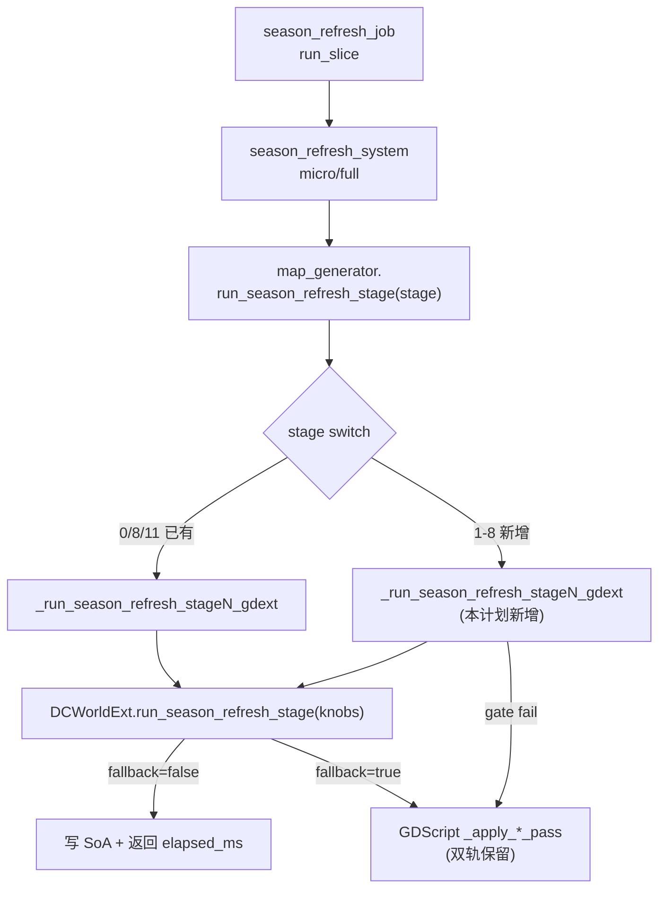

## 用户原始诉求

"还有多少计算残留在GDScript没有移动到C++？" → 经分析得出 8 个 season_refresh stage + cyclone 突刺 + enum_atlas pack + 3 个 SIMD flag 是残留 → "制定方案，帮我把所有这些计算全部移动到DOTS架构下。"

## 产品概述

对 Project Keynes 的气候/地形仿真热路径做"真·收尾"迁移：将仍残留在 GDScript 的所有重计算搬到 C++ (dots_ext GDExtension)，使 fast tick 主热路径 100% 在 native，fast_ms p95 从 7-8ms 压到 ≤5ms。

## 核心功能

1. **season_refresh stage 1-8 全量 C++ 化**（8 个 pass）

- stage 1：`_apply_rain_shadow_per_cell`（雨影 + WindBelt 6 邻接 lookback）
- stage 2：`_seasonal_redecide_terrain`（决策树 + apply_terrain，5ms 单帧最高峰）
- stage 3：`_apply_river_ecology`（河岸绿洲）
- stage 4：`_apply_vegetation_feedback`（邻域 diffuse + 二次 redecide，3ms × 4 帧）
- stage 5：`_apply_shrubland_pass`（灌木过渡带）
- stage 6：`_apply_mangrove_pass`（红树林）
- stage 7：`_apply_glacier_pass`（冰川多 pass，843 行最难）
- stage 8：`_apply_swamp_pass`（沼泽）

2. **cyclone_wake_step 突刺路径诊断与下沉**（spawn/merge/death 离散事件）
3. **enum_atlas pack** GDScript fallback 路径退役（C++ 路径已默认 ON，仅清理残留）
4. **3 个 SIMD flag 启用**：`use_gdext_pass_b_simd` / `use_gdext_ocean_water_simd` / `use_gdext_ocean_land_simd`，1000-tick mean ≥30% 加速验收
5. **完整双轨 + 验收**：每个 stage 保留 `use_gdext_*` flag、A/B 等价性 diff、72h 长跑稳定性

## 验收标准

- **等价性**：1000-tick A/B diff，所有 cell 的 terrain/base_terrain/vegetation/moisture/elevation_modifier 一致（浮点 epsilon 1e-5）
- **性能**：season_refresh 总耗时 ↓ ≥60%，fast_ms p95 ≤5ms
- **稳定性**：72h soak 无 crash / NaN / atlas 错位

## 技术栈

- **GDScript（Godot 4.x）**：调度层 + helper 包装 + flag 双轨 gate；现有项目唯一脚本语言
- **C++ (GDExtension `dots_ext`)**：所有热路径计算 native 实现；通过 `DCWorldExt.run_season_refresh_stage(knobs: Dictionary)` 统一入口
- **PackedArray / SoA**：跨语言零拷贝引用传递（`map.soil_moisture_arr` / `vegetation_growth_pressure_arr` / `terrain_arr` / `base_terrain_arr` 等）
- **CSR 邻接表**：`neighbor_indices_packed`（已存在，weather/atlas pipeline 在用）

## 实施策略

**整体思路**：完全复刻 stage 0/8/11 的双轨模板（line 2306/2345/2405），新增 stage 1-8 各自的 `_run_season_refresh_stage{N}_gdext(map, world, season) -> bool` helper：

1. flag + ext + method 存在性 gate；任一不满足返回 false 走 GDScript fallback；
2. 构造 knobs（stage 编号 + 输入 SoA 引用 + 必要 cfg）；
3. 调 `_data_core_world_ext.run_season_refresh_stage(knobs)`；
4. 检 `fallback` 字段 + `elapsed_ms`，失败 once-log 并回 GDScript；
5. 主 switch (`run_season_refresh_stage` line 1910) 在每个 stage 优先 try gdext helper。

**关键技术决策**：

- **C++ ABI 沿用现有约定**：单一入口 `run_season_refresh_stage(knobs)`，stage 编号区分子 pass，避免方法爆炸；C++ 端在已有 stage 0/8/10 的 dispatch switch 内补 1-8 case。
- **WindBelt 复刻**：C++ 端实现 `wind_belt_wind_at(ny, season_phase) -> Vec2` + `upwind_hex_dir(...)`，纯函数无状态，与 `wind_belt.gd` bit-equal；6 邻接 lookback 走 neighbor_indices_packed CSR。
- **apply_terrain 复刻**：C++ 端必须同步写 `terrain_arr` / `vegetation_arr`（multi-axis），依赖 `feature_flags.use_hexcell_facade=true` 让 GDScript HexCell.terrain getter 自动看到 SoA；不写 `base_terrain`（与 hex_cell.gd:812 一致）。
- **stage 7 冰川分子 pass**：843 行内含雪线/冰川流/侵蚀多 sub-pass，knobs 加 `glacier_sub_pass: int` 子分发，C++ 内分函数实现；保留 GDScript fallback 用于 bit-equal 测试。
- **cyclone 突刺**：等下次 SLOW dump 复现，定位 spawn/merge/death 是否有 GDScript 回调或 C++ 内部某条 O(N²) 路径；先加细粒度计时再决定迁移面。
- **SIMD flag 翻 ON**：纯 flag 翻转 + dots_soak_ab_runner.gd 跑 1000-tick mean，满足 ≥30% 加速 + bit-equal 才提交。
- **enum_atlas pack 收尾**：C++ 路径已默认 ON 且稳定，本次仅在 baker 加遥测确认 fallback 路径 0 触发后，把 `use_gdext_enum_atlas_pack` 升入 `dots_completion_gate` required=true，GDScript fallback 保留。

**性能与可靠性**：

- 每 stage helper O(N_cells)，与 GDScript 同阶但常数 8-15×（参考已迁 stage 实测）；预计 stage 1-8 累加 ~17-20ms → ~2-3ms。
- knobs 全部 PackedArray 引用零拷贝，避免 Variant 装箱；ms_breakdown 字段沿用现有遥测。
- once-log fallback：每个 helper 一个 `_seasonN_gdext_fallback_logged: bool` 防 spam；reason 字符串用于诊断。
- 双轨期保护：任何 stage 的 GDScript 实现禁止改语义；C++ 必须 bit-equal（epsilon 1e-5）。

**避免技术债**：

- 完全沿用 stage 0/8/11 的 helper 命名 / gate / once-log / fallback 模式，零新模式；
- flag 注册三处同步（climate_profile.gd 默认值 / feature_flags.gd 注册表 / dots_completion_gate.gd 段元数据），与 dots-final-push 一致；
- 不删 GDScript 实现（用户明确要求保留双轨）；
- A/B 验收复用 `dots_soak_ab_runner.gd`（line 396-404 已支持 use_gdext_season_refresh on/off）。

## 实施备注

- **Grounded**：所有改动严格沿用 `_run_season_refresh_stage{0,8,11}_gdext` 现有模板；不发明新 ABI / 新方法名 / 新 flag 命名风格。
- **性能**：stage 2/4/7 是 hot 中之 hot，C++ 端必须避免 Dictionary 查询 / Vector3i 哈希；用 row-table 预计算 + flat 数组寻址；6 邻接走 CSR 直接索引，禁止 cell.neighbors() 调用。
- **日志**：复用现有 `print("[season_refresh] gdext stageN fallback: ...")` 风格 + `_seasonN_gdext_fallback_logged` once-flag；不打 per-cell 日志；SLOW dump 复用 map_generator.gd line 5341 的现有触发器。
- **爆炸半径控制**：每 stage 单独 PR / 单独 flag；分 4 期合入；任一期发现 diff 超 epsilon 立刻 flag=false 回滚 GDScript 路径，不阻塞其他 stage。

## 架构设计

### 数据流



### 模块划分

- **map_generator.gd**：8 个新 helper + 主 switch 改造（核心改动面）
- **climate_profile.gd**：复用 `use_gdext_season_refresh` 总开关，可选拆 8 个子 flag（推荐：单总开关 + per-stage knob 内部细分，与 stage 0/8/11 一致）
- **feature_flags.gd / dots_completion_gate.gd**：补 SIMD 三 flag 的 segment 元数据；enum_atlas_pack required 升 true
- **dots_soak_ab_runner.gd**：补 SIMD 与 cyclone 的 A/B 矩阵
- **wind_belt.gd**：纯查询函数；不动，C++ 复刻不影响 GDScript

## 目录结构

```
Project/project-keynes/scripts/
├── geography/
│   └── map_generator.gd                   # [MODIFY] 主改动面。新增 8 个 helper:
│                                          #   _run_season_refresh_stage1_gdext (rain_shadow + WindBelt 6 邻接)
│                                          #   _run_season_refresh_stage2_gdext (redecide_terrain + decision tree)
│                                          #   _run_season_refresh_stage3_gdext (river_ecology)
│                                          #   _run_season_refresh_stage4_gdext (vegetation_feedback + 二次 redecide)
│                                          #   _run_season_refresh_stage5_gdext (shrubland)
│                                          #   _run_season_refresh_stage6_gdext (mangrove)
│                                          #   _run_season_refresh_stage7_gdext (glacier multi sub-pass via knobs.glacier_sub_pass)
│                                          #   _run_season_refresh_stage8_gdext (swamp)
│                                          # 改 run_season_refresh_stage line 1910 主 switch:
│                                          #   每个 stage 1-8 case 先 try gdext helper, 失败再调原 _apply_*_pass
│                                          # 移除 line 1945-1976 的 8 条 TODO(dots-total-cpp) 注释（迁完后）
│                                          # cyclone 突刺：在 weather 分发处加 spawn/merge/death 细粒度遥测字段
│                                          #   到 _last_weather_breakdown，便于 SLOW dump 定位
│                                          # 新增 8 个 once-log flag：_season{N}_gdext_fallback_logged: bool
│
├── data/
│   └── climate_profile.gd                 # [MODIFY] line 370-372 三个 SIMD flag 翻 true:
│                                          #   use_gdext_pass_b_simd: bool = true
│                                          #   use_gdext_ocean_water_simd: bool = true
│                                          #   use_gdext_ocean_land_simd: bool = true
│                                          # 注释加验收标记 "1000-tick mean ≥30% accel verified"
│                                          # 复用现有 use_gdext_season_refresh 总开关 (line 286)
│
├── data_core/
│   ├── feature_flags.gd                   # [MODIFY] 在 line 389-405 三个 SIMD flag 注册块加注释:
│                                          #   "Phase 4 真·收尾启用：1000-tick A/B 验收通过后默认翻 true"
│                                          # 不新增 flag（季节 8 stage 复用 use_gdext_season_refresh 总开关）
│   │
│   └── dots_completion_gate.gd            # [MODIFY] 把 enum_atlas_pack required=true（line 63-65 / 100-103）
│                                          # 新增 segment："season_refresh_stage_1_to_8"
│                                          #   flag = use_gdext_season_refresh, required=true
│                                          # 新增 segment："simd_avx2_pack"
│                                          #   3 个 flag, required=true
│
├── simulation/
│   ├── sus/jobs/season_refresh_job.gd     # [VERIFY-ONLY] 调用入口 line 99-113 已对：
│                                          #   先 try run_season_refresh_stage_micro 再 fallback run_season_refresh_stage
│                                          # 不需改动；新 helper 自动生效
│   │
│   └── systems/season_refresh_system.gd   # [VERIFY-ONLY] 同上 line 137-154，无需改动
│
├── weather/
│   └── wind_belt.gd                       # [VERIFY-ONLY] WindBelt 静态查询不动；C++ 端复刻 ABI:
│                                          #   wind_at(ny, season_phase), upwind_hex_dir(...)
│                                          # 验收时 GDScript / C++ 各采样 1000 ny × 4 season 比对 epsilon 1e-5
│
├── rendering/map_baker.gd                 # [MODIFY] line 696-961 enum_atlas pack 收尾：
│                                          #   保留 GDScript fallback 但加 _enum_atlas_fallback_count 计数
│                                          #   72h soak 期间若 0 触发，文档标记可在下一计划期删除
│
└── tools/
    └── dots_soak_ab_runner.gd             # [MODIFY] line 396-404 A/B 矩阵扩充：
                                           #   新增 stage 1-8 单独 on/off 矩阵（用于回归隔离）
                                           #   新增 SIMD 三 flag 矩阵（pass_b_simd / ocean_water_simd / ocean_land_simd）
                                           #   新增 cyclone 突刺路径 A/B（待 SLOW dump 定位后补 knob）
```

## 关键代码结构

新 helper 严格沿用 `_run_season_refresh_stage8_gdext` (line 2306) 模板；签名固定：

```
# 每个 stage 1-8 的 helper 接口（GDScript）
# 返回 true = C++ 路径成功；返回 false = 主 switch 调原 _apply_*_pass
func _run_season_refresh_stage{N}_gdext(map: MapData, _world: WorldData, season: int) -> bool

# C++ ABI（已存在，仅扩 stage case）
# DCWorldExt.run_season_refresh_stage(knobs: Dictionary) -> Dictionary
# knobs:
#   stage: int                          # 1..8
#   season: int                         # 0..3
#   moist_scale / off_tab / row_season_off ...  (复用 stage 0 风格)
#   neighbor_indices_packed: PackedInt32Array   # CSR for 6 邻接（stage 1/4 用）
#   terrain_arr / base_terrain_arr / vegetation_arr / moisture_arr / elevation_arr ...
#   glacier_sub_pass: int               # 仅 stage 7 用，0..K
# 返回:
#   fallback: bool, elapsed_ms: float, ms_breakdown: Dict, reason: String
```

## Agent Extensions

### Skill

- **civ-grounded-development**
- Purpose: 强制在动手前完成 grounding（架构 / 现有 stage 0/8/11 模板 / WindBelt / apply_terrain 语义 / SoA 字段命名），确保 C++ 化与 GDScript fallback bit-equal
- Expected outcome: 每个 stage helper 的 knobs 字段、回退路径、once-log、SoA 引用方式都对齐既有约定，零新模式

### SubAgent

- **code-explorer**
- Purpose: 在实现 stage 7 冰川（843 行多 sub-pass）和 stage 4（二次 redecide）时，跨多个相关函数（_decide_terrain / _alt_penalty / _is_permanent_landform / apply_terrain）梳理依赖闭包，定位所有 cell 字段写入点
- Expected outcome: 输出每个 stage 的"输入 SoA 字段集 / 输出 SoA 字段集 / 决策依赖参数"清单，作为 C++ 端复刻的契约文档