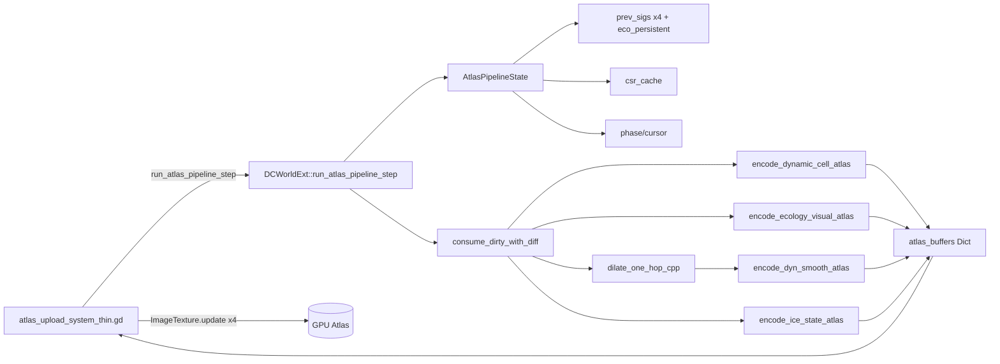

## 用户需求

将 `dynamic_visual_atlas_upload_system` 这条**每帧热路径**（4 张运行期视觉 atlas：dynamic_cell / ecology_visual / dyn_smooth / ice_state）的全部计算一次性下沉到 C++ DOTS（gdext/src/world_ext），GD 端 4 个 baker chunk 接口与 atlas_upload_system 状态机退化为薄壳。

## 核心特性

- **单一入口**：GD 每 tick 只调 `world_ext.run_atlas_pipeline_step(opts)`，C++ 内部完成 dirty 消费 / value-diff / merge / dilate / CSR 打包 / 4 张 atlas encode / 4-phase 调度节流
- **dirty 兜底**：在 dirty_count≈2400/9600 的现状下，C++ 端为 4 张 atlas 各自维护上一帧 snapshot（sigs + ecology 持久状态），对 dirty_indices 做 value-diff 过滤，真正变化的 cell 才进 encode
- **数据零迁移**：C++ 通过现有 `world->get(...)` / Slot 机制读 SoA TypedArray，不动 hex_cell facade setter、不动 weather_system hot path、不动 dirty 语义
- **GD 边界保留**：`ImageTexture.update` 仍由 GD 端拿到 atlas_buffers（PackedByteArray）后调用，避免跨 RenderingServer 线程边界
- **可回退**：新增 `cpp_atlas_pipeline_enabled` flag，关闭时走旧 4-phase chunk 路径（map_baker.gd 旧函数与 atlas_upload_system 旧状态机保留可用）
- **单 PR 一次性大改**：4 张 atlas 一起下沉

## 技术栈

- Godot 4.x + GDExtension（C++17，godot-cpp）
- 现有 `gdext/src/world_ext.{h,cpp}`（已包含 4 个 atlas encode 函数与 Slot/CSR 基础设施）
- GDScript 端 `Project/project-keynes/scripts/...`（薄壳化）

## 实现策略

### 总体方法

将原 GD 端 `_step_phase_baker` 4-phase 状态机 + `*_chunk_begin/step/finalize` 三段式调用 + `BakerDirtyHelpers.dilate_dirty_one_hop / merge_with_eco_decay` 的 GDScript 实现，**整体收敛**到 C++ 端 `DCWorldExt::run_atlas_pipeline_step()` 单一入口。C++ 内部用一个 `AtlasPipelineState` 结构体持有 4 张 atlas 的 snapshot（prev_sigs）+ ecology 持久状态 + CSR 缓存 + phase cursor，GD 端薄壳每 tick 推进一次。

### 关键技术决策

1. **snapshot value-diff 替代 dirty 语义修复**（用户明确不修 dirty）：每 atlas 维护 `PackedInt32Array prev_sigs[N]`；C++ 在 encode 前先按 dirty_indices 计算新 sig，与 prev_sigs 比对，相等则 skip pixel fan-out（已部分实现于 `encode_dynamic_cell_atlas` line 7737-7750，本 PR 推广到 ecology / smooth / ice 并把 prev_sigs 持久化到 ext 内部，无需 GD 来回传）

2. **CSR 缓存常驻 C++**：`world.cells_to_pixel_lists()` 是稳定映射（地图不变就不变），把 CSR（first_px / px_count / flat_px）一次性建在 C++ 端 `AtlasPipelineState::csr_cache`，提供 `invalidate_atlas_csr_cache()` API 给地图重生成时调用；省掉每 stride 的 GD→C++ marshalling

3. **ecology 持久状态迁移**：`foliage / stress / transition_age / growth_damage / _eco_active_decay_set` 当前在 `map_baker.gd` 内部累计，迁移到 `AtlasPipelineState::eco_persistent` 一次性挂载（init 阶段从 GD 拷贝；后续完全由 C++ 维护）

4. **dilate / merge 用 C++ 重写**：`dilate_dirty_one_hop` 已有自适应稀疏/稠密路径（`baker_dirty_helpers.gd` line 45-126），C++ 用 `std::vector<uint8_t> seen` + `MapData::neighbor_indices_packed()` 直读重写；merge 用 `seen` 数组合并 dirty_indices ∪ decay_set

5. **ImageTexture.update 留在 GD**：C++ 输出 4 个 PackedByteArray atlas_buffers，GD 端薄壳调 `Image.create_from_data` + `ImageTexture.update`。代价：每 stride 4 次 PBA 跨边界，但 PBA 是 CoW + 引用计数，零拷贝；好处：避免跨 RenderingServer 渲染线程边界 + 保留 `_pending_*_buf` 的 partial atlas upload 兼容

6. **4-phase 状态机内置 C++**：`AtlasPipelineState::phase` 枚举 + `cursor` 标量；GD 端只看返回 Dict 的 `done` 字段决定是否再调一次。`soft_budget_us` 由 GD 传入，C++ 在每 phase 内部 + 每 chunk 边界检查截止时间

### 性能与可靠性

- **复杂度**：每 stride O(D × P)，D = 真·变化 cell（snapshot diff 后），P = 平均像素/cell；理论上 dirty=2400 全部静态时 D 趋近 0
- **内存**：snapshot ≈ 4 × 9600 × 4B(sig) + ecology 持久 4 × 9600 × 4B ≈ 300KB，可控
- **回退**：`cpp_atlas_pipeline_enabled = false` 时所有薄壳 fallback 到旧路径；同时保留现有 `cpp_atlas_encode_enabled`（per-phase encode-only 下沉）作为中间档位
- **bit-equal 验收**：与 GD 旧路径 ⊕ 现有 `tests/cpp_atlas_encode_bitequal_test.gd` 对齐，新增 pipeline-level 测试

### 避免技术债

- 复用 `parse_csr_common` / Slot / `component_id` 等已有 C++ 基础设施
- 4 个 encode_* 函数签名保留（薄壳测试 / 回退路径用），不做不兼容删除
- GD 端 deprecated 文件加 `[deprecated 2026-05-20 atlas-pipeline-cpp]` 顶部注释而非立即删除

## 实现要点（Implementation Notes）

- **不动**：`hex_cell.gd` facade setter、`weather_system.gd` setter 风暴、`world.read_and_clear_dirty_mask()` 语义、4 个 atlas 像素布局
- **日志复用**：现有 `[DCWorldExt] encode_*: ...fallback to GDScript` 风格 + `_dvas_diag_*` 采样窗口；C++ 端用 `UtilityFunctions::push_warning / print_verbose`，每 30 stride 采样一次 phase breakdown
- **零回归**：保留 `_tick_oneshot` 紧急回退；保留 `enable_time_slicing = false` 路径
- **Blast radius**：所有改动闸门在 `cpp_atlas_pipeline_enabled` flag；ecology 持久状态迁移做"GD→C++ 双写校验"一次性 burn-in，验证后切单写

## 架构



## 目录结构

```
gdext/
├── src/
│   ├── world_ext.h                         # [MODIFY] 新增 AtlasPipelineState 前向声明 + run_atlas_pipeline_step / invalidate_atlas_csr_cache / migrate_eco_persistent_from_gd 三个公开方法签名；保留现有 4 个 encode_* 签名
│   ├── world_ext.cpp                       # [MODIFY] 新增 AtlasPipelineState 定义、run_atlas_pipeline_step 主循环、consume_dirty_with_diff、dilate_one_hop_cpp、merge_with_eco_decay_cpp、phase 调度逻辑；4 个 encode_* 改造为接受内部 state 引用而非纯 knobs Dict（保留旧 knobs 入口做兼容）
│   └── register_types.cpp                  # [MODIFY] 注册 3 个新 ClassDB method
Project/project-keynes/
├── scripts/
│   ├── simulation/systems/
│   │   └── dynamic_visual_atlas_upload_system.gd   # [MODIFY] 退化为薄壳：tick 内只调 run_atlas_pipeline_step，拿 atlas_buffers 后 4 次 ImageTexture.update；保留 enable_time_slicing=false 紧急回退；保留 _last_breakdown 诊断；删除 _step_phase_baker / _baker_callables / 12 个 phase ms 累加器
│   ├── rendering/
│   │   ├── map_baker.gd                            # [MODIFY] 4 组 chunk_begin/step/finalize（line 674-1311 ≈ 640 行）退化为：cpp_atlas_pipeline_enabled=true 时直接 return 空 ctx；=false 时走旧路径。保留 _cpp_atlas_encode_active / _pending_*_buf 字段供薄壳路径使用
│   │   └── bakers/
│   │       └── baker_dirty_helpers.gd              # [MODIFY] 顶部加 [deprecated]，函数体保留但仅作 cpp_atlas_pipeline_enabled=false 时的 fallback；新增 _ensure_cpp_dilate_used_warning 一次性提示
│   ├── data/
│   │   └── climate_profile.gd                      # [MODIFY] 新增 cpp_atlas_pipeline_enabled: bool（默认 true）；保留 cpp_atlas_encode_enabled
│   └── data_core/
│       └── feature_flags.gd                        # [MODIFY] 注册 &"cpp_atlas_pipeline_enabled" flag
└── tests/
    └── cpp_atlas_pipeline_bitequal_test.gd         # [NEW] pipeline-level bit-equal 测试：跑 N stride 后 4 张 atlas PackedByteArray 与旧路径逐字节比对；ecology 持久状态跨 stride 一致性校验
```

## 关键 C++ 接口（仅签名）

```cpp
// gdext/src/world_ext.h 新增
struct AtlasPipelineState;  // 前向声明，定义在 .cpp 匿名命名空间
class DCWorldExt {
public:
    // 主入口：每 tick 调一次，内部推进 4 phase 状态机
    godot::Dictionary run_atlas_pipeline_step(godot::Dictionary opts);
    // 地图重生成时调，使 csr_cache / snapshot 失效
    void invalidate_atlas_csr_cache();
    // 一次性把 GD 端 ecology 持久状态迁到 C++（init 阶段调）
    void migrate_eco_persistent_from_gd(godot::Dictionary state);
private:
    AtlasPipelineState *_atlas_state = nullptr;  // lazy 构造
};
```

```cpp
// gdext/src/world_ext.cpp 匿名命名空间内
struct AtlasPipelineState {
    enum Phase : int { IDLE=0, DYNAMIC=1, ECOLOGY=2, SMOOTH=3, ICE=4, DONE=5 };
    Phase phase = IDLE;
    int cursor = 0;
    // 4 atlas snapshot（按 cell.index 顺序）
    godot::PackedInt32Array prev_sigs_dyn, prev_sigs_eco, prev_sigs_smo, prev_sigs_ice;
    // ecology 持久状态（值随时间衰减）
    godot::PackedFloat32Array eco_foliage, eco_stress, eco_transition_age, eco_growth_damage;
    godot::PackedInt32Array eco_active_decay_indices;  // 替代 GD Dictionary set
    // CSR 缓存（地图稳定时常驻）
    godot::PackedInt32Array csr_first_px, csr_px_count, csr_flat_px;
    bool csr_valid = false;
    // 本 stride 工作集
    godot::PackedInt32Array stride_dirty_indices;
    godot::PackedInt32Array stride_dyn_real;  // value-diff 后真·变化
    godot::PackedInt32Array stride_eco_real;
    godot::PackedInt32Array stride_smo_real;  // ∪ 1 跳邻居
    godot::PackedInt32Array stride_ice_real;  // ∩ water_cells
    // phase ms 切片
    double ms_dyn_prep=0, ms_dyn_step=0, ms_dyn_fin=0;
    double ms_eco_prep=0, ms_eco_step=0, ms_eco_fin=0;
    double ms_smo_prep=0, ms_smo_step=0, ms_smo_fin=0;
    double ms_ice_prep=0, ms_ice_step=0, ms_ice_fin=0;
    // 输出 buffer（每 phase finalize 时填充）
    godot::PackedByteArray buf_dyn, buf_eco, buf_smo, buf_ice;
};
```

## Agent Extensions

### SubAgent

- **code-explorer**
- Purpose: 在实施阶段对 `map_baker.gd` 4 组 chunk 函数的内部状态依赖（`_pending_*_buf` / `_last_*_sigs` / `_eco_active_decay_set` 等）做一次完整调用图扫描，确保迁移到 C++ 时无遗漏字段
- Expected outcome: 输出一份"GD→C++ 状态迁移清单"，每个字段标注：当前持有者、写入点、读取点、是否需要 burn-in 双写

### Skill

- **civ-grounded-development**
- Purpose: 在改造 `world_ext.cpp` 时严格遵循"读优先、复用优先"——禁止新建并行 Slot/CSR 抽象，必须复用 `parse_csr_common` / `_slots` / `component_id` 现有基础设施
- Expected outcome: 所有 C++ 新增逻辑均在现有 namespace + 现有 helper 之上扩展，不引入第二套数据访问层