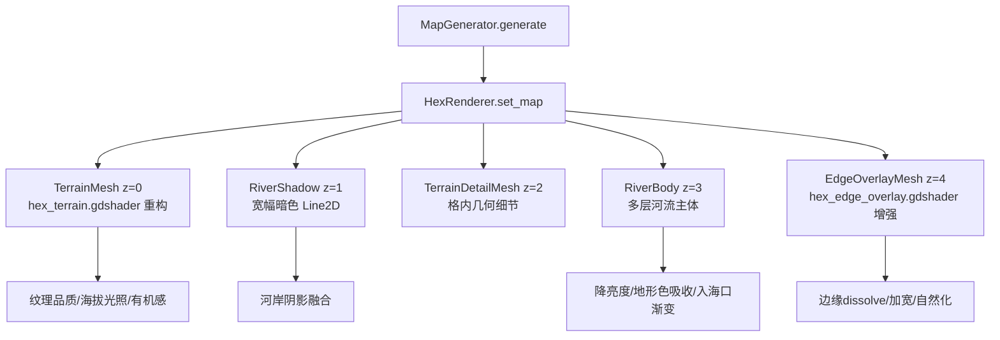

## 用户需求

对当前六边形地图的渲染效果进行第二轮深度优化，解决上一轮优化后仍然存在的 5 个核心视觉缺陷。

## 产品概述

将地图渲染从当前"可辨识但粗糙"的状态提升到"精致自然的策略地图"水平。整体效果应让地形有机融合，海拔层次分明，河流与地形一体化，六边形边界基本不可见。

## 核心特性

1. **河流与地形融合**：河流不再是浮在地形上方的独立线条，而是嵌入地面、带有河岸阴影和地形侵蚀效果的自然水系；入海口有渐变扩散、颜色过渡和湿地感
2. **六边形边缘自然化**：通过更强的边缘扰动、跨格纹理连续性和边缘噪声 dissolve，使六边形网格在视觉上不可辨识，像有机地形而非拼图
3. **纹理品质提升**：清理当前"脏感"噪声，使用更精心的噪声参数（频率/振幅/octave数），让每种地形纹理清晰、干净、有辨识度而非噪点堆砌
4. **海拔视觉表达**：通过光照方向性、明暗梯度、阴影投射和色调偏移，让玩家直观感知地形高低关系——山地明显高于平原，平原高于海岸
5. **有机地形感**：打破六边形的规则死板感，通过 domain warp 增强、格间纹理衔接、非对称细节分布，让地图看起来像自然地貌而非棋盘

## 技术栈

- 引擎：Godot 4.x (GDScript + canvas_item shader)
- 渲染管线：MeshInstance2D + ArrayMesh + ShaderMaterial（保持不变）
- 纯程序化：不引入外部贴图资源
- 目标性能：60x40 (2400格) 地图保持 15ms 级别生成时间，shader 60fps 无掉帧

## 实现方案

### 总体策略

采用"分层渐进增强"策略，从底层到顶层逐一解决 5 个问题，每层改动相互独立可验证：

1. **hex_terrain.gdshader 全面重构**（解决问题 3/4/5）
2. **hex_edge_overlay.gdshader 增强**（解决问题 2）
3. **hex_renderer.gd 河流系统重构**（解决问题 1）
4. **hex_renderer.gd 边缘 overlay 参数调优**（配合问题 2）
5. **terrain_type.gd 色板微调**（配合整体协调）

### 关键技术决策

#### 1. 纹理品质提升（问题 3）——"减法纹理"策略

**现状问题**：当前 shader 对所有地形都叠加了多层高频噪声（land_noise + blotch + grain + speck + punch_detail），层层叠加产生"脏"感。

**解决方案**：

- 将通用纹理逻辑（第 222-233 行的 `land_noise/blotch/grain/speck` 堆叠）替换为每种地形独立调优的"主纹理 + 辅助细节"两层结构
- 降低 `punch_detail` 的 amount 参数（从 0.54 降至 0.20-0.30）
- 减少 cell_noise 的 octaves（从 3-4 降至 2-3），降低高频噪点
- 对每种地形使用不同的 noise scale，避免一刀切的频率导致有些地形过于嘈杂
- 核心原则：每种地形只保留 1 个"定义性纹理"（如森林=树冠 Voronoi、山地=脊线 ridged、沙漠=沙丘方向性），其余细节降至背景级

#### 2. 海拔视觉表达（问题 4）——方向性光照 + 色调偏移

**现状问题**：`apply_light()` 只使用 FBM 噪声模拟光照，elevation 的贡献仅 `* 0.12`，几乎无感知。

**解决方案**：

- 引入全局光照方向 `uniform vec2 light_dir`（默认左上方 `(-0.6, -0.8)`）
- 对地形格计算基于 elevation 梯度的伪法线，与光照方向点乘生成 directional light
- 高海拔地形（elevation > 0.6）向亮色偏移，低海拔地形（elevation < 0.3）向暗色偏移
- 相邻格的 elevation 差异在边缘产生明暗对比（利用 `hex_metric` 边缘区域 + elevation 差推断坡度方向）
- elevation 影响颜色饱和度：高海拔低饱和偏冷，低海拔高饱和偏暖
- 综合效果：`elevation * 0.12` → `elevation * 0.35 + directional * 0.25`

#### 3. 有机感增强（问题 5）——domain warp 重做 + 跨格纹理

**现状问题**：`domain_warp(wp, 0.022, 18.0)` 作用在世界坐标上，但各格内纹理仍以 `local` 坐标为基础，导致每格内部独立、格间不连续。

**解决方案**：

- 将主要纹理计算从 `local` 坐标切换到 `warped world position`（p），使纹理跨越格边界连续
- 增强 domain_warp 的量级：从 `amount=18.0` 增加到 `amount=32.0`，让纹理更扭曲、更有机
- 在 `hex_metric` 边缘区域，使用更强的 warp 让边界处纹理更模糊
- 每种地形的特征纹理（树冠/脊线/沙丘）同时使用 warped 坐标和 local 坐标的混合，格内中心偏 local（保持可读性），格边缘偏 world（跨格连续）

#### 4. 六边形边缘自然化（问题 2）——边缘 dissolve + overlay 加宽

**现状问题**：

- `micro_edge` 暗化（shader 308-310 行）效果太均匀，反而强调了六边形形状
- edge overlay 宽度不足（same_terrain 仅 0.115 * hex_size ≈ 3px），破碎效果不够

**解决方案**：

- **shader 端**：移除/弱化 `micro_edge` 和 `rim` 效果（第 305-310 行），改为基于噪声的不规则边缘淡化
- **shader 端**：在边缘区域（hex_m > 0.75）引入大尺度噪声 dissolve，让边界呈锯齿/有机形状消融而非均匀暗化
- **overlay 端**：加宽 same_terrain 的 `half_width` 从 0.115 到 0.18，加宽 cross-terrain 从 0.165 到 0.22
- **overlay shader 端**：增加 `noise_scale` 和 `broken` 效果的强度，让更多区域被噪声"吃掉"
- **overlay 端**：增加 jitter 幅度，使 overlay 条带更不规则

#### 5. 河流融合（问题 1）——河岸阴影 + 地形凹陷 + 入海口渐变

**现状问题**：4 层 Line2D 绘制在 z_index=3，完全覆盖在地形上方，没有与地面交互。

**解决方案**：

- **新增河岸阴影层**：在现有河流层之前（z_index=2，与 edge overlay 同层或之间），添加一个深色宽幅阴影 Line2D，模拟河流切割地形的凹陷阴影
- **调整河流颜色**：降低河流整体亮度和透明度，使其更接近周围地形而非高亮浅蓝
- **河流颜色根据地形变化**：河流穿过不同地形时，颜色略微吸收地形色调（如穿过森林偏深绿，穿过沙漠偏暗黄）
- **入海口增强**：河口的 Polygon2D 改为渐变色（从河色渐变到海色），增加更大面积的低透明度"扩散区"
- **河流主体降低 z_index**：从 z=3 改为 z=1（在 detail 层和 edge overlay 之间），让边缘 overlay 可以部分覆盖河流边缘，产生融合感
- **河岸纹理暗带**：在 hex_renderer.gd 中，对有河流经过的格子，在 terrain mesh 的 COLOR 编码中加入 river 标记（利用 seed 的部分位），让 shader 在河流附近区域产生湿润暗化效果

### 性能考量

- shader 噪声 octaves 总量控制：每个 fragment 最多 3 次 fbm 调用（当前有 5-6 次），通过合并/复用减少
- domain_warp 复用：只算一次，后续所有纹理计算共用 warped 坐标
- edge overlay 顶点数：增加宽度不增加段数，三角形数不变
- 河流 Line2D 数量不增加（阴影层只是新增一个宽层，不增加点数）
- 目标：shader 复杂度与当前持平或略低（通过去除冗余 punch_detail 抵消新增 elevation 计算）

## 实现注意事项

- 当前代码中 `COLOR.a = seed` 已占用 alpha 通道，不能再用于 river 标记；改为使用 `v_seed` 的高位（将 seed 从 [0,1] 压缩到 [0,0.9]，>0.9 表示有河流经过）
- `apply_light()` 重构时保留 `texture_strength` uniform 控制力度，允许用户运行时调节
- 边缘 overlay 加宽后，需确保不超出六边形区域导致相邻 overlay 重叠——使用 taper 控制首尾收窄
- 河流 z_index 调整后，需确认 edge overlay 不会完全遮盖河流主体——通过 edge overlay 的 alpha 和 broken 效果保证河流可见
- terrain_type.gd 色板调整只动 color 字段，不动 passable/move_cost 等玩法数据

## 架构设计

保持现有四层渲染架构，调整 z_index 关系：



## 目录结构

```
Project/project-keynes/
├── shaders/
│   ├── hex_terrain.gdshader        # [MODIFY] 全面重构：
│   │                               #   - 新增 uniform light_dir 方向光
│   │                               #   - 重写 apply_light() 为 directional_light() 支持海拔梯度
│   │                               #   - 增强 domain_warp 参数和使用范围
│   │                               #   - 去除通用 punch_detail 堆叠，改为每地形独立精调
│   │                               #   - 移除/弱化 micro_edge 和 rim，改为噪声 dissolve 边缘
│   │                               #   - 添加河流湿润区域暗化逻辑
│   │                               #   - 优化每种地形的噪声参数（降频/降octave/降amount）
│   │
│   └── hex_edge_overlay.gdshader   # [MODIFY] 增强边缘自然化：
│                                   #   - 增加 broken 效果强度和范围
│                                   #   - 提升 noise dissolve 面积
│                                   #   - 优化海岸/地形交界的颜色混合
│                                   #   - 增加边缘不规则度
│
├── scripts/
│   ├── rendering/
│   │   └── hex_renderer.gd         # [MODIFY] 多处调整：
│   │                               #   - 河流 z_index 重排（shadow z=1, body z=3, overlay z=4）
│   │                               #   - 新增 _rebuild_river_shadow() 构建河岸阴影层
│   │                               #   - 河流颜色调暗、增加地形色吸收
│   │                               #   - 入海口 Polygon2D 改为多层渐变扩散
│   │                               #   - 边缘 overlay 宽度参数加大
│   │                               #   - 边缘 overlay jitter 幅度提升
│   │                               #   - terrain mesh 的 seed 编码增加 river proximity 标记
│   │                               #   - 新增 _compute_river_proximity() 计算格到河流距离
│   │
│   └── terrain_type.gd             # [MODIFY] 色板微调：
│                                   #   - 调整 OCEAN/COAST 色值使深浅对比更明显
│                                   #   - 调整 PLAIN/GRASSLAND 拉开色相差异
│                                   #   - 统一饱和度范围，使整体更协调
```

## 关键数据结构

顶点数据编码调整（保持向后兼容）：

```
# TerrainMesh 顶点数据契约（调整后）：
#   COLOR.r = terrain_id / 15.0        （不变）
#   COLOR.g = elevation [0, 1]         （不变）
#   COLOR.b = coastal [0, 1]           （不变）
#   COLOR.a = packed_seed              （调整：[0, 0.9] = seed, >0.9 = has_river_nearby）
#   UV.xy   = 格内局部坐标             （不变）
```

shader 新增 uniform：

```
uniform vec2 light_dir = vec2(-0.6, -0.8);          // 全局光照方向
uniform float elevation_contrast : hint_range(0.0, 1.0) = 0.55;  // 海拔明暗对比度
uniform float organic_warp : hint_range(0.0, 2.0) = 1.0;         // 有机扭曲强度
uniform float edge_dissolve : hint_range(0.0, 1.0) = 0.7;        // 边缘噪声消融强度
```

## Agent Extensions

### Skill

- **civ-grounded-development**
- Purpose: 确保所有改动遵循当前项目架构，不破坏地图生成、坐标系统、玩法数据等核心系统
- Expected outcome: 改动仅限渲染表现层，所有 passable/move_cost/terrain 枚举等不受影响

### SubAgent

- **code-explorer**
- Purpose: 在实施前验证修改链路的完整性，确保 z_index 调整、seed 编码变更不产生副作用
- Expected outcome: 明确所有受影响的文件和调用关系，确保无遗漏