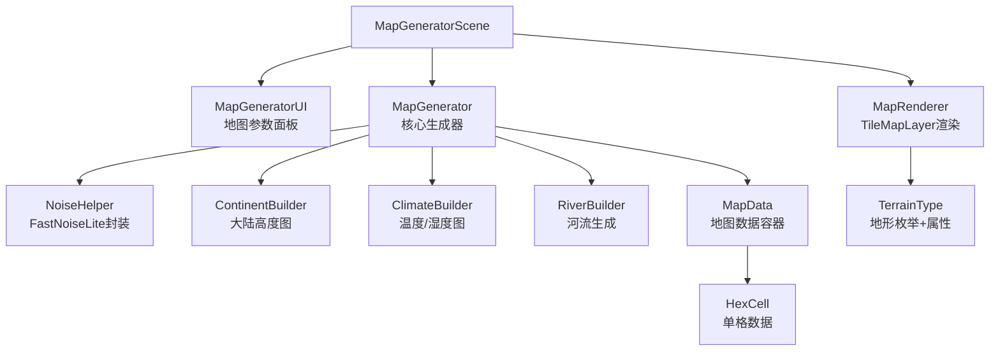

## 用户需求

为 Godot 4.6（GDScript）4X 策略游戏开发一套**程序化随机地图生成系统**，具备以下核心能力：

## 产品概述

一个可独立运行的地图生成模块，输出一张由六边形地块组成的世界地图，地形分布符合地理规律（大陆、温度带、湿度带），并为游戏单位提供通行性数据支撑。

## 核心功能

1. **六边形地图网格**：地图由规则六边形地块组成，支持配置地图宽度与高度（地块数量），使用 cube 坐标系进行邻居计算与坐标转换
2. **可扩展地形系统**：支持海洋、浅海、平原、草地、森林、丘陵、山地、沙漠、冻原、雪地等地形类型，每种地形通过独立数据类定义属性，便于后续扩展
3. **符合地理规律的地形生成**：

- 使用 Simplex/Perlin 噪声 + 大陆核心距离场混合生成高度图，体现1个或多个大陆
- 基于纬度模拟温度梯度（赤道热带 → 极地冻原/雪地）
- 湿度噪声叠加，控制沙漠、草原、森林的分布
- 河流从高地向低地流动并标记在地块上

4. **通行性系统**：每个地块携带 `passable_land`（陆上单位）和 `passable_sea`（海上单位）两个标志，山地/海洋对陆上单位不可通行，海洋/浅海对海上单位可航行
5. **地图预览渲染**：使用 Godot TileMapLayer 或 ColorRect 进行简单的地形颜色可视化，供开发验证；后续可替换为正式美术资源
6. **生成参数 UI**：提供简单界面允许设置地图尺寸、大陆数量、随机种子，点击按钮触发重新生成

## 技术栈

- **引擎**：Godot 4.6，GDScript
- **渲染器**：Mobile / D3D12（已配置）
- **六边形坐标**：Cube 坐标系（q, r, s），转换为 offset 坐标用于 TileMapLayer
- **噪声**：Godot 内置 `FastNoiseLite`（Simplex 类型），无需外部依赖
- **渲染方案**：`TileMapLayer` 用于六边形网格 + 程序化着色（每种地形对应一个 Atlas Source 图块颜色）

---

## 实现方案

### 核心思路

采用**多层噪声叠加的程序化生成管线**：

1. **高度图生成**（决定陆/海边界）：多个随机大陆核心点 + FastNoiseLite Simplex 噪声混合，使大陆形状自然不规则
2. **温度图生成**（决定气候带）：基于行号的纬度余弦函数 + 高度惩罚，模拟赤道→极地梯度
3. **湿度图生成**：独立 FastNoiseLite 噪声，控制干旱/湿润分布
4. **地形决策**：三层数据（高度、温度、湿度）交叉查表，映射到最终地形枚举
5. **河流生成**：从随机高山地块出发，沿最低邻居方向流动直至入海
6. **通行性注入**：地形决定后写入每格 passable_land / passable_sea

### 关键技术决策

| 决策 | 选择 | 理由 |
| --- | --- | --- |
| 坐标系 | Cube 坐标（q,r,s） | 邻居计算、距离、路径寻路最简洁，TileMapLayer 支持 offset 转换 |
| 噪声库 | FastNoiseLite（内置） | Godot 原生，无需导入，支持 Simplex/Perlin，可设置 seed |
| 大陆生成 | 距离场 + 噪声混合 | 比纯噪声更可控，确保出现完整大陆，不会产生碎片化小岛为主的地图 |
| 渲染 | TileMapLayer | Godot 4 原生六边形支持，性能好，后期易于替换美术资源 |
| 地形数据 | Resource 子类 | Godot 的 Resource 体系，可序列化、可编辑器配置、易扩展 |


### 性能与可靠性

- 地图数据全部存储在 `MapData`（纯数据类，Dictionary of HexCell），生成完毕后缓存，渲染时一次性批量更新 TileMapLayer，避免逐帧重绘
- 噪声采样为 O(W×H)，大地图（100×80）约 8000 次采样，GDScript 可在单帧内完成，无需异步
- 河流生成使用贪心最低邻居算法，最大步长限制防止死循环

---

## 架构设计



---

## 目录结构

```
project-keynes/
├── scenes/
│   └── map_generator_scene.tscn     # [NEW] 地图生成主场景，包含 UI 面板 + TileMapLayer + 生成器节点
├── scripts/
│   ├── terrain_type.gd              # [NEW] 地形枚举定义（OCEAN/PLAIN/HILL 等）+ 每种地形的 passable_land/passable_sea/颜色属性；提供静态方法按地形查属性，易于扩展新地形
│   ├── hex_utils.gd                 # [NEW] 六边形工具类（静态方法）：cube坐标↔offset转换、六方向邻居向量、cube距离计算、屏幕坐标转换
│   ├── hex_cell.gd                  # [NEW] 单个地块数据类（cube坐标q/r/s、terrain_type、has_river、elevation、passable_land、passable_sea）
│   ├── map_data.gd                  # [NEW] 地图数据容器：存储 width/height 及所有 HexCell 的 Dictionary（key: Vector3i cube坐标）；提供 get_cell/set_cell/get_neighbors 接口
│   ├── map_generator.gd             # [NEW] 核心生成算法：接收 MapConfig 参数，调用噪声生成高度图/温度图/湿度图，执行地形决策逻辑，驱动河流生成，返回填充完毕的 MapData
│   ├── map_config.gd                # [NEW] 地图配置数据类（width/height/num_continents/sea_level/seed），作为生成器输入参数，支持默认值
│   └── map_renderer.gd              # [NEW] 地图渲染器：持有 TileMapLayer 引用，根据 MapData 批量设置地块的图块（按地形颜色区分），提供 render(map_data) 接口；河流用叠加层渲染
├── ui/
│   └── map_generator_ui.gd          # [NEW] UI 控制脚本：绑定 宽/高 SpinBox、大陆数量 Slider、种子 LineEdit、生成按钮；触发 MapGenerator 生成并调用 MapRenderer 刷新显示
└── assets/
    └── tiles/
        └── hex_terrain_tileset.tres  # [NEW] TileSet 资源（程序化创建或编辑器配置），每种地形对应一个 atlas 图块，初期使用纯色占位
```

---

## 关键数据结构

```
# hex_cell.gd
class_name HexCell
var q: int       # cube 坐标
var r: int
var s: int       # 约束: q+r+s == 0
var terrain: int          # TerrainType 枚举值
var has_river: bool = false
var elevation: float      # 归一化高度 [0,1]
var passable_land: bool   # 陆上单位可通行
var passable_sea: bool    # 海上单位可航行

# terrain_type.gd - 地形属性表（静态字典）
# OCEAN, COAST, PLAIN, GRASSLAND, FOREST, HILL, MOUNTAIN, DESERT, TUNDRA, SNOW
# 每项包含: color(Color), passable_land(bool), passable_sea(bool), move_cost(int)

# map_config.gd
class_name MapConfig
var width: int = 60
var height: int = 40
var num_continents: int = 2
var sea_level: float = 0.42   # 高度图阈值，控制陆海比例
var seed: int = 0              # 0表示随机种子
```

## 地图生成器场景 UI 设计（Godot 原生控件）

基于 Godot 4 原生 Control 节点，采用深色策略游戏风格设计。整体布局分为左侧参数面板和右侧地图预览区。

### 主场景布局

**顶部标题栏**
背景深灰（#1A1A2E），标题文字"ProjectKeynes - 地图生成器"，使用白色加粗字体，高度 48px

**左侧参数面板（宽 280px）**
背景深蓝灰（#16213E），包含地图宽度 SpinBox（20-200）、地图高度 SpinBox（15-150）、大陆数量 Slider（1-5）、随机种子 LineEdit（空=随机）、"生成地图"按钮（主色强调色）、地形图例色块列表

**右侧地图预览区（自适应剩余宽度）**
背景纯黑（#0F0F1A），包含 TileMapLayer（六边形网格渲染），支持鼠标缩放与拖拽平移

**底部状态栏**
显示当前地图尺寸、种子值、各地形占比统计

## 使用的 Agent 扩展

### Skill

- **civ-grounded-development**
- Purpose: 在实现过程中对 Godot 4X 游戏架构进行系统性 grounding，确保地图生成模块与后续游戏系统（单位移动、资源、城市）兼容对接
- Expected outcome: 生成的代码结构和接口设计符合 4X 游戏架构最佳实践，通行性、地形数据格式可直接被后续寻路和战斗系统复用