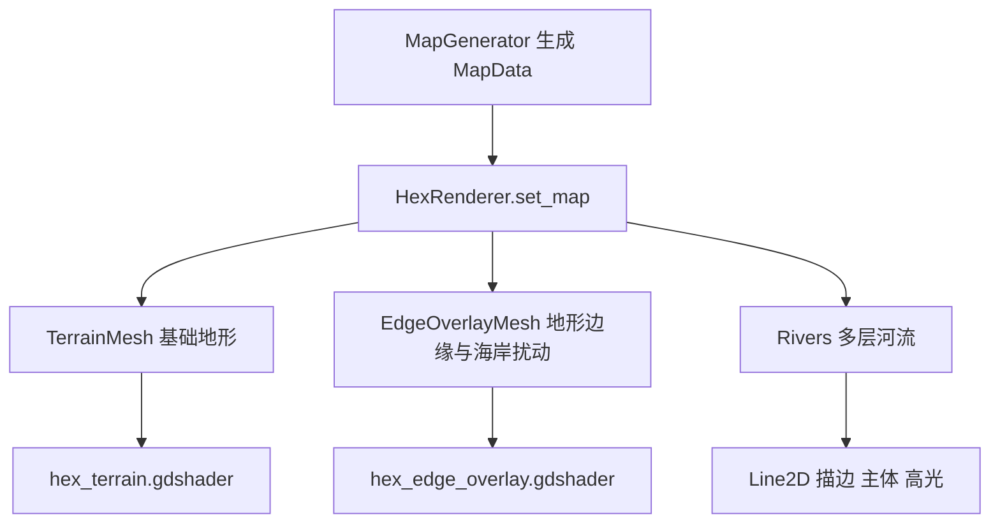

## User Requirements

用户需要对当前地图预览进行一次彻底视觉优化，解决画面大面积纯色色块、缺少细节纹理、地形边界机械、海岸线生硬、河流表现单薄等问题。

## Product Overview

将地图预览升级为更精致的风格化六边形战略地图。整体效果应更自然、更有层次，地形之间有明显辨识度，海洋、海岸、森林、山地、沙漠、雪地等区域不再像简单调试色块。

## Core Features

- 增强各类地形的细节纹理与明暗层次，让平原、草地、森林、丘陵、山地、沙漠、冻原、雪地具有不同视觉质感。
- 优化海洋与海岸表现，增加浅滩、浪花、海岸过渡和水面动态层次。
- 增加视觉上的边缘扰动与过渡效果，弱化六边形边界的机械感，同时避免出现裂缝。
- 提升河流表现，增加描边、高光、宽度变化和更清晰的流向层次。
- 调整整体色板，使地图更统一、更耐看，并保持不同地形的可读性。

## Tech Stack Selection

- 项目类型：Godot 六边形地图预览。
- 现有技术栈：GDScript、ArrayMesh、MeshInstance2D、ShaderMaterial、canvas_item shader、Line2D。
- 实施原则：复用当前 `MeshInstance2D + ArrayMesh + ShaderMaterial` 渲染管线，不引入外部贴图资源，不重建大型渲染系统。
- 主要修改范围：地图渲染器、地形 shader、地形基础色板，并新增一个轻量边缘覆盖 shader。

## Implementation Approach

本次优化采用“程序化美术增强”方案：保留现有六边形网格几何稳定性，在 shader 和覆盖层中增加纹理、边缘扰动、海岸细节和河流层次。
关键技术决策如下：

1. **不直接扰动六边形顶点**

- 当前规则六边形可以避免几何裂缝。
- 边缘扰动改为视觉层实现，通过边缘覆盖 mesh 和 shader 噪声打散边界。

2. **扩展现有顶点数据编码**

- 保持 `COLOR.a = 1.0`，避免 CanvasItem 透明问题。
- 继续使用 `UV.x` 存储 coastal。
- 将 `UV.y` 从纯 terrain_id 扩展为 `terrain_id + elevation * 0.01`，shader 中解码地形类型和高度。
- 保留 `UV2.xy` 存储格子中心坐标，用于局部纹理和边缘计算。
- 这样无需依赖未验证的新 Mesh 自定义通道，兼容现有实现。

3. **强化地形 shader**

- 海洋：增加深浅水变化、波纹、浅滩、浪花和海岸泡沫。
- 陆地：使用多层 fbm、ridged noise、voronoi 和轻量 domain warp 生成地形纹理。
- 山地：根据 elevation 增强山脊、阴影和高海拔雪线。
- 森林：增加树冠斑块与暗部密度。
- 沙漠：增加方向性沙丘纹理。
- 雪地和冻原：增加冷色层次和轻微颗粒。
- 平原和草地：拉开色相和纹理强度，避免混成同一种色块。

4. **新增边缘覆盖层**

- 在 `HexRenderer` 中新增一个单独的 `MeshInstance2D`，位于地形层之上、河流层之下。
- 遍历相邻格子，只对不同地形或水陆交界的共享边生成窄条 quad。
- 使用新 shader 对边缘条做噪声透明裁切、颜色混合、岸线泡沫和阴影，形成不规则边界。
- 边缘覆盖层是单一 ArrayMesh，避免为每条边创建大量节点。

5. **增强河流层**

- 将每条河流从单层 `Line2D` 改为多层绘制：外层暗描边、主水体、内层高光。
- 保留现有平滑折线逻辑，增加宽度曲线，使下游更粗、上游更细。
- 控制河流节点数量，仅对实际河流链生成少量 Line2D，避免性能压力。

## Implementation Notes

- 当前仓库已有未提交修改：`main.gd`、`hex_renderer.gd`、`terrain_type.gd`，以及未跟踪的 `shaders/` 目录。实施时必须先读取最新文件内容，保留用户已有改动，避免覆盖。
- 不修改地图生成规则作为第一优先级，避免影响玩法数据；本次主要解决预览美术表现。
- 边缘扰动只做视觉覆盖，不改变六边形碰撞、坐标、地形数据和相机边界。
- 60x40 地图约 2400 格，地形 mesh 约 14400 三角形；边缘覆盖层预计为 O(cell_count * 6) 的单 mesh，性能可控。
- shader 噪声层数需要克制，避免过多 octaves 造成低端设备掉帧；优先复用现有噪声函数。
- 河流多层 Line2D 只作用于少量河流链，不对每个河流格单独建复杂节点。
- 需要保持 `main.gd` 的现有预览操作不变：重新生成、适配视口、拖拽、缩放等功能不应受影响。

## Architecture Design

当前渲染链路保持不变，只在渲染层增加更丰富的视觉分层：



## Directory Structure

本次实现围绕现有渲染管线进行局部增强，文件组织如下：

```text
Project/project-keynes/
├── scripts/
│   ├── rendering/
│   │   └── hex_renderer.gd
│   │       # [MODIFY] 地图渲染核心。扩展 UV.y 编码传入 elevation；
│   │       # 新增边缘覆盖 MeshInstance2D；重建流程改为地形、边缘、河流三层；
│   │       # 优化河流为多层 Line2D，并保持现有平滑路径逻辑。
│   ├── terrain_type.gd
│   │   # [MODIFY] 地形基础色板。统一整体风格，增强各地形辨识度；
│   │   # 颜色仍作为 shader 的基础输入，不改变通行和移动成本数据。
│   └── main.gd
│       # [VERIFY ONLY] 入口和预览交互保持不变；
│       # 只检查与 HexRenderer 的调用兼容性，不做无关重构。
├── shaders/
│   ├── hex_terrain.gdshader
│   │   # [MODIFY] 主地形 shader。解码 elevation；
│   │   # 增强海洋、海岸、森林、山地、草地、沙漠、雪地等程序化纹理；
│   │   # 增加高度分层、视觉描边和局部扰动。
│   └── hex_edge_overlay.gdshader
│       # [NEW] 边缘覆盖 shader。用于不同地形交界和水陆交界；
│       # 通过噪声 alpha、颜色混合、泡沫和暗边实现自然扰动。
```

## Key Code Structures

关键数据约定：

- `COLOR.rgb`：地形基础色。
- `COLOR.a`：固定为 `1.0`。
- `UV.x`：coastal，范围 `[0, 1]`。
- `UV.y`：编码后的 `terrain_id + elevation * 0.01`。
- `UV2.xy`：格子中心世界坐标。
- shader 解码：
- `terrain_id = int(v_encoded + 0.5)`
- `elevation = clamp(fract(v_encoded) * 100.0, 0.0, 1.0)`

该方案兼容当前 mesh 数据结构，并能让 shader 使用真实高度改善水深、山脉、雪线和陆地层次。

## Design Approach

采用“精致策略棋盘地图 + 程序化绘本质感”的视觉方向。地图应保留六边形战略地图的清晰可读性，同时通过纹理、噪声、边缘覆盖和河流分层减少调试色块感。

## Screen Planning

### 地图预览主屏

- **地形底图层**：使用统一自然色板，控制饱和度和明度，让陆地与海洋更协调。
- **地貌纹理层**：不同地形使用专属纹理语言，森林有冠层斑块，山地有脊线，沙漠有沙丘。
- **海岸与浅滩层**：水陆交界增加浅色浪花、沙滩和不规则过渡，让海岸更自然。
- **边缘扰动层**：在不同地形交界添加轻微暗边、色彩混合和噪声破碎，弱化机械六边形边。
- **河流层**：河流使用暗描边、主水体和高光线，宽度随下游增强，提升层次感。
- **调试信息层**：保留顶部信息，但避免遮挡地图主体，维持清晰可读。

## Visual Style

整体风格偏高质感、自然、轻写实的策略地图。避免过度写实贴图，保持缩放查看时的清晰辨识；使用柔和但丰富的颜色、细腻纹理、轻微动态水面和自然岸线，让预览第一眼更像成品地图而不是调试图。

## Agent Extensions

### Skill

- **civ-grounded-development**
- Purpose: 按本仓库的文明类游戏开发流程复核地图生成、渲染和视觉优化链路，避免脱离现有架构。
- Expected outcome: 确认改动只作用于渲染表现，不破坏地图数据、坐标系统、相机和玩法字段。

### SubAgent

- **code-explorer**
- Purpose: 在实施前后复查渲染相关文件、调用关系和现有未提交改动。
- Expected outcome: 明确所有受影响文件，降低误改、漏改和覆盖用户改动的风险。