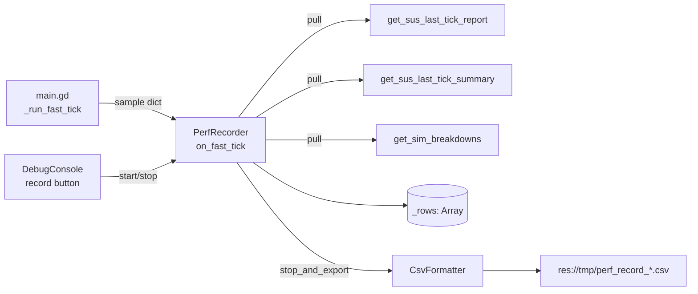

## Product Overview

扩展 DebugConsole 已有的"性能快照"工具链，新增"录制一段时间的处理耗时并导出为 CSV"的开发者工具，便于事后用 Excel/Pandas 对照分析每一帧的瓶颈。

## Core Features

- **DebugConsole 新增一个开关按钮**："⏺ 开始录制 / ⏹ 停止并导出"。点击开始后，每个 fast_tick 末尾自动采样一行；再次点击停止录制并把全部数据写入 `res://tmp/perf_record_YYYYMMDD_HHMMSS.csv`，同时在控制台 print 导出路径。
- **录制内容（每行一帧 fast_tick）**：
- 时间维度：`tick_idx`（全局 fast_tick 序号）、`row_idx`、`timestamp`（系统时间，毫秒）、`was_skipped_day`、`fps`、`frame_ms`（来自 `Engine.get_frames_per_second()`）。
- 三段总览：`fast_ms` / `t_sus_ms` / `t_render_ms` / `t_ui_ms`。
- tick 摘要：`largest_job` / `largest_stage` / `largest_substage` / `largest_path` / `largest_ms`、`sus_sim_p95_300` / `sus_sim_max_300` / `over_1ms_count_300`（取自 `_last_tick_summary`）。
- SUS 各 Job：每个 job 动态展开为 `<job_id>_ms` / `<job_id>_slices` / `<job_id>_skip`（skip 为 skipped_reason 字符串，未跳过则空）。
- Job 内部细分：`refresh_climate_daily` 等的 `sus_*_breakdown` 字典展开为 `bd_<job>_<key>` 列。
- **CSV 输出**：UTF-8 + BOM（Excel 友好）、逗号分隔、首行 header；动态列以"录制期内出现过的 job_id / breakdown key 并集"按首次出现顺序排序，缺失值留空字符串。
- **不破坏既有功能**：复用 `_snapshot_btn` 同一控制行的视觉风格，与现有"📸 快照→文件"、"⏸ 暂停刷新"按钮并列；不影响 PerfMiniHUD、verdict、snapshot 三套既有路径。

## Visual Effect

- DebugConsole 的"实时监视（Telemetry）"分组顶部控制条，新增第三颗按钮，紧挨现有 ⏸ / 📸 按钮。
- 录制期间按钮文案变为"⏹ 停止并导出（已录 N 帧）"，颜色高亮（红色）；停止后 2 秒内变绿色提示"✅ 已导出 res://tmp/perf_record_*.csv"，随后还原为初始"⏺ 开始录制"。

## Tech Stack

- **语言**：GDScript（Godot 4.x），与现有 `debug_console.gd` / `main.gd` / `sus_scheduler.gd` 同栈。
- **写文件**：`FileAccess.WRITE` + `DirAccess.make_dir_recursive_absolute`（沿用 `_on_btn_snapshot` 同一模式）。
- **测试**：GUT（项目 `tests/` 目录已有先例如 `baker_atlas_section_verdict_test.gd`）。

## Implementation Approach

**策略**：录制器是一个轻量"观察者"——在 fast_tick 末尾"被动接收"已经算好的本帧指标快照，不引入新的计时插桩，不修改任何 Job 内部逻辑。

**数据流**：

```
main.gd._run_fast_tick()
  ├─ 既有计算 (t_sus_ms / t_render_ms / t_ui_ms / fast_ms / was_skipped_day)
  └─ [新增] _publish_fast_tick_perf_sample(...)
              └─ 调 _perf_recorder.on_fast_tick(sample) (若正在录制)

DebugConsole / PerfRecorder
  ├─ 持有 _recording: bool + _rows: Array[Dictionary]
  ├─ on_fast_tick(sample): 拉取本帧 SUS report / summary / breakdowns，
  │     与 sample 合并后 push 到 _rows
  └─ stop_and_export(): 列并集 → header → 写 CSV → 清空 buf
```

**关键决策**：

1. **采样发布点放在 main.gd `_run_fast_tick()` 末尾**——这是唯一拥有 `t_sus_ms / t_render_ms / t_ui_ms / fast_ms / was_skipped_day` 的位置；新增一个 setter `set_perf_recorder(rec)` + 在 fast_tick 末尾若 recorder ≠ null 就调 `rec.on_fast_tick(...)`，避免把整个 fast_tick 局部状态变成成员字段污染主类。
2. **PerfRecorder 单独成类**（`scripts/ui/perf_recorder.gd`，RefCounted）——避免把"列并集 + CSV 拼装 + 状态机"塞进 `debug_console.gd`（已 ~38KB），且方便单测。DebugConsole 仅持有 recorder 实例 + 按钮 UI。
3. **每帧拉取 SUS 数据，不持有 SUS 引用**：`on_fast_tick` 通过 `_main` 现有 getter `get_sus_last_tick_report()` / `get_sus_last_tick_summary()` / `get_sim_breakdowns()` 拉取——零新增耦合。
4. **CSV 列并集在导出时计算**：录制中只 push 原始 dict 行（O(1)），停止时一次扫描所有行汇总列名（O(N×K)），N=帧数 K=平均 dict 大小，远小于 CSV 写盘成本，不必维护增量列表。
5. **跳日帧仍记录**：CSV 列 `was_skipped_day` 区分；不主动过滤——用户的诉求是"录制一段时间的处理耗时"，缺帧会让分析者误判。

**Performance & Reliability**:

- 每帧采样开销：仅 1 次 `_last_report.duplicate(true)`（已是既有 getter 行为）+ 1 次 dict 浅合并 + 1 次 Array.append——预估 < 0.1ms / 帧，对 12ms budget 影响可忽略。
- 内存：单行 dict ≈ 50 个字段 ≈ 5KB；按 30 FPS 录制 10 分钟 = 18000 帧 ≈ 90MB——属可接受范围；如需更长录制，可在 todo 阶段加一个软上限（如 60000 帧自动 stop）。
- 写盘：单文件 sequential write，10 分钟录制 ≈ 几 MB；用 `store_string` 一次性拼成字符串还是逐行 append，取后者（避免大 String 内存峰值）。
- 失败兜底：`FileAccess.open` 返回 null 时 `push_error` 并保留 `_rows`，让用户重试；目录不存在时先 `make_dir_recursive_absolute`。

**Avoiding Technical Debt**:

- 完全复用 `get_sus_last_tick_report` / `get_sus_last_tick_summary` / `get_sim_breakdowns` 三个已有 getter；不在 SUS scheduler 中添加新 API。
- 按钮 UI 复用 `_build_telemetry_group` 的 `ctrl_row` 容器（line 293），与 `_pause_btn` / `_snapshot_btn` 视觉风格一致。
- 时间戳命名、`res://tmp` 兜底建目录、绿色文案 2 秒回滚的交互模式——直接复用 `_on_btn_snapshot`。

## Implementation Notes

- **采样发布**：在 main.gd `_run_fast_tick()` 末尾（line ~735 之后，紧跟 `_perf_verdict_total_ms.append(...)`）调 `_publish_fast_tick_perf_sample(...)`。该方法内部检查 `_perf_recorder == null` 直接 return，零开销快路径。
- **跳日帧**：`was_skipped_day == true` 的 fast_tick，`_last_report` 仍是上一非跳日 tick 的内容（SUS 没运行）——CSV 中 sus 列要么写 0 要么空？方案选**空字符串**，并由 `was_skipped_day` 列标记，避免误把"未刷新"读作"0ms"。
- **列稳定性**：列顺序 = 固定列（17 列）→ 动态 job 列（按首次出现）→ 动态 breakdown 列（按首次出现）。固定列写死在 PerfRecorder 的常量数组中，便于后期 diff。
- **CSV 转义**：值含 `,` `"` `\n` 时按 RFC4180 转义（双引号包裹 + 内部 `"` → `""`）。stage/substage/path 字段可能含路径，必须转义。
- **Logging**：开始 / 停止 / 导出成功 / 导出失败各 print 一行 `[perf-record] ...`，与现有 `[fast tick]` / `[SUS]` 前缀风格一致；不重复每帧打 log。
- **Blast radius**：仅修改 main.gd（+1 成员 + 1 setter + 1 publish 调用 + 1 私有方法）、debug_console.gd（+1 按钮 + 3 回调）、新增 perf_recorder.gd + 测试。不动 SUS scheduler / Verdict / HUD。

## Architecture Design



## Directory Structure

```
Project/project-keynes/
├── scripts/
│   ├── main.gd                              # [MODIFY]
│   │   - 新增 var _perf_recorder: RefCounted = null
│   │   - 新增 func set_perf_recorder(rec)/get_perf_recorder()
│   │   - 在 _run_fast_tick() 末尾（line ~735 区域）调
│   │     _publish_fast_tick_perf_sample(t_sus_ms, t_render_ms, t_ui_ms,
│   │     float(fast_ms), was_skipped_day)
│   │   - 新增私有 func _publish_fast_tick_perf_sample(...)：构造 sample dict
│   │     {tick_idx=_fast_tick_count, fast_ms, t_sus_ms, t_render_ms, t_ui_ms,
│   │     was_skipped_day, fps=Engine.get_frames_per_second(),
│   │     timestamp_ms=Time.get_ticks_msec()} 并 forward 给 recorder
│   │
│   └── ui/
│       ├── perf_recorder.gd                 # [NEW] 录制器主体（RefCounted，class_name PerfRecorder）
│       │   - var _main: Node                # 注入引用
│       │   - var _recording: bool = false
│       │   - var _rows: Array = []
│       │   - var _start_tick: int = 0
│       │   - func bind_main(m: Node) -> void
│       │   - func is_recording() -> bool
│       │   - func row_count() -> int
│       │   - func start() -> void           # 重置 _rows + _recording=true
│       │   - func stop_and_export() -> String  # 返回导出文件路径或 "" 失败
│       │   - func on_fast_tick(sample: Dictionary) -> void
│       │       └─ pull SUS report/summary/breakdowns 合并入 sample，append _rows
│       │   - 静态：_collect_columns(rows) -> Array[String]   # 固定列 + job 并集 + bd 并集
│       │   - 静态：_format_csv(rows, columns) -> String      # 头 + 行；含 RFC4180 转义
│       │   - 静态：_csv_escape(value) -> String              # ,"\n 转义 + 数值格式化
│       │   - const FIXED_COLUMNS: Array = [...]              # 17 个固定列名
│       │   - const SAMPLE_KEY_*                              # sample dict 的 key 常量
│       │
│       └── debug_console.gd                 # [MODIFY]
│           - 新增 var _record_btn: Button
│           - 新增 var _perf_recorder: PerfRecorder
│           - 在 _build_telemetry_group 的 ctrl_row（line 293-307）追加 _record_btn
│             文案："⏺ 开始录制"，tooltip "录制期间每个 fast_tick 一行 → res://tmp/perf_record_<时间>.csv"
│           - 在 set_main 时 _perf_recorder = PerfRecorder.new(); _perf_recorder.bind_main(m);
│             m.set_perf_recorder(_perf_recorder)
│           - 新增 func _on_btn_toggle_record()：根据 _recording 切 start / stop_and_export
│           - 新增 func _refresh_record_btn_text()：未录制 = "⏺ 开始录制"；
│             录制中 = "⏹ 停止并导出（已录 %d 帧）" % row_count；用 _telemetry_timer
│             tick 顺带刷新（不新建 Timer）
│           - 导出成功后参考 _on_btn_snapshot 的 2 秒绿色文案回滚（共用工具方法）
│
└── tests/
    └── perf_recorder_test.gd                # [NEW] GUT 测试（class_name PerfRecorderTest）
        - test_collect_columns_union: 三行不同 job_id → 列并集正确，固定列在前、动态列按首次出现
        - test_format_csv_header_and_rows: header 第一行 + 数值/字符串/空 cell 正确
        - test_csv_escape_special_chars: 含 `,` `"` `\n` 的 path 字段被双引号包裹 + 内部 `"` 翻倍
        - test_skipped_day_row: was_skipped_day=true 时 sus 列保持空字符串
        - test_breakdown_keys_dynamic: 不同 tick 出现新 bd_* key 时列扩展
```

## Key Code Structures

```
# perf_recorder.gd 核心接口（仅签名，不含实现）
class_name PerfRecorder
extends RefCounted

const FIXED_COLUMNS: Array = [
    "row_idx", "tick_idx", "timestamp_ms", "was_skipped_day",
    "fps", "fast_ms", "t_sus_ms", "t_render_ms", "t_ui_ms",
    "largest_job", "largest_stage", "largest_substage",
    "largest_path", "largest_ms",
    "sus_sim_p95_300", "sus_sim_max_300", "over_1ms_count_300",
]

func bind_main(m: Node) -> void
func start() -> void
func stop_and_export() -> String                        # 返回 globalize 后路径或 ""
func on_fast_tick(sample: Dictionary) -> void           # 由 main.gd 在 fast_tick 末尾调
func is_recording() -> bool
func row_count() -> int

static func _collect_columns(rows: Array) -> PackedStringArray
static func _format_csv(rows: Array, columns: PackedStringArray) -> String
static func _csv_escape(value) -> String
```

## Agent Extensions

### SubAgent

- **code-explorer**
- Purpose: 在实现阶段需要进一步交叉验证 `sus_*_breakdown` 各方法返回 dict 的具体 key 列表（climate / weather / enum_atlas / sea_ice_atlas 四个），以及 main.gd `_run_fast_tick` 末尾插桩点的精确行号
- Expected outcome: 输出每个 breakdown 方法的 key 集合 + 插桩点行号清单，供 PerfRecorder 兼容性测试与列名常量定义使用