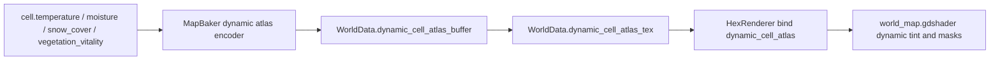
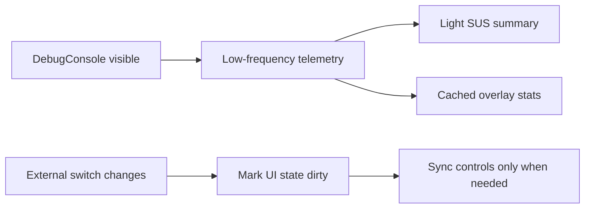

## User Requirements

- 全面推进地形主地图视觉反馈与 Debug 面板问题修复。
- 主地图需要更明显地反映地块级温度、湿润/降水、积雪、植被健康等变化，减少“陆地和海洋表现单一”的问题。
- Debug 面板需要修复通道看似缺失的问题，区分“无效区域”“接近零值”“真实缺失数据”。
- 打开 Debug 面板后不应明显降低帧率。
- 推进过程需要分阶段、可回退、避免大规模重构。

## Product Overview

这是一次策略地图可视化与调试体验优化。主地图会从单一地形色逐步升级为受真实地块状态驱动的动态表现；Debug 面板会更清晰、更轻量，帮助判断气候、洋流、风场、植被等系统是否正常运行。

## Core Features

- 地形颜色根据地块真实状态产生动态变化。
- 积雪、植被健康、温湿变化能在主地图上形成可见反馈。
- 海洋风场、洋流视觉表现恢复或增强。
- Debug 通道展示有效性、统计值和低值区域提示。
- Debug 面板打开时减少持续刷新和卡顿。

## Tech Stack Selection

- 引擎与脚本：沿用 Godot 项目现有 GDScript 架构。
- 渲染路径：保留当前 `WorldData -> MapBaker -> atlas texture -> world_map.gdshader` 主路径。
- Shader：继续使用现有 `canvas_item` atlas 采样方案，不回退到旧 `hex_terrain.gdshader` per-instance 路径。
- Debug/Overlay：沿用 `DataOverlayBaker`、`OverlayMode`、`DebugConsole`、`OverlayLegend` 既有结构。
- 性能策略：复用现有 `cell_pixel_lists`、cell-level byte dirty cache、cached byte buffer、低频上传等成熟模式。

## Implementation Approach

整体采用“先止血、再增强、最后验证”的分阶段方案。

1. 先修 DebugConsole 的帧率下降：去掉每秒全量 UI 状态同步，降低 telemetry 字典深拷贝和字符串构造开销。
2. 再修 Overlay 可读性：让无效区域、低值区域、真实零值在面板和图例中可区分。
3. 恢复/验证风场与洋流向量 atlas：解决主 shader 中 `vector_atlas` 被中性占位导致风/洋流视觉失效的问题。
4. 增加动态地块状态 atlas：把真实 cell 字段编码为一张动态 RGBA atlas，让主地图材质直接读取温度、湿润/降水代理、积雪、植被健康。
5. Shader 分层混合：在不推翻现有海洋、海岸、昼夜、水体、火山等效果的前提下，把动态字段作为 tint/mask/weight 参与最终颜色。

关键决策：

- 不优先改为每个 hex 一个 instance。当前全屏 quad + atlas 是更适合本项目的合批路径；真正缺口是动态 cell 数据没有进入主 shader。
- 动态字段优先打包成一张 `dynamic_cell_atlas_tex`，减少 sampler 数量；如果后续发现单通道高频上传成为瓶颈，再拆成独立 R8 纹理。
- 所有高风险视觉增强都应有安全 fallback：纹理为空时使用旧派生逻辑或中性值，不阻断地图渲染。

## Performance and Reliability

- DebugConsole：
- 将 `_refresh_from_state()` 从每秒轮询改为打开面板、外部快捷键变更、显式 dirty 时同步。
- 避免 `get_sus_last_tick_report()` 每秒 `duplicate(true)` 深拷贝完整调度报告。
- telemetry 刷新频率建议从 1.0s 调整到 2.0s，或将重统计项分频刷新。
- 控件赋值前先比较当前值，避免无意义 redraw/theme 更新。
- Overlay：
- `get_overlay_stats()` 已是缓存读取，不应触发重新 bake。
- invalid 区域只做统计与轻量提示，不额外引入高频重烘焙。
- 动态 atlas：
- 使用 `WorldData.cell_pixel_lists` 从 cell 粒度写入像素列表，避免整图重复取 cell 字段。
- 维护 `PackedByteArray` 缓冲和 per-cell byte snapshot；没有 cell 字节变化时跳过 Image/Texture 更新。
- 一张 RGBA8 动态 atlas 在 620k 像素量级约 2.4MB，低频 daily/seasonal 上传可接受；若变更频率提高再拆分。
- Blast radius：
- 不修改旧 `hex_terrain.gdshader` 主路径。
- 不重构 `map_baker.gd` 大结构，只在现有入口和增量模式旁扩展。
- 当前 git 已有大量未提交变更，实施时必须逐文件核对，避免覆盖用户已有改动。

## Architecture Design

当前主路径保留：


新增动态字段路径：



Debug 修复路径：



## Directory Structure Summary

本计划只修改现有文件，不新增大型子系统。

```
Project/project-keynes/
├── scripts/
│   ├── ui/
│   │   ├── debug_console.gd
│   │   │   # [MODIFY] Debug 面板性能修复。
│   │   │   # 移除每秒 _refresh_from_state 全量同步；增加 dirty sync；
│   │   │   # 降低 telemetry 频率；避免控件重复赋值；展示 invalid/zero 提示。
│   │   └── overlay_legend.gd
│   │       # [MODIFY] Overlay 图例提示增强。
│   │       # 为仅水域、仅陆地、方向强度阈值等通道补充说明；
│   │       # 避免用户把透明区域误认为数据丢失。
│   ├── main.gd
│   │   # [MODIFY] DebugConsole 数据接口优化。
│   │   # 增加轻量 SUS telemetry getter 或截断返回；
│   │   # 在快捷键/开关变更后通知 DebugConsole 状态 dirty；
│   │   # 保持 get_overlay_stats 仍为缓存读取。
│   ├── geography/
│   │   └── world_data.gd
│   │       # [MODIFY] 增加动态地块 atlas buffer/texture 字段。
│   │       # 建议新增 dynamic_cell_atlas_buffer: PackedByteArray；
│   │       # dynamic_cell_atlas_tex: ImageTexture；
│   │       # 文档注明 RGBA 通道语义。
│   └── rendering/
│       ├── map_baker.gd
│       │   # [MODIFY] 增加 dynamic_cell_atlas 编码与增量更新入口。
│       │   # 复用 cell_pixel_lists、byte snapshot、cached PackedByteArray；
│       │   # bake_world 初始化纹理，daily/seasonal 路径触发增量更新；
│       │   # 同时审计 C3 vector_atlas removal 注释对应逻辑。
│       ├── hex_renderer.gd
│       │   # [MODIFY] 绑定 dynamic_cell_atlas_tex 与恢复 vector_atlas uniform。
│       │   # 纹理为空时绑定安全空纹理或 shader fallback；
│       │   # 同步 season_transition material 需要的参数。
│       ├── data_overlay_baker.gd
│       │   # [MODIFY] Overlay 统计与显示增强。
│       │   # 增加 invalid domain 统计/原因提示；
│       │   # 对洋流强度等低值通道增加显示增强策略，但保留 raw stats。
│       ├── overlay_mode.gd
│       │   # [MODIFY] 增加每个通道的 domain/range/invalid hint 元数据。
│       │   # 供 DebugConsole 和 OverlayLegend 展示“仅水域/仅陆地/低强度无方向”等说明。
│       └── data_overlay_layer.gd
│           # [MODIFY] 如需可视化 invalid mask，则增加轻量 uniform 开关。
│           # 默认保持原行为，Debug 模式下才显示弱提示。
├── shaders/
│   ├── world_map.gdshader
│   │   # [MODIFY] 主地图动态字段采样。
│   │   # 读取 dynamic_cell_atlas：R=temperature，G=wetness/precip proxy，
│   │   # B=snow_cover，A=vegetation_vitality；
│   │   # 用真值影响陆地色、雪覆盖、植被饱和度、湿润度；
│   │   # 恢复 vector_atlas 风/洋流读取或保留 fallback。
│   └── data_overlay.gdshader
│       # [MODIFY] 如启用 invalid mask，渲染弱灰/虚线提示。
│       # 不改变 stats 语义，不让无效区域污染有效通道颜色。
```

## Key Code Structures

建议新增动态 atlas 通道约定：

| Texture | Format | Channel | Meaning | Source |
| --- | --- | --- | --- | --- |
| `dynamic_cell_atlas_tex` | RGBA8 | R | 当前温度 | `cell.temperature` |
| `dynamic_cell_atlas_tex` | RGBA8 | G | 湿润/降水视觉代理 | `cell.moisture` 或既有降水估算 |
| `dynamic_cell_atlas_tex` | RGBA8 | B | 积雪覆盖 | `cell.snow_cover` |
| `dynamic_cell_atlas_tex` | RGBA8 | A | 植被健康 | `cell.vegetation_vitality` |


编码原则：

- 所有通道写入 0..255 byte。
- 无 cell 像素保持中性值，避免地图外残影。
- Shader 中必须判断纹理有效性或使用默认中性值。
- 温度、湿润、积雪、植被只作为颜色调制因子，不直接覆盖现有地形分类色。

## Agent Extensions

### Skill

- **civ-grounded-development**
- Purpose: 在本策略游戏仓库中执行 read-first、understand-first 的改动流程，避免绕过既有气候、地图、渲染和数值系统。
- Expected outcome: 所有实现步骤复用现有 `MapBaker`、`WorldData`、`HexRenderer`、`DataOverlayBaker`、`DebugConsole` 模式，避免无依据重构。

### SubAgent

- **code-explorer**
- Purpose: 在实施前系统扫描纹理绑定、bake/rebake 调用点、DebugConsole 外部状态同步入口和 Overlay 通道消费链。
- Expected outcome: 形成准确调用点清单，确保新增动态 atlas、vector_atlas 恢复和 Debug telemetry 优化不会遗漏调用方。