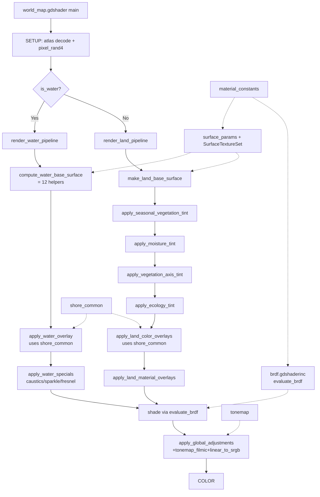

## 用户需求

针对 `Project/project-keynes/shaders/world_map.gdshader` 及其 14 个 include 文件，实施一次"半 PBR 化 + 全面架构重构 + 可扩展性升级"的整体优化。**修复上一轮 review 已诊断出的 17 项已知问题**（P0~P3），把当前已有功能以规整、易维护的形式重新组织，为后续四个方向的扩展（真实贴图 / biome 特征注册 / 真 PBR & IBL / 动态特效）预留清晰 hook。允许产生可见但可控的视觉变化。

## 核心改动概览

- **半 PBR 化**：实现 Cook-Torrance（GGX + Smith + Schlick + 能量守恒），引入 Linear-space lighting 与 Filmic tonemap，让 `metallic`/`roughness` 真正生效；land/water 共用同一份 BRDF。
- **架构重构**：抽 `shore_common`、拆 `compute_water_base_surface`（→ ~12 helper）、拆 `apply_land_material_modifiers`（→ 4 helper），消灭复制粘贴与上帝函数。
- **抽象升级**：`SurfaceParams` 补 emission/alpha 入参版构造、增加贴图采样 hook（`SurfaceTextureSet`）、定义 `LightingContext` struct 为未来 IBL/多光源做准备。
- **可扩展 hook**：biome modifier 改为可插拔 stage 列表；emission/overlay 通道暴露给火山 / 闪电 / 城市夜景占位；BRDF 通过 `USE_PBR_BRDF` 单点开关可一键回退。
- **细节治理**：常量集中到 `material_constants`、清理 `pixel_noise` 多分量复用陷阱（新增独立 hash 派生）、删除"// 6." 等旧编号注释、统一为 `LAND x.y / SEA x.y / BRDF x.y` 体系。
- **风险控制**：保留 legacy 路径作 A/B 对照，每个大步骤独立 commit，分 8 阶段递进，每阶段后做目视回归。

## 验收标准

1. 17 项已知问题（P0~P3）逐项闭合，每项在文档中可追溯到对应 commit/文件位置。
2. 主入口 `world_map.gdshader` 行数与拓扑顺序保持清爽（≤200 行）。
3. land 与 water 走同一份 `evaluate_brdf` ，spec 系数 / tod_exposure / Fresnel 不再分叉。
4. `compute_water_base_surface` 拆完后单函数 ≤80 行；`apply_land_material_modifiers` 13 参数收成 ≤2 个 struct。
5. 新增 4 个 inc 文件均有 4 段式 docstring（职责/调用方/依赖/性能）。
6. `USE_PBR_BRDF` 关闭时可一键回退到原 Blinn-Phong 路径，便于回滚验证。
7. 视觉回归：在 `main.tscn` 上对 6 类 biome（OCEAN/COAST/LAKE/REEF/KELP/SEA_ICE）+ 陆地（FOREST/DESERT/TUNDRA/SNOW）+ 3 档 `visual_quality` 完成目视检查，记录截图差异。

## 一、技术栈与定位

- **语言/平台**：Godot 4 GLSL（`canvas_item` shader，2D top-down）
- **光照定位**：Stylized 半 PBR——主路径用 Cook-Torrance（GGX+Smith+Schlick+能量守恒），但保留 hillshade / caustics / sparkle / season_overlay 等风格化 modulator
- **视图模型**：`vec3 V = vec3(0,0,1)` 提升为常量 `VIEW_DIR_TOP_DOWN`，未来切倾斜视角时只改一处
- **颜色空间**：所有 color uniform 与 base_color 在进入 BRDF 前 `srgb_to_linear`，最终 `apply_global_adjustments` 末端 `linear_to_srgb + filmic`

## 二、新文件 / 改文件清单（精确路径）

### 新增（4 个）

| 路径 | 职责 |
| --- | --- |
| `Project/project-keynes/shaders/include/material_constants.gdshaderinc` | 集中所有 magic number、F0 表、roughness→gloss 映射、`USE_PBR_BRDF` 开关、`VIEW_DIR_TOP_DOWN` |
| `Project/project-keynes/shaders/include/shore_common.gdshaderinc` | 抽 land/water 复制粘贴的 3×3 邻域采样为 `ShoreSamples sample_shore_neighborhood(uv)` + `compute_shore_weight(samples, role)` |
| `Project/project-keynes/shaders/include/brdf.gdshaderinc` | Cook-Torrance 全套（D_GGX / G_SmithGGX / F_Schlick / evaluate_brdf）；定义 `LightingContext` struct；`USE_PBR_BRDF=0` 时退化到 Blinn-Phong fallback |
| `Project/project-keynes/shaders/include/tonemap.gdshaderinc` | `srgb_to_linear` / `linear_to_srgb` / `tonemap_filmic`(ACES Approx) / `tonemap_reinhard_legacy`（保留备用） |


### 修改（6 个）

| 路径 | 主要改动 |
| --- | --- |
| `Project/project-keynes/shaders/world_map.gdshader` | include 顺序追加 4 个新 inc（在 surface_params 之前/之后视依赖）；fragment 末端引入 tonemap |
| `Project/project-keynes/shaders/include/surface_params.gdshaderinc` | 重写：`make_surface_params` 接收 emission/alpha；新增 `SurfaceTextureSet` 钩子结构 + `apply_albedo_map` / `apply_normal_map` / `apply_orm_map` helper（接口先行，调用方暂为 no-op） |
| `Project/project-keynes/shaders/include/land_pipeline.gdshaderinc` | 拆 `apply_land_material_modifiers` → 4 个 helper（seasonal/moisture/axis/ecology），引入 `LandModInputs` struct；删除 3×3 邻域复制；`shade_land_surface` 改调 `evaluate_brdf`；overlay 拆为 `apply_land_color_overlays` + `apply_land_material_overlays` 双语义 |
| `Project/project-keynes/shaders/include/water_pipeline.gdshaderinc` | 拆 `compute_water_base_surface` → ~12 个 helper（详见下表）；删除 3×3 邻域复制；`shade_water_surface` 改调 `evaluate_brdf` + 抽出 `apply_water_specials`（caustics/sparkle/fresnel-water）；LAKE 走正常 roughness（不再 max 绕过） |
| `Project/project-keynes/shaders/include/global_adjustments.gdshaderinc` | 末端追加 `linear_to_srgb + tonemap_filmic`；`season_transition_overlay` 改用 `pixel_noise` 派生而非二次 fbm |
| `Project/project-keynes/shaders/include/common_noise.gdshaderinc` | 新增 `vec4 derive_independent_noise4(vec2 seed)` hash 函数，用于消除 pixel_noise 多分量复用陷阱 |


### 不动（11 个叶子 inc）

uniforms / height / climate_season / biome_color / vegetation / weather_front / snow_cover / biome_detail / hillshade_tod / water 保持原样（仅在调用侧适配）。

## 三、关键 struct / interface（接口先行，实现后续填）

```
// brdf.gdshaderinc
struct LightingContext {
    vec3 L;             // 主光方向（已归一化，世界空间）
    vec3 V;             // 观察方向（top-down 默认 (0,0,1)）
    vec3 sun_color;     // 已 srgb_to_linear
    vec3 ambient_color; // 已 srgb_to_linear
    float exposure;     // tod_exposure
    float night_factor; // tod_night_factor
    float shadow;       // hillshade_strength（0~1）
};

vec3 evaluate_brdf(SurfaceParams s, LightingContext lc); // 单一光照入口

// surface_params.gdshaderinc
struct SurfaceTextureSet {
    // 接口预留：未来挂 albedo/normal/ORM atlas binding
    // 当前为占位 struct，调用方传 default_surface_texture_set()
    bool has_albedo;
    bool has_normal;
    bool has_orm;
};
SurfaceParams apply_albedo_map(SurfaceParams s, SurfaceTextureSet ts, vec2 uv);
SurfaceParams apply_normal_map(SurfaceParams s, SurfaceTextureSet ts, vec2 uv);
SurfaceParams apply_orm_map(SurfaceParams s, SurfaceTextureSet ts, vec2 uv);

// shore_common.gdshaderinc
struct ShoreSamples {
    int nearby_water_cnt;
    int nearby_land_cnt;
    float min_water_dist;
    float min_land_dist;
};
ShoreSamples sample_shore_neighborhood(vec2 uv);
float compute_shore_weight(ShoreSamples s, int role); // role: 0=land halo, 1=water halo

// land_pipeline.gdshaderinc — 4 个拆分后的 helper
struct LandModInputs {
    int biome; int veg; float moist; float lat_signed;
    float dyn_valid; float dyn_vitality;
    float eco_foliage; float eco_stress; float eco_transition; float eco_growth; float eco_valid;
    vec4 pixel_noise; vec2 wp;
};
SurfaceParams apply_seasonal_vegetation_tint(SurfaceParams s, LandModInputs i);
SurfaceParams apply_moisture_tint            (SurfaceParams s, LandModInputs i);
SurfaceParams apply_vegetation_axis_tint     (SurfaceParams s, LandModInputs i);
SurfaceParams apply_ecology_tint             (SurfaceParams s, LandModInputs i);
```

## 四、`compute_water_base_surface` 拆分映射表

| 新 helper | 对应原代码段（water_pipeline.gdshaderinc 行号区间） |
| --- | --- |
| `compute_offshore_depth` | line 111-145 区段 (B) |
| `apply_water_depth_gradient` | (B) 后半 |
| `apply_global_water_ripple` | (B)→(C) 之间 ripple 段 |
| `compute_water_biome_weights` → `WaterWeights` | (C) biome 软权重 |
| `apply_open_ocean_patch` | (C) 子段 |
| `apply_deep_ocean_layered_tint` | (D) 深海色温 |
| `apply_lake_features` | (E) LAKE |
| `apply_reef_features` | (F) REEF |
| `apply_kelp_features` | (G) KELP |
| `apply_sea_ice_features` | (H) SEA_ICE |
| `apply_shallow_transparency` | (H)→(I) shallow 段 |
| `apply_ocean_currents` | 洋流段 |
| `apply_estuary_plume` | 河口羽流段 |
| `build_water_normal_and_calm` | 末端 normal/roughness/calm noise |


主函数 `compute_water_base_surface` 仅做线性调度，每个 helper ≤60 行。

## 五、Implementation Approach

### 1. 半 PBR 光照模型

**策略**：Cook-Torrance 微表面模型 = `D · G · F / (4·NdotL·NdotV)`

- `D_GGX(roughness, NdotH)` → Trowbridge-Reitz
- `G_SmithGGX(NdotL, NdotV, roughness)` → Smith joint
- `F_Schlick(F0, VdotH)` → F0 由 metallic 在 `vec3(0.04)` 与 base_color 之间 lerp
- 能量守恒：`kD = (1 - F) · (1 - metallic)`，`Lo = (kD · albedo / PI + spec) · NdotL · sun_color`
- Hillshade 注入为 `lc.shadow` 乘子，与 BRDF 解耦
- 退化路径：`USE_PBR_BRDF=0` 时调用 `evaluate_brdf_blinn_phong_legacy`，沿用原系数，作为单点回滚

### 2. Linear-space lighting

- 在 `srgb_to_linear` 列表中包含：`color_*` uniforms、`tod_sun_color`、`tod_ambient_color`、所有手写 `vec3(0.x, 0.x, 0.x)` 字面量颜色（在 base surface 阶段进入 BRDF 前转换）
- `apply_global_adjustments` 末端 `tonemap_filmic(linear_color) → linear_to_srgb → COLOR`
- 风格化 overlay（羊皮纸纸张色等）保持在 sRGB 后期叠加，**不进入 BRDF 路径**

### 3. 可扩展 hook

- **真实贴图**：`SurfaceTextureSet` 当前所有 `has_*=false`，helper 是 no-op 直接 return；后期挂 atlas 时只改 helper 内部，调用点不变
- **biome modifier 注册**：`apply_land_material_modifiers` 内部按固定顺序调用 4 个 stage helper，新增 stage 只需追加一行 + 在 `LandModInputs` 加字段
- **BRDF 模块化**：`LightingContext` struct 预留 `vec3 ibl_diffuse / ibl_specular`、`float[] additional_lights` 占位字段（先注释 // TODO IBL，避免占用寄存器）
- **emission/overlay hook**：`SurfaceParams.emission` 在 BRDF 输出后直接相加，`apply_land_material_overlays` 暴露 `add_emission(s, color, weight)` 便于火山/闪电/城市灯光接入

### 4. pixel_noise 治理

- 在 SETUP 0 阶段调用一次 `derive_independent_noise4(wp + seed_offsets)`，得到真正独立的 4 个随机数
- 重命名为 `pixel_rand4`，4 个分量的语义注释清晰：`.r=phase_jitter, .g=amp_jitter, .b=eq_band, .a=eq_mix`
- 原 `pixel_noise` 仅保留为"动态结构噪声采样"用途，不再当独立 RV

## 六、Implementation Notes

### 性能

- 单像素纹理 fetch 数维持现状（SETUP 仍是 6+1 张），不增加新 fetch
- BRDF 改造增加 ~30 ALU/像素（GGX+Smith+Schlick），在 1080p 下 < 0.3ms 影响（参考 Godot 4 canvas_item benchmark）
- `derive_independent_noise4` 是 4 次 sin/dot 的纯 ALU hash，比原来多采 fbm 便宜
- `visual_quality` 分档保持，BRDF 在 quality=0 时退化为简化 Lambert（NDF 与 G 设为常数）

### 日志与调试

- 不引入 print/log（GLSL 无此能力）
- 每个新 inc 顶部 4 段式 docstring：**职责 / 调用方 / 依赖 / 性能**
- `material_constants.gdshaderinc` 顶部列出所有可调常量及推荐范围

### 影响半径控制

- `USE_PBR_BRDF` 单点开关：默认 1，关闭即恢复原行为（仅光照部分）
- 保留 `world_map.gdshader` 当前文件不动，新增 `world_map.legacy.gdshader` 作为 A/B 对照入口（git 中保留 1 个版本周期，确认无回归后删除）
- 每个大阶段独立 commit，commit message 格式：`shader/refactor(stage-N): xxx`

## 七、Architecture Design



## 八、Directory Structure

```
Project/project-keynes/shaders/
├── world_map.gdshader                      # [MODIFY] include 列表追加 4 个新 inc；fragment 末端走 tonemap
├── world_map.legacy.gdshader               # [NEW][TEMP] 完整复制当前 world_map.gdshader 作为 A/B 对照，验证完成后删除
└── include/
    ├── material_constants.gdshaderinc      # [NEW] 集中常量：USE_PBR_BRDF 开关、F0 表、roughness→gloss 映射、VIEW_DIR_TOP_DOWN、所有原 magic number 命名常量化
    ├── shore_common.gdshaderinc            # [NEW] sample_shore_neighborhood / compute_shore_weight，消灭 land/water 双份 3×3 复制
    ├── brdf.gdshaderinc                    # [NEW] D_GGX + G_SmithGGX + F_Schlick + evaluate_brdf + LightingContext struct + Blinn-Phong fallback
    ├── tonemap.gdshaderinc                 # [NEW] srgb_to_linear / linear_to_srgb / tonemap_filmic (ACES Approx) / tonemap_reinhard_legacy
    ├── surface_params.gdshaderinc          # [MODIFY] make_surface_params 加 emission/alpha 入参；新增 SurfaceTextureSet + apply_albedo/normal/orm helper（接口先行，no-op）
    ├── common_noise.gdshaderinc            # [MODIFY] 新增 derive_independent_noise4(seed) hash，治理 pixel_noise 多分量复用
    ├── land_pipeline.gdshaderinc           # [MODIFY] apply_land_material_modifiers 拆 4 个 helper + LandModInputs struct；删 3×3 复制改用 shore_common；shade_land_surface 改调 evaluate_brdf；overlay 拆 color/material 双语义函数
    ├── water_pipeline.gdshaderinc          # [MODIFY] compute_water_base_surface 拆 12 helper；删 3×3 复制；shade_water_surface 改调 evaluate_brdf + apply_water_specials；LAKE 走正常 roughness
    ├── global_adjustments.gdshaderinc      # [MODIFY] 末端接 tonemap_filmic + linear_to_srgb；season_transition_overlay 改用 pixel_rand4 派生
    └── (其余 11 个叶子 inc 不动)
```

## 九、问题闭合追溯表

| # | Review 问题 | 闭合方式 | 落点文件 |
| --- | --- | --- | --- |
| 1 | shore 邻域复制粘贴 | 抽 shore_common | shore_common.gdshaderinc |
| 2 | 自称 PBR 实则 Blinn-Phong | 实现 Cook-Torrance | brdf.gdshaderinc |
| 3 | land/water 光照路径不一致 | 共用 evaluate_brdf | brdf + land/water_pipeline |
| 4 | compute_water_base_surface 上帝函数 | 拆 12 helper | water_pipeline |
| 5 | apply_land_material_modifiers 13 参 | 拆 4 helper + LandModInputs | land_pipeline |
| 6 | SurfaceParams 僵尸字段 | metallic/alpha/emission 真正消费 | surface_params + brdf + global |
| 7 | make_surface_params 不接 emission/alpha | 重写 ctor | surface_params |
| 8 | tod_exposure 双路径不一致 | 统一在 LightingContext.exposure | brdf |
| 9 | V 硬编码 | 提为 VIEW_DIR_TOP_DOWN | material_constants |
| 10 | pixel_noise 多分量复用 | derive_independent_noise4 | common_noise + main |
| 11 | 海岸邻域 fetch 二次浪费 | shore_common 中心点共享 | shore_common |
| 12 | caustics/sparkle 无清晰边界 | 抽 apply_water_specials | water_pipeline |
| 13 | magic number 散落 | 集中到 material_constants | material_constants |
| 14 | 注释新旧编号并存 | 统一为 LAND/SEA/BRDF x.y 体系 | land/water/brdf |
| 15 | apply_land_overlay 语义混淆 | 拆 color/material 双函数 | land_pipeline |
| 16 | lat/current_temp 水面用得窄 | 独立到 deep_ocean helper | water_pipeline |
| 17 | season_transition_overlay 二次 fbm | 改用 pixel_rand4 派生 | global_adjustments |


## Agent Extensions

### Skill

- **civ-grounded-development**
- Purpose: 在每个改动阶段开始前强制"先读代码、先理解、再动手"，确保对 land/water pipeline / hillshade / water inc 现状的精准把握
- Expected outcome: 每个 commit 前的 grounding checklist 都已勾选，避免 BRDF 改造误伤 hillshade/season 等正交子系统

### SubAgent

- **code-explorer**
- Purpose: 在拆分 `compute_water_base_surface`（~430 行）与 `apply_land_material_modifiers`（~130 行）时，跨文件追踪所有调用点、所有 magic number 出现位置、所有 pixel_noise 分量的下游消费者
- Expected outcome: 产出精确的"行号→新 helper 名"映射表 + 所有 magic number 的全局清单 + pixel_noise 复用点全集，让重构无遗漏