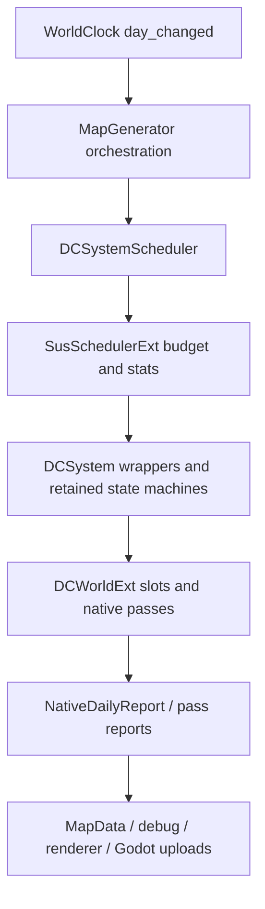

# Runtime Authority Matrix

运河覆盖：DataCore 的 `cell.canal_edge_mask/canal_water` 是地理权威；Economy 的
InfrastructureProjectStore 是施工/路线权威；Effect 仅负责跨域事务；Godot Visual Tile
只消费脏层。完整契约见 [运河运行时](./canal-runtime.md)。

## Current schema precedence (2026-08-20)

The current implementation supersedes older historical rows retained in the
long-form matrix below: country authority is **PKCN v13**, economy authority is
**PKEC v47**, configurable cross-domain effects are **PKEF v11**, Trigger state is
**PKTR v6**, ideology state is **PKID v3**, and the native gameplay journal is
**journal v4**. The save
coordinator restores domain state in its documented order and verifies active
ideology bindings against PKEF; recovery never replays an effect to repair a
missing binding. Effect ACK masks identify adapters rather than authored domain
numbers, so Modifier subdomains cannot alias Country/Economy adapter ACKs in a
mixed transaction. PKEC is exact-version only: every schema other than v41 is
rejected, with no precipitation, family, Modifier, or expedition defaults.

## Game flow and persistence authorities

| State | Authority | Persistent provider | Rule |
| --- | --- | --- | --- |
| Pending new/load request | `GameFlowService` | none; one-shot process state | Never use `Engine` meta on the product path |
| Validated world creation inputs | `NewGameConfig v3` | PKSV `new_game_config` | Store seed, foreign count, starting country cash and research policy; optional `base.map_source=pkmap` plus `pkmap_path`; v2 migrates with zero foreigners |
| Player and foreign identity/territory | PKCN / `NativeCountryRuntime` | PKSV `pkcn` plus player-only `player_context` | Player is slot 0; each opening country owns one cell; only `cell.country_slot` is mirrored to cells |
| Population, market, buildings, family traits/cell influence, notable families and important people, family expedition custody (people/funds/cargo), prosperity/settlement identity, taxable events and fiscal escrow | PKEC / `NativeEconomyRuntime` | PKSV `pkec` / PKEC v47 | Restore after PKCN, PKEF and trade topology; v47 is current and v46/v45/v44/v43/v42/v41 remain readable; v45 transaction-tax order columns migrate as zero; building fact/quote diagnostics are appended after legacy business fields |
| Composite cohort satisfaction (8 dimensions), family branch satisfaction, published social-pressure level, cell carrying capacity | PKEC / `NativeEconomyRuntime` | embedded in PKEC v47 | Authoritative for births, hire order, branch promotion and `ECONOMY_SOCIAL_PRESSURE`; starvation still reads only `SAT_DIM_SUBSISTENCE`; carrying capacity uses previous completed local net and effective food flow |
| Dynamic cell SoA | `DCWorld` / `DCWorldExt` by component contract | PKSV `dynamic_world` | Missing provider fails the save |
| Native environment rounds | `EnvironmentRuntime` | `PKEnvironmentRuntime v1` in PKSV `environment` | Persist arrays, ping-pong, dirty sets, topology and cursors, not counters only |
| Climate modifiers | Climate `ModifierStore` | PKSV `pkcm` / PKCM v1 | Publishes frozen add/factor; climate still owns temperature history |
| Country research, technology, treasury, territory claim and national/cell tax policy | PKCN / `NativeCountryRuntime` | PKSV `pkcn` / PKCN v13 | Owns discovery/evidence, research, neutral-only colonization claim, five national defaults/overrides, interned sparse per-cell policies, fiscal cash bridge, native Effect ingress idempotency and the era-reward plan reference; catalog identity includes technology recipes/terms, Trigger definitions and content bindings |
| Country modifiers | Country `ModifierStore` | embedded in PKCN v13 | Technology, production-family, climate-adaptation and fine-grained tax-rate effects alter frozen national/cell consumers, never ledgers directly |
| Economy/building/family-cell modifiers | Economy `ModifierStore` + `BuildingIdentityStore` | embedded in PKEC v42, Modifier schema v3 | Factors feed frozen output/birth/consumption/resource helpers; exact-good uses shared+CSR overrides and exact-building reuses type cache; never writes ledgers directly |
| Gameplay modifiers | Gameplay `ModifierStore` + base/identity SoA | PKSV `pkgp` / PKGP v1 | Explicit native handles only; no Godot Object reflection |
| Configurable effects and cross-domain plans | `EffectRuntime` | PKSV `pkef` / PKEF v11 | Owns catalog IR, FamilyEffect metadata/stack groups, managed lifecycle, unique technology recipes, flat metric slabs, due/dirty candidates, transactions, durable external bindings and ACKs; never owns country/economy/Modifier stores |
| Trigger accumulation, technology-practice breakthroughs and development duration | `TriggerRuntime` | PKSV `pktr` / PKTR v6 | Owns source cursors, aggregate/remainder/window state, last sample day, fire sequence and unhanded effects; threshold crossing hands typed Country-signal commands to Effect and never writes Country or Economy directly |
| Country ideology collection/progression/offers/public-opinion gates/synergies | `NativeIdeologyRuntime` | PKSV `pkid` / PKID v3 | Owns sparse country idea state, slots, points, offer RNG, directional support policy, exclusion and synergy state; reads committed Economy class facts and verifies PKEF external identity rather than replaying effects |
| Effect-originated gameplay events | native Gameplay journal | PKSV `journal` v4 | `gameplay_effect` is the POD ingress/ACK boundary; journal stores normal event IDs and `event_id=-1` custom geography-commit idempotency evidence |
| Calendar/RNG/time mode | `WorldClock` | PKSV `world_clock` | Restore date, carry, RNG, publish indices, pause and speed |
| Cell exploration progress | `VisionSolver` writing `cell.explored` | PKSV `pkfg` (`PKFogOfWar v1`) | Monotonic; restore after PKCN because re-solving reads territory |
| Current visibility and fog knowledge | `VisionSolver` writing `cell.visible` and `MapData.fog_k_arr` | none; derived | Pure function of territory plus baked terrain; recomputed on restore, never saved |
| Selection/camera | `PlayerController` + `MapCamera` Godot boundary | PKSV `player_view` | Restore after derived map/render resources exist; PlayerController owns input/session orchestration, MapCamera owns smoothing/inertia |
| Player construction intent/receipt | `PlayerController` + `EconomyFacade` boundary; settlement in `NativeEconomyRuntime`, treasury in `NativeCountryRuntime` | Pending command remains in PKEC v42; receipt is transient | Quotes are bounded/nonbinding; execution atomically consumes treasury goods, local-market goods and treasury cash without a new scheduler stage |
| Player family colonization intent/receipt | `PlayerController` + `EconomyFacade`; custody in `NativeEconomyRuntime`, claim in `NativeCountryRuntime`, transaction in `EffectRuntime` | PKEC v42 + PKCN v11 + PKEF v11 | Quotes remain readable during a frozen cycle as nonbinding; start/cancel still require the committed boundary because departure extracts real population and source-market cargo. Survival, tool and construction candidate groups may carry multiple substitute goods whose equivalent contribution meets the authored requirement. Unowned arrival waits for Country+Economy ACK, own-country relocation publishes after Economy ACK. Greenfield arrival consumes construction cargo and inserts family-owned buildings; developed cells only deposit the survival bridge |

Transient 经济缓存与 climate/ocean hot-state capsule 不改变本矩阵的权威
划分；具体边界见
[运行时性能优化契约](runtime-performance-optimization-2026-07.md)。

## 2026-08 性能治理边界

`NativeCountryRuntime` 的生产报告默认 `LIGHT`：只发布 stage、路径、日、
变更量、generation/state version、published slot、native timing、barrier、
pending command 和研究队列计数。完整 `state_hash`、cell-tax 诊断遍历和
memory 估算仅在 `PROBE`、`country_full_diagnostics` 或关闭
`country_light_report_enabled` 时运行；LIGHT/FULL 都不改变 PKCN state/event
hash 契约。pending activation queue 是 native 内部 transient 索引，不进入存档。
该索引只在 bootstrap/restore/整批研究状态替换后重建；正常 completion/activation
按 technology index 有序增量更新，`research_queue_rebuilds` 用于发现意外全树重建。
FULL/PROBE 若发现索引与 authoritative pending bitset 不一致，只对当前 research
day 使用完整 technology scan，随后从 bitset 重建索引；`_pending_queue_enabled`
不会被永久关闭，下一日 parity 通过后自动回到 queue path，并在报告中保留
`fallback_reason=pending_queue_mismatch` 与累计 `research_full_scan_fallbacks`。

Country 面板的动态数据仍由 native facade 提供，GDScript 只持有按 section 的
UI cache。`get_country_ui_snapshot(handle, section_mask)` 一次返回所需 section
和 revision；静态科技目录只构建一次。事件驱动路径使用 `build()`，旧完整构建
仅通过 `build_legacy()` 暴露给 debug/A-B 开关。Country/Economy/Bio 状态、MapData 和
存档 authority 不迁移到 UI。

Bio occupancy 第一阶段每日完整覆盖并写入 native staging，完整 pass 后才发布
`CELL_BIO_OCCUPANCY_BITS` 与 discovery 事件。`bio_occupancy_slice_enabled` 当前
默认关闭；打开时 `DCWorldExt` 持有 transient cursor state，按固定 cell range
完成 persistence/diffusion/merge/publish，生产范围为 2048 cells，最终片才发布。
in-flight round 设置 `bio_occupancy_day_barrier`，防止 WorldClock 跨日；cursor
pass 不可用或校验失败时必须报告 `path/fallback_reason/fail_stage/published_to_slot`
并回退 one-shot；staging 不进入存档或 state/event hash。Native daily 的未完成
round 也设置 `native_daily_day_barrier`，continuation pulse 先完成 climate，再
完成 Bio，随后才允许 Country/Economy ACK drain。

本文记录当前日级 runtime 的权威边界。它区分“C++ 加速”“slot 写入”“tick/state authority”“visible publish”和“Godot object boundary”，避免把可运行 native pass 误判成完整 DOTS authority。

| System | Stage / Cursor Owner | Slot Writer | Publish Path | Fallback Owner | ACTIVE Eligibility | Known Blockers |
| --- | --- | --- | --- | --- | --- | --- |
| `season_refresh` | `SeasonRefreshSystem` 持有 period counter、round stage、stage cursor；B+ round 可由 `DCWorldExt` probe。 | GDScript helper 与 B+ C++ pass 写 terrain/landform/vegetation/cover/moisture/weather dirty slots。 | `MapData` mutation、dirty mask、enum atlas/detail scatter intents。 | `SeasonRefreshSystem` 12-stage path；B+ 失败回退同 system。 | 默认 GDScript retained；`native_season_refresh_active_owner_enabled=true` 且 B+ state 可证明时，report 可升为 `native_active`。 | Atlas queue、detail scatter 和 Godot upload 是 retained boundaries；只有 owner 未 active 才阻塞 simulation complete。 |
| `refresh_climate_daily` | `ClimateDailySystem` 持有 `_round_active`、`_pass_cursor`、phase lock；native daily report 镜像 climate state。 | 多个 `DCWorldExt` climate/ocean/wind/sea-ice/transpiration pass 写 slot；GDScript system 仍持 round state。 | Pass 级 `_flush_slot_to_map()` / `published_to_slot`，尾部 debug/CSV/visual intents。 | `ClimateDailySystem` sliced path；旧 `RefreshClimateDailyJob` 已删除。 | Partial native-ready / guarded ACTIVE owner flags；默认仍保留 GDScript round shell。 | Reset/abort/debug boundary、visible publish 与 sync sliced fallback 尚未完全退休。 |
| `native_daily_sim` | `DCWorldExt::run_native_daily_slice()` 持有 graph continuation、node cursor、round accumulator；GDScript 只保留 SUS shell 与 bundle boundary。 | `SCHEDULE_GRAPH` 节点调用 C++ pass 写 slots。 | Graph report `published_slots`、`visual_dirty_intents`、`authority_report`、`authority_blockers`、`retained_boundaries`；必要时 flush 到 `MapData`。首片被预算跳过时，GDScript 的 transient `native_daily_day_pending` 持有 same-day barrier，continuation 再直接启动 job。 | 普通 ACTIVE 不再回 full-run；`run_native_daily_tick()` 只作 debug/probe，`run_native_sim_tick()` 作 SHADOW/A-B。 | `run_native_daily_slice` 是唯一 ACTIVE hot path；`graph_coverage_state=complete` 只由 simulation authority blockers 决定；`native_daily_legacy_daily_production_retired=true` 才允许 fallback/test-only handoff。 | Climate/weather/ocean/season owner gates 与 legacy fallback 未退休时仍阻塞；Godot/visual boundaries 只进 `retained_boundaries`；pending 标记不进入存档或 hash，reset 时清理。 |
| `modifier_daily` | `ModifierRuntime` 持有四域 SoA、bucket、expiry heap、命令排序与 snapshot version。 | 不写领域 base slot；发布只读 effective 聚合。 | `MODIFIER_GRAPH` report、command result、journal；PKCM/PKGP 与 PKCN/PKEC 内嵌 domain。 | GDScript fallback 只消费同一 `evaluate_modifier_stat` 公式；无第二份可变 store。 | ACTIVE，priority 90、单 slice、无工作时零 slice。 | 独立 SHADOW 双算和目标规模性能门禁尚未完成。 |
| `country_daily` | `NativeCountryRuntime` 持有国家 SoA、handle generation、领土 CSR、国家科技/研究信号 bitset、稀疏证据、现金/物资国库、五类税务默认率/稀疏覆盖、命令游标与 state hash；研究日使用有序 active-country index 与 discovery 反向 CSR。 | 只把 `cell.country_slot` 发布到 DataCore/MapData；名称、科技、证据、国库、税表和 CSR 保持 native。 | 原子 `command_preflight → command_apply → aggregate_publish`；只有 `territory_generation` 改变才同步地块；研究可见性使用独立 `research_generation`；PKCN v13。 | PROBE/OFF 只作验证门；OFF 时依赖国家的经济禁用，不恢复旧状态。 | 默认 **ACTIVE**；Native Runtime Graph ACTIVE 时旧 SUS `country_daily` 永久 no-op，避免同日双 authority。 | 不含灭国、科技撤销、外交、战争或 AI；活跃国家至少一格，水域无主。独立模拟线程尚须先清除 graph 内 Godot Variant/Object/WorkerThreadPool 边界。 |
| `economy_daily` | `NativeEconomyRuntime` 持有 Population/Settlement/Market/Family/FamilyTrait/FamilyCellInfluence/NotablePerson stores、稀疏关系、BUILDING_GRAPH、国内 Trade、税务与财政 escrow。 | 独立 native vectors；due-cell sample 冻结七条环境 lane、国家/科技/税率、城市 Modifier 和资源再生 factor。 | `FAMILY_COMMIT` 归一化 claim、评审威望、冻结行为因子 CSR、按 mask 发布 FamilyEffect metric，并仅在变化时协调 legacy Modifier/Trigger 与 FamilyEffect POD source；`PERSON_COMMIT` 绑定人物；发布审计与 PKEC v42。 | 无大规模 GDScript fallback；资源再生保留读取同一 POD 的脚本 fallback。 | 默认 **ACTIVE / 锁定 N∈[1,5]**。 | 跨国贸易执行、政治、谱系仍未接入。 |
| `weather_refresh` | `WeatherDCSystem` wrapper 内的 `WeatherRefreshJob` 持有 field stage/front state；`WeatherSystem` 持业务 facade。 | `DCWorldExt` weather field/distribute/summary/stage-b pass 与 GDScript fallback 写 weather slots。 | Weather commit flush、front apply、weather LUT upload intent/Godot upload。 | `WeatherRefreshJob` staged path；merged native 受 readiness gate。 | `weather_native_daily_readiness_report()` 证明 visible publish/front/LUT 后为 `native_ready`；`native_weather_transaction_active_owner_enabled=true` 后为 `native_active`，执行后可升 `native_active_verified`。 | WeatherFront Godot objects、front rebuild、ImageTexture/LUT upload、CSV visible fields 是 retained boundaries；publish readiness 未达成才是 blocker。 |
| Vegetation / cover / landform | `vegetation_dynamics`（stage-b）独占 `cell_vegetation` 演替/streak/vitality。季节 B+ `sync_current_state` 写 snow/landform/cover， knobs `skip_vegetation_rewrite` 禁止全图 `pk_derive_vegetation`。同日 B+ 完成后 stage-b `run_veg_dyn=false`。 | `DCWorldExt::run_stage_b_pass` / `run_vegetation_dynamics_pass`；B+ 不 flush `cell_vegetation`。 | Succession dirty → gameplay event bus / `queue_detail_scatter_changes`。 | GDScript season stages 0–8 生产为 `emergent_noop`。 | ACTIVE climate round。 | 不要平行第二套植被公式；tick-sync memcmp 仅 debug。 |
| `runtime_hydrology` | Legacy path 由 `WeatherRefreshJob` stage 3 持有；native daily path 由 `SCHEDULE_GRAPH` 的 `runtime_hydrology` node 持有单日执行点。 | `DCWorldExt::run_runtime_hydrology_pass` 后置写 `cell_moisture` 的河道/一环河岸下限，并写 `soil_moisture`、`water_balance_30d`、`river_discharge*`、`river_storage`、`groundwater_storage`、`surface_runoff` slots。 | Pass 内 `_flush_slot_to_map()`；native daily graph report 宣告 hydrology published slots（含 `cell_moisture`）。 | Legacy staged path 保留为 fallback/A-B。 | `runtime_hydrology_enabled=true` 时需要 native bundle 同时包含 `weather_knobs` 与 `runtime_hydrology_knobs`；stage-b 通过 `stage_b_after_hydrology_knobs` 在 hydrology 后运行；publish 成功后 phase 为 `native_active_verified`。 | 缺 `runtime_hydrology_knobs` 才是 blocker；legacy facade 仅作 A/B/test/fallback 入口。 |
| `ocean_currents` | `OceanCurrentsSystem` wrapper 内的 `OceanCurrentsJob` 持 physical/visual round state；native facade mirrors physical state. | `DCWorldExt` SLP/wind/PSI/upwelling/raster pass 写 slots 或 visual buffers。 | SLP/wind/current/upwelling slot flush；visual raster + texture commit 留在 Godot side。 | `OceanCurrentsJob` physical/visual staged path。 | `native_ocean_physical_active_owner_enabled=true` 且 snapshot owner 为 `native_active` 后，physical state 不再阻塞 simulation complete。 | Visual raster/texture commit、overlay upload、Godot buffers 是 retained boundaries；wrapper `_inner` 未 inline。 |
| `sea_ice_daily` | `SeaIceDailySystem` / climate round sea-ice stage；native daily report 另有 `authority_report.sea_ice`。 | `DCWorldExt::run_sea_ice_daily_pass` 写 sea-ice/terrain-related slots。 | Slot flush + dynamic visual LUT/atlas dirty intent；native daily graph report 宣告 `cell_sea_ice_frac` 等 published slots。 | Sea-ice helper fallback retained where ext unavailable. | Native daily graph 中 `sea_ice_knobs` 存在时可报告 native graph owner；native round 完成后 phase 可升为 `native_active_verified`。 | Terrain flip visibility、visual LUT/Godot upload 是 retained boundaries，不再阻塞 simulation authority。 |
| `enum_atlas_upload` | `EnumAtlasUploadSystem` owns dirty patch cadence. | C++ encoder may produce patch bytes; DataCore slots are read-only inputs. | GDScript `ImageTexture` / atlas upload. | GDScript fan-out/upload fallback. | Not simulation authority; visual boundary only. | GPU upload and texture lifetime remain Godot-side. |
| `dynamic_visual_atlas_upload` | `DynamicVisualAtlasUploadSystem` owns LUT/atlas stride and catch-up. | C++ LUT/patch encoders read slots and return byte buffers. `encode_cell_luts` also takes an optional `fog_k_arr` and emits `enum_lut` as RGBA8 (4 bytes per slot) with fog knowledge in A. | GDScript Image/ImageTexture update; weather LUT is published by weather commit path. | GDScript encoder fallback; it must write the same `fog_k`. | Not simulation authority; optional visual job. | GPU upload, dirty queue, renderer interpolation. Vision changes do not set the climate/weather dirty mask, so `refresh_country_visuals()` forces its own LUT rebake instead of waiting for the stride. |
| Vision / fog of war | `VisionSolver` owns the whole solve; it is event-driven off `country_committed` plus one bootstrap pass, never a daily tick. | Writes `cell.visible` / `cell.explored` (U8 schema components, `owner="vision"`) and the derived `MapData.fog_k_arr`. Reads baked `WorldData.cell_view_height` / `cell_view_block`. | `enum_lut.a` for terrain graying and the fog layer; `fog_state()` for Inspector gating; PKFG for `explored`; Economy samples a frozen `visible` mask at market-cycle freeze when `fog_solved` so player-involved trade cannot pick currently invisible endpoints; family colonization still reads live `visible_arr`. | GDScript is currently the authority, not a fallback. A future `world_ext_vision.cpp` port keeps this file as the fallback. | Not a daily graph owner. It never advances a tick. Economy/colonization consume the published arrays; they do not write vision. | Fog is inert outside a formal session: `_resolve_fog_of_war_enabled()` requires a gameplay start context, otherwise `mark_all_visible()` saturates every array and trade stays ungated-equivalent. |
| Country border visuals | `CountryBorderLayer` rebuilds a full `ArrayMesh` on every territory change. | None; it only reads `country_slot_arr` and `neighbor_index`. | Godot `MeshInstance2D` at z=6; camera zoom only pushes `border_world_width`, it never rebuilds geometry. | No fallback; a missing shader disables the layer. | Visual boundary only. | Geometry is mandatory here — dithered `map_index_atlas` makes shader-side edge detection produce broken lines. |
| Player map overlay | `WorldRuntimeHost` owns request/dirty/throttle state; it does not own simulation values. | `DataOverlayBaker.bake_cell_lut` reads the already-published `DCViewAdapter`/`MapData` snapshot and writes one RGBA8 texel per cell. | `DataOverlayLayer` binds static map-index atlas + dynamic LUT and performs Godot `ImageTexture.update`. | No simulation fallback; legacy full-raster baker remains debug-only. | Visual consumer only; it never writes slots, economy stores, MapData, or save state. | First/switch refresh is immediate; dirty refresh is coalesced to 10 Hz after authoritative flush. |
| Building visual layer | `WorldRuntimeHost` owns visibility/intel refresh cadence; `BuildingVisualLayer` owns chunk queue and LOD only. | `NativeEconomyRuntime` committed building CSR; `NativeCountryRuntime` completed era milestone cache. | `BuildingVisualIntelCache` preserves last-seen rows; Macro LUT + chunk MultiMesh/atlas upload remain Godot visual outputs. | `DCWorldExt::bake_building_visual_chunk` is the desktop/Web default numeric path; GDScript baker is explicit compatibility diagnostics only and native failure is fail-closed by default. | Visual consumer only; no building, technology, DataCore, PKEC or state-hash writes. | 16x16 chunks, one upload/frame, resident/body caps; `bulk_encoder_required` flags a >1.5 ms native numeric-bake diagnostic. See `building-visual-runtime.md`. |
| `native_environment_runtime` | `NativeEnvironmentRuntimeSystem` thin scheduler job; native runtime owns internal shadow/probe state. | `EnvironmentRuntime` / `DCWorldExt` where available. | Report-only unless a specific pass publishes slots. | Skip/hard fail when native runtime unavailable. | SHADOW/probe thin job unless a concrete owner gate promotes it. | Needs per-system publish contract before authority. |
| Native world generation / bake | Awaited `MapGenerator.generate()` orchestrates cooperatively on the Godot main thread; `DCWorldExt` owns base/post-base generation data. | Native generation result package and generation publish pass write initial SoA/slots. | GDScript assembles `MapData`/`HexCell`; publish pass flushes initial runtime slots; `MapGenerator`/`MapBaker` yield frames only at stage boundaries. | Old full GDScript generation fallback is retired; failures abort generation or use scoped post-base fallback only where documented. | Native generation is C++ authoritative for base/post-base generation; cooperative yielding does not transfer authority. | Godot object assembly, `HexCell` facade, texture bake/upload remain GDScript/Godot; one native pass is still non-preemptible. |

Season refresh 的 `sync_current_state` 阶段只读取已由 `wind_surface` 发布的 `cell_temp` 来派生雪盖、
地貌和覆盖；`cell_vegetation` 的演替/streak 由 `vegetation_dynamics`（stage-b）独占写入。
B+ round knobs 带 `skip_vegetation_rewrite=true`，季节日不再全图 `pk_derive_vegetation`。
同一模拟日若刚完成 season round，stage-b 跳过 `run_veg_dyn`。native 与 GDScript fallback 使用同一输入口径。
`sync_current_state` 不得重算、写入或 flush `cell_temp`，以免绕过 climate finalizer。

## Economy Authority

经济域当前仍为 C++ `NativeEconomyRuntime` ACTIVE authority：136-good MarketStore、182 类稀疏
owner-lot、两组四档升级族、Price V3 稀疏企业信号、自适应工资/奖金、真实金银锚定发行和电力 utility prepass 都在
ECONOMY_GRAPH/BUILDING_GRAPH 内完成。GDScript 只编译 profile/technology tags、桥接 30 个注册自然
资源 slots、提交命令和查询选中 cell；不存在 GDScript 货币、价格、生产或贸易 fallback。
国家身份、领土、科技和国库由 `NativeCountryRuntime` 单一权威持有；经济周期冻结国家映射与科技，
现金/商品审计包含国家资产、贸易托管与开拓货物托管。当前持久格式为 PKCN v12 + PKEC v47，必须先恢复 PKCN 与 PKEF；
PKEC v40 及更早版本统一返回明确的不兼容错误。

cohort 综合满意度（八维度 composite）同属该权威：`_population.composite_satisfaction`
及其维度列由 `NativeEconomyRuntime` 独占写入，进 `state_hash` 与 PKEC v42，
驱动出生率、同格就业流动排序、家族分支晋升评审与社会压力事件。
`needs_satisfaction`（`SAT_DIM_SUBSISTENCE`）保留原语义但**只**驱动饥饿死亡。
GDScript 只编译分档/权重内容并做只读展示，见[综合满意度运行时](./satisfaction-runtime.md)。

## Scheduling Policy Boundary

`ClimateProfile.sim_stagger_*` controls when each job is eligible to start a new slice/round. It is interpreted centrally in `DCSystemScheduler.configure_job_from_profile()` / `apply_job_schedule()` and does not transfer authority between GDScript, C++, DataCore, or Godot object boundaries.

Default full-platform buckets are: ocean/native environment phase 0, climate/native daily phase 1 with climate stride 2, dynamic visual phase 2, weather + enum atlas phase 4, and sea ice phase 6 under `sim_stagger_bucket_stride=8`. A job skipped by `policy_gated` is simply outside its bucket. Authority is still determined by the owner/state/publish columns above.

## Native Daily Owner Gate Order

Legacy daily production paths are retired only in this order:

1. `climate_round`：native owns round cursor/phase/pass progress; GDScript keeps reset/abort/debug and MapData/Godot boundary intents.
2. `sea_ice`：native graph owns sea-ice fraction computation; GDScript keeps terrain flip visibility and sea-ice visual upload until soak proves them.
3. `weather_transaction` / `runtime_hydrology`：native graph owns weather transaction and hydrology route before stage-b; GDScript keeps WeatherFront objects, front apply, weather LUT upload, and fallback A/B.
4. `ocean_physical`：native may own physical stage cursor and output slots; pixel raster, texture commit, overlays, and Godot buffers remain retained.
5. `season_refresh`：native may report cadence and slot dirty intents last; period policy, atlas queue, detail scatter, and Godot uploads remain retained boundaries.

## Current Ownership Diagram

## Rules

- A system is DOTS-authoritative only when native owns state, writes slots, advances tick/cursor, and publishes a graph-level report.
- A pass returning `published_to_slot=true` proves slot publication for that pass, not visible renderer upload.
- Godot object lifetimes, `ImageTexture`, front objects, UI/debug, and CSV sampling remain explicit GDScript/Godot boundaries until a dedicated native object API exists.

## Building visual authority

| Concern | Authority | Publish / fallback |
| --- | --- | --- |
| Committed building counts and type CSR | `NativeEconomyRuntime` | Published only after `building_commit`; never enters PKEC hash through the visual mirror. |
| Country visual era | `NativeCountryRuntime` | Derived from completed `TechnologyCatalog` era milestones; pending research cannot advance it. |
| Player last-seen building intelligence | `BuildingVisualIntelCache` | GDScript-owned fog memory and PKFG v2 serialization; hidden foreign changes are ignored. |
| Chunk aggregation, quota, layout, river rejection, buffer encoding | `DCWorldExt::bake_building_visual_chunk` | C++ native-only production path; explicit opt-in GDScript baker is compatibility diagnostics only. |
| MultiMesh/texture/shader object lifetime | `BuildingVisualLayer` / Godot RenderingServer | Main-thread upload and LOD/resident scheduling; native failure is fail-closed by default. |

建筑视觉层的 GDScript 代码不得成为默认的 per-cell/per-instance 数值实现；它只负责
SceneTree 调度、fog 情报边界、PackedArray 组包和 Godot 对象上传。

## Visual tile authority

| Concern | Authority | Publish / fallback |
| --- | --- | --- |
| Global geometry, height, river, water, pixel CSR | `run_bake_geometry_fields_pass` + `WorldData` CPU baseline | Existing legacy textures and CPU sampling remain valid. |
| High-resolution static visual bytes | Stateless C++ `run_bake_visual_tile_layer_pass` | GDScript uploads a complete `VisualTileSet`; never writes simulation slots. |
| Tiled horizon | local RenderingDevice compute | Atomic `horizon_ready`; native global-horizon resample on failure. |
| Layout, texture objects, shader variant | GDScript/Godot | `generation_id` rejects stale work; Compatibility and static failure use legacy. |
| Per-cell enum/dyn/eco/weather state | Existing global LUT owners | Never duplicated into Tile arrays; save schema unchanged. |

Changing Tile budget or `N` is a rendering-quality decision, not a generation or runtime authority change.
See [Visual Tile Rendering](./visual-tile-rendering.md).
## Economy v14 authority clarification

`NativeEconomyRuntime` remains the only mutable owner of cohorts, funds, market
inventory/prices, buildings, construction, employment, production, investment,
trade orders, escrow, and resource extraction deltas. `EconomyProfile` and
`EconomyCatalog` only compile configuration and fixed columns. CSV, Inspector,
and GDScript facades are read-only consumers. Desired/funded demand arrays,
owner allocation worklists, investment candidates, and trade response clocks are
native transient diagnostics and are not parallel gameplay state.

## Economy v15 authority override (current)

`NativeEconomyRuntime` is stage, tick, state, and publish authority for rolling
local settlement. GDScript only captures coarse environment/resource inputs,
submits commands, schedules the native call, and reads committed snapshots.
Production cadence is fixed at five days per cell, staggered by stable phase;
workload-auto cadence and the global epoch commit barrier are no longer ACTIVE
paths. Daily trade arrival and escrow settlement remain native cross-cell
transactions outside worker-local market writes.

Production worker ranges do not create a second authority. They execute inside
`NativeEconomyRuntime` and own only disjoint cell partitions under the current
`market_id == cell_id` contract. Global diagnostics, retained output, event
stream, and cashflow ledger publication remain a stable native main-thread
merge. If that ownership proof, the workload threshold, or WorkerThreadPool is
unavailable, the same native body runs scalar; GDScript never becomes the
fallback simulation owner. Plan, sparse market-signal observation, indexed
investment evaluation, and investment commit continuation are likewise native
transient work. None adds a DataCore slot, public bridge method, scheduler stage,
PKEC field, cadence rule, or state-hash input.

The investment review-cell ordinal list and closing-audit shadow/stamp/touched
lanes are also native transient scheduling/accounting state. Worker settlement
worksets are registered by the native main thread before dispatch; workers do
not own or publish the audit ledger. FULL remains the exact baseline, PROBE keeps
the full scan authoritative, and INCREMENTAL cannot become the production default
without the documented 200-day gate. None of these lanes is serialized or hashed.

## Economy v19 employment/recovery authority override (current)

`NativeEconomyRuntime` remains the sole mutable authority for endogenous
investment. Each reviewed cell evaluates a fixed four-type portfolio and
submits aggregate BUILD counts; source-cohort willingness and the shared
population, capital, credit, material, and market-gap budgets are native
fixed-point transient data. Partial liquidation reuses the existing
BuildingGroup and recovery state and does not add per-building identity.
`EconomyProfile` compiles the four portfolio/liquidation controls plus bounded
growth, new-type seeding, and merchant-transition improvement controls. PKEC
v19 persists the portfolio controls plus pending recovery state/cooldown; v18
loads with deterministic defaults. CSV v21 observes portfolio, partial-liquidation, and procurement-tier metrics.
There is no GDScript fallback or new DataCore slot.

## Economy production climate authority override (current)

`DCWorldExt` owns and publishes the `cell_plant_available_water` slot, while
`NativeEconomyRuntime` remains the sole owner of frozen Q16 environment samples,
building climate diagnostics, plans, settlement, hash, and PKEC v42. GDScript
compiles `ProductionClimateProfile` resources and retains the climate/resource
reference fallbacks; it never settles production. The change adds no scheduler
node or GDScript economy authority. Empty profile IDs are an identity capacity.

## Economy production shortage propagation authority override (current)

`NativeEconomyRuntime` keeps hard-input execution and economic intent separate.
For an installed ACTIVE group with a live owner and an output inventory gap,
the native building plan may retain a cash-backed `1/32` storable or `1/6`
cycle-flow probe even when input stock is zero. The value reuses the existing
building planning/diagnostic field and is not a second economy state: actual
capacity, withdrawals, wages, goods, and money remain zero until normal
settlement can fund and reserve the input. Planned, funded, and unfunded input
quantities reuse the sparse market-signal CSR and update the existing business
demand EMA used by price and merchant procurement. The propagation is one
output-to-input hop per production cycle; no PKEC/DataCore schema, price ABI,
scheduler node, or GDScript authority changes.

## Climate moisture visibility override (current)

`DCWorldExt.cell_moisture` remains the simulation authority; no schema,
component ID, scheduler node, or save field was added. Native daily pass nodes
retain slot authority but defer only their visible `MapData` publish until the
round finalizer. GDScript/Godot remains a snapshot consumer. Standalone,
legacy, PROBE, and A/B pass entry points keep immediate flush unless they
explicitly request `defer_visible_publish`.

## Climate Pass-A visibility override (2026-09-01)

Pass-A likewise keeps slot authority and defers its visible publish, but unlike
moisture it has no per-slot bridge. The sliced round commits
`NATIVE_DAILY_PASS_A_DEFERRED_SLOTS` at completion (insolation, insolation dev,
day length, season offset, runtime baseline, temp 30d/365d/anomaly,
`cell_ema_initialized`, heat input, thermal energy, snowpack) and reports
`pass_a_deferred_publish_slots`. No schema, component ID, scheduler node, or
save field changed.

This is a visibility contract, not just a diagnostic one: the sliced bundle
keeps `refresh_slots_from_map=true`, so a stale mirror is re-imported into the
slot at the next round start and would reset the thermal-energy/EMA integrators
to their day-0 values every round.

Consumers that need the current simulation day rather than the last committed
round read the live slot through `MapGenerator._native_daily_live_f32/_u8`
(`component_id()` + `snapshot_f32()/snapshot_u8()`): the sea-ice solar gate uses
`cell_insolation_now`, and the ocean knobs use `cell_temp_baseline` and
`cell_ema_initialized`.

## Trigger authority

## Climate mode authority (2026-08)

`DCWorldExt` owns monsoon cache/state, ENSO basin topology and oscillator state,
and the bounded cyclone entity/forcing pool. `run_wind_field_pass` derives the
thermal monsoon scratch field; ocean-water passes update ENSO and write only the
existing ocean anomaly buffers; weather-field passes advance and stamp cyclones.
`wind_surface` remains the only writer of `cell_temp`. No new per-cell DataCore
slot is introduced. GDScript owns profile knob construction, cadence orchestration,
visual WeatherFront/LUT application, and save envelope ordering. The environment
save section carries an optional `climate_modes` extension; schema-1 saves remain
valid and restore with zero/legacy mode state when the extension is absent.

`TriggerRuntime` owns committed event aggregation, condition IR, dynamic family-branch bindings,
the ordered effect buffer, and PKTR v6. GameplayEventBus owns facts and replay; Modifier,
Country, Economy, and Gameplay remain owners of effect application.

`EffectRuntime` is the next graph owner at priority 85. It owns packed effect
definitions, active instances, frozen metric revisions, deterministic plans,
cross-domain transactions, durable external bindings, FamilyEffect stack arbitration, and PKEF v11 ACK state. Declarative candidate planning
may run in workers over frozen slabs, while stable transaction replay remains a
single EffectRuntime writer. Known Effect-to-Modifier, all 14 Country opcodes,
all 15 Economy opcodes, and the Gameplay/PublishEvent/registered-CustomDomain
ingress are batch-enqueued in C++ and ACKed at their owning safe boundaries;
unsupported or unregistered commands retain the adapter boundary
`preflight -> PREFLIGHTED -> safe commit -> COMMITTED -> ACK`; it never writes
Trigger, Modifier, Country, Economy, Gameplay or conserved state. PKEF restores
before PKEC so Economy can validate active cross-domain transactions; journal
and PKTR restore afterward from the same committed domain snapshot.

Technology and family producers register instances through this owner: country
research keeps technology bits in PKCN, while family traits, branches, bindings
and metrics stay in `FAMILY_COMMIT` (behavior CSR freeze + metric publish); Effect only arbitrates stacks and plans the
typed command.
Native person promotion and `PERSON_COMMIT` also register the current
`person.modifier.gameplay.generic.bonus` instance. No person ledger or
structural authority is moved out of `NotablePersonStore`/`PERSON_COMMIT`.

# Current Country worker status

Country has a numeric POD snapshot and a SHADOW-only read-only daily probe. The
legacy `NativeCountryRuntime` remains the synchronous authority. Country state
mutation, Effect/Modifier/Economy ACK, and command application are therefore
still outside the worker ownership set; `authority_ready` must remain false and
the missing-domain mask must remain non-zero.

# Consolidated domain diagnostic runner (current status)

`RuntimeDomainAuthorityRunner` executes the fixed 12-stage POD plan/replay
diagnostic after the Climate trace barrier. It owns isolated shadow stores,
emits typed intents/ACKs, and reports timing, hashes, and fallback reasons.
It is not an authority: `capability_mask()` is zero, MapData is never written,
and `implemented_domain_mask` remains `COMMIT (0x800)`.
