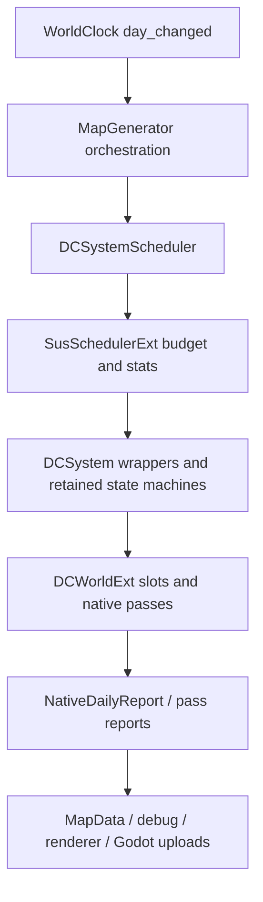

# Runtime Authority Matrix

本文记录当前日级 runtime 的权威边界。它区分“C++ 加速”“slot 写入”“tick/state authority”“visible publish”和“Godot object boundary”，避免把可运行 native pass 误判成完整 DOTS authority。

| System | Stage / Cursor Owner | Slot Writer | Publish Path | Fallback Owner | ACTIVE Eligibility | Known Blockers |
| --- | --- | --- | --- | --- | --- | --- |
| `season_refresh` | `SeasonRefreshSystem` 持有 period counter、round stage、stage cursor；B+ round 可由 `DCWorldExt` probe。 | GDScript helper 与 B+ C++ pass 写 terrain/landform/vegetation/cover/moisture/weather dirty slots。 | `MapData` mutation、dirty mask、enum atlas/detail scatter intents。 | `SeasonRefreshSystem` 12-stage path；B+ 失败回退同 system。 | 默认 GDScript retained；`native_season_refresh_active_owner_enabled=true` 且 B+ state 可证明时，report 可升为 `native_active`。 | Atlas queue、detail scatter 和 Godot upload 是 retained boundaries；只有 owner 未 active 才阻塞 simulation complete。 |
| `refresh_climate_daily` | `ClimateDailySystem` 持有 `_round_active`、`_pass_cursor`、phase lock；native daily report 镜像 climate state。 | 多个 `DCWorldExt` climate/ocean/wind/sea-ice/transpiration pass 写 slot；GDScript system 仍持 round state。 | Pass 级 `_flush_slot_to_map()` / `published_to_slot`，尾部 debug/CSV/visual intents。 | `ClimateDailySystem` sliced path；旧 `RefreshClimateDailyJob` 已删除。 | Partial native-ready / guarded ACTIVE owner flags；默认仍保留 GDScript round shell。 | Reset/abort/debug boundary、visible publish 与 sync sliced fallback 尚未完全退休。 |
| `native_daily_sim` | `DCWorldExt::run_native_daily_slice()` 持有 graph continuation、node cursor、round accumulator；GDScript 只保留 SUS shell 与 bundle boundary。 | `SCHEDULE_GRAPH` 节点调用 C++ pass 写 slots。 | Graph report `published_slots`、`visual_dirty_intents`、`authority_report`、`authority_blockers`、`retained_boundaries`；必要时 flush 到 `MapData`。 | 普通 ACTIVE 不再回 full-run；`run_native_daily_tick()` 只作 debug/probe，`run_native_sim_tick()` 作 SHADOW/A-B。 | `run_native_daily_slice` 是唯一 ACTIVE hot path；`graph_coverage_state=complete` 只由 simulation authority blockers 决定；`native_daily_legacy_daily_production_retired=true` 才允许 fallback/test-only handoff。 | Climate/weather/ocean/season owner gates 与 legacy fallback 未退休时仍阻塞；Godot/visual boundaries 只进 `retained_boundaries`。 |
| `economy_daily` | `NativeEconomyRuntime` 持有冻结周期、stage/cursor、PopulationStore、MarketStore、稀疏 MarketSignalStore/LaborMarketStore、BUILDING_GRAPH、need/bundle 清算和 ECB。 | 独立 native vectors；周期 sample day 读取 temp/moisture/snow/weather/resource slots，周期内冻结；仅资源净 delta 写回 extra-change slots。 | `wait_commit` 隔离半成品；截止日 `aggregate_publish` 统一发布周期 summaries、merchant-owned market/building snapshots、守恒审计和 PKEC v8 stream。 | 无大规模 GDScript fallback；PROBE 保留，native ABI 不可用时 disabled。 | 默认 **ACTIVE / 5日**；0 才按 4k/12k/30k cohort slice 自动选 N，截止日未完成才开 same-day 屏障。 | Price V3、自适应生活工资、欠薪停产与 owner-lot 利润奖金均为 C++ 权威；税、贸易和人口自然变化尚不在本图。 |
| `weather_refresh` | `WeatherDCSystem` wrapper 内的 `WeatherRefreshJob` 持有 field stage/front state；`WeatherSystem` 持业务 facade。 | `DCWorldExt` weather field/distribute/summary/stage-b pass 与 GDScript fallback 写 weather slots。 | Weather commit flush、front apply、weather LUT upload intent/Godot upload。 | `WeatherRefreshJob` staged path；merged native 受 readiness gate。 | `weather_native_daily_readiness_report()` 证明 visible publish/front/LUT 后为 `native_ready`；`native_weather_transaction_active_owner_enabled=true` 后为 `native_active`，执行后可升 `native_active_verified`。 | WeatherFront Godot objects、front rebuild、ImageTexture/LUT upload、CSV visible fields 是 retained boundaries；publish readiness 未达成才是 blocker。 |
| `runtime_hydrology` | Legacy path 由 `WeatherRefreshJob` stage 3 持有；native daily path 由 `SCHEDULE_GRAPH` 的 `runtime_hydrology` node 持有单日执行点。 | `DCWorldExt::run_runtime_hydrology_pass` 写 `soil_moisture`、`water_balance_30d`、`river_discharge*`、`river_storage`、`groundwater_storage`、`surface_runoff` slots。 | Pass 内 `_flush_slot_to_map()`；native daily graph report 宣告 hydrology published slots。 | Legacy staged path 保留为 fallback/A-B。 | `runtime_hydrology_enabled=true` 时需要 native bundle 同时包含 `weather_knobs` 与 `runtime_hydrology_knobs`；stage-b 通过 `stage_b_after_hydrology_knobs` 在 hydrology 后运行；publish 成功后 phase 为 `native_active_verified`。 | 缺 `runtime_hydrology_knobs` 才是 blocker；legacy facade 仅作 A/B/test/fallback 入口。 |
| `ocean_currents` | `OceanCurrentsSystem` wrapper 内的 `OceanCurrentsJob` 持 physical/visual round state；native facade mirrors physical state. | `DCWorldExt` SLP/wind/PSI/upwelling/raster pass 写 slots 或 visual buffers。 | SLP/wind/current/upwelling slot flush；visual raster + texture commit 留在 Godot side。 | `OceanCurrentsJob` physical/visual staged path。 | `native_ocean_physical_active_owner_enabled=true` 且 snapshot owner 为 `native_active` 后，physical state 不再阻塞 simulation complete。 | Visual raster/texture commit、overlay upload、Godot buffers 是 retained boundaries；wrapper `_inner` 未 inline。 |
| `sea_ice_daily` | `SeaIceDailySystem` / climate round sea-ice stage；native daily report 另有 `authority_report.sea_ice`。 | `DCWorldExt::run_sea_ice_daily_pass` 写 sea-ice/terrain-related slots。 | Slot flush + dynamic visual LUT/atlas dirty intent；native daily graph report 宣告 `cell_sea_ice_frac` 等 published slots。 | Sea-ice helper fallback retained where ext unavailable. | Native daily graph 中 `sea_ice_knobs` 存在时可报告 native graph owner；native round 完成后 phase 可升为 `native_active_verified`。 | Terrain flip visibility、visual LUT/Godot upload 是 retained boundaries，不再阻塞 simulation authority。 |
| `enum_atlas_upload` | `EnumAtlasUploadSystem` owns dirty patch cadence. | C++ encoder may produce patch bytes; DataCore slots are read-only inputs. | GDScript `ImageTexture` / atlas upload. | GDScript fan-out/upload fallback. | Not simulation authority; visual boundary only. | GPU upload and texture lifetime remain Godot-side. |
| `dynamic_visual_atlas_upload` | `DynamicVisualAtlasUploadSystem` owns LUT/atlas stride and catch-up. | C++ LUT/patch encoders read slots and return byte buffers. | GDScript Image/ImageTexture update; weather LUT is published by weather commit path. | GDScript encoder fallback. | Not simulation authority; optional visual job. | GPU upload, dirty queue, renderer interpolation. |
| `native_environment_runtime` | `NativeEnvironmentRuntimeSystem` thin scheduler job; native runtime owns internal shadow/probe state. | `EnvironmentRuntime` / `DCWorldExt` where available. | Report-only unless a specific pass publishes slots. | Skip/hard fail when native runtime unavailable. | SHADOW/probe thin job unless a concrete owner gate promotes it. | Needs per-system publish contract before authority. |
| Native world generation / bake | `MapGenerator.generate()` orchestrates; `DCWorldExt` owns base/post-base generation data. | Native generation result package and generation publish pass write initial SoA/slots. | GDScript assembles `MapData`/`HexCell`; publish pass flushes initial runtime slots. | Old full GDScript generation fallback is retired; failures abort generation or use scoped post-base fallback only where documented. | Native generation is C++ authoritative for base/post-base generation. | Godot object assembly, `HexCell` facade, texture bake/upload remain GDScript/Godot. |

## Economy Authority

经济域当前仍为 C++ `NativeEconomyRuntime` ACTIVE authority：124-good MarketStore、128 类稀疏
owner-lot、Price V3 稀疏企业信号、自适应工资/奖金、金银锚定发行和电力 utility prepass 都在
ECONOMY_GRAPH/BUILDING_GRAPH 内完成。GDScript 只编译 profile/technology tags、桥接 37 个自然
资源 slots、提交命令和查询选中 cell；不存在 GDScript 货币、价格或生产 fallback。当前持久格式为
PKEC v8，v2-v7 通过显式迁移读取。

## Scheduling Policy Boundary

`ClimateProfile.sim_stagger_*` controls when each job is eligible to start a new slice/round. It is interpreted centrally in `DCSystemScheduler.configure_job_from_profile()` / `apply_job_schedule()` and does not transfer authority between GDScript, C++, DataCore, or Godot object boundaries.

Default full-platform buckets are: ocean/native environment phase 0, climate/native daily phase 1 with climate stride 2, dynamic visual phase 2, weather + enum atlas phase 4, and sea ice phase 6 under `sim_stagger_bucket_stride=8`. A job skipped by `policy_gated` is simply outside its bucket. Authority is still determined by the owner/state/publish columns above.

## Native Daily Owner Gate Order

Legacy daily production paths are retired only in this order:

1. `climate_round`：native owns round cursor/phase/pass progress; GDScript keeps reset/abort/debug and MapData/Godot boundary intents.
2. `sea_ice`：native graph owns sea-ice fraction computation; GDScript keeps terrain flip visibility and sea-ice visual upload until soak proves them.
3. `weather_transaction` / `runtime_hydrology`：native graph owns weather transaction and hydrology route before stage-b; GDScript keeps WeatherFront objects, front apply, weather LUT upload, and fallback A/B.
4. `ocean_physical`：native may own physical stage cursor and output slots; pixel raster, texture commit, overlays, and Godot buffers remain retained.
5. `season_refresh`：native may report cadence and slot dirty intents last; period policy, atlas queue, detail scatter, and Godot uploads remain retained boundaries.

## Current Ownership Diagram

## Rules

- A system is DOTS-authoritative only when native owns state, writes slots, advances tick/cursor, and publishes a graph-level report.
- A pass returning `published_to_slot=true` proves slot publication for that pass, not visible renderer upload.
- Godot object lifetimes, `ImageTexture`, front objects, UI/debug, and CSV sampling remain explicit GDScript/Godot boundaries until a dedicated native object API exists.
