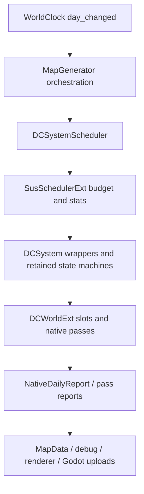

# Runtime Authority Matrix

## Game flow and persistence authorities

| State | Authority | Persistent provider | Rule |
| --- | --- | --- | --- |
| Pending new/load request | `GameFlowService` | none; one-shot process state | Never use `Engine` meta on the product path |
| Validated world creation inputs | `NewGameConfig v3` | PKSV `new_game_config` | Store seed, foreign count, starting country cash and research policy; v2 migrates with zero foreigners |
| Player and foreign identity/territory | PKCN / `NativeCountryRuntime` | PKSV `pkcn` plus player-only `player_context` | Player is slot 0; each opening country owns one cell; only `cell.country_slot` is mirrored to cells |
| Population, market, buildings, prosperity/settlement identity (including bootstrap capital forced-name bit), taxable events and fiscal escrow | PKEC / `NativeEconomyRuntime` | PKSV `pkec` / PKEC v24 | Restore only after PKCN and trade topology |
| Dynamic cell SoA | `DCWorld` / `DCWorldExt` by component contract | PKSV `dynamic_world` | Missing provider fails the save |
| Native environment rounds | `EnvironmentRuntime` | `PKEnvironmentRuntime v1` in PKSV `environment` | Persist arrays, ping-pong, dirty sets, topology and cursors, not counters only |
| Climate modifiers | Climate `ModifierStore` | PKSV `pkcm` / PKCM v1 | Publishes frozen add/factor; climate still owns temperature history |
| Country research, technology, treasury and tax policy | PKCN / `NativeCountryRuntime` | PKSV `pkcn` / PKCN v4 | Owns discovery, research, five tax defaults, sparse overrides and fiscal cash bridge |
| Country modifiers | Country `ModifierStore` | embedded in PKCN v4 | Technology and fine-grained tax-rate effects alter frozen consumers, never ledgers directly |
| Economy/building modifiers | Economy `ModifierStore` + `BuildingIdentityStore` | embedded in PKEC v24 | Factors feed deterministic output/construction/trade helpers, never ledgers directly |
| Gameplay modifiers | Gameplay `ModifierStore` + base/identity SoA | PKSV `pkgp` / PKGP v1 | Explicit native handles only; no Godot Object reflection |
| Calendar/RNG/time mode | `WorldClock` | PKSV `world_clock` | Restore date, carry, RNG, publish indices, pause and speed |
| Cell exploration progress | `VisionSolver` writing `cell.explored` | PKSV `pkfg` (`PKFogOfWar v1`) | Monotonic; restore after PKCN because re-solving reads territory |
| Current visibility and fog knowledge | `VisionSolver` writing `cell.visible` and `MapData.fog_k_arr` | none; derived | Pure function of territory plus baked terrain; recomputed on restore, never saved |
| Selection/camera | player scene controllers | PKSV `player_view` | Restore after derived map/render resources exist |

Transient 经济缓存与 climate/ocean hot-state capsule 不改变本矩阵的权威
划分；具体边界见
[运行时性能优化契约](runtime-performance-optimization-2026-07.md)。

本文记录当前日级 runtime 的权威边界。它区分“C++ 加速”“slot 写入”“tick/state authority”“visible publish”和“Godot object boundary”，避免把可运行 native pass 误判成完整 DOTS authority。

| System | Stage / Cursor Owner | Slot Writer | Publish Path | Fallback Owner | ACTIVE Eligibility | Known Blockers |
| --- | --- | --- | --- | --- | --- | --- |
| `season_refresh` | `SeasonRefreshSystem` 持有 period counter、round stage、stage cursor；B+ round 可由 `DCWorldExt` probe。 | GDScript helper 与 B+ C++ pass 写 terrain/landform/vegetation/cover/moisture/weather dirty slots。 | `MapData` mutation、dirty mask、enum atlas/detail scatter intents。 | `SeasonRefreshSystem` 12-stage path；B+ 失败回退同 system。 | 默认 GDScript retained；`native_season_refresh_active_owner_enabled=true` 且 B+ state 可证明时，report 可升为 `native_active`。 | Atlas queue、detail scatter 和 Godot upload 是 retained boundaries；只有 owner 未 active 才阻塞 simulation complete。 |
| `refresh_climate_daily` | `ClimateDailySystem` 持有 `_round_active`、`_pass_cursor`、phase lock；native daily report 镜像 climate state。 | 多个 `DCWorldExt` climate/ocean/wind/sea-ice/transpiration pass 写 slot；GDScript system 仍持 round state。 | Pass 级 `_flush_slot_to_map()` / `published_to_slot`，尾部 debug/CSV/visual intents。 | `ClimateDailySystem` sliced path；旧 `RefreshClimateDailyJob` 已删除。 | Partial native-ready / guarded ACTIVE owner flags；默认仍保留 GDScript round shell。 | Reset/abort/debug boundary、visible publish 与 sync sliced fallback 尚未完全退休。 |
| `native_daily_sim` | `DCWorldExt::run_native_daily_slice()` 持有 graph continuation、node cursor、round accumulator；GDScript 只保留 SUS shell 与 bundle boundary。 | `SCHEDULE_GRAPH` 节点调用 C++ pass 写 slots。 | Graph report `published_slots`、`visual_dirty_intents`、`authority_report`、`authority_blockers`、`retained_boundaries`；必要时 flush 到 `MapData`。 | 普通 ACTIVE 不再回 full-run；`run_native_daily_tick()` 只作 debug/probe，`run_native_sim_tick()` 作 SHADOW/A-B。 | `run_native_daily_slice` 是唯一 ACTIVE hot path；`graph_coverage_state=complete` 只由 simulation authority blockers 决定；`native_daily_legacy_daily_production_retired=true` 才允许 fallback/test-only handoff。 | Climate/weather/ocean/season owner gates 与 legacy fallback 未退休时仍阻塞；Godot/visual boundaries 只进 `retained_boundaries`。 |
| `modifier_daily` | `ModifierRuntime` 持有四域 SoA、bucket、expiry heap、命令排序与 snapshot version。 | 不写领域 base slot；发布只读 effective 聚合。 | `MODIFIER_GRAPH` report、command result、journal；PKCM/PKGP 与 PKCN/PKEC 内嵌 domain。 | GDScript fallback 只消费同一 `evaluate_modifier_stat` 公式；无第二份可变 store。 | ACTIVE，priority 90、单 slice、无工作时零 slice。 | 独立 SHADOW 双算和目标规模性能门禁尚未完成。 |
| `country_daily` | `NativeCountryRuntime` 持有国家 SoA、handle generation、领土 CSR、国家科技 bitset、现金/物资国库、五类税务默认率/稀疏覆盖、命令游标与 state hash。 | 只把 `cell.country_slot` 发布到 DataCore/MapData；名称、科技、国库、税表和 CSR 保持 native。 | 原子 `command_preflight → command_apply → aggregate_publish`；国家事件与粗粒度 snapshot；PKCN v4。 | PROBE/OFF 只作验证门；OFF 时依赖国家的经济禁用，不恢复旧状态。 | 默认 **ACTIVE**；priority 255、`must_run=false`、`use_job_should_run=true`，无到期命令零 slice。 | 不含灭国、科技撤销、外交、战争或 AI；活跃国家至少一格，水域无主。 |
| `economy_daily` | `NativeEconomyRuntime` 持有滚动五相结算、stage/cursor、PopulationStore、SettlementStore、MarketStore、BUILDING_GRAPH、国内 Trade stores、税率冻结、应税事件、负所得税 cohort 汇总与最低生活税基、补贴权重及 fiscal escrow；国家税表与国库由 `NativeCountryRuntime` 提供。 | 独立 native vectors；繁荣/地名不写 DataCore 或 MapData；due-cell sample 冻结环境、`cell → country`、科技、税率、Modifier factor 和负所得税最低生活申请。 | 有界 continuation 隔离半成品；COMMIT 消费去重人口变化集更新繁荣/名称；财政提交要求 escrow 清零；发布 summaries、聚居地 delta、审计与 PKEC v24 stream。 | 无大规模 GDScript fallback；国家桥无效时 disabled。 | 本地市场、繁荣度、税收财政、商人信用和国内贸易默认 **ACTIVE / 每 cell 固定 5 日**。 | 进口/出口关税仅有政策、Modifier、存档和 UI 占位；跨国贸易/外交仍未接入。 |
| `weather_refresh` | `WeatherDCSystem` wrapper 内的 `WeatherRefreshJob` 持有 field stage/front state；`WeatherSystem` 持业务 facade。 | `DCWorldExt` weather field/distribute/summary/stage-b pass 与 GDScript fallback 写 weather slots。 | Weather commit flush、front apply、weather LUT upload intent/Godot upload。 | `WeatherRefreshJob` staged path；merged native 受 readiness gate。 | `weather_native_daily_readiness_report()` 证明 visible publish/front/LUT 后为 `native_ready`；`native_weather_transaction_active_owner_enabled=true` 后为 `native_active`，执行后可升 `native_active_verified`。 | WeatherFront Godot objects、front rebuild、ImageTexture/LUT upload、CSV visible fields 是 retained boundaries；publish readiness 未达成才是 blocker。 |
| `runtime_hydrology` | Legacy path 由 `WeatherRefreshJob` stage 3 持有；native daily path 由 `SCHEDULE_GRAPH` 的 `runtime_hydrology` node 持有单日执行点。 | `DCWorldExt::run_runtime_hydrology_pass` 写 `soil_moisture`、`water_balance_30d`、`river_discharge*`、`river_storage`、`groundwater_storage`、`surface_runoff` slots。 | Pass 内 `_flush_slot_to_map()`；native daily graph report 宣告 hydrology published slots。 | Legacy staged path 保留为 fallback/A-B。 | `runtime_hydrology_enabled=true` 时需要 native bundle 同时包含 `weather_knobs` 与 `runtime_hydrology_knobs`；stage-b 通过 `stage_b_after_hydrology_knobs` 在 hydrology 后运行；publish 成功后 phase 为 `native_active_verified`。 | 缺 `runtime_hydrology_knobs` 才是 blocker；legacy facade 仅作 A/B/test/fallback 入口。 |
| `ocean_currents` | `OceanCurrentsSystem` wrapper 内的 `OceanCurrentsJob` 持 physical/visual round state；native facade mirrors physical state. | `DCWorldExt` SLP/wind/PSI/upwelling/raster pass 写 slots 或 visual buffers。 | SLP/wind/current/upwelling slot flush；visual raster + texture commit 留在 Godot side。 | `OceanCurrentsJob` physical/visual staged path。 | `native_ocean_physical_active_owner_enabled=true` 且 snapshot owner 为 `native_active` 后，physical state 不再阻塞 simulation complete。 | Visual raster/texture commit、overlay upload、Godot buffers 是 retained boundaries；wrapper `_inner` 未 inline。 |
| `sea_ice_daily` | `SeaIceDailySystem` / climate round sea-ice stage；native daily report 另有 `authority_report.sea_ice`。 | `DCWorldExt::run_sea_ice_daily_pass` 写 sea-ice/terrain-related slots。 | Slot flush + dynamic visual LUT/atlas dirty intent；native daily graph report 宣告 `cell_sea_ice_frac` 等 published slots。 | Sea-ice helper fallback retained where ext unavailable. | Native daily graph 中 `sea_ice_knobs` 存在时可报告 native graph owner；native round 完成后 phase 可升为 `native_active_verified`。 | Terrain flip visibility、visual LUT/Godot upload 是 retained boundaries，不再阻塞 simulation authority。 |
| `enum_atlas_upload` | `EnumAtlasUploadSystem` owns dirty patch cadence. | C++ encoder may produce patch bytes; DataCore slots are read-only inputs. | GDScript `ImageTexture` / atlas upload. | GDScript fan-out/upload fallback. | Not simulation authority; visual boundary only. | GPU upload and texture lifetime remain Godot-side. |
| `dynamic_visual_atlas_upload` | `DynamicVisualAtlasUploadSystem` owns LUT/atlas stride and catch-up. | C++ LUT/patch encoders read slots and return byte buffers. `encode_cell_luts` also takes an optional `fog_k_arr` and emits `enum_lut` as RGBA8 (4 bytes per slot) with fog knowledge in A. | GDScript Image/ImageTexture update; weather LUT is published by weather commit path. | GDScript encoder fallback; it must write the same `fog_k`. | Not simulation authority; optional visual job. | GPU upload, dirty queue, renderer interpolation. Vision changes do not set the climate/weather dirty mask, so `refresh_country_visuals()` forces its own LUT rebake instead of waiting for the stride. |
| Vision / fog of war | `VisionSolver` owns the whole solve; it is event-driven off `country_committed` plus one bootstrap pass, never a daily tick. | Writes `cell.visible` / `cell.explored` (U8 schema components, `owner="vision"`) and the derived `MapData.fog_k_arr`. Reads baked `WorldData.cell_view_height` / `cell_view_block`. | `enum_lut.a` for terrain graying and the fog layer; `fog_state()` for Inspector gating; PKFG for `explored`. | GDScript is currently the authority, not a fallback. A future `world_ext_vision.cpp` port keeps this file as the fallback. | Not simulation authority; it never advances a tick or participates in the native daily graph. | Fog is inert outside a formal session: `_resolve_fog_of_war_enabled()` requires a gameplay start context, otherwise `mark_all_visible()` saturates every array. |
| Country border visuals | `CountryBorderLayer` rebuilds a full `ArrayMesh` on every territory change. | None; it only reads `country_slot_arr` and `neighbor_index`. | Godot `MeshInstance2D` at z=6; camera zoom only pushes `border_world_width`, it never rebuilds geometry. | No fallback; a missing shader disables the layer. | Visual boundary only. | Geometry is mandatory here — dithered `map_index_atlas` makes shader-side edge detection produce broken lines. |
| Player map overlay | `WorldRuntimeHost` owns request/dirty/throttle state; it does not own simulation values. | `DataOverlayBaker.bake_cell_lut` reads the already-published `DCViewAdapter`/`MapData` snapshot and writes one RGBA8 texel per cell. | `DataOverlayLayer` binds static map-index atlas + dynamic LUT and performs Godot `ImageTexture.update`. | No simulation fallback; legacy full-raster baker remains debug-only. | Visual consumer only; it never writes slots, economy stores, MapData, or save state. | First/switch refresh is immediate; dirty refresh is coalesced to 10 Hz after authoritative flush. |
| `native_environment_runtime` | `NativeEnvironmentRuntimeSystem` thin scheduler job; native runtime owns internal shadow/probe state. | `EnvironmentRuntime` / `DCWorldExt` where available. | Report-only unless a specific pass publishes slots. | Skip/hard fail when native runtime unavailable. | SHADOW/probe thin job unless a concrete owner gate promotes it. | Needs per-system publish contract before authority. |
| Native world generation / bake | Awaited `MapGenerator.generate()` orchestrates cooperatively on the Godot main thread; `DCWorldExt` owns base/post-base generation data. | Native generation result package and generation publish pass write initial SoA/slots. | GDScript assembles `MapData`/`HexCell`; publish pass flushes initial runtime slots; `MapGenerator`/`MapBaker` yield frames only at stage boundaries. | Old full GDScript generation fallback is retired; failures abort generation or use scoped post-base fallback only where documented. | Native generation is C++ authoritative for base/post-base generation; cooperative yielding does not transfer authority. | Godot object assembly, `HexCell` facade, texture bake/upload remain GDScript/Godot; one native pass is still non-preemptible. |

## Economy Authority

经济域当前仍为 C++ `NativeEconomyRuntime` ACTIVE authority：136-good MarketStore、182 类稀疏
owner-lot、两组四档升级族、Price V3 稀疏企业信号、自适应工资/奖金、真实金银锚定发行和电力 utility prepass 都在
ECONOMY_GRAPH/BUILDING_GRAPH 内完成。GDScript 只编译 profile/technology tags、桥接 30 个注册自然
资源 slots、提交命令和查询选中 cell；不存在 GDScript 货币、价格、生产或贸易 fallback。
国家身份、领土、科技和国库由 `NativeCountryRuntime` 单一权威持有；经济周期冻结国家映射与科技，
现金/商品审计包含国家资产及贸易托管。持久格式为 PKCN v2 + PKEC v22，必须先恢复 PKCN；
兼容 v11 ACTIVE 可迁移，ACTIVE 配置拒绝 v11 PROBE/v10，v2-v9 明确返回
`legacy_countryless_economy_save_unsupported`。

## Scheduling Policy Boundary

`ClimateProfile.sim_stagger_*` controls when each job is eligible to start a new slice/round. It is interpreted centrally in `DCSystemScheduler.configure_job_from_profile()` / `apply_job_schedule()` and does not transfer authority between GDScript, C++, DataCore, or Godot object boundaries.

Default full-platform buckets are: ocean/native environment phase 0, climate/native daily phase 1 with climate stride 2, dynamic visual phase 2, weather + enum atlas phase 4, and sea ice phase 6 under `sim_stagger_bucket_stride=8`. A job skipped by `policy_gated` is simply outside its bucket. Authority is still determined by the owner/state/publish columns above.

## Native Daily Owner Gate Order

Legacy daily production paths are retired only in this order:

1. `climate_round`：native owns round cursor/phase/pass progress; GDScript keeps reset/abort/debug and MapData/Godot boundary intents.
2. `sea_ice`：native graph owns sea-ice fraction computation; GDScript keeps terrain flip visibility and sea-ice visual upload until soak proves them.
3. `weather_transaction` / `runtime_hydrology`：native graph owns weather transaction and hydrology route before stage-b; GDScript keeps WeatherFront objects, front apply, weather LUT upload, and fallback A/B.
4. `ocean_physical`：native may own physical stage cursor and output slots; pixel raster, texture commit, overlays, and Godot buffers remain retained.
5. `season_refresh`：native may report cadence and slot dirty intents last; period policy, atlas queue, detail scatter, and Godot uploads remain retained boundaries.

## Current Ownership Diagram

## Rules

- A system is DOTS-authoritative only when native owns state, writes slots, advances tick/cursor, and publishes a graph-level report.
- A pass returning `published_to_slot=true` proves slot publication for that pass, not visible renderer upload.
- Godot object lifetimes, `ImageTexture`, front objects, UI/debug, and CSV sampling remain explicit GDScript/Godot boundaries until a dedicated native object API exists.
## Economy v14 authority clarification

`NativeEconomyRuntime` remains the only mutable owner of cohorts, funds, market
inventory/prices, buildings, construction, employment, production, investment,
trade orders, escrow, and resource extraction deltas. `EconomyProfile` and
`EconomyCatalog` only compile configuration and fixed columns. CSV, Inspector,
and GDScript facades are read-only consumers. Desired/funded demand arrays,
owner allocation worklists, investment candidates, and trade response clocks are
native transient diagnostics and are not parallel gameplay state.

## Economy v15 authority override (current)

`NativeEconomyRuntime` is stage, tick, state, and publish authority for rolling
local settlement. GDScript only captures coarse environment/resource inputs,
submits commands, schedules the native call, and reads committed snapshots.
Production cadence is fixed at five days per cell, staggered by stable phase;
workload-auto cadence and the global epoch commit barrier are no longer ACTIVE
paths. Daily trade arrival and escrow settlement remain native cross-cell
transactions outside worker-local market writes.

Production worker ranges do not create a second authority. They execute inside
`NativeEconomyRuntime` and own only disjoint cell partitions under the current
`market_id == cell_id` contract. Global diagnostics, retained output, event
stream, and cashflow ledger publication remain a stable native main-thread
merge. If that ownership proof, the workload threshold, or WorkerThreadPool is
unavailable, the same native body runs scalar; GDScript never becomes the
fallback simulation owner. Plan, sparse market-signal observation, indexed
investment evaluation, and investment commit continuation are likewise native
transient work. None adds a DataCore slot, public bridge method, scheduler stage,
PKEC field, cadence rule, or state-hash input.

The investment review-cell ordinal list and closing-audit shadow/stamp/touched
lanes are also native transient scheduling/accounting state. Worker settlement
worksets are registered by the native main thread before dispatch; workers do
not own or publish the audit ledger. FULL remains the exact baseline, PROBE keeps
the full scan authoritative, and INCREMENTAL cannot become the production default
without the documented 200-day gate. None of these lanes is serialized or hashed.

## Economy v19 employment/recovery authority override (current)

`NativeEconomyRuntime` remains the sole mutable authority for endogenous
investment. Each reviewed cell evaluates a fixed four-type portfolio and
submits aggregate BUILD counts; source-cohort willingness and the shared
population, capital, credit, material, and market-gap budgets are native
fixed-point transient data. Partial liquidation reuses the existing
BuildingGroup and recovery state and does not add per-building identity.
`EconomyProfile` compiles the four portfolio/liquidation controls plus bounded
growth, new-type seeding, and merchant-transition improvement controls. PKEC
v19 persists the portfolio controls plus pending recovery state/cooldown; v18
loads with deterministic defaults. CSV v21 observes portfolio, partial-liquidation, and procurement-tier metrics.
There is no GDScript fallback or new DataCore slot.

## Economy production climate authority override (current)

`DCWorldExt` owns and publishes the `cell_plant_available_water` slot, while
`NativeEconomyRuntime` remains the sole owner of frozen Q16 environment samples,
building climate diagnostics, plans, settlement, hash, and PKEC v22. GDScript
compiles `ProductionClimateProfile` resources and retains the climate/resource
reference fallbacks; it never settles production. The change adds no scheduler
node or GDScript economy authority. Empty profile IDs are an identity capacity.

## Climate moisture visibility override (current)

`DCWorldExt.cell_moisture` remains the simulation authority; no schema,
component ID, scheduler node, or save field was added. Native daily pass nodes
retain slot authority but defer only their visible `MapData` publish until the
round finalizer. GDScript/Godot remains a snapshot consumer. Standalone,
legacy, PROBE, and A/B pass entry points keep immediate flush unless they
explicitly request `defer_visible_publish`.
