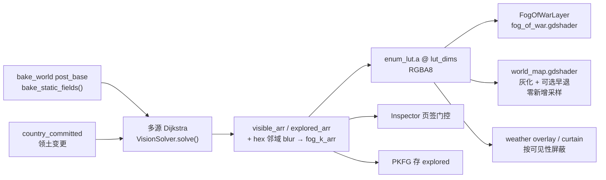

# 视野迷雾与国界线

本文是「三态视野迷雾 + 国界线渲染」的权威契约。数据流、存档边界与渲染层次
以本文为准；`computation-pipelines.md`、`gdscript-cpp-data-bridge.md`、
`game-flow-start-save.md` 只保留各自视角的交叉引用。

## 三态语义

`VisionSolver` 维护三个 per-cell 状态，`fog_state()` 把它们折成 UI 与视觉都认的
三态枚举：

| 态 | 枚举 | 判据 | 地形表现 | 玩家可得信息 |
| --- | --- | --- | --- | --- |
| 未探索 | `FOG_UNEXPLORED = 0` | `explored == 0` | 厚云完全不透明 | 无。Inspector 只给一张「未探索」占位卡 |
| 已探索、当前不可见 | `FOG_EXPLORED = 1` | `explored != 0 && visible == 0` | 薄云 + 地形去饱和灰化 | 仅地理页签 |
| 可见 | `FOG_VISIBLE = 2` | `visible != 0` | 无遮挡 | 全部页签 + 经济追踪 |

`visible ⊆ explored` 恒成立，这是把两态压进单通道的前提（见「知识度 k」）。

## 数据流



触发点只有两个：country bootstrap 后一次（`world_ready`），以及每次
`country_committed`。**不进每日 tick**——领土变更极少，全量重算比增量维护便宜。

## 静态预烘焙

`bake_static_fields()` 在 `MapBaker.bake_world` 的 post_base 阶段产出两个
`WorldData` 上的 `PackedByteArray`，地形不变则永不重算：

- `cell_view_height`：观察者视高，由 landform 派生（`PEAK` 30 / `MOUNTAIN` 22 /
  `HILL` 12 / `PLAIN` 0 / `CANYON` -4，钳到 `[0, MAX_VIEW_HEIGHT=32]`）。
- `cell_view_block`：视线穿透代价，landform 基值加 vegetation 附加值
  （`TROPICAL_RAINFOREST` +14 / `TEMPERATE_CONIFER` +10 / 草本 +1 / 水面 0），
  钳到 `[3, 60]`。

两张 256 项查找表先展开、再逐格查表，避免在 per-cell 循环里做 Dictionary 查找
（与 `map_data` 的 `passable_sea_lut` 同套路）。

该函数**必须**同时支持从 AoS（`HexCell`）和 SoA（`PackedByteArray`）读取：它在
`bake_world` 末尾被调用，而 `map.init_soa_from_bake()` 要到 `bake_world` 返回之后
才跑，此时 SoA 仍是空的。后续从 `solve()` 懒补烘时 SoA 已就位，走更快的一路。

## 解算模型

多源 Dijkstra，整数代价：

- 源 = 玩家国家的全部领土格（`country_slot_arr[i] == player_slot`），初始预算
  `BASE_BUDGET(42) + cell_view_height[src]`。
- 扩散到邻格扣 `cell_view_block[nb]`，预算仍 ≥ 0 则该格可见。取「剩余预算最大」
  的路径，于是站在山上看得远、穿密林看得近。平原 `view_block = 10`，所以平地上
  大约看 4 格。
- 邻接用现有的 `map.neighbor_indices_packed()`（`idx*6+dir` 布局，东西 wrap、
  南北硬边界）。
- 预算是有界小整数（≤ `BASE_BUDGET + MAX_VIEW_HEIGHT`），所以用 **bucket queue**
  从高预算向低预算扫描，不需要二叉堆。

**bucket 必须用 `Array` 而不是 `PackedInt32Array`。** `PackedInt32Array` 是
写时复制的，`buckets[b].append(i)` 会改到一份临时副本、原桶保持为空，可见集会
恒为空且不报任何错。`vision_solver_test.gd` 覆盖了这个回归。

`explored |= visible` 单调累积，永不清零。

比逐格 LOS 光线步进便宜两个数量级，视觉上足够。真需要精确遮挡时，后续可以离线
预烘每格可视集 CSR，`VisionSolver` 的对外接口不变。

## 知识度 k 与 enum_lut.a

`fog_k = 0.5 * blur(explored) + 0.5 * blur(visible)`，量化到 `0..255`：

```
k = 0    未探索
k = 128  已探索、当前不可见
k = 255  完全可见
中间值   blur 产生的柔化过渡带
```

blur 是 hex 邻域 box blur（自身权重 2、六邻各 1，图边缺失的邻居不计入分母，
避免南北极行被虚假拉向 0），迭代 `BLUR_ITERATIONS = 2`。**迭代数不能降到 2 以下**：
迷雾 shader 的噪声域扭曲最多位移 1 个 hex，而主地形早退要求「完全未探索」，
靠这 2 环柔化留出安全边界。

k 存进 **`enum_lut` 的 A 通道**，而不是新开一张 `fog_lut`。主地形本就无条件采样
`enum_lut` 且只用了 rgb，所以灰化与早退是**零新增 texture sample**——`_cell_id` 和
`cell_lut_uv()` 都已经算过，只是多读一个已有采样的第四分量。

代价是迷雾值被绑进了 `enum_lut` 的日刷节奏：`encode_cell_luts()`（C++）和
`map_baker.gd` 的 GDScript fallback **两条打包路径都必须带上当前 `fog_k`**，
漏一条就会在该路径生效时闪回全亮。缓解办法是两条路径读同一个
`map.fog_k_arr`，不存在第二份真源。

反过来，**解算之前必须一个字节都不传**。`fog_k_arr` 的长度不能当"有值"的判据：
`init_soa_from_bake()` 会把它分配成 n 个 0，而 0 正是"未探索"的合法取值，两种状态
在字节层面无法区分。所以判据是显式的 `MapData.fog_solved`（`VisionSolver.solve()` /
`mark_all_visible()` 置位，`rebuild_soa_from_cells()` 清位）；为假时 `bake_cell_luts`
传空数组，两条路径都落到"A 恒为 255"的全知默认。这与 `fog_state()` 在数组未初始化时
返回 `FOG_VISIBLE` 是同一条原则——**没解算过就当全知，绝不当全黑**，否则任何早于首次
solve 的 LUT 重烘都会把整张地图刷成未探索。LUT 首烘推迟到 `bind_map_data` 之后
（见 `computation-pipelines.md`）时就踩过这个坑：`enum_lut.a` 均值从 255 掉到 0。

视野变化时不能等 `DynamicVisualAtlasUploadSystem` 的日刷——它在 `dirty_count == 0`
时会 early-return，而视野变化不体现在 climate/weather 的 dirty mask 上。所以
`refresh_country_visuals()` 显式调 `MapBaker.refresh_cell_luts_daily()` 强制重烘。

## 渲染层次

完整 z 序（`top_level = true` 的 `Node2D` 挂在 `WorldRoot` 下）：

| z_index | 层 | 说明 |
| --- | --- | --- |
| 0 | `WorldQuad` / `SeasonTransitionQuad` | 主地形 `world_map.gdshader` |
| 4 | `WeatherLayer` | 云层、雨雪幕、云影、粒子 |
| 5 | `DataOverlayLayer` | 玩家信息遮罩 |
| 6 | `CountryBorderLayer` | 国界 ribbon mesh |
| 10 | `CellHighlight` | 选中框 |
| 12 | `FogOfWarLayer` | 迷雾厚云 |

迷雾必须在最上层：未探索区要连天气云、国界线和选中框一起盖住。

## 迷雾云的着色模型

### 为什么不做 raymarch

试过，撤了。俯视地图能看见的本来就只有云海的**顶面**；沿视线积分算出来的云内部
光路，屏幕上一点都体现不出来。而这个层在开局几乎铺满全屏，每像素几百次噪声换不到
对应的观感收益——实测出来的画面反而更差，因为步数被压到 9～16 之后到处是欠采样。

结论写在这里免得再走一遍：**全屏俯视云层使用分层 2.5D 密度场 + 少量质量探针，
不要做低步数体积积分。** 散射模型该给的东西，不积分也拿得到。

### deck / body / top 分层模型

`fog_sample_shape()` 从同一个连续宏观场派生三层，避免多张独立噪声贴片互相滑动：

| 层/环节 | 作用 | 实现 |
| --- | --- | --- |
| deck | 满迷雾区的低层托底，保证 `alpha=1` 时云缝仍是层云而非黑洞 | `veil + deck` |
| body | 中层主云体，负责大部分团块轮廓和明暗 | `body` |
| top | 高层云塔，提供受光白顶与晨昏暖色重点 | `top` |
| 自阴影 | 沿主光方向 2~3 次采前方云体质量，积分柔和光学厚度 | `fog_shadow_mass()` |
| 直射消光 | 双指数 Beer。单指数把阴影压成死黑，那是烟不是云 | `cloud_beer_ms()` |
| 多重散射回填 | 暗部的主要亮度来源，使用有理式厚尾衰减 | 主循环 |
| Powder | 迎光薄边因多重散射不足反而偏暗；纯 Beer 会把云缘算得过亮 | `cloud_powder()` |
| 银边 | 前向散射的**结果**，不是手动加的边缘亮度 | `cloud_phase()` |
| 3S 透射 | 薄云被背后的太阳点亮，云才「通透」而不是一块石膏 | `exp(-density·k)` |
| 色调映射 | 压缩 HDR 云顶，避免大面积直接 clamp 成纯白 | `fog_soft_tonemap()` |

原语在 `shaders/include/cloud_volume.gdshaderinc`（保留这个文件名：它装的是体积
散射模型，只是不含 march）。

**未探索区的遮挡由 deck 保证，视觉层次由 body/top、天空补光和多重散射共同承担。**
法线只负责有限的方向明暗，不能再主导整片云海。

### 形状：连续宏观场 + 高频侵蚀

主场使用 1/2、1、2、4 倍频的可平铺梯度噪声。低/中频形成连续宏观场；2/4 倍频以
小权重侵蚀阈值边缘，并另走低振幅细节法线，不能主导宏观坡向。`cover` 决定统一阈值：
满迷雾区阈值较低，形成连续 deck；边界处阈值升高，只留下破碎 body/top 云团。

q2 使用一层低幅域扭曲，q3 叠第二层。域扭曲只改变采样位置，不参与法线链式导数；
默认 `warp_amount=0.28`，q3 第二层系数 1.6。幅度再高会把云团拉成长卷曲流线，即使
法线很软也仍像液体大理石。默认 `cloud_scale=3.2`，在旧高度场 5.5 的巨型明暗墙与
2.5 的满屏细纹之间取中间尺度。

各频段使用不同线性漂移；2/4 倍频再叠小幅周期 wobble，使 octave 干涉关系随时间改变，
云团会缓慢翻卷、合并和分裂，而不是整张纹理刚性平移。wobble 不进入主法线。

### 走过的弯路：胞状噪声（已回退）

曾经判断「连续高度场从上方看永远是大理石纹，做不出云海那种一朵一朵的离散感」，于是
把形状换成胞状噪声试了两轮，最后按实际观感回退到连续梯度 FBM。**当前形状是低频
宏观 FBM + 小权重高频侵蚀，下面只是留个记录，免得再走一遍。**

两轮的结果：

- **Worley F1 —— 明确失败，别再回去。** 直觉上 F1（到最近特征点的距离）正好是
  「鼓包 + 缝网」，但 `F1 = min(各候选距离)` 在「哪个特征点最近」发生切换的 locus 上
  **梯度不连续**。每个胞边界都是一道折痕，整屏显出一张 Voronoi 多边形网：直线硬棱 +
  发光胞心，像裂冰或彩绘玻璃，比连续 FBM 更难看。
  换光滑的鼓包剖面**救不了** —— 折痕来自 `min()` 本身，不在剖面里。
- **metaball 求和 —— 数学上成立，观感上没被采纳。** 把每个特征点的光滑核
  `k(q)=(1-q)³`（`q=|p-c|²/R²`）**相加**而不是取 min：在 `q=1` 处值与一阶导同时为 0，
  于是处处 C1 连续、没有任何折痕，圆包重叠处柔和融合，且全程只用 `q=|v|²` 不需要
  sqrt。折痕问题确实解决了，但整体观感仍不如 FBM，遂回退。

如果以后再动这个方向，几条附带结论仍然有效：

- **胞状噪声的哈希不能用 `fract(sin(·))`。** 它相关性很强：用在**梯度**噪声里误差会被
  插值掩盖，但胞状噪声的哈希输出直接就是特征点**位置**，相关性会变成肉眼可见的成排
  鼓包和对角条纹。`sin()` 的精度还依赖 GPU 厂商。
- **层权重要强烈偏向第一层。** 各层等权会糊成一片均匀泡沫，一朵一朵的形就没了。
- **域扭曲幅度必须远小于一个胞。** 一格约等于一个包，位移超过一格就把胞结构打散，
  得到的又是流体涡纹。（FBM 则相反，需要接近一格的强扭曲才有走向。）
- **要垫底噪。** 胞场只负责"高低"，但未探索区必须完全不透明；没有底噪，包间低谷会
  被 `density` 阈值判成透明，迷雾上出现一个个窟窿。
- **层级阈值与 `shadow_absorb` 必须随场分布重调。** 胞场的高度差比 FBM 大得多，
  沿用窄窗口会让包心饱和成发光白核、把缝压成死黑。

### 坑一：高频梯度不能与宏观坡向等权进入法线

FBM 第 i 层贡献 `amp_i · noise(freq_i · p)`，斜率是 `amp_i · freq_i · dn`。标准参数
下 `amp = 0.5^(i+1)`、`freq = 2^i`，**`amp · freq` 是常数** —— 每个 octave 对梯度的
贡献一模一样，于是梯度被最高频完全主导，本质上就是白噪声。

直接拿它当法线，云会变成**一团揉皱的锡纸**：满屏硬边高光，暗面断崖式掉黑。

正确做法是把两个空间尺度拆开：

- `broad_grad` 只取 1/2、1 倍频，限制最大梯度后乘 `cloud_relief=0.28`，形成宽缓云丘；
- `detail_grad` 只取 2、4 倍频，保留较高空间频率但乘很小的
  `cloud_detail_relief=0.08`，形成低振幅锐利绒面；
- 禁止再乘 deck/body/top 三条窄 `smoothstep` 的解析坡度。三条导数会在每条层级
  等高线上造出尖脊，正是“大轮廓法线过锐”的来源。

最终 `N = normalize(vec3(-(broad_grad·cloud_relief +
detail_grad·cloud_detail_relief), 1))`。高频不是完全删除，而是与宏观坡向解耦。

法线只描述坡向，体积来自分层辐射：deck 以天光和多重散射为主、body 接受柔和直射并
带局部深度衰减、top 获得更强直射与更白反照率，最后按嵌套密度从下往上合成。三层共用
一套光照再只换 albedo，会退化成没有深度的浮雕纹，禁止恢复。

### 坑二：把云当不透明漫反射面 = 没有 GI

云的单次散射反照率≈1，光子在云里弹几十次才出来。所以：

- **背光面不会掉黑。** `light_wrap` 要给足（默认 1.0），硬 `N·L` 是固体的行为。
- **暗部亮度主要来自多重散射回填**（`bounce`），不是环境光。这一项刻意**不吃
  `N·L`** —— 邻近云体的二次照明与局部法线基本无关。少了它就是「仿佛没有 GI」的
  石头感。
- **低层不是黑的。** `valley_sky` 是天空遮蔽的下限（默认 0.68）；压太低缝隙就全黑，而真实云谷
  还被四周的云壁照着。

三项（`direct + bounce + ambient`）之和调到让塔顶**刚好逼近白**：再低整片发灰，
再高会削平顶部的形状细节。

### 坑三：多重散射不服从指数衰减

这是「暗部 GI 对不上现实」的根因。指数衰减是 **Beer 定律**，描述的是单次散射的
直接透射。但云的单次散射反照率≈1，光子要弹几十次才出来 —— 这属于**扩散输运**，
衰减尾巴比指数厚得多。

用 `exp(-d)` 做多重散射回填，云会被画成不透光的石头；现实中云的暗面是**通透发亮**
的。改用有理式 `1/(1 + k·d)` 近似扩散衰减，暗部立刻透起来：

| 深度 d | `exp(-1.1·d)` | `1/(1+1.1·d)` |
|---|---|---|
| 0.5 | 0.58 | 0.65 |
| 1.0 | 0.33 | 0.48 |
| 1.5 | 0.19 | 0.38 |
| 2.0 | 0.11 | 0.31 |

差距随深度拉开 —— 越深的地方越是「石头 vs 云」的分野。

（`cloud_beer_ms` 的双指数是同一件事的另一种拟合：两个不同速率的指数叠加，就是在
用有限项去逼近这条厚尾。直射透射沿用它，MS 回填用有理式。）

### 坑三点五：暗部必须偏蓝

现实中云的暗面是**冷蓝**的，不是中性灰。原因是照明主导权随深度转移：

- 受光面：太阳直射，暖白。
- 深处：直射被挡光，剩下的主要照明是**天光** —— Rayleigh 散射，强烈偏蓝。

水滴本身是 Mie 散射，几乎不分波长，所以在云里弹来弹去的光不会变蓝；变蓝是因为它
随深度衰减后，天光的比重上来了。

所以 MS 回填的**颜色**要随 `ms_depth` 从主光色漂向天光色。整条 MS 都用主光色，
暗部就一路暖灰 —— 立刻假。

受光面暖白 + 暗面冷蓝的这一组冷暖对比，是云「看起来真」的一大半。

实现上 `shadow_tint` 先归一化到亮度 1，于是它**只改色相不改明度**；调色时不会一改
颜色就顺带把暗部整体压暗，两个自由度独立。

### 夜侧必须消费月光，但不能硬切整套光照

`EarthDaylight` 已经提供 `moon_dir` / `moon_col` / `moon_strength`，地形、水面、
植被全都经 `brdf.make_lighting_context` 消费。**雾层也必须消费**，否则会出现
「地形有月光、云一片漆黑」的割裂。

基础方向与色板仍与 brdf 同源，但雾层按高空散射需要做平滑合成：

- `moon_dir = -sun_dir`，仰角压到 `z ≤ 0.72`，午夜才读得出云脊的法线差。
- 日月方向近乎相反，不能直接向量插值；太阳与月亮分别计算法线漫反射和银边，再按各自
  连续强度相加。
- 只有阴影探针轴仍选一个主光方向；切换发生在方向性阴影几乎被暮光权重消隐的区域。
- 天空 SH 色板按 `sun_share` 连续混合月色/日色，午夜不会拿白昼太阳色染云。

#### 晨昏线使用高空云专属的宽过渡

地表 `EarthDaylight.local_day` 的过渡围绕几何日落，适合地面，却会把高空云的昼夜
边界画得过硬。雾层因此从同一个 `sun_dir.z` 派生更宽的 `cloud_day` 与
`sun_strength`：太阳落到地平线以下后，高空云仍继续收到散射光。

太阳和月亮分别计算 `N·L`、颜色和银边后再相加，不再用 `step()` 瞬间翻转整套光照。
阴影仍只选一个主轴，但在 `twilight` 区把光学厚度衰减到 28%，使轴切换不可见。该区
额外按 deck/body/top 权重加入 HDR 金橙散射并在最后统一 tone map：云塔与软边最暖，
低层只吃少量反射，避免形成整堵橙墙。

### 探针积分质量，不比较高度差

旧版用「前方高度 - 本地高度」制造投影，低频差值会放大成黑色沟槽。现在
`fog_shadow_mass()` 只返回前方 body/top 云体质量，2~3 点加权平均后形成光学厚度；
本地高层质量只用于软化遮挡，最终再经 `cloud_beer_ms()`。探针不计算导数，q2 每点
2 个频段，q3 每点 3 个频段。

### 覆盖度当阈值

覆盖度 `cover` 直接当噪声阈值用：未探索区阈值压到底 → 连成整片云甲板；过渡带阈值
抬高 → 只有噪声峰值冒得出来 → 破碎的孤立云团。**迷雾边界因此是参差的云缘而不是
一条渐变带**，且不需要额外的边缘处理。

### 明暗直接进颜色，不要归一化

曾经的写法是累积 premultiplied 辐射再除回覆盖度。**未探索区覆盖度恒为 1，除回去
等于把所有明暗变化一起除掉，屏幕上就是一整片灰。** 现在直接算颜色，alpha 单独走。

同理，`cloud_albedo` 必须接近白（0.97）。云是高反照率介质，暗部要由光照和自阴影
拉出来；把 albedo 压暗只会得到一块死板。`sun_gain` 调到让塔顶**刚好逼近白**——
再低整片发灰，再高会削平顶部的形状细节。

### 东西向环绕：所有噪声必须可平铺

地图东西向无限滚动，`fog_wrap_world_x()` 会把采样点折回一个周期内。普通噪声在周期
两端对不上，接缝处就是**一条肉眼可见的竖线**。

`cloud_grad_noise_tiled*()` 把晶格的 x 坐标对周期取模，于是噪声本身以该周期为周期。
前提是周期必须是**整数**格数，所以域缩放要先过 `fog_tileable_scale()`：把周期四舍
五入到 4 的整数倍格，再反解出修正后的缩放（改动幅度 < 1%，云团大小看不出变化）。
取 4 的倍数是为了让 1/2、1/4 频率的域扭曲层也落在整数格上——**域扭曲的子频率只能
取 2 的负幂**，否则接缝会从扭曲层回来。

代价：octave 之间不能再旋转（旋转破坏周期性），只能轴对齐倍频 + 每层常量偏移。
可能出现轻微的网格走向，靠域扭曲补偿。

`edge_warp`（打散 hex 轮廓的那层）同样要走可平铺噪声，否则接缝上的迷雾边界会错开。

### LOD 截断：噪声必须按屏幕足迹降频

缩小地图时高频 octave 的特征尺寸会掉到像素以下，直接采样等于对噪声做点采样，
屏幕上就是一片**沙砾状闪烁噪点**。`cloud_cumulus_fbm*()` 接一个 `lod_px`（一个屏幕
像素在噪声域里跨越的距离 = `fwidth(world) × 域缩放`），按 Nyquist 把跨不过一个像素
的 octave 平滑淡出，并同步缩小归一化分母。于是缩小时云自然收敛成柔和大团，而不是
锐化成噪点。

全部 octave 都被砍掉时（极端缩小）要收敛到噪声均值而不是 0，否则整层会突然跳成
另一种颜色。

**任何新增的程序化噪声层都要照做**，这是缩放地图上程序化噪声的通用约束，不是
迷雾特有的。

### 相函数必须掺各向同性底

单瓣 HG 在侧光 / 背光方向会掉到前向峰值的 1/30。俯视时视线近似朝上，散射角基本就
跟着太阳高度角走，直接用单瓣会让云在太阳一低的时候整片发黑。`cloud_phase()` 掺了
42% 的各向同性底——这不是为了好看作弊，而是**单次散射相函数本来就不该单独代表整朵
云**，真云的高阶散射早把方向性抹平了。

### TOD 光照

走 `earth_daylight.gdshaderinc` 的逐像素太阳/月亮方向和基础色板，与地形 / 水面 /
植被 / 天气云同源；雾层只针对高空可见性拓宽过渡。正午是冷白顶配蓝灰缝隙，晨昏是
柔和金橙散射，夜里回到冷蓝月光。

include 要求调用方**在 include 之前**声明 `season_phase` / `day_phase` /
`axial_tilt_rad` / `tod_debug_*` / `tod_sun_dir`。漏掉任何一个都是 shader 编译期
失败，而 `--headless` 不建渲染设备、根本不编译 shader，所以这类错误只能在真实
渲染驱动下暴露。

夜侧由 deck 天光填充和多重散射保持可读，不再使用逐像素 `max()` 硬地板；后者会沿
晨昏线产生亮度折点。

深夜不能复用白昼级方向光：太阳消失后，质量自阴影只保留 16% 的厚度提示；月光漫反射
只有 18% 响应局部法线，直射增益为日光的 30%，月光银边也降为 16%。q3 天空 SH 只读
低频 `broad_grad`，不读细节法线，再用无方向性的冷灰月光填充补回可读性。夜间环境色
本身已经偏蓝，`shadow_tint` 只以 30% 权重叠加，避免双重染蓝成水下色。晨昏金色散射
继续保留，但密度权重与强度均低于旧版，不能在夜区外圈形成橙色硬环。

### 云体表现时钟

`FogOfWarLayer` 与 `WeatherLayer` 使用相同的 `_clock_speed_multiplier` /
`_clock_running` 接口。运行时 `_world_time += delta * speed_multiplier`，所以 x5/x20
会同步加快 octave 相对漂移和内部翻卷；暂停时按天气层既有语义保留 1x 真实时间的缓慢
大气运动，不让画面完全冻结。正式玩家路径由 `TimeControlsController ->
WorldRuntimeHost.on_speed_changed/on_clock_running_changed` 同时推给两层，debug
`main.gd` 也同步两层。禁止让迷雾层退回独立的真实时间计时。

### 质量分档

有效档 = `min(编译期 tier 上限, 运行时 fog_quality)`。编译期宏砍掉低端机的整段
代码，运行时 uniform 让桌面端低配也能降档。

| 档 | 内容 | 每像素噪声 octave |
| --- | --- | --- |
| q0 | 1 octave，无光照。纯色 + 一点起伏，最便宜 | 1 |
| q1 | 3 频段分层密度 + 平滑法线 + TOD。无域扭曲、无阴影探针 | 3 |
| q2 | 4 频段 + 1 层域扭曲 + 2 个质量探针 + Powder/银边/3S | 4 + 2 + 2×2 = 10 |
| q3 | 4 频段 + 2 层域扭曲 + 3 个质量探针 + 天空 SH | 4 + 4 + 3×3 = 17 |

LOD 截断会在缩小时进一步砍掉高频 octave，所以上表是放大时的上限。

q1 的存在意义只是给移动端中档兜底（编译期 tier 把上限卡在 q1）。
`FogOfWarLayer.set_visual_quality()` 把 `visual_quality` 的 0/1/2 映射到 q0/q2/q3：
桌面端要么便宜到 q0，要么就该拿到完整着色的 q2/q3，中间那档没有意义。编译期档位切换
（`set_mobile_quality_tier`）必须**重载 shader** 让 `#define` 生效，与 `WeatherLayer`
同套：只在 `OS.has_feature("mobile")` 时给源码前置 `#define`，桌面端拿未修改的源码
走 `PK_QUALITY_DESKTOP`。

## 国界线

**国界必须走几何，不能在 shader 里对 `map_index_atlas` 做邻域 edge detect。**
cell index 在烘焙期带 Bayer dither（`map_baker` 的 `dither_enabled`），逐像素反查
在 hex 边界会抖 ±1 texel，描出来的线是碎的。而国界边数极少（60×40 地图最多 7200
条，实际通常几十到几百条），一次性烘一张 `ArrayMesh` 完全不是负担。

每个「归属与邻格不同」的 hex 边，由**拥有该格的一侧**生成一条朝本格内侧的 ribbon。
两个相邻国家各出一条，国界线上自然形成「深色分隔线 + 两侧国色带」；国家 vs
无主地/图边只出一条。这样既避免了去重时选哪一侧的歧义，也免费得到双色国界。

ribbon 按 `RIBBON_WIDTH_RATIO(0.62) × hex_size` 烘死，实际线宽由 shader 的
`border_world_width` uniform 裁出，因此**相机缩放只推 uniform、不重建 mesh**。
wrap 时复制 `-period / 0 / +period` 三份，与 `_build_quad_mesh` 一致。

### ribbon 几何：内缩梯形，不是平行四边形

凸多边形向内偏移 `d` 时每条边会**变短**——六边形每端缩 `d·tan30°`。所以：

- 外侧两点落在偏移后的外轮廓上：沿边各**加长** `bleed·tan30°`；
- 内侧两点沿边各**收短** `ribbon_width·tan30°`。

两侧都是凸多边形的正确偏移，于是相邻两条 ribbon 在角点处顶点重合，围成的环
既没有缝也没有交叉。

> 早期版本把四个顶点**全部沿边向外延伸**（本意是 miter，方向反了），每条边都越过
> 两端角点，相邻两条在角外交叉——放大后是肉眼可见的 X。原有断言只数边数和顶点数，
> 全部照过。`country_border_mesh_test.gd` 现在直接检查外缘端点：6 条边共 12 个端点，
> 去重后必须正好剩 6 个。

外侧额外留 `OUTER_BLEED_RATIO(0.18) × ribbon_width` 的余量，纯粹是为了让线的
**外缘**也落在三角形内部、能被 `fwidth` 抗锯齿。没有这条余量时外缘正好压在三角形
边界上，拉近后是一条硬锯齿。

### 顶点属性用世界单位

`UV.x` = 沿边距起点角的距离，`UV.y` = 距国界线的垂距（外侧为负）。**存世界单位而
不是归一化 0..1**：两者都是位置的线性函数，在梯形拆成的两个三角形里插值都精确；
归一化后的 `UV.x` 在梯形里会沿对角线出现折痕。`COLOR.rgb` 是国色，`COLOR.a` 是
per-edge 噪声种子（不是透明度）。

### 线宽策略

屏幕线宽**不做恒定**：恒定宽度在拉近后是一根压在巨大 hex 上的发丝，显得廉价。

```
screen = clamp(border_screen_width × zoom^border_width_zoom_exp, min, max)
world  = screen / zoom
```

默认 `3.6 px × zoom^0.42`，夹在 `[2.0, 9.0]` px。指数 0 退化为屏幕恒定、1 为世界
恒定。`ribbon_world_width` 必须能容纳最小 zoom 下换算出的世界线宽，否则线会被
ribbon 的内边界截断。

### 断面结构

从国界线往本格内侧：`[深色外套 casing] [国色带] [向内柔化收尾]`。相邻两国各画一条，
共享边上就是「色A | 双份深色 | 色B」。**深色外套是这条线能压住任何地形底色的原因**
——没有它，金色线落在黄绿色地表上会糊掉。默认外套占线宽 42%，国色带带 1.12 的
亮度增益。

国色：`NativeCountryRuntime` 不存颜色，由 slot 经黄金比 hue 派生（与
`data_overlay.gdshader` 的 `categorical_color` 同思路），玩家国家固定为一个高辨识
度色。`country_color()` 是 slot 的纯函数，`country_border_mesh_test.gd` 对此有断言。

## 主地形早退（默认关闭的性能实验）

`fog_early_out_enabled` 默认 **false**。开启时，`fog_k` 低于阈值的像素直接输出
`fog_unexplored_color` 并跳过整条陆地/水体/BRDF/hillshade 管线。

### 只有 q0 才真的放行

早退的前提是迷雾层在该处输出一个**与地形无关的常量色**——地形被完全盖住，跳过才
不可见。q0 满足（纯色 + 起伏）；**q1 以上一旦接入 TOD 光照，颜色随位置和时间变化，
早退分支那块常量色就会露成一块死斑。** q1+ 更是连基础反照率都换成了 `cloud_albedo`
（接近白），与 `unexplored_color`（板岩灰）根本不是同一个量。

所以请求的 `early_out` 还要与迷雾层的实际档位取与：
`HexRenderer._effective_fog_early_out()` 调 `FogOfWarLayer.supports_terrain_early_out()`
（`effective_quality() <= 0`）。质量档或编译期 tier 一变就要重推这个 uniform。

这也意味着**早退与体积云是互斥的两条路线**：想要早退的性能收益，就得接受 q0 的
观感。默认配置选了观感。

### 其余约束

- **净收益取决于厚云是否真的比被跳过的地形便宜。** 省下的屏幕面积现在由迷雾层
  来画，如果厚云照抄 `weather_overlay` 那套三层云 + TOD 光照 + 4-tap 梯度，就是
  拆东墙补西墙。q0 刻意只用 1 octave FBM + 缓慢时间推进 + 一个冷灰色带。
  （q2+ 的 12~18 个 octave 大概率比被跳过的地形还贵，这是它不许早退的另一重理由。）
- **`canvas_item` 的 fragment 禁用 `return`**，只能把整个 fragment 体包进 `if` 块。
- **编译器可能把分支内的无副作用采样提升到分支外**做延迟隐藏。分支体足够大时
  不会全提，但这属于不能假设、必须实测的范畴。

因此它是可开关的独立开关，**必须靠 GPU 侧 A/B 实测决定是否开启**，覆盖开局
（约 99% 未探索）与后期（大部分已探索）两种极端。无头环境测不出这一项。

## 动态信息屏蔽

`weather_overlay.gdshader` 与 `weather_cell_curtain.gdshader` 采 `enum_lut.a` 得到
可见度，把 alpha / intensity / cloud / precip / shadow / edge 全部乘上去，并对
完全不可见的格做 early-out。已探索但看不见的地方不该显示实时天气——这个信号对
「这是记忆中的旧信息」的表达力其实强于灰化本身。由 `fog_mask_enabled` uniform
统一开关，`HexRenderer._push_fog_uniforms()` 推送。

## UI 门控

`cell_inspector_view_model.build()` 按 `fog_state` 过滤页签并**跳过被过滤页签的
数据构建**（顺带省掉一次经济查询）：未探索返回占位模型；已探索只留 `geography`；
可见给全套。`game_ui_manager.show_cell_panel()` 据此决定是否调
`_set_inspector_trace_cell`——不可见格不该开经济追踪。

`InspectorPanel` 用页签集合的**签名比对**决定是否重建页签栏。早期的一次性
`_tabs_ready` 闩锁在这里是错的：同一个面板会在三态之间切换，页签集合会变。

## 存档

`cell_explored` 是单调累积的玩家进度，必须持久化，落在 PKSV 的 `pkfg` section
（`PKFogOfWar v1`）。`visible` 与 `fog_k` 是领土与地形的纯函数，不存，恢复后重算。
恢复顺序必须排在 PKCN 之后（解算读领土），细节见 `game-flow-start-save.md`。

## 关闭路径

`fog_of_war_enabled` 总开关之外，还要求本局有 gameplay start context
（`_resolve_fog_of_war_enabled()` 检查 `gameplay_start_report().ok`）。调试 /
沙盒路径没有玩家国家、`country.default` 铺满全部陆地，若不豁免整张地图会被云盖死。

关闭时走 `VisionSolver.mark_all_visible()`：三个数组全部填满、`fog_k = 255`。
**消费点因此不需要各自再判一次总开关**——UI 门控与 `enum_lut.a` 只认这三个数组。

运行期开关统一走 `WorldRuntimeHost.set_fog_of_war_enabled()`：它改总开关、重跑
上下文门控、推渲染器 uniform，再触发一次 `refresh_country_visuals()`。GM 面板的
`visual.fog_of_war` 就挂在这个入口上，回读的是门控后的实际状态而不是请求值——
在没有正式对局上下文时打开它不会有任何效果，这是预期行为。

## 验证

- `tests/vision_solver_test.gd`：地形感知半径、`explored` 单调性、三态
  `fog_state`、迷雾关闭直通路径、bucket 回归。
- `tests/country_border_mesh_test.gd`：边数与拓扑、四顶点 ribbon、wrap 三份、
  国色纯函数性、无主地全透明，以及**相邻 ribbon 在角点重合**（X 伪影回归）。
- `tests/game_save_roundtrip_test.gd`：`explored_arr` 的存档往返哈希。
- shader 改动**无法用 `--headless` 验证**（dummy renderer 不编译 shader），必须在
  真实渲染驱动下加载一次材质。缺 uniform 声明、include 依赖不全这类错误只有这样
  才会暴露——`fog_of_war.gdshader` 接 `earth_daylight` 时漏声明 `tod_sun_dir`
  就是一个实例，headless 全绿而真机直接编译失败。
- 仿真侧回归看 `bd_dynamic_visual_atlas_lut_refresh_ms`（含整个 `encode_cell_luts`）
  与 `t_sus_ms` 的比值；迷雾层的全屏 fragment 成本只能在 GPU 侧量。
