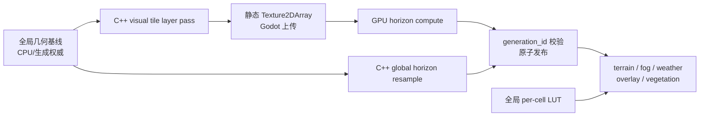

# Visual Tile Rendering

本文描述当前地图静态视觉栅格的分块实现。目标是在不提高生成/仿真权威分辨率的前提下，
让大地图按设备预算获得更高的地形、河流、海岸、迷雾和天气采样精度。

## 权威边界

系统采用“低分辨率全局基线 + 高分辨率视觉 Tile”双层结构：

- `run_bake_geometry_fields_pass` 产生的全局 `height_buffer`、河流、海岸、水深、
  `pixel_to_cell_lookup`、`cell_pixel_lists` 和 CSR 仍是生成期/CPU 权威。
- `VisualTileSet` 只保存 GPU 可见的静态重采样结果，不写回 `HexCell`、`MapData`、
  DataCore slot、河网或任何日仿真字段。
- `sample_height()` 等 CPU 查询继续读取全局基线。改变 Tile 预算不得改变生成 hash、
  仿真结果或存档。
- `enum_lut`、`dyn_lut`、`eco_lut`、`weather_lut` 仍是每 cell 的全局纹理；
  不按 Tile 复制。季节/天气过渡只快照这些 LUT，不快照静态数组。
- `WorldData.visual_tiles` 是临时视觉对象，不进入 PKSV。

权威移动仅限于视觉逐像素热循环：静态 Tile 字节由 C++ 生成，horizon 由 GPU compute
生成；GDScript 仍负责生命周期、路径选择、`Texture2DArray` 创建/上传和原子发布。



## 画质预算与布局

`VisualTileLayout.resolve()` 从 `auto/low/medium/high`、平台和设备限制推导布局。
玩家不直接指定 `N`；`N = grid_x * grid_y` 是预算解析结果。

| 平台 | Low | Medium | High | Auto |
| --- | ---: | ---: | ---: | ---: |
| Mobile | 0.25 MP | 1 MP | 2 MP | Low |
| Desktop | 1 MP | 4 MP | 8 MP | High |

默认 interior 上限为 `512x512`，每边 gutter 为 2 px，interior 轴向上取整到 8。
水平环绕地图的 `visual_domain.x=[0, wrap_period_x)`，不把 `world_bounds` 的水平 padding
计入预算；非环绕地图使用完整 `world_bounds`。推导公式为：

```text
target_w = ceil(sqrt(pixel_budget * aspect))
target_h = ceil(pixel_budget / target_w)
grid_x = ceil(target_w / 512)
grid_y = ceil(target_h / 512)
interior = align_up(ceil(target / grid), 8)
logical = grid * interior
```

layer 数同时受 64、`LIMIT_MAX_TEXTURE_ARRAY_LAYERS` 和
`LIMIT_MAX_TEXTURE_SIZE_2D` 限制。预算 resolver 以 0.85 逐级下降，直到 layer、纹理尺寸、
稳态和峰值内存全部满足；无法求解时回退 legacy。

默认内存硬上限：Mobile 64/96 MB，Desktop 192/256 MB（稳态/峰值）。稳态按每物理
texel 18 bytes 估算；compute 临时工作集额外按 12 bytes 估算。可通过以下设置或命令行覆盖：

- `project_keynes/rendering/map_tiles/mode`
- `project_keynes/rendering/map_tiles/budget_mp`
- `--map-visual-mode=` / `--map-tile-mode=`
- `--map-tile-budget-mp=`
- `--map-tile-resident-cap-mb=` / `--map-tile-peak-cap-mb=`

画质变化只在下一次地图载入/生成生效。Compatibility renderer 强制 legacy。

## Texture2DArray 契约

`VisualTileSet` 全驻留且不生成 mipmap。每层物理尺寸为
`interior_size + 2 * gutter_px`：

| 字段 | Image 格式 | bytes/texel | 语义 |
| --- | --- | ---: | --- |
| `height` | RG8 | 2 | 16-bit 最终视觉高度 |
| `terrain_normal` | RG8 | 2 | 最终视觉高度的宏观法线 xy |
| `map_index` | RGBA8 | 4 | biome、cell id low/high、landform |
| `flow` | L8 | 1 | 高分河流 SDF |
| `water_depth` | L8 | 1 | 海/湖水深 |
| `terrain_detail` | L8 | 1 | 静态地表细节 |
| `edge_neighbor` | RG8 | 2 | 次级 cell id |
| `edge_distance` | L8 | 1 | cell 边界距离 |
| `horizon` | RGBA8 | 4 | 8 方向、每方向 4-bit |

`ready` 表示全部静态数组可统一绑定；`horizon_ready` 单独表示异步 horizon 已完整替换
中性数组。消费者绝不绑定部分静态 layer。

## 原生静态 Tile bake

`MapBaker._bake_visual_tiles()` 只构造一次 cell SoA/base knobs；每层浅复制 Dictionary，
增加 layer 的 world rect 后调用：

```text
DCWorldExt.run_bake_visual_tile_layer_pass(knobs)
```

输入包括 generation/layer id、map 尺寸和 cell SoA、全局基线场、world rect、seed、
wrap period、海平面及地形参数。输出为八个静态字段的 `PackedByteArray`、字段 hash、尺寸、
`elapsed_ms` 和 `csr_emitted=false`。逐像素工作使用 C++ 行批次并行；GDScript 不做
O(n_pixels) 循环。每个 layer 返回后立即 `update_layer()` 并让出一帧，staging bundle
随即释放。

视觉高度为 bicubic 全局侵蚀高度加世界坐标驱动的有界高频 residual。residual 与 tile id
无关，按 seed 确定，并保持权威海陆侧不变。河流 SDF、海岸 carve、水深和法线在目标
分辨率重新计算，不从 R8 基线放大。算法所需 halo 在 native pass 内按世界坐标采样，
运行时 2 px gutter 只服务滤波和接缝。

当前 API 是无状态的逐层 pass，而不是持久 C++ session 对象；共享 PackedArray 依靠 Godot
Copy-on-Write 复用，且热循环仍完全位于 C++。若后续 profiling 证明每层参数解析或重复预处理
占比显著，再引入带 generation handle 的 native session；引入前不得改变现有输出契约。

## Horizon Compute

`VisualTileHorizonBaker` 使用 local `RenderingDevice`：

1. decode shader 把 RG8 array 解码到 logical level-0 float buffer。
2. pyramid shader 构建跨 layer 的 max-height 金字塔。
3. trace shader 对物理 layer（含 gutter）的 8 个方向执行分层 branch-and-bound。
4. 输出直接写 nibble-packed RGBA8 buffer，回读后逐层上传。

X 坐标先按周期环绕再解析 logical texel，Y clamp。水平射线最多一个经度周期；其他方向
到 Y 边界停止。达到 iteration cap 时用未解析区间的上界保守量化，并累计
`non_converged_rays`，因此失败模式是略多遮挡而不是漏遮挡。

compute 在静态 Tile 发布后异步启动；完成前 shader 关闭 tiled horizon direct-light
遮蔽。shader 编译、资源创建、dispatch、sync 或 readback 失败时，renderer 调
`encode_bake_horizon_tex_data` 取得全局 RGBA8 horizon，再逐层调用
`run_resample_visual_horizon_layer_pass`。只有所有 layer 上传成功才置
`horizon_ready=true`；fallback 再失败则保持中性 horizon 并记录原因。

## 统一寻址与消费者

`shaders/include/visual_tile_sampling.gdshaderinc` 是唯一 world-position 寻址实现：

1. X 先 wrap 到 `visual_domain`。
2. world position 转 logical UV、`tile_xy` 和 row-major `layer_id`。
3. interior-local texel 加 gutter 后得到 array UV。

nearest/linear helper 分离。邻域采样必须对每个偏移后的世界坐标重新解析 layer，不能假设
邻点仍在当前层。所有 gutter 也由相同世界坐标函数生成，因此普通邻接和首尾 X 接缝遵守
同一字节契约。

shader 通过编译时 `MAP_VISUAL_TILED` 生成 tiled/legacy 两套变体，避免同一 shader 同时
声明两套 sampler。已迁移的消费者包括主地形、水面、海岸、法线、horizon、FogOfWar、
Weather overlay、DataOverlay 和 Shrub/vegetation。Fog/Weather 的 `map_index + edge`
来自 Tile；各 per-cell LUT 保持全局。雨雪 curtain 继续直接携带 cell id。

## 模式、发布与回退

- `legacy`：不创建 Tile，使用现有单图 shader/纹理。
- `probe`：生成静态 Tile 和 hash/report，但消费者仍绑定 legacy；用于成本和确定性对比。
- `tiled`：正式 array shader 路径。`N=1` 仍走 tiled 变体。

回退顺序固定：预算先降级；静态 Tile 成功但 compute horizon 失败时重采样全局 horizon；
数组创建或任一静态 layer bake/upload 失败时，整个世界切回 legacy，禁止混合不完整静态字段。
每次 bake 递增 `generation_id`；逐层上传、compute 完成和 fallback 发布都校验 id，快速重生成
产生的旧结果只能丢弃。

稳定期仍保留低分 CPU 基线、全局 height/horizon 和 legacy GPU 纹理，以支持 Compatibility、
probe 与失败回退。删除重复全局 GPU atlas 必须等 tiled 跨平台 soak 后单独评估，不能在当前
fallback 尚有验证缺口时提前删除。

## 诊断与验收

静态报告记录 mode/fallback、renderer、requested/effective budget、domain、grid、layer、
interior/gutter/logical size、估算 resident/peak bytes，以及每层 bake/upload/wall time 和字段 hash。
Horizon 报告记录 path、mip levels、compile/resource setup/command record/submit/GPU wait/readback/
upload time、buffer bytes、hash 与 non-converged ray 数；fallback 另记 source path、每层时间/hash
和 compute failure。

自动测试入口：

- `visual_tile_layout_test.gd`：预算、极端比例、设备降级、wrap/边界地址。
- `visual_tile_native_bake_test.gd`：八字段尺寸、hash 确定性、无高分 CSR、horizon fallback
  尺寸/hash/环绕 gutter。
- `visual_tile_horizon_shader_test.gd`：compute source 契约。
- `visual_tile_horizon_smoke_test.gd`：真实 RenderingDevice dispatch/readback/upload 和 gutter。
- `terrain_shader_variant_test.gd`、`overlay_edge_transition_shader_test.gd`：legacy/tiled shader 变体。

发布门槛还包括 Windows D3D12 和 Android Vulkan 的 LOW/MID/HIGH 真机编译截图、8 MP/2 MP
峰值内存、GPU p95、horizon exhaustive CPU 角误差和跨 Tile 视觉回归。这些是实机验收，
不能用 headless Dummy renderer 结果替代。
