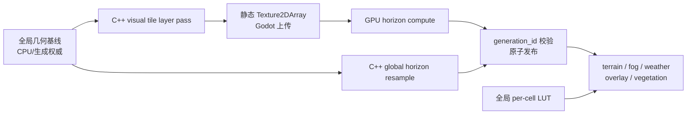

# Visual Tile Rendering

本文描述当前地图静态视觉栅格的分块实现。目标是在不提高生成/仿真权威分辨率的前提下，
让大地图按设备预算获得更高的地形、河流、海岸、迷雾和天气采样精度。

## 权威边界

系统采用“低分辨率全局基线 + 高分辨率视觉 Tile”双层结构：

- `run_bake_geometry_fields_pass` 产生的全局 `height_buffer`、河流、海岸、水深、
  `pixel_to_cell_lookup`、`cell_pixel_lists` 和 CSR 仍是生成期/CPU 权威。
- `VisualTileSet` 只保存 GPU 可见的静态重采样结果，不写回 `HexCell`、`MapData`、
  DataCore slot、河网或任何日仿真字段。
- `sample_height()` 等 CPU 查询继续读取全局基线。改变 Tile 预算不得改变生成 hash、
  仿真结果或存档。
- `enum_lut`、`dyn_lut`、`eco_lut`、`weather_lut` 仍是每 cell 的全局纹理；
  不按 Tile 复制。季节/天气过渡只快照这些 LUT，不快照静态数组。
- `WorldData.visual_tiles` 是临时视觉对象，不进入 PKSV。

权威移动仅限于视觉逐像素热循环：静态 Tile 字节由 C++ 生成，horizon 由 GPU compute
生成；GDScript 仍负责生命周期、路径选择、`Texture2DArray` 创建/上传和原子发布。



## 画质密度与布局

`VisualTileLayout.resolve()` 从 `auto/low/medium/high`、平台和设备限制推导单位世界面积的
采样密度。玩家不指定 `N`，也不先为整张地图指定固定 MP；设备档位选择
`texels_per_hex`，默认 `512x512` interior 由此得到一层合理覆盖的世界范围，地图实际面积再
决定 `grid` 和 `N = grid_x * grid_y`。

| 平台 | Low | Medium | High | Auto |
| --- | ---: | ---: | ---: | ---: |
| Mobile | 6 texels/hex | 8 texels/hex | 10 texels/hex | 6 texels/hex |
| Desktop | 8 texels/hex | 12 texels/hex | 16 texels/hex | 14 texels/hex |

这里的 `hex` 是一个 `hex_size`（六边格半径）的世界长度。例如 Desktop Auto 的目标单层
边长为 `512 / 14 = 36.57 hex`；High 为 `32 hex`。地图扩大时每层世界覆盖基本不变，层数
随地图面积增长；小地图不会为了凑固定 MP 被无谓放大。每边 gutter 为 2 px，interior 轴向
上取整到 8。水平环绕地图的 `visual_domain.x=[0, wrap_period_x)`，不把 `world_bounds` 的
水平 padding 计入布局；非环绕地图使用完整 `world_bounds`。推导公式为：

```text
density = profile_texels_per_hex
target_w = ceil(visual_domain.width  / hex_size * density)
target_h = ceil(visual_domain.height / hex_size * density)

target_tile_world_span = 512 * hex_size / density
grid_x = ceil(visual_domain.width  / target_tile_world_span)
grid_y = ceil(visual_domain.height / target_tile_world_span)
interior = align_up(ceil(target / grid), 8)
logical = grid * interior
```

所有 Tile 等分 `visual_domain`，因此实际 `tile_world_span = visual_domain / grid`；未降级时不
超过档位目标跨度，设备约束触发密度降级后会相应增大。layer 数同时受 64、
`LIMIT_MAX_TEXTURE_ARRAY_LAYERS` 和
`LIMIT_MAX_TEXTURE_SIZE_2D` 限制。resolver 以 0.90 逐级降低 `texels_per_hex`，直到 layer、
纹理尺寸、稳态和峰值内存全部满足；无法在最低密度求解时回退 legacy。`budget_mp` 仅作为旧
配置和 QA 的可选整图硬上限，不再决定初始布局。

当前 `100x64`、`hex_size=22` 大地图的 Desktop Auto 解析为约 `2440x1416`、15 layers、
3.46 MP；High 解析为约 `2784x1632`、24 layers、4.54 MP。它们是地图面积和密度的结果，
不是固定目标值。

默认内存硬上限：Mobile 64/96 MB，Desktop 192/256 MB（稳态/峰值）。稳态按每物理
texel 18 bytes 估算；compute 临时工作集额外按 12 bytes 估算。可通过以下设置或命令行覆盖：

- `project_keynes/rendering/map_tiles/mode`
- `project_keynes/rendering/map_tiles/texels_per_hex`
- `project_keynes/rendering/map_tiles/budget_mp`
- `project_keynes/rendering/map_tiles/horizon_height_scale_hex`
- `--map-visual-mode=` / `--map-tile-mode=`
- `--map-tile-texels-per-hex=`
- `--map-tile-budget-mp=`
- `--map-tile-resident-cap-mb=` / `--map-tile-peak-cap-mb=`

画质变化只在下一次地图载入/生成生效。Compatibility renderer 强制 legacy。

## Texture2DArray 契约

`VisualTileSet` 全驻留且不生成 mipmap。每层物理尺寸为
`interior_size + 2 * gutter_px`：

| 字段 | Image 格式 | bytes/texel | 语义 |
| --- | --- | ---: | --- |
| `height` | RGBA8 | 4 | RG=16-bit 最终视觉高度；B=河流 SDF；A=0 |
| `terrain_normal` | RG8 | 2 | 最终视觉高度的宏观法线 xy |
| `map_index` | RGBA8 | 4 | biome、cell id low/high、landform |
| `water_depth` | L8 | 1 | 海/湖水深 |
| `terrain_detail` | L8 | 1 | 静态地表细节 |
| `edge_neighbor` | RG8 | 2 | 次级 cell id |
| `edge_distance` | L8 | 1 | cell 边界距离 |
| `horizon` | RGBA8 | 4 | 8 方向、每方向 4-bit |
| `gi_occluder` | RGBA8 | 4 | 遮挡最强两个方向的落点 cell id，RG=主源、BA=次源，低字节在前 |

独立 `flow` 层已退役（2026-08-06 height-flow-pack）：河流 SDF 打进 `height.B`，与 Legacy `height_tex` 对齐。`BYTES_PER_PHYSICAL_TEXEL` = 23。

`horizon` 与 `gi_occluder` 是 `COMPUTE_FIELDS`：它们由 horizon compute 产出，不参与
`upload_layer_bundle` 的静态字段上传。

`ready` 表示全部静态数组可统一绑定；`horizon_ready` 单独表示异步 horizon 已完整替换
中性数组；`gi_occluder_ready` 再单独表示弹射源可用。三者是递进关系而非同一个开关——
occluder 失败只关闭弹射，AO 与 bent normal 仍由 horizon 驱动。消费者绝不绑定部分静态 layer。

## 原生静态 Tile bake

`MapBaker._bake_visual_tiles()` 只构造一次 cell SoA/base knobs；每层浅复制 Dictionary，
增加 layer 的 world rect 后调用：

```text
DCWorldExt.run_bake_visual_tile_layer_pass(knobs)
```

输入包括 generation/layer id、map 尺寸和 cell SoA、全局基线场、world rect、seed、
wrap period、海平面及地形参数。输出为八个静态字段的 `PackedByteArray`、字段 hash、尺寸、
`elapsed_ms` 和 `csr_emitted=false`。逐像素工作使用 C++ 行批次并行；GDScript 不做
O(n_pixels) 循环。每个 layer 返回后立即 `update_layer()` 并让出一帧，staging bundle
随即释放。

视觉高度为 bicubic 全局侵蚀高度加世界坐标驱动的有界高频 residual。residual 与 tile id
无关，按 seed 确定，并保持权威海陆侧不变。河流 SDF、海岸 carve、水深和法线在目标
分辨率重新计算，不从 R8 基线放大。河流/海岸 SDF 截断距离与岸坡带宽以全局基线 texel
为参考，按 Tile 相对基线的 X/Y 几何平均像素倍率换算；算法 halo 同步覆盖换算后的范围，
所以提高视觉 MP 不会让河岸、海岸或 carve 带在世界空间变窄。cell 边界距离不是像素距离，
而是主/副 cell 中心距离差除以 `hex_size` 后在 `0.90 hex` 饱和；任意 Tile 分辨率都保持
相同世界范围，高分辨率只提高量化精度。8x8 Bayer DitherUV 锚定全局基线 texel 的世界尺寸，
不会因 Tile MP 增加而缩成更密的图案。宏观法线先用 X/Y 各自的 texel 世界尺寸把中心差分
还原为世界导数，再按一个全局基线 texel 校准到 legacy 的坡度强度；
`normal_reference_radius_px` 同样从基线 texel 半径换算为每轴 Tile 半径。因此改变像素预算或
Tile 数量不会压平坡度，也不会改变宏观法线的世界空间平滑范围。算法所需 halo 在 native
pass 内扩展到足以覆盖换算后的法线半径；运行时 2 px gutter 只服务滤波和接缝。

当前 API 是无状态的逐层 pass，而不是持久 C++ session 对象；共享 PackedArray 依靠 Godot
Copy-on-Write 复用，且热循环仍完全位于 C++。若后续 profiling 证明每层参数解析或重复预处理
占比显著，再引入带 generation handle 的 native session；引入前不得改变现有输出契约。

## Horizon Compute

`VisualTileHorizonBaker` 使用 local `RenderingDevice`：

1. decode shader 把 RG8 array 解码到 logical level-0 float buffer，并仅在 horizon 派生场中以
   `max(height, sea_level)` 把海底接收面抬到水面；原始高度、bathymetry 与水深纹理不变。
2. pyramid shader 构建跨 layer 的 max-height 金字塔。
3. trace shader 对物理 layer（含 gutter）的 8 个方向执行分层 branch-and-bound。
4. 输出直接写 nibble-packed RGBA8 buffer，回读后逐层上传。
5. 同一次 trace 顺带产出 `gi_occluder`：记录每个方向 level-0 精确命中的 texel，
   取量化角最大的两个方向，用 `map_index` 的 G/B 通道解析成 cell id 写出。
   保守 tail 与全局 fallback 只知道高度上界、不知道命中点，一旦它们成为最强遮挡就把
   该方向的命中作废（写 `0xFFFF` 哨兵），宁可丢弃弹射贡献也不记录错误的 cell。

烘焙层只记录"遮挡源是哪个 cell"，不记录颜色——地表 albedo 每日随 `dyn_lut` / `eco_lut`
变化，运行期查 `bounce_lut` 即可，季节、雪盖、植被枯荣都不触发重烘。详见
`terrain-gi-bake.md`。

X 坐标先按周期环绕再解析 logical texel，Y clamp。水平射线最多一个经度周期；其他方向
到 Y 边界停止。达到主 traversal iteration cap 时，使用沿当前射线走廊的分层 max-height
span 完成保守 tail；每个 span 以最近距离计算斜率上界，因此只会略多遮挡，不会漏遮挡，
也不会把全图无关山峰投成三角长影。只有 512 次 tail 仍无法覆盖的病理尺寸才使用全局最大值，
并单独累计 `global_fallback_rays`。

**环绕取模绝不能把负数交给 GLSL 的 `%`。** GLSL 规范 §5.9 规定 `%` 在任一操作数为负时
结果**未定义**（不是 C 那样的截断取余），因此 `int v = x % width; return v < 0 ? v + width : v;`
这种在 C++ 里正确的写法在 GPU 上不成立——实测某驱动上 `(-2) % 70` 返回 `-26`，兜底后
得到 44 而不是 68。`wrap_column` 必须先判正负、只用非负左操作数取模。

这个 bug 的表现是**东西接缝西侧一整条错误阴影带**：出错的不只是 tile 0 左侧 gutter 的
输出 texel，而是所有向西越过 `x=0` 的射线——`height_at_logical` / `segment_upper_height`
一旦拿到负 x 就整段采到错误的列。东侧因为 `x > width` 是正数，取模正常，所以错误是
单侧的。C++ 侧（`world_ext_bake.cpp` 的 `((x % w) + w) % w`）不受影响，C++ 的 `%` 有定义。

周期 mip 的寻址契约是“先按 level-0 `logical_size.x` 环绕，再除以 `2^level` 解析 mip cell”，
不能把已经缩小的 cell index 按 `mip_size.x` 取模。逻辑宽度不整除 `2^level` 时，最右 mip cell
是非完整尾块，两种取模并不等价，会让东西接缝一侧查询到错误的远处高度。单个 span 跨越接缝时
还必须同时查询 level-0 的 `x=0` 与 `x=logical_size.x-1`；这是因为非完整尾块可能令一个不超过
一块宽度的周期 span 实际接触三个 mip cell。该规则同时用于主 traversal 和 conservative tail。

compute 在静态 Tile 发布后异步启动；完成前 shader 关闭 tiled horizon direct-light
遮蔽。shader 编译、资源创建、dispatch、sync 或 readback 失败时，renderer 调
`encode_bake_horizon_tex_data` 取得全局 RGBA8 horizon，再逐层调用
`run_resample_visual_horizon_layer_pass`。只有所有 layer 上传成功才置
`horizon_ready=true`；fallback 再失败则保持中性 horizon 并记录原因。

fallback 路径同样能产出 occluder：给 `encode_bake_horizon_tex_data` 传
`emit_occluder_cells=true` 与全局 map_index 字节，它会在同一次 tracing 里顺带写出
`occluder_data`。遮挡源图与 horizon 完全同构（RGBA8、同尺寸、必须 NEAREST 重采样），
所以复用同一个 `run_resample_visual_horizon_layer_pass`，只换 `source_data`。
occluder 独立降级：DLL 未 rebuild 或 map_index 不可用时它保持为空、只关闭弹射，
horizon 本身照常发布。

## 统一寻址与消费者

`shaders/include/visual_tile_sampling.gdshaderinc` 是唯一 world-position 寻址实现：

1. X 先 wrap 到 `visual_domain`。
2. world position 转 logical UV、`tile_xy` 和 row-major `layer_id`。
3. interior-local texel 加 gutter 后得到 array UV。

nearest/linear helper 分离。邻域采样必须对每个偏移后的世界坐标重新解析 layer，不能假设
邻点仍在当前层。所有 gutter 也由相同世界坐标函数生成，因此普通邻接和首尾 X 接缝遵守
同一字节契约。

shader 通过编译时 `MAP_VISUAL_TILED` 生成 tiled/legacy 两套变体，避免同一 shader 同时
声明两套 sampler。已迁移的消费者包括主地形、水面、海岸、法线、horizon、FogOfWar、
Weather overlay、DataOverlay 和 Shrub/vegetation。Fog/Weather 的 `map_index + edge`
来自 Tile；各 per-cell LUT 保持全局。雨雪 curtain 继续直接携带 cell id。

## 模式、发布与回退

- `legacy`：不创建 Tile，使用现有单图 shader/纹理。
- `probe`：生成静态 Tile 和 hash/report，但消费者仍绑定 legacy；用于成本和确定性对比。
- `tiled`：正式 array shader 路径。`N=1` 仍走 tiled 变体。

回退顺序固定：预算先降级；静态 Tile 成功但 compute horizon 失败时重采样全局 horizon；
数组创建或任一静态 layer bake/upload 失败时，整个世界切回 legacy，禁止混合不完整静态字段。
每次 bake 递增 `generation_id`；逐层上传、compute 完成和 fallback 发布都校验 id，快速重生成
产生的旧结果只能丢弃。

稳定期仍保留低分 CPU 基线、全局 height/horizon 和 legacy GPU 纹理，以支持 Compatibility、
probe 与失败回退。删除重复全局 GPU atlas 必须等 tiled 跨平台 soak 后单独评估，不能在当前
fallback 尚有验证缺口时提前删除。

## 诊断与验收

静态报告记录 mode/fallback/degradation、renderer、设备 profile、requested/effective
`texels_per_hex`、world-units-per-texel、requested/actual tile world span/area、由此产生的
requested/effective pixels、domain、grid/layer、interior/gutter/logical size、估算
resident/peak bytes，以及每层 bake/upload/wall time 和字段 hash。
Horizon 报告记录 path、mip levels、compile/resource setup/command record/submit/GPU wait/readback/
upload time、buffer bytes、hash、`non_converged_rays`、`conservative_tail_rays/ratio`、
`global_fallback_rays`、`height_world_scale`、`sea_level`，以及 GI 侧的 `gi_occluder_ok`、
`occluder_output_bytes`、`occluder_hash` 与 `occluder_sentinel_ratio`（哨兵占比异常偏高
说明 trace 的命中记录有问题）。静态层另记 raster/distance scale、
换算后的 river/coast SDF 与岸坡像素范围，以及 cell edge distance 的 world/hex 单位；fallback
另记 source path、每层时间/hash 和 compute failure。

自动测试入口：

- `visual_tile_layout_test.gd`：世界面积缩放、档位密度、设备降级、极端比例、wrap/边界地址。
- `visual_tile_native_bake_test.gd`：八字段尺寸、hash 确定性、无高分 CSR、不同 Tile
  分辨率的世界坡度法线一致性、同世界采样点的 cell edge distance/secondary cell 一致性，
  以及 horizon fallback 尺寸/hash/环绕 gutter。
- `visual_tile_renderer_variant_lifecycle_test.gd`：renderer 在 `_ready()` 的无世界 legacy
  状态之后注入/移除 tiled world 时，必须重新选择 `MAP_VISUAL_TILED`/legacy shader
  变体；仅重绑 uniform 不能替代变体重编译。
- `visual_tile_horizon_shader_test.gd`：compute source 契约。
- `visual_tile_horizon_smoke_test.gd`：真实 RenderingDevice dispatch/readback/upload 和 gutter。
  horizon 只是 origin 的函数，所以该测试把整行里**所有出现多于一次的 logical 列**在
  interior 与 gutter 之间逐位对齐，而不是抽查两个像素——接缝 bug 往往只在部分列上发作。
- `terrain_shader_variant_test.gd`、`overlay_edge_transition_shader_test.gd`：legacy/tiled shader 变体。
- `terrain_gi_test.gd`：`gi_horizon_lut` 端点与单调性、V_sky 与 bent normal 的解析构型、
  occluder cell id 打包往返与哨兵、弹射代表色表覆盖全部 TERRAIN，以及地形 8 变体与
  植被 2 变体的 GI uniform 编译契约。

发布门槛还包括 Windows D3D12 和 Android Vulkan 的 LOW/MID/HIGH 真机编译截图、8 MP/2 MP
峰值内存、GPU p95、horizon exhaustive CPU 角误差和跨 Tile 视觉回归。这些是实机验收，
不能用 headless Dummy renderer 结果替代。
