# DOTS 主指挥手册（28 周完整执行方案）

> 创建：2026-05-14（DOTS storage 同源紧急修复完成 + ground truth 调研后）
> 状态：**主权威文档**——本手册替代以下 5 份分散文档（已加 deprecated 头部指向本手册）：
> - [`dots-stage-ii-iii-execution-plan.md`](./dots-stage-ii-iii-execution-plan.md)（10 周简版，已被本手册扩展到 28 周）
> - [`dots-phase2-followup.md`](./dots-phase2-followup.md)
> - [`dots-phase3-followup.md`](./dots-phase3-followup.md)
> - [`dots-phase4-followup.md`](./dots-phase4-followup.md)
> - [`dots-stage-ii-data-ownership-plan.md`](./dots-stage-ii-data-ownership-plan.md)
> - 当前运行期 C++/DOTS 架构、调度、通信和性能诊断参考见 [`cpp-dots-runtime/index.md`](./cpp-dots-runtime/index.md)。
>
> 路线图引用（保持有效）：[`dots-migration-roadmap.md`](./dots-migration-roadmap.md)、
> [`performance-charter.md`](./performance-charter.md)、
> [`DOTS review.md`](./DOTS%20review.md)

---

## 目录

- [§0 Ground Truth Baseline](#0-ground-truth-baseline)
- [§1 优先级与排序逻辑](#1-优先级与排序逻辑)
- [§2 28 周完整 timeline + 甘特图](#2-28-周完整-timeline--甘特图)
- [§3 Block A — Phase 2 数据所有权下移（W01-W07，11 PR）](#3-block-a--phase-2-数据所有权下移w01-w0711-pr)
- [§4 Block B — Ocean wind C++ 化插队（W08-W09）](#4-block-b--ocean-wind-c-化插队w08-w09)
- [§5 Block C — Phase 4 阶段 III（W10-W13，4 PR）](#5-block-c--phase-4-阶段-iiiw10-w134-pr)
- [§6 Block D — Phase 3 巨石拆分（W14-W26，~50-65 PR）](#6-block-d--phase-3-巨石拆分w14-w2650-65-pr)
- [§7 Block E — 整体验收（W27-W28）](#7-block-e--整体验收w27-w28)
- [§8 Phase IV 条件触发预案（不主动启动）](#8-phase-iv-条件触发预案不主动启动)
- [§9 共享改造模板](#9-共享改造模板)
- [§10 风险登记 + 中断处理](#10-风险登记--中断处理)
- [§11 Cursor Plan todos 索引](#11-cursor-plan-todos-索引)

---

## 0. Ground Truth Baseline

本节是基于 2026-05-14 三 explore subagent 调研的**当前真实进度快照**。所有数字均经
ripgrep / Grep / Glob / Read 验证，PR 估算与时间盒以本节为准（不以历史 roadmap 数据）。

### 0.1 巨石模块行数 vs roadmap 标注

| 模块 | roadmap §0/§2.1/§4.2 标注 | **实际 baseline** | 偏差 | 拆分目标 |
|---|---|---|---|---|
| `[map_generator.gd](../Project/project-keynes/scripts/geography/map_generator.gd)` | 4639 | **6454** | +1815 | ≤ 200 |
| `[map_baker.gd](../Project/project-keynes/scripts/rendering/map_baker.gd)` | 2583 | **2973** | +390 | ≤ 150 |
| `[weather/weather_system.gd](../Project/project-keynes/scripts/weather/weather_system.gd)` | 2142 | **2964** | +822 | ≤ 150 |
| `[main.gd](../Project/project-keynes/scripts/main.gd)` | 1901 | **2114** | +213 | ≤ 400 |
| `[hex_cell.gd](../Project/project-keynes/scripts/geography/hex_cell.gd)` 字段数 | 30 | **56** | +26 | facade 35 hot 字段 |

**累计**：14505 行（巨石主体）+ 56 字段（HexCell），需要拆 / 改 facade。

### 0.2 Phase 2 阻塞性发现

#### 0.2.1 `world.gd::write_f32_indexed` 不存在

```gdscript
# Project/project-keynes/scripts/data_core/world.gd
# 现有写 API（line 266-310）：
func write_f32(comp_id: int, idx: int, v: float) -> void:    # 单 cell
func write_i32(comp_id: int, idx: int, v: int) -> void:
func write_u8(comp_id: int, idx: int, v: int) -> void:

# Range API（line 314+）：
func write_f32_range(comp_id: int, start: int, count: int, vals: PackedFloat32Array)
# ...

# write_f32_indexed —— 不存在
# 仅 tmp/* 与注释提及（map_generator.gd:4022 注释里出现）
```

**Phase 2 必须先做 PR-2.0 实现批量索引写 API**，否则后续 PR-2.1.x 无 target。

#### 0.2.2 Pass-A C++ 路径被短路

[`map_generator.gd:3486-3487`](../Project/project-keynes/scripts/geography/map_generator.gd#L3486)：

```gdscript
# 当前（2026-05-15+）：常量短路已删除，升级为 ClimateProfile flag
@export var use_gdext_climate_pass_a: bool = false  # climate_profile.gd:227
# earth_like.tres opt-in = true（实际游戏运行时已启用 C++ Pass-A）
# 但 default 仍 false，等 PR-2.1.1 storage 同源 PASS 后翻
```

历史：早期由 `const _DIAG_DISABLE_CPP_PASS_A = true` 短路（详见 git log
2026-05-12 ~ 05-14）；现已升级为 flag。Phase 1 todo `phase1-f4`/
`phase1-scheduler` 标 completed 且实际启用，但 default false 是为了
让 storage 同源验证 PR-2.1.1 完成后才正式翻。

#### 0.2.3 `map.<field>_arr[i] = X` 字面写位 = 0

ripgrep `map\.\w+_arr\[[^\]]+\]\s*=` 在 map_generator.gd 全文 0 处匹配。
SoA 写入一律经局部别名（`temp_a[i]` 等）。**这意味着 Phase 2 实质改造**：
不是把 `map.field_arr[i] = X` 替成 `world.write_f32_indexed`，而是**把别名引用
通过 world API 路由**——技术含义相同，但定位写位的 ripgrep 模式不同。

#### 0.2.4 `flush_soa_to_cells` / `rebuild_soa_from_cells` 调用方仅 3 处

| File | Line | 调用 |
|---|---|---|
| [`climate_daily_system.gd`](../Project/project-keynes/scripts/simulation/systems/climate_daily_system.gd) | 475 | `map.flush_soa_to_cells()` |
| [`map_generator.gd`](../Project/project-keynes/scripts/geography/map_generator.gd) | 837 | `map.rebuild_soa_from_cells()` |
| [`view_adapter_test.gd`](../Project/project-keynes/tests/view_adapter_test.gd) | 148 | `map.rebuild_soa_from_cells()` |

函数定义在 [`map_data.gd`](../Project/project-keynes/scripts/geography/map_data.gd)
line 313 / 371。删除规模可控（~90 行 + 3 处调用方）。

### 0.3 Phase 3 拆分骨架已就位

以下 stub 文件**已存在**，Phase 3 工作主要是从 monolith 搬代码进去：

| 目标位置 | 状态 | 当前内容 |
|---|---|---|
| `[simulation/climate/pass_a.gd](../Project/project-keynes/scripts/simulation/climate/pass_a.gd)` | ✅ 已 stub | `DCClimatePassA.run()` |
| `[simulation/climate/pass_b.gd](../Project/project-keynes/scripts/simulation/climate/pass_b.gd)` | ✅ 已 stub | `DCClimatePassB.run()` |
| `[simulation/ocean/water_pass.gd](../Project/project-keynes/scripts/simulation/ocean/water_pass.gd)` | ✅ 已 stub | `DCOceanWaterPass.run()` |
| `[simulation/ocean/land_pass.gd](../Project/project-keynes/scripts/simulation/ocean/land_pass.gd)` | ✅ 已 stub | `DCOceanLandPass.run()` |
| `[simulation/sea_ice/daily_pass.gd](../Project/project-keynes/scripts/simulation/sea_ice/daily_pass.gd)` | ✅ 已 stub | `DCSeaIceDailyPass.run()` |
| `[simulation/biology/transpiration_pass.gd](../Project/project-keynes/scripts/simulation/biology/transpiration_pass.gd)` | ✅ 已 stub | `DCTranspirationPass.run()` |
| `[geography/diagnostics_bus.gd](../Project/project-keynes/scripts/geography/diagnostics_bus.gd)` | ✅ 已 stub | `DCDiagnosticsBus` |
| `[geography/map_generation/terrain_gen.gd](../Project/project-keynes/scripts/geography/map_generation/terrain_gen.gd)` | ✅ 已 stub | `DCTerrainGenerator` facade |
| `[rendering/bakers/atlas_encoders.gd](../Project/project-keynes/scripts/rendering/bakers/atlas_encoders.gd)` | ✅ 已 stub | encoder 占位 |
| `[rendering/bakers/terrain_baker.gd](../Project/project-keynes/scripts/rendering/bakers/terrain_baker.gd)` | ✅ 已 stub | |
| `[rendering/bakers/climate_baker.gd](../Project/project-keynes/scripts/rendering/bakers/climate_baker.gd)` | ✅ 已 stub | |
| `[rendering/bakers/weather_baker.gd](../Project/project-keynes/scripts/rendering/bakers/weather_baker.gd)` | ✅ 已 stub | |
| `[rendering/bakers/overlay_baker.gd](../Project/project-keynes/scripts/rendering/bakers/overlay_baker.gd)` | ✅ 已 stub | |
| `[rendering/bakers/baker_context.gd](../Project/project-keynes/scripts/rendering/bakers/baker_context.gd)` | ✅ 部分实装 | `DCBakerContext` |

**Phase 3 利好**：50-65 PR 主要是机械搬迁，不写新功能。

### 0.4 map_generator 被遗漏的依赖块

roadmap §0.1 拆分表**没列**的 2 个依赖块：

| 行号区间 | 内容 | 拆到哪 |
|---|---|---|
| 6062-6320 (~260 行) | 日照数学 + 季节相位 + 生态评分 | **新增** `simulation/climate/climate_math.gd` |
| 6321-6454 (~135 行) | 风温耦合 (`_apply_wind_heat_transport_pass` / `_wind_air_mass_pass` / `_wind_surface_pass`) | **新增** `simulation/climate/wind_heat_transport.gd` |

如果 Phase 3.3 不抽这 2 块，pass_a / pass_b 搬迁会跨文件依赖 `_climate_pass_a → _compute_insolation`
等回引 monolith，破坏拆分独立性。

### 0.5 ViewAdapter 覆盖率

[`view_adapter.gd:275-317`](../Project/project-keynes/scripts/data_core/view_adapter.gd#L275)
`DCViewAdapter.World` 当前实装 **35 / 56 getter**。未覆盖的 21+ 字段：

```
q, r, s, index, base_terrain, base_landform, base_vegetation, current_state,
is_lake_seed, has_volcano, temperature_transport_anomaly, accumulated_snow_days,
pre_snow_cover, passable_land, passable_sea, biome_history, vegetation_history,
biome_history_idx, vegetation_history_idx, vegetation_vitality, _vitality_*,
upwelling_strength, slp, wind_speed, wind_stress_curl, ocean_psi,
soil_moisture, vegetation_growth_pressure, temperature_breakdown
```

**Phase 2.3 HexCell facade 处理策略**：
- **热字段（35 个 ViewAdapter 已覆盖）**：改 facade（`get_X()` → `world.read_f32`）
- **冷字段（21+ 个未覆盖）**：保留强类型 var（写位低，读时机是 generate / inspector / debug）

### 0.6 Hot pass 写位实测（Phase 2.1.x 各 PR 工作量）

| Pass | 文件 | GDScript fallback 行号 | C++ flag | cell.field= 写位 | 备注 |
|---|---|---|---|---|---|
| transpiration / F.5 | map_generator.gd:5736-5865 | `cp.use_gdext_transpiration` | **1** | 仅 cell.moisture@5865 |
| Pass-A | map_generator.gd:3447-3632 (legacy) + 4431-4685 (SoA) | `cp.use_data_core_climate` (被短路) | legacy 10 + SoA 0 | SoA 已走别名（temp_a / moist_a 等 9 个） |
| Pass-B / F.3 | map_generator.gd:3633-3882 + 4706-5044 | `cp.use_gdext_climate_pass_b` | 顶层 2 + breakdown 子键 5 | breakdown 子键算独立写位 |
| ocean water / F.2a | map_generator.gd:4225-4322 (legacy) + 5046-5224 (SoA) | `cp.use_gdext_ocean_water` | legacy 4 + SoA 6 | |
| ocean land / F.2b | map_generator.gd:4328-4412 + 5226-5409 | `cp.use_gdext_ocean_land` | legacy 4 + SoA 6 | |
| sea_ice daily / F.4 | map_generator.gd:3903-4183 | `cp.use_gdext_sea_ice` | **5** | 含 line 4039 C++ 后回拷 + 4118/4122/4154 fallback + 4160-4168 apply_terrain |
| weather field / F.1 | weather_system.gd:707-1033 | `cp.use_gdext_weather_field` | **30+** | 16 commit out_cell.weather_* + 14 cell.weather_* + soa_* |

总写位约 **75** 处（不含 breakdown 子键），跨 7 个 hot pass。

### 0.7 ocean_currents 35ms spike 根因

[`physical_circulation_solver.gd::solve_wind_field`](../Project/project-keynes/scripts/rendering/physical_circulation_solver.gd#L258)
197 行纯 GDScript：

| Step | 行号 | 算法 | 复杂度 |
|---|---|---|---|
| Pass 0 | 266-314 | 陆地沿海种子 + BFS 扩散到 `_WIND_MONSOON_MAX_DIST=5` | O(N_land × 5) |
| (a) | 323-324 | 纬度基线 `WindBeltScript.wind_at` | O(N) |
| (b) | 326-356 | 6 邻域 slp 离散梯度 + 方向匹配 | **O(N × 6 × 6)** |
| (c) | 375-390 | 海陆季风加权 | O(N) |
| (d) | 358-373 | 科氏旋转 | O(N) |
| (e) | 404-451 | 陆地摩擦 + `terrain_aware` 时山脉绕流 | **O(N_land × 6 × 6)** |

主要瓶颈：(b) + (e) 的 6×6 邻域扫，N=2400 时 ~31-33ms。
触发：[`ocean_currents_job.gd::run_slice`](../Project/project-keynes/scripts/simulation/sus/jobs/ocean_currents_job.gd#L135)
+ ContinuousSlicedPolicy（`period_ticks=240`, `slice_count=120`）。

`enable_terrain_aware_wind` 实际定义在
[`climate_profile.gd:415-420`](../Project/project-keynes/scripts/data/climate_profile.gd#L415)（默认 true），
不是 earth_like.tres。

---

## 1. 优先级与排序逻辑

### 1.1 五大 Block 排序

```
Block A  W01-W07  Phase 2  数据所有权下移      → 治本"0.4 极寒"漂移
Block B  W08-W09  Ocean wind C++ 插队          → 消 35ms spike
Block C  W10-W13  Phase 4  序列化 + soak 基建   → DOTS 存档可用
Block D  W14-W26  Phase 3  巨石拆分             → 4 巨石 ≤ 目标行数
Block E  W27-W28  整体验收 + 完全 DOTS 化达成认证
Block F  N/A      Phase IV 条件触发预案         → SIMD/chunk_remap/D-async
```

### 1.2 为什么 Phase 2 优先

| 痛点 | 修复路径 | 不做 Phase 2 的代价 |
|---|---|---|
| 2026-05-14 这次 0.4 极寒漂移 | DCViewAdapter 不缓存 + 5 处 refresh_slots_from_map | 每次新增 hot pass 都要再担心一次——CoW 漏写 / slot 失同步是 Phase 2 没做留下的常驻雷 |
| SAME_SOURCE A/B scalar 仍 0.01-0.03 残差 | hot pass 写路径全部下移到 world.write_f32_indexed 单一 SoA | 残差永远收敛不到 < 1e-3，storage 同源契约口头存在但没硬保证 |
| `flush_soa_to_cells` 每天 O(N) 同步税 | 删除该 API + map_data 退化 IO 容器 | 加任何新 component 都要付一次同步开销 |
| `cell.<field> = X` 还能编译 | HexCell facade 化 | 任何新写一个 `cell.temp = X` 的 PR 立刻又制造 CoW 风险 |

**Phase 2 是这次紧急修复的"根治版"**——本周做的 5 处 `refresh_slots_from_map` 是症状治疗，
Phase 2 才是病因治疗。

### 1.3 为什么 Ocean wind 紧接 Phase 2

- 唯一可见性能 spike（p95=35.55ms），消除后 SUS 日志清爽
- 在 Phase 2 完成后写路径标准化，C++ 化时直接调用 `world.write_f32_indexed`
- 1-2 周窗口可控

### 1.4 为什么 Phase 4 紧接 Ocean wind

- 序列化按 schema 自动遍历，与"巨石是否拆分"无关
- HexCell facade 完成后存档读写完全走 SoA，无 cell 镜像分歧
- DCSoakDump 已交付，soak 夹具化只需薄包装

### 1.5 为什么 Phase 3 推后

巨石拆分（map_generator 6454 / map_baker 2973 / weather_system 2964 / main 2114 行）
总工作量：

- 估算 50-65 PR，跨越 14000+ 行业务代码
- bit-equal 验收每 PR 都要跑 30-day soak（DCSoakABRunner 加持）
- 需要团队评审带宽

如果 Phase 3 在 Phase 2 之前做，会出现：
1. 拆完之后 hot pass 的写路径仍是 `cell.field=`，Phase 2 还得在拆出的新文件里再改一遍
2. Phase 2 改的写路径模板要套到一个 6454 行的文件里——审查难度大
3. 中途的紧急修复（像本周这种）改的是哪个版本要扯皮

**正确顺序**：

```
Phase 2 写路径下移（在原巨石文件里改）
  ↓
Ocean wind C++（在 Phase 2 标准化的 API 上 C++ 化）
  ↓
Phase 4 序列化（紧凑 schema 已就位，serialize 是 schema 自动遍历）
  ↓
Phase 3 巨石拆分（拆分时所有写路径已是 world.write_*，机械搬迁）
```

### 1.6 为什么 Phase IV 不在主线

按 charter §3.1 / §3.2 + dots-experiment-report §B0 + cpp-async-experiment-report：

- **SIMD**: charter §3.1 6 条全满足才启（N ≥ 50000 + 已 C++ + stride-1 + 相邻独立 + 单 pass > 2ms + bench ≥ scalar × 1.5）
- **chunk_remap**: 4ms/帧瓶颈 + mask 准静态
- **D-async**: charter §3.2 6 条全满足

当前 N=2400，**完全不满足任何一项触发条件**。预案仅在 §8 列出，不动代码。

---

## 2. 28 周完整 timeline + 甘特图

### 2.1 甘特图

```mermaid
gantt
    title DOTS 28 周完整执行（W = Week）
    dateFormat  X
    axisFormat  W%w
    section BlockA_Phase2
    PR2_0_writeIndexedAPI         :a0, 0, 0.5w
    PR2_passA_unblock             :a0b, after a0, 0.5w
    PR2_1_5_transpiration_template :a1, after a0b, 0.5w
    PR2_1_1_climatePassA          :a2, after a1, 1w
    PR2_1_2_climatePassB          :a3, after a2, 1w
    PR2_1_3a_oceanWater           :a4a, after a3, 0.5w
    PR2_1_3b_oceanLand            :a4b, after a4a, 0.5w
    PR2_1_4_seaIce                :a5, after a4b, 0.5w
    PR2_1_6_weatherField          :a6, after a5, 1.5w
    PR2_2_killFlush               :a7, after a6, 1w
    PR2_3_HexCellFacade           :a8, after a7, 1w
    section BlockB_OceanWind
    PR_oceanWind_cpp              :b1, after a8, 2w
    section BlockC_Phase4
    PR4_1_serialize               :c1, after b1, 1w
    PR4_2_migration               :c2, after c1, 0.5w
    PR4_3_soakFixture             :c3, after c2, 0.5w
    PR4_4_flagHotReload           :c4, after c3, 1w
    section BlockD_Phase3
    Phase3_1_mapBaker             :d1, after c4, 6w
    Phase3_2_weatherSystem        :d2, after c4, 8w
    Phase3_3_mapGenerator         :d3, after c4, 12w
    Phase3_4_main                 :d4, after c4, 6w
    section BlockE_Wrap
    Final_acceptance              :e1, after d3, 2w
```



### 2.2 周分解总览

| 周 | Block | 主要 PR | 目标 |
|---|---|---|---|
| W01 上 | A | PR-2.0 + PR-2.passA-unblock | API 落地，Pass-A C++ 复活 |
| W01 下 | A | PR-2.1.5 transpiration | 模板 PR 定型改造模式 |
| W02 | A | PR-2.1.1 Pass-A ✅ | 长期均值字段 mean_diff ≤ 0.005（实测 = 0.0，commit `8a725f5`）|
| W03 | A | PR-2.1.2 Pass-B | 含局部气候耦合 |
| W04 上 | A | PR-2.1.3a ocean water | |
| W04 下 | A | PR-2.1.3b ocean land | |
| W05 上 | A | PR-2.1.4 sea_ice | |
| W05 下 - W06 | A | PR-2.1.6 weather field | 单 PR > 800 LOC 拆 2 子 PR |
| W07 上 | A | PR-2.2 删 flush | ripgrep `flush_soa_to_cells` = 0 |
| W07 下 | A | PR-2.3 HexCell facade | ripgrep `cell.field=` 在 hot loop = 0 |
| W08-W09 | B | Ocean wind C++ | p95 35ms → ≤ 5ms |
| W10 | C | PR-4.1 serialize | 1000-day round-trip bit-equal |
| W11 上 | C | PR-4.2 migration | add/rename/delete 3 类型 |
| W11 下 | C | PR-4.3 soak fixture | 标准夹具化 |
| W12-W13 | C | PR-4.4 flag hot-reload | 编辑器改 flag 无需重启 |
| W14-W19 | D | Phase 3.1 map_baker | 6-10 PR |
| W14-W21 | D | Phase 3.2 weather_system | 10-14 PR（并行启动） |
| W14-W26 | D | Phase 3.3 map_generator | 22-30 PR（并行，最大块） |
| W22-W26 | D | Phase 3.4 main.gd | 6-9 PR |
| W27-W28 | E | 整体验收 + DoD | 完全 DOTS 化达成 |

### 2.3 依赖关系图


---

## 3. Block A — Phase 2 数据所有权下移（W01-W07，11 PR）

### 3.1 PR-2.0 write_indexed API 落地（W01 上半，~0.5 周）

#### 3.1.1 目标

新增批量索引写 API，让 hot pass 收集 `dirty_indices + new_values` 后一次性提交。

#### 3.1.2 改造点

[`world.gd`](../Project/project-keynes/scripts/data_core/world.gd) 在 line 310 之后追加：

```gdscript
# ─── 批量索引写（PR-2.0，2026-05-14）──────────────────────────────────
## 批量写 PackedFloat32Array：indices.size() == values.size()。
## 不在范围内的 idx 静默跳过，不 push_error（与 write_f32 单点行为一致）。
func write_f32_indexed(comp_id: int, indices: PackedInt32Array, values: PackedFloat32Array) -> void:
    if comp_id < 0 or comp_id >= _slots.size():
        return
    var slot: Dictionary = _slots[comp_id]
    var arr: PackedFloat32Array = slot.get("arr_f32")
    if arr == null:
        return
    var n: int = mini(indices.size(), values.size())
    var cap: int = arr.size()
    for i in range(n):
        var idx: int = indices[i]
        if idx >= 0 and idx < cap:
            arr[idx] = values[i]
    slot["arr_f32"] = arr  # 触发 CoW 后写回

func write_i32_indexed(comp_id: int, indices: PackedInt32Array, values: PackedInt32Array) -> void:
    # ... 镜像实现
    pass

func write_u8_indexed(comp_id: int, indices: PackedInt32Array, values: PackedByteArray) -> void:
    # ... 镜像实现
    pass
```

C++ 端 [`world_ext.cpp`](../gdext/src/world_ext.cpp) 加镜像 stub（暂不启用，PR-2.1.x 真正调用时再实装）：

```cpp
double DCWorldExt::write_f32_indexed_pass(const Dictionary &knobs) {
    // PR-2.0 stub：暂时返回 -1.0，让 GDScript 走 world.gd 的 fallback。
    // 待 PR-2.1.x 验证 GDScript 实装稳定后再 C++ 化。
    return -1.0;
}
```

#### 3.1.3 测试

新增 [`tests/world_write_indexed_test.gd`](../Project/project-keynes/tests/world_write_indexed_test.gd)：

```gdscript
extends RefCounted
class_name WorldWriteIndexedTest

static func test_basic_indexed_write() -> bool:
    # 准备 world + 1 个 f32 component (n=10)
    # write_f32_indexed([0, 3, 5], [1.0, 2.0, 3.0])
    # assert read_f32(cid, 0) == 1.0 / read_f32(cid, 3) == 2.0 / read_f32(cid, 5) == 3.0
    return true

static func test_out_of_range_silent() -> bool:
    # write_f32_indexed([100], [9.9]) when n=10
    # 不应 push_error，arr 不变
    return true

static func test_size_mismatch_truncate() -> bool:
    # write_f32_indexed([0, 1, 2], [1.0, 2.0])
    # 应只写 idx 0/1，不写 idx 2
    return true
```

#### 3.1.4 验收

- 所有 unit test PASS
- DCSoakABRunner SAME_SOURCE PASS（无业务变化）
- ripgrep `write_f32_indexed` 在 world.gd 应有 1 处定义

#### 3.1.5 回滚

git revert PR-2.0；后续 PR 因依赖 API 会失败（这是预期），不影响 main 稳定性。

---

### 3.2 PR-2.passA-unblock 修 Pass-A C++ 短路（W01 上半并行，~0.5 周）

#### 3.2.1 目标

复活 [`map_generator.gd:3486-3487`](../Project/project-keynes/scripts/geography/map_generator.gd#L3486)
被短路的 Pass-A C++ 路径：

```gdscript
# 历史现状（2026-05-12 ~ 05-14）：
const _DIAG_DISABLE_CPP_PASS_A: bool = true   # 已删除，升级为 flag
```

#### 3.2.2 改造点

1. ✅ **已完成（2026-05-15）**：常量短路已删除，升级为 ClimateProfile flag
   `use_gdext_climate_pass_a`（climate_profile.gd:227, default=false）；
   `earth_like.tres` opt-in = true（实际游戏已启用 C++ Pass-A）：

```gdscript
# 当前（2026-05-15+）：
# climate_profile.gd:227
@export var use_gdext_climate_pass_a: bool = false
# earth_like.tres
use_gdext_climate_pass_a = true
# map_generator.gd::_climate_pass_a 入口判断
if cp.use_gdext_climate_pass_a and cp.use_data_core_climate ...
```

2. ⏸ **deferred 到 PR-2.1.1 之后**：把 default 翻 true。
   原因：当前 SAME_SOURCE 仍 FAIL（master 基线 12 hot field 0.01–0.13 漂移，
   见 `.workbuddy/baselines/master-2026-05-15/`），需 PR-2.1.1 storage 同源后才合规。

2. 在 `_climate_pass_a` 入口处：

```gdscript
func _climate_pass_a(...):
    if _c().use_data_core_climate and _data_core_world_ext != null:
        if _data_core_world_ext.has_method("run_climate_pass_a"):
            var rc: float = _data_core_world_ext.run_climate_pass_a(knobs)
            if rc >= 0.0:
                return  # C++ 路径成功
    # fallback 到 GDScript SoA / legacy
```

3. 跑 DCSoakABRunner VS_LEGACY 验证 C++ 路径数值与 GDScript baseline 误差在 charter §12.5 容差内

#### 3.2.3 验收

- DCSoakABRunner SAME_SOURCE PASS（开启 C++ Pass-A 后两次跑 dc_on 仍同源）
- VS_LEGACY 模式 cell.temp mean_diff ≤ 0.05（C++ Pass-A vs GDScript fallback）
- 控制台出现 `[climate_a] gdext path ACTIVE`

#### 3.2.4 风险与回滚

- 如果发现 C++ Pass-A 有 bug → 把 `cp.use_data_core_climate = false` 默认值，留待单独 hotfix
- 不影响后续 PR-2.1.1（PR-2.1.1 改的是写路径，与 C++ vs GDScript 路径选择正交）

---

### 3.3 PR-2.1.5 transpiration 模板 PR（W01 下半，~0.5 周）

#### 3.3.1 目标

最简改造（只 1 写位）作为后续 5 个 hot pass PR 的**模板**。

#### 3.3.2 改造点

[`map_generator.gd::_apply_transpiration_pass`](../Project/project-keynes/scripts/geography/map_generator.gd#L5736)
内的 GDScript fallback 段（line 5824-5865）：

```gdscript
# ─── 改前（line 5824-5865 简化）───
for i in range(n_cells):
    var cell: HexCell = cells[i]
    var new_moisture: float = compute_transpiration(cell, ...)
    cell.moisture = new_moisture       # ← line 5865 写位

# ─── 改后（PR-2.1.5）───
var dirty_indices: PackedInt32Array = PackedInt32Array()
var new_moistures: PackedFloat32Array = PackedFloat32Array()
dirty_indices.resize(n_cells)
new_moistures.resize(n_cells)
var write_i: int = 0
for i in range(n_cells):
    var cell: HexCell = cells[i]
    var new_moisture: float = compute_transpiration(cell, ...)
    dirty_indices[write_i] = i
    new_moistures[write_i] = new_moisture
    write_i += 1
    cell.moisture = new_moisture       # 双写保留（PR-2.3 facade 化时删）
dirty_indices.resize(write_i)
new_moistures.resize(write_i)
if _world != null:
    var cid_moisture: int = _world.component_id(&"cell.moisture")
    _world.write_f32_indexed(cid_moisture, dirty_indices, new_moistures)
```

#### 3.3.3 验收

- DCSoakABRunner SAME_SOURCE PASS（scalar < 0.05 / long-term < 0.01）
- DCSoakABRunner VS_LEGACY moisture mean_diff 应 ≤ 之前的 0.07（不应升高）

#### 3.3.4 改造模板（用于后续 PR）

把上面的改造模式抽成 §9.1 §9.2 共享模板，PR-2.1.1~2.1.6 都套这个。

---

### 3.4 PR-2.1.1 climate Pass-A（W02，~1 周）✅ **DONE 2026-05-15**

> **验收存档**：[`.workbuddy/baselines/pr-2-1-1/`](../.workbuddy/baselines/pr-2-1-1/) — long-term mean_diff = **0.0**（红线 ≤ 0.005），12 hot field 全部在 baseline 水位附近或更稳，commit `8a725f5`。

#### 3.4.1 目标

[`_climate_pass_a`](../Project/project-keynes/scripts/geography/map_generator.gd#L3447)
legacy 10 处 + [`_climate_pass_a_soa`](../Project/project-keynes/scripts/geography/map_generator.gd#L4431)
的 SoA 体 9 个局部别名（temp_a / moist_a / snow_a / temp_baseline_a / season_off_a /
ema_init_a / temp_30d_a / temp_365d_a / temp_anom_a）写路径全部 route 到 world API。

#### 3.4.2 改造点

##### A. legacy 路径 (line 3544-3628)

10 处 `cell.<field> = X`（temperature / moisture / snow_cover / temp_baseline /
temp_season_offset / _ema_initialized / temp_30d_mean / temp_365d_mean / temp_dev_from_annual）：
按 §9.1 模板分别 collect → batch write_f32_indexed。

##### B. SoA 路径 (line 4431-4685)

9 个局部别名指向 `map.temp_arr` 等 PackedFloat32Array，CoW 风险在 ptrw() 后写回。
Phase 2.1.1 的关键改造：写完别名后**显式 push back to world**：

```gdscript
# SoA 体 line 4636-4655 简化：
var temp_a: PackedFloat32Array = map.temp_arr  # 旧：取引用
var moist_a: PackedFloat32Array = map.moisture_arr
# ... 9 个别名

for i in range(n_cells):
    if dirty_mask[i]:
        temp_a[i] = new_temp
        moist_a[i] = new_moist
        # ... 9 个写位

# 改后：增加 push back to world
if _world != null:
    var cid_temp: int = _world.component_id(&"cell.temp")
    var cid_moisture: int = _world.component_id(&"cell.moisture")
    var cid_temp_30d: int = _world.component_id(&"cell.temp_30d")
    # ... 9 个 cid

    # 收集 dirty indices
    var dirty_idx_arr: PackedInt32Array = PackedInt32Array()
    for i in range(n_cells):
        if dirty_mask[i]:
            dirty_idx_arr.append(i)

    # 批量写每个字段（仅 dirty 部分）
    var dirty_temps: PackedFloat32Array = PackedFloat32Array()
    for idx in dirty_idx_arr:
        dirty_temps.append(temp_a[idx])
    _world.write_f32_indexed(cid_temp, dirty_idx_arr, dirty_temps)
    # ... 重复 9 次（或抽 helper）
```

##### C. 抽取 helper 函数

由于 9 个字段重复模式，建议在 map_generator.gd 顶部抽：

```gdscript
# 内部 helper：将 PackedFloat32Array 别名的 dirty 部分写回 world SoA
func _push_dirty_f32_to_world(cid: int, alias: PackedFloat32Array, dirty_idx: PackedInt32Array) -> void:
    if _world == null or cid < 0:
        return
    var vals: PackedFloat32Array = PackedFloat32Array()
    vals.resize(dirty_idx.size())
    for i in range(dirty_idx.size()):
        vals[i] = alias[dirty_idx[i]]
    _world.write_f32_indexed(cid, dirty_idx, vals)
```

#### 3.4.3 验收

- DCSoakABRunner SAME_SOURCE PASS
- **特殊红线**：长期均值字段（`cell.temp_30d` / `cell.temp_365d` / `cell.temp_anomaly`）
  mean_diff ≤ **0.005**（比通用 0.01 严，因为是长期累积，对 storage 同源最敏感）

#### 3.4.3.✅ 实测结果（2026-05-15 commit `8a725f5`）

| 指标 | 红线 | PR-passA-unblock | PR-2.1.1 after | 判定 |
|---|---|---|---|---|
| long-term mean_diff | ≤ 0.005 | 0.0 | **0.0** | ✅ 完美 |
| cell.temp mean_diff | (参考) | 0.021 | **0.013** | 改善 |
| cell.moisture mean_diff | (参考) | 0.047 | **0.044** | 持平 |
| cell.snow_cover mean_diff | (参考) | 0.039 | **0.043** | 持平（< 0.05）|

scalar FAIL 来自 `world.sea_ice_fraction_buffer_hash`（uint32→f32 cast），baseline 也 FAIL，与 refactor 无关；真正 storage bug 信号是 long-term，值 = 0.0。

helper `_push_f32_to_world` / `_push_u8_to_world` 已落地于 `map_generator.gd` 紧邻 `_climate_pass_a` 之前，封装 `_data_core_world == null` / `cid < 0` 双守卫，**PR-2.1.2 ~ PR-2.1.4 hot pass push 块直接复用**，避免 boilerplate 堆积。

#### 3.4.4 风险

- 9 字段批量写性能开销：N=2400 × 9 字段每天 collect dirty + write_f32_indexed ~ 1ms 内
- 如果发现性能下降 > 5%，把 `_push_dirty_f32_to_world` 内 vals.resize / append 改成预分配

---

### 3.5 PR-2.1.2 climate Pass-B（W03，~1 周）

#### 3.5.1 改造点

[`_climate_pass_b`](../Project/project-keynes/scripts/geography/map_generator.gd#L3633) +
[`_apply_local_climate_coupling_pass`](../Project/project-keynes/scripts/geography/map_generator.gd#L3653) +
[`_climate_pass_b_soa`](../Project/project-keynes/scripts/geography/map_generator.gd#L4706)：

| 区域 | 行号 | 字段 | 写位数 |
|---|---|---|---|
| legacy 顶层 | 3751, 3877 | cell.temperature, cell.moisture | 2 |
| legacy breakdown 子键 | 3756-3760 | cell.temperature_breakdown["radiative" / "advect" / "transport" / "albedo" / "feedback"] | 5 |
| SoA 体 | 4948, 5026 | temp_a[i], moist_a[i] | 2 |
| SoA breakdown 子键 | 4951-4956 | c.temperature_breakdown[...] | 5 |

**breakdown 子键处理**：是诊断字典（不在 SoA 中），无需 write_f32_indexed。
但 PR-2.3 HexCell facade 化时这些字典字段会改读 path（write 仍允许，因为是 cold path）。
本 PR-2.1.2 **保留** breakdown 写入不动。

**真正改造的是顶层 + SoA 4 处**（cell.temperature / cell.moisture × legacy + SoA）。

#### 3.5.2 验收

- DCSoakABRunner SAME_SOURCE PASS
- cell.moisture mean_diff 在 ≤ 0.05 内（是 weather 链下游字段，已在 SAME_SOURCE 白名单）

---

### 3.6 PR-2.1.3a ocean water（W04 上半，~0.5 周）

#### 3.6.1 改造点

| 区域 | 行号 | 字段 |
|---|---|---|
| legacy | 4263, 4321-4322 | cell.temperature, cell.temperature_transport_anomaly |
| SoA | 5159, 5185-5186, 5223-5224 | cells[ci].temperature_transport_anomaly, temp_a[i] |

合计 4-6 处。按 §9.1 模板批量改造。

#### 3.6.2 注意

`temperature_transport_anomaly` 字段不在 ViewAdapter 35 个 getter 内（属冷字段 21 个之一），
component_schema 中也不一定有对应 cid（需检查）。

如 schema 中无该字段：
- 选项 A：本 PR 加 schema entry（建议）
- 选项 B：保留 cell.temperature_transport_anomaly 直写（标 TODO PR-2.3 处理）

#### 3.6.3 验收

- DCSoakABRunner SAME_SOURCE PASS
- ocean_currents SUS avg ±5%

---

### 3.7 PR-2.1.3b ocean land（W04 下半，~0.5 周）

[`_ocean_land_pass`](../Project/project-keynes/scripts/geography/map_generator.gd#L4328) +
[`_ocean_land_pass_soa`](../Project/project-keynes/scripts/geography/map_generator.gd#L5226)
4-6 处，与 PR-2.1.3a 完全镜像。

---

### 3.8 PR-2.1.4 sea_ice daily（W05 上半，~0.5 周）

#### 3.8.1 改造点

[`_apply_sea_ice_daily_pass`](../Project/project-keynes/scripts/geography/map_generator.gd#L3903) 5 处：

| 行号 | 写法 | 说明 |
|---|---|---|
| 4039 | `c_sync.sea_ice_fraction = map.sea_ice_frac_arr[i_sync]` | C++ 后回拷 |
| 4118 | `cell.sea_ice_fraction = X` | fallback main loop |
| 4122 | `cell.sea_ice_fraction = X` | fallback main loop |
| 4154 | `cell.sea_ice_fraction = X` | fallback main loop |
| 4160-4168 | `apply_terrain` 路径（含 cell.terrain = X） | terrain 翻转，**不在本 PR 改**（terrain 走 ECB） |

#### 3.8.2 验收

- DCSoakABRunner SAME_SOURCE PASS
- sea_ice_frac mean_diff ≤ 0.05（已在白名单）

---

### 3.9 PR-2.1.6 weather field（W05 下半 - W06，~1.5 周）

#### 3.9.1 改造点

[`weather_system.gd`](../Project/project-keynes/scripts/weather/weather_system.gd) 30+ 写位：

| 区域 | 行号 | 字段 |
|---|---|---|
| commit 阶段 | 981-988 | out_cell.weather_intensity / cloud / vapor / precip / instability / type / cover_dirty / front |
| SoA push | 991-998 | map.weather_intensity_arr / cloud_arr / ... / field_init_arr |
| 分发 | 681-682, 697 | cell.weather_intensity / cell.weather_cloud |
| 反馈 | 1585-1600, 1632, 1635-1636, 1642, 1644 | cell.weather_* |
| 累积 | 2034-2035, 2046 | cell.snow_cover / cell.soil_moisture |

#### 3.9.2 拆分策略

如果单 PR git diff > 800 行 → 拆 2 子 PR：

- **PR-2.1.6a**：commit + SoA push（line 981-998），最重要
- **PR-2.1.6b**：分发 + 反馈 + 累积（line 681-697 + 1585-2046）

#### 3.9.3 验收

- DCSoakABRunner SAME_SOURCE PASS
- weather_* 7 字段（已在白名单）肉眼观察 stats 不暴涨
- VS_LEGACY 模式 weather_type mean_diff 应**降低**（CoW 不再漏写）

---

### 3.10 PR-2.2 删除 flush_soa_to_cells（W07 上半，~0.5 周）

#### 3.10.1 前置

PR-2.1.1~2.1.6 全部合入 + 稳一周 SUS 日志正常。

#### 3.10.2 改造点

```diff
- // climate_daily_system.gd:475
- map.flush_soa_to_cells()

- // map_generator.gd:837
- map.rebuild_soa_from_cells()

- // tests/view_adapter_test.gd:148
- map.rebuild_soa_from_cells()

- // map_data.gd:313 函数定义 (~30 行)
- func flush_soa_to_cells() -> void:
-     ...

- // map_data.gd:371 函数定义 (~60 行)
- func rebuild_soa_from_cells() -> void:
-     ...
```

#### 3.10.3 替代方案（generate 末尾）

[`map_generator.gd:837`](../Project/project-keynes/scripts/geography/map_generator.gd#L837)
原本调用 `rebuild_soa_from_cells` 把 cell.* 反向同步到 SoA。删除后的替代：

```gdscript
# 改前 line 837：
map.rebuild_soa_from_cells()

# 改后：generate 末尾直接遍历 cells 一次，写 SoA（仅 generate 一次性，性能不敏感）
if _world != null:
    var cid_temp: int = _world.component_id(&"cell.temp")
    var cid_moisture: int = _world.component_id(&"cell.moisture")
    # ... 38 个 cid
    var indices: PackedInt32Array = PackedInt32Array()
    indices.resize(n)
    for i in range(n):
        indices[i] = i
    var temps: PackedFloat32Array = PackedFloat32Array()
    temps.resize(n)
    for i in range(n):
        temps[i] = cells[i].temperature
    _world.write_f32_indexed(cid_temp, indices, temps)
    # ... 重复 38 次
    # 或写 helper：_dump_all_cells_to_world(cells, _world)
```

#### 3.10.4 验收

- ripgrep `flush_soa_to_cells|rebuild_soa_from_cells` = **0**（仅 git history）
- DCSoakABRunner SAME_SOURCE PASS
- SUS `refresh_climate_daily` avg **下降 1-3ms**（每天省一次 O(N=2400) flush）

---

### 3.11 PR-2.3 HexCell facade 化（W07 下半，~0.5 周 + buffer 0.5 周）

#### 3.11.1 改造范围

[`hex_cell.gd`](../Project/project-keynes/scripts/geography/hex_cell.gd) 56 字段分类：

**热字段（35 个 ViewAdapter 已覆盖）→ 改 facade**：
```
temp, temp_baseline, temp_30d_mean, temp_365d_mean, temp_dev_from_annual,
temp_season_offset, temperature, moisture, snow_cover, sea_ice_fraction,
weather_intensity, weather_cloud, weather_vapor, weather_precip,
weather_instability, weather_type, ocean_current, wind_vector,
landform, terrain, vegetation, cover, has_river, _ema_initialized,
... (35 字段全集见 view_adapter.gd:275-317)
```

**冷字段（21+ 个）→ 保留强类型 var**：
```
q, r, s, index, base_terrain, base_landform, base_vegetation,
current_state, is_lake_seed, has_volcano, temperature_transport_anomaly,
accumulated_snow_days, pre_snow_cover, passable_land, passable_sea,
biome_history, vegetation_history, biome_history_idx, vegetation_history_idx,
vegetation_vitality, _vitality_*, upwelling_strength, slp, wind_speed,
wind_stress_curl, ocean_psi, soil_moisture, vegetation_growth_pressure,
temperature_breakdown
```

#### 3.11.2 改造模板（每热字段）

```gdscript
# ─── 改前 ───
var temperature: float = 0.0
# 调用：cell.temperature

# ─── 改后 ───
var _world: DCWorld = null
var _cid_temperature: int = -1

func _init(p_q: int = 0, p_r: int = 0, p_world: DCWorld = null) -> void:
    q = p_q
    r = p_r
    s = -p_q - p_r
    _world = p_world
    if p_world != null:
        _cid_temperature = p_world.component_id(&"cell.temp")
        # ... 35 个 cid cache

# Property 风格 facade（GDScript 4 setget 已废弃，用 getter / setter 函数）
func get_temperature() -> float:
    if _world == null or _cid_temperature < 0:
        return 0.0
    return _world.read_f32(_cid_temperature, index)

func set_temperature(v: float) -> void:
    # PR-2.3 后 setter 仍保留（generate / serialize 路径要写）
    if _world == null or _cid_temperature < 0:
        return
    _world.write_f32(_cid_temperature, index, v)
```

#### 3.11.3 调用点改造

ripgrep `cell\.temperature\b` 找出所有读写：
- 读：`cell.temperature` → `cell.get_temperature()` 或继续用 ViewAdapter
- 写：`cell.temperature = X` → `cell.set_temperature(X)`（hot loop 应用 PR-2.1.x 已经走 world API）

**ripgrep 红线**：

```bash
rg "cell\.\w+\s*=" -t gd | grep -v "_init\|generate\|serialize\|_alloc_soa\|tests/" | wc -l
# 应当 = 0
```

#### 3.11.4 验收

- ripgrep `cell\.\w+\s*=` 在 hot-loop 文件 = 0
- DCSoakABRunner SAME_SOURCE PASS
- SUS 总耗时 ±5%

#### 3.11.5 风险与回滚

- 若 facade get_X() 调用频次过高（read_f32 反射开销）→ 加 `_index` cache 减少 dict lookup
- 若 30-day soak 数值偏离 → 检查是否有遗漏的 fast-path 仍直读 `cell.temperature` 字段 var（已不存在）

---

## 4. Block B — Ocean wind C++ 化插队（W08-W09）

### 4.1 背景

[`physical_circulation_solver.gd::solve_wind_field`](../Project/project-keynes/scripts/rendering/physical_circulation_solver.gd#L258)
197 行纯 GDScript 是当前唯一可见性能 spike（p95=35.55ms）。
触发：[`ocean_currents_job.gd::run_slice`](../Project/project-keynes/scripts/simulation/sus/jobs/ocean_currents_job.gd#L135)
+ ContinuousSlicedPolicy（period_ticks=240，slice_count=120）。

### 4.2 改造步骤（charter §12.4 七步 SOP）

#### Step 1 — 加 ClimateProfile flag

[`climate_profile.gd`](../Project/project-keynes/scripts/data/climate_profile.gd) 末尾：

```gdscript
@export_group("DOTS — GDExtension Acceleration")
@export var use_gdext_wind_field: bool = false  # 默认 false 进入双轨期
```

#### Step 2 — C++ 端实装 `run_wind_field_pass`

[`gdext/src/world_ext.h`](../gdext/src/world_ext.h) 添加方法声明：

```cpp
double run_wind_field_pass(const Dictionary &knobs);
```

[`gdext/src/world_ext.cpp`](../gdext/src/world_ext.cpp) 参考现有
`run_climate_pass_b` / `run_ocean_water_pass` 模板：

```cpp
double DCWorldExt::run_wind_field_pass(const Dictionary &knobs) {
    // 1. 解析 knobs：season_phase, hex_size, world_bounds, monsoon_max_dist, terrain_aware
    // 2. 取 SoA slot ptrw()：terrain / landform / slp
    // 3. Pass 0：BFS coast distance + coast_sea_dir（O(N_land × monsoon_max_dist=5)）
    // 4. 主循环 O(N)：
    //    (a) 纬度基线（WindBeltScript 等价的 C++ 实现，或从 GDScript 传 LUT）
    //    (b) 6 邻域 slp 离散梯度（stride-1 友好）
    //    (c) 海陆季风加权
    //    (d) 科氏旋转
    //    (e) terrain_aware 时山脉绕流（O(N_land × 36)）
    // 5. 写回：cell.wind_vector_x / wind_vector_y / wind_speed（在 schema 中存为 3 个 f32 component）
    return 0.0;  // 成功
}
```

[`register_types.cpp`](../gdext/src/register_types.cpp) 把 `run_wind_field_pass` 加入 ClassDB::bind。

#### Step 3 — GDScript caller 加 fast-path

[`map_baker.gd:_PHYS_STAGE_WIND@2726`](../Project/project-keynes/scripts/rendering/map_baker.gd#L2726)：

```gdscript
match _phys_stage:
    _PHYS_STAGE_WIND:
        if _c().use_gdext_wind_field and _data_core_world_ext != null:
            if _data_core_world_ext.has_method("run_wind_field_pass"):
                var rc: float = _data_core_world_ext.run_wind_field_pass(knobs)
                if rc >= 0.0:
                    _phys_stage = _PHYS_STAGE_PSI_INIT
                    return  # C++ 路径成功
        # fallback 到 GDScript solve_wind_field（保留现有行为）
        PhysCircSolverScript.solve_wind_field(map, season_phase, hex_size, world_bounds, terrain_aware)
        _phys_stage = _PHYS_STAGE_PSI_INIT
```

#### Step 4 — bench micro-test

新增 [`tools/migration_harness/bench_wind_field.gd`](../Project/project-keynes/tools/migration_harness/bench_wind_field.gd)：

| 指标 | 红线 |
|---|---|
| C++ vs GDScript wind_vector mean diff | < 1e-5 |
| C++ vs GDScript wind_speed mean diff | < 1e-3 |
| C++ time | ≤ 5ms |
| C++ ≥ GDScript × 5（charter 铁律 3） | ≥ 6× 期望（GDScript 31ms / C++ ≤ 5ms） |

#### Step 5 — 30-day soak bit-equal 验证

DCSoakABRunner VS_LEGACY 模式跑：
- A=use_gdext_wind_field=true（C++ 路径）
- B=use_gdext_wind_field=false（GDScript 路径）
- 期望：wind_vector / wind_speed mean_diff < 0.01

#### Step 6 — flag 默认 true 跑稳一周

charter §12.5 验收周期：默认开 7 天，无回归后关 fallback 路径（保留代码 + push_warning hint，不删）。

#### Step 7 — 文档化

新增 [`docs/dots-wind-validation.md`](dots-wind-validation.md) 记录：
- micro-bench 结果
- 30-day SUS 日志对比（baseline vs after）
- VS_LEGACY 数值对比表
- 已知差异（terrain_aware 山脉绕流 6×6 邻域可能因浮点累加顺序产生 ≤ 1e-5 偏差）

### 4.3 验收

- 单 stage `_PHYS_STAGE_WIND` 时间从 ~31-33ms 降到 **≤ 5ms**
- ocean_currents p95=35.55ms 降到 **≤ 8ms**（含其他 stage 总和）
- DCSoakABRunner SAME_SOURCE PASS（不影响 storage 同源）
- DCSoakABRunner VS_LEGACY wind 字段 mean_diff < 0.01

### 4.4 注意：`enable_terrain_aware_wind`

实际定义位置 [`climate_profile.gd:415-420`](../Project/project-keynes/scripts/data/climate_profile.gd#L415)（默认 true），
**不是** `earth_like.tres`。C++ 实装时通过 knobs 参数传入即可。

---

## 5. Block C — Phase 4 阶段 III（W10-W13，4 PR）

### 5.1 PR-4.1 DCWorld serialize / deserialize（W10，~1 周）

#### 5.1.1 API 设计

[`world.gd`](../Project/project-keynes/scripts/data_core/world.gd) 末尾追加：

```gdscript
# ─── 序列化 API（PR-4.1，2026-Q3）───
const SAVE_VERSION: int = 1

func serialize() -> Dictionary:
    return {
        "version": SAVE_VERSION,
        "n_cells": cell_count(),
        "n_fronts": _query_pool_used(DCComponentIds.POOL_WEATHER_FRONTS),
        "cells": _serialize_cells(),
        "fronts": _serialize_fronts(),
    }

func deserialize(d: Dictionary) -> void:
    var v: int = int(d.get("version", 0))
    if v < SAVE_VERSION:
        # schema migration（PR-4.2）
        d = DCSchemaMigrations.migrate(d, v, SAVE_VERSION)
    elif v > SAVE_VERSION:
        push_error("[DCWorld] save version %d > current %d (downgrade not supported)" % [v, SAVE_VERSION])
        return
    _deserialize_cells(d.get("cells", {}))
    _deserialize_fronts(d.get("fronts", {}))

# 按 component_schema.gd CELL_SCHEMA 自动遍历 38 entries
func _serialize_cells() -> Dictionary:
    var out: Dictionary = {}
    for e in DCComponentSchema.entries_production():
        # 跳过 demo 字段（命名空间 "cell.demo.*"）
        if String(e.cpp_name).begins_with("cell.demo."):
            continue
        var cid: int = component_id(e.cpp_name)
        if cid < 0:
            continue
        match int(e.dtype):
            DCComponentIds.F32:
                out[String(e.cpp_name)] = view_f32(cid)
            DCComponentIds.I32:
                out[String(e.cpp_name)] = view_i32(cid)
            DCComponentIds.U8:
                out[String(e.cpp_name)] = view_u8(cid)
    return out

func _deserialize_cells(d: Dictionary) -> void:
    for key in d.keys():
        var cid: int = component_id(StringName(key))
        if cid < 0:
            push_warning("[DCWorld] deserialize: unknown component '%s' (skip)" % key)
            continue
        var arr = d[key]
        var n: int = mini(arr.size(), cell_count())
        var indices: PackedInt32Array = PackedInt32Array()
        indices.resize(n)
        for i in range(n):
            indices[i] = i
        if arr is PackedFloat32Array:
            write_f32_indexed(cid, indices, arr)
        elif arr is PackedInt32Array:
            write_i32_indexed(cid, indices, arr)
        elif arr is PackedByteArray:
            write_u8_indexed(cid, indices, arr)

func _serialize_fronts() -> Dictionary:
    # 通过 weather_system 的 pack_into_dict 接口
    # 返回 { "fronts": [ {pos_x, pos_y, vel_x, vel_y, age, type, ...}, ... ] }
    if _weather_system == null or not _weather_system.has_method("pack_fronts_to_dict"):
        return {}
    return _weather_system.pack_fronts_to_dict()

func _deserialize_fronts(d: Dictionary) -> void:
    if _weather_system == null or not _weather_system.has_method("unpack_fronts_from_dict"):
        return
    _weather_system.unpack_fronts_from_dict(d)
```

#### 5.1.2 PR 序列

| PR | 范围 | 验收 |
|---|---|---|
| PR-4.1.1 | API + 版本号 + serialize/deserialize 骨架 | unit test：serialize → deserialize 同 dict |
| PR-4.1.2 | _serialize_cells + _deserialize_cells 38 字段 round-trip | 1000-day soak → save → load → 100-day → bit-equal |
| PR-4.1.3 | _serialize_fronts + WeatherFront pack/unpack | front 数 / 类型 / 位置 / 速度 round-trip |

#### 5.1.3 验收

- save 文件大小 < 5 MB（38 字段 × 2400 cells × 4B + 16 fronts × 23 字段 ≈ 350KB + fronts）
- save / load 各 < 100ms
- 1000-day round-trip bit-equal：load 后所有 SoA 数值 byte-equal

---

### 5.2 PR-4.2 schema migration 钩子（W11 上半，~0.5 周）

#### 5.2.1 目录设计

```
tools/schema_migrations/
├── _schema_migrations.gd     # 中央 dispatcher
├── v0_to_v1.gd               # 示例：加 cell.demo.thermal_gradient
└── README.md                 # SOP 与历史记录
```

#### 5.2.2 dispatcher

```gdscript
# tools/schema_migrations/_schema_migrations.gd
class_name DCSchemaMigrations

const _MIGRATIONS: Array = [
    preload("res://tools/schema_migrations/v0_to_v1.gd"),
    # 后续版本追加
]

static func migrate(d: Dictionary, from_v: int, to_v: int) -> Dictionary:
    while from_v < to_v:
        if from_v >= _MIGRATIONS.size():
            push_error("[DCSchemaMigrations] no migration v%d → v%d" % [from_v, from_v + 1])
            break
        var m = _MIGRATIONS[from_v]
        d = m.apply(d)
        from_v += 1
    return d
```

#### 5.2.3 三种 migration 类型

```gdscript
# tools/schema_migrations/v0_to_v1.gd（add 类型示例）
class_name SchemaMigrationV0ToV1
static func apply(d: Dictionary) -> Dictionary:
    var cells: Dictionary = d.get("cells", {})
    var n: int = int(d.get("n_cells", 0))
    if not cells.has("cell.demo.thermal_gradient"):
        var arr: PackedFloat32Array = PackedFloat32Array()
        arr.resize(n)
        cells["cell.demo.thermal_gradient"] = arr
    d["cells"] = cells
    d["version"] = 1
    return d

# rename 类型示例：
static func apply_rename(d: Dictionary) -> Dictionary:
    var cells: Dictionary = d.get("cells", {})
    if cells.has("old_key") and not cells.has("new_key"):
        cells["new_key"] = cells["old_key"]
        cells.erase("old_key")
    return d

# delete 类型示例：
static func apply_delete(d: Dictionary) -> Dictionary:
    var cells: Dictionary = d.get("cells", {})
    cells.erase("removed_field")
    return d
```

#### 5.2.4 单测

新增 [`tests/schema_migration_test.gd`](../Project/project-keynes/tests/schema_migration_test.gd)：

```gdscript
extends RefCounted
class_name SchemaMigrationTest

static func test_add_field() -> bool:
    var d: Dictionary = {"version": 0, "n_cells": 100, "cells": {}}
    var migrated: Dictionary = DCSchemaMigrations.migrate(d, 0, 1)
    assert(migrated.cells.has("cell.demo.thermal_gradient"))
    assert(migrated.version == 1)
    return true

static func test_rename_field() -> bool: # ...
    return true

static func test_delete_field() -> bool: # ...
    return true
```

---

### 5.3 PR-4.3 soak 夹具化（W11 下半，~0.5 周）

#### 5.3.1 目标

把 `DCSoakDump`（已交付）+ `DCSoakABRunner`（已交付）包装成"标准 fixture"，
让任何模块迁移都能用一行代码跑 soak 验收。

#### 5.3.2 目录设计

```
tools/soak_harness/
├── soak_runner.gd            # 主入口（封装 DCSoakDump + 1000-day 跑）
├── random_map_generator.gd   # 用 cfg seed 生成 random map
├── soak_assertions.gd        # 1000-day soak 断言模板
└── ab_diff.gd                # DOTS-A vs DOTS-B 对照工具（封装 DCSoakABRunner）
```

#### 5.3.3 调用 SOP

```gdscript
# tests/soak_test_full_world.gd
extends RefCounted

func test_full_soak() -> void:
    var seed: int = 12345
    var dots_a_result = SoakRunner.run({
        "seed": seed, "days": 1000,
        "flags": { "use_gdext_*": false, "use_world_view_adapter": true },
    })
    var dots_b_result = SoakRunner.run({
        "seed": seed, "days": 1000,
        "flags": { "use_gdext_*": true, "use_world_view_adapter": true },
    })
    var diff = AbDiff.compare(dots_a_result, dots_b_result, 1e-5)
    assert(diff.bit_equal_pct > 0.9999, "DOTS-A vs DOTS-B 偏差 %.4f%% > 0.01%%" % (1.0 - diff.bit_equal_pct))
```

---

### 5.4 PR-4.4 FeatureFlag hot-reload（W12-W13，~1 周）

#### 5.4.1 目标

editor 内或 dev console 改 flag → 自动 unbind/rebind world → 立即生效，无需重启。

#### 5.4.2 改造点

```gdscript
# scripts/data_core/feature_flags.gd 顶部新增：
signal flag_changed(name: StringName, new_value)

func toggle(name: StringName) -> void:
    var old = get_flag_value(name)
    var new = not bool(old)
    set_flag_value(name, new)
    flag_changed.emit(name, new)

# scripts/data_core/world.gd 监听：
const _BIND_CRITICAL_FLAGS: Array[StringName] = [
    &"use_data_core",
    &"use_world_view_adapter",
    &"demo_thermal_gradient_enabled",
]

func _on_flag_changed(name: StringName, _new_value) -> void:
    if name in _BIND_CRITICAL_FLAGS:
        if _last_map_data == null:
            return
        unbind_map_data()
        bind_map_data(_last_map_data)
        print("[FeatureFlag] hot-reload: %s = %s (re-bind done)" % [name, str(_new_value)])

# bind_map_data 内自动 connect：
func bind_map_data(map_data: MapData) -> void:
    # ... 原有逻辑
    _last_map_data = map_data
    var flags: DCFeatureFlags = DCFeatureFlags.instance
    if flags != null and not flags.flag_changed.is_connected(_on_flag_changed):
        flags.flag_changed.connect(_on_flag_changed)
```

#### 5.4.3 验收

- 编辑器 inspector 修改 ClimateProfile.use_data_core_weather → 控制台立即出现
  `[FeatureFlag] hot-reload: use_data_core_weather = true (re-bind done)`
- 改前后 SoakAB SAME_SOURCE PASS（hot-reload 不破坏 storage 同源）
- 切回旧 flag 后行为无 hysteresis（byte-equal）

---

## 6. Block D — Phase 3 巨石拆分（W14-W26，~50-65 PR）

### 6.1 总览

| 巨石 | 行数 | 拆出文件数 | PR 数 | 周分布 | owner 推荐 |
|---|---|---|---|---|---|
| map_baker.gd | 2973 | 6 stub（已存在）+ 1 残留 | **6-10** | W14-W19 | render 团队 |
| weather_system.gd | 2964 | 5 新建 + 1 残留 | **10-14** | W14-W21 | weather 团队 |
| map_generator.gd | 6454 | 9 stub（已存在）+ 2 新建（climate_math / wind_heat_transport）+ 1 残留 | **22-30** | W14-W26 | climate 团队（最大块） |
| main.gd | 2114 | 5 bootstrap | **6-9** | W22-W26 | infra 团队 |

**总计 50-65 PR**，4 路并行，最大主路径 13 周（map_generator）。

### 6.2 Phase 3.1 — map_baker.gd 拆分（W14-W19，6-10 PR）

#### 6.2.1 骨架（已存在 stub）

```
scripts/rendering/bakers/
├── baker_context.gd          # 已部分实装：DCBakerContext 共享 map/world/cfg/hex_size/atlases
├── atlas_encoders.gd         # stub
├── terrain_baker.gd          # stub
├── climate_baker.gd          # stub
├── weather_baker.gd          # stub
└── overlay_baker.gd          # stub
```

#### 6.2.2 迁移顺序（独立性递减）

按 Phase 3 子 PR 推荐顺序：

##### PR-3.1.1~3.1.3 atlas_encoders（3 PR，~600 LOC）

map_baker.gd 内的纯函数 atlas 编码：

| map_baker 行号 | 函数 | 拆到 |
|---|---|---|
| 1901 | `_encode_height_tex` | `atlas_encoders.gd::encode_height_tex` |
| 1923 | `_encode_enum_atlas` | `atlas_encoders.gd::encode_enum_atlas` |
| 1953 | `_encode_scalar_atlas` | `atlas_encoders.gd::encode_scalar_atlas` |
| 1975 | `_encode_vector_atlas` | `atlas_encoders.gd::encode_vector_atlas` |
| 2002 | `_encode_upwelling_tex` | `atlas_encoders.gd::encode_upwelling_tex` |
| 2026 | `_encode_r8_tex` | `atlas_encoders.gd::encode_r8_tex` |
| 2902 | `_rebuild_vector_atlas_data_from_buffers` | `atlas_encoders.gd::rebuild_vector_atlas_data` |

##### PR-3.1.4~3.1.6 terrain_baker（3 PR，~1500 LOC）

| 行号 | 函数 | 拆 |
|---|---|---|
| 278 | `bake_world` | `terrain_baker.gd::bake_world`（残留入口在 map_baker） |
| 1350 | `_bake_height_biome_moisture` | `terrain_baker.gd::bake_height_biome_moisture` |
| 1534 | `_hydraulic_erosion` | `terrain_baker.gd::hydraulic_erosion` |
| 1686 | `_bake_river_sdf` + 1720-1827 trace_* + stamp_polyline + 1862 chamfer | `terrain_baker.gd::bake_river_sdf` |
| 454-465 | rebake_biome_tex_only / cover / vegetation | `terrain_baker.gd` |
| 469 | `prewarm_dynamic_axis_caches` | `terrain_baker.gd` |

##### PR-3.1.7 climate_baker（1 PR，~150 LOC）

| 行号 | 函数 | 拆 |
|---|---|---|
| 2056 | `bake_sea_ice_fraction_only` | `climate_baker.gd::bake_sea_ice_fraction` |
| 2357 | `_bake_latitude_buffer` | `climate_baker.gd::bake_latitude_buffer` |

##### PR-3.1.8~3.1.9 weather_baker（2 PR，~600 LOC）

包含 weather field bake + 物理求解 dispatch：

| 行号 | 函数 |
|---|---|
| 2193 | `bake_weather_field_only` |
| 2373 | `_bake_wind_field` |
| 2410 | `_bake_ocean_currents` |
| 2535 | `_bake_ocean_upwelling` |
| 511, 639, 756 | `rebake_ocean_currents` / slice |
| 2703-2814 | `_physical_solve_step_one` / `_physical_solve_for_phase` |
| 2863-2929 | `_rasterize_*` 系列 |

**注意**：`_PHYS_STAGE_WIND` dispatch 已被 Block B 改造（Ocean wind C++ 化），
本 PR 仅做文件搬迁不动算法。

##### PR-3.1.10 overlay_baker + 残留（1 PR，~200 LOC）

| 行号 | 函数 |
|---|---|
| 578-603 | `_ensure_pending_*` |
| 877 | `commit_ocean_buffers` |
| 929 | `discard_ocean_buffers` |

map_baker.gd 残留 ≤ 150 行：仅 facade + 入口 dispatch。

#### 6.2.3 验收（每 PR）

- 截图像素 diff < 0.1%
- SUS 30-tick avg / p95 / slices ±5%
- 无 lint 错误
- map_baker.gd 残留行数（最终 PR 验收）≤ 150

### 6.3 Phase 3.2 — weather/weather_system.gd 拆分（W14-W21，10-14 PR）

#### 6.3.1 骨架（需新建）

```
scripts/weather/
├── weather_system.gd       # 拆完后 ≤ 150 行（仅 facade）
├── field_solver.gd         # 新建
├── front_advect.gd         # 新建
├── front_spawn.gd          # 新建
├── feedback.gd             # 新建
└── summary_builder.gd      # 新建
```

**注意**：区分两个 `weather_system.gd`：
- [`weather/weather_system.gd`](../Project/project-keynes/scripts/weather/weather_system.gd)：业务实现，**本节拆**
- [`simulation/systems/weather_system.gd`](../Project/project-keynes/scripts/simulation/systems/weather_system.gd)：DCSystem 包装，**不拆**

#### 6.3.2 迁移顺序

##### PR-3.2.1~3.2.5 field_solver（4-5 PR，~1300 LOC）

最大块：

| 行号 | 函数 | 拆到 |
|---|---|---|
| 707 | `begin_weather_field_solve` | `field_solver.gd::begin` |
| 771 | `run_weather_field_solve_slice` | `field_solver.gd::run_slice` |
| 953 | `commit_weather_field_solve` | `field_solver.gd::commit`（PR-2.1.6 已改 write API） |
| 1326 | `_solve_weather_field` | `field_solver.gd::solve_field` |
| 1216 | `_run_weather_field_gdscript_loop_inplace` | `field_solver.gd::gdscript_loop_inplace` |
| 1081 | `_try_run_weather_field_solve_gdext` | `field_solver.gd::try_gdext` |
| 2018 | `_distribute_weather_field_to_cells` | `field_solver.gd::distribute_to_cells`（PR-2.1.6 已改） |

##### PR-3.2.6~3.2.7 front_advect（1-2 PR，~210 LOC）

| 行号 | 函数 |
|---|---|
| 258-463 | `tick_one_day`（核心） |
| 2591 | `_tick_cyclone_wake` |
| 2652, 2687 | `_front_decay_modifier`, `_front_orographic_precip_bonus` |

##### PR-3.2.8~3.2.10 front_spawn（2-3 PR，~470 LOC）

| 行号 | 函数 |
|---|---|
| 464-595 | `_spawn_random_front`, `_apply_front_shape_by_type`, `_pick_weather_type` |
| 2724-2857 | `_spawn_emergent_front`, `_pick_weather_type_emergent`, `_ocean_weight_multiplier` |
| 2870-2905 | `_ocean_filter_precip`, `_build_front_at` |

##### PR-3.2.11~3.2.12 feedback（1-2 PR，~135 LOC）

| 行号 | 函数 |
|---|---|
| 665-700 | `_distribute_to_cells` |
| 1516 | `_apply_frontal_convergence_boost` |
| 1623 | `_apply_snow_accumulation` |
| 2375 | `has_cover_dirty` |

##### PR-3.2.13~3.2.14 summary_builder（1-2 PR，~325 LOC）

| 行号 | 函数 |
|---|---|
| 2050 | `_build_field_summary_fronts` |
| 2234 | `_pick_inheritance_seed` |
| 2260 | `_flood_fill_field_component` |
| 2313 | `_merge_nearby_components` |

#### 6.3.3 验收（每 PR）

- 30-day soak bit-equal（DCSoakABRunner SAME_SOURCE PASS）
- weather front 数 / 类型分布 / 视觉无 diff
- weather/weather_system.gd 残留 ≤ 150 行（最终 PR）

### 6.4 Phase 3.3 — map_generator.gd 拆分（W14-W26，22-30 PR）

#### 6.4.1 骨架

已就位的 stub（§0.3 已列），加 2 个新建：
- `simulation/climate/climate_math.gd` 日照数学（被遗漏依赖 1）
- `simulation/climate/wind_heat_transport.gd` 风温耦合（被遗漏依赖 2）

#### 6.4.2 迁移顺序（13 个子任务）

##### PR-3.3.1 climate_math（1 PR，~260 LOC）— **最先做**

[`map_generator.gd:6062-6320`](../Project/project-keynes/scripts/geography/map_generator.gd#L6062)：
- `_compute_insolation*` / `_insol_*` 日照计算
- `_season_temp_offset*` 季节温偏
- `_ecosystem_score*` 生态评分
- `nominal_season_label` / `observe_local_month`

拆到 `simulation/climate/climate_math.gd`，导出为静态函数集。

##### PR-3.3.2 wind_heat_transport（1 PR，~135 LOC）

[`map_generator.gd:6321-6454`](../Project/project-keynes/scripts/geography/map_generator.gd#L6321)：
- `_apply_wind_heat_transport_pass`
- `_wind_air_mass_pass`
- `_wind_surface_pass`

拆到 `simulation/climate/wind_heat_transport.gd`。

##### PR-3.3.3~3.3.16 terrain_gen（10-14 PR，~3000 LOC）

[`map_generator.gd:706-3317`](../Project/project-keynes/scripts/geography/map_generator.gd#L706) 拆到 `geography/map_generation/terrain_gen.gd`：

| 子段 | 行号区间 | 内容 | PR 数 |
|---|---|---|---|
| generate 编排 | 706-854 | 总入口（保留在 map_generator 残留） | 0（残留） |
| SUS bootstrap | 855-1407 | _setup_sus / sus_tick_daily / refresh hooks | 2 PR（拆到 sus_systems_bootstrap 路径，与 main.gd 拆分协同） |
| _generate_cells + 高度 + biome | 1416-2400 | 核心地形生成 | 3-4 PR |
| 河流 + 湖泊 | 2400-2700 | _generate_rivers_*  + 湖泊 seeds | 2 PR |
| 洋流 / 风场（非物理） | 2700-3137 | _compute_ocean_currents / _compute_terrain_perturbed_wind | 2 PR |
| 坐标工具 + 季节刷新 | 3138-3317 | _cube_to_col / refresh_seasonal | 1 PR |

##### PR-3.3.17~3.3.18 pass_a（2 PR）

| 行号 | 拆到 | 备注 |
|---|---|---|
| 3447-3632 | `simulation/climate/pass_a.gd::run_legacy` | legacy 路径 |
| 4431-4685 | `simulation/climate/pass_a.gd::run_soa` | SoA 路径（PR-2.1.1 已改 write_indexed） |

##### PR-3.3.19~3.3.21 pass_b（2-3 PR）

| 行号 | 拆到 |
|---|---|
| 3633-3877 | `pass_b.gd::run_legacy`（含 `_apply_local_climate_coupling_pass`） |
| 4706-5044 | `pass_b.gd::run_soa` |
| 4691 | `_build_climate_b_foliage_table`（独立 helper） |

##### PR-3.3.22 ocean water + land（2 PR）

| 行号 | 拆到 |
|---|---|
| 4225-4322 + 5046-5224 | `simulation/ocean/water_pass.gd` |
| 4328-4412 + 5226-5409 | `simulation/ocean/land_pass.gd` |

##### PR-3.3.23 sea_ice（1 PR）

[`_apply_sea_ice_daily_pass`](../Project/project-keynes/scripts/geography/map_generator.gd#L3903)
拆到 `simulation/sea_ice/daily_pass.gd`。
另 line 2264-2318 `_bootstrap_sea_ice_fraction` 留在 generate（生成期初始化）。

##### PR-3.3.24 transpiration（1 PR）

[`_apply_transpiration_pass`](../Project/project-keynes/scripts/geography/map_generator.gd#L5736)
+ `_build_transpiration_donor_table` 拆到 `simulation/biology/transpiration_pass.gd`。

##### PR-3.3.25~3.3.27 feedback / albedo / veg（2-3 PR）

[`map_generator.gd:5634-6030`](../Project/project-keynes/scripts/geography/map_generator.gd#L5634)：
- `_apply_weather_to_map_feedback_pass` → `simulation/biology/weather_feedback.gd`（新建）
- `_apply_albedo_pass` → `simulation/climate/albedo.gd`（新建）
- `_apply_vegetation_dynamics` → `simulation/biology/vegetation_dynamics.gd`（新建）
- `refresh_yearly` → 留在 generator 残留

##### PR-3.3.28~3.3.29 diagnostics → diagnostics_bus（1-2 PR）

[`diagnostics_bus.gd`](../Project/project-keynes/scripts/geography/diagnostics_bus.gd)
已存在 stub。把 map_generator 的 `_last_climate_breakdown` / `_last_weather_breakdown` /
`sus_*` 埋点字段全部下沉。

##### PR-3.3.30 残留入口（1 PR）

map_generator.gd 残留：
- `generate` 入口（步骤组装）
- `refresh_climate_daily` 编排
- `refresh_daily*` / setter
- 目标 ≤ 200 行

#### 6.4.3 验收

- 每 PR：SUS 30-tick avg / p95 / slices ±5% + 截图像素 diff < 0.1%
- 最终 PR：map_generator.gd ≤ 200 行
- ripgrep `func _\w+` 在 map_generator.gd 应只剩 ~10 个 facade 入口

### 6.5 Phase 3.4 — main.gd 拆分（W22-W26，6-9 PR）

#### 6.5.1 骨架（需新建）

```
scripts/bootstrap/
├── dots_bootstrap.gd            # 新建
├── sus_systems_bootstrap.gd     # 已存在（Phase 1.4 ✅）
├── demo_bootstrap.gd            # 新建
└── visual_bootstrap.gd          # 新建

scripts/ui/
└── info_panel_controller.gd     # 新建
```

#### 6.5.2 迁移顺序

##### PR-3.4.1~3.4.2 dots_bootstrap（2 PR，~400 LOC）

main.gd 1676-2088 全段：
- `_parse_data_core_cli`
- `_apply_data_core_cli_to_profile`
- `data_core_status_dict`
- `_soak_dump_hotkey_start` / `_soak_ab_hotkey_start`
- `is_data_core_on`
- DC toggle 系列（`_toggle_data_core_*`）
- `_print_data_core_flag_snapshot`
- `_validate_weather_*` 系列
- `_rebuild_view_adapter`

##### PR-3.4.3 sus_systems_bootstrap（1 PR，~200 LOC）

main.gd 内的 SUS register / fast-tick：
- `_generate_and_render` 中 `MapGenerator.new` + `sus_reset_all` + `set_world_clock_ref`
- `_on_day_changed` 内 `sus_tick_daily` 调度
- `_print_daily_breakdown`

##### PR-3.4.4 demo_bootstrap（1-2 PR，~300 LOC）

main.gd 1149-1450：
- `_demo_tg_diag_once`
- `_is_demo_thermal_gradient_enabled`
- `_run_demo_thermal_gradient_pass_if_enabled`
- `_run_demo_tg_via_ecs`
- `_dc_ecs_*`

##### PR-3.4.5~3.4.6 visual_bootstrap（1-2 PR，~700 LOC）

main.gd 931-1675：
- `_push_visual_toggles`
- `_init_tod_profile` / `_recompute_and_push_tod`
- `_apply_overlay_mode` / `_set_overlay_alpha` / `_refresh_overlay_data`
- overlay error / pointer 系列

##### PR-3.4.7 info_panel_controller（1 PR，~100 LOC）

main.gd 1018-1116：
- `_select_cell` / `_clear_selection`
- `_refresh_info_panel` / `_refresh_weather_line` / `_refresh_climate_line` / `_refresh_vitality_line`
- `_ensure_emergent_labels` / `_refresh_emergent_lines`

#### 6.5.3 验收

- main.gd ≤ 400 行（含 _ready + _unhandled_key_input + _on_day_changed + getter facade）
- fast-tick 函数残留 ≤ 50 行（仅调度 + render sync + ui sync）
- DCSoakABRunner SAME_SOURCE PASS

---

## 7. Block E — 整体验收（W27-W28）

### 7.1 Definition of Done（红线）

| 项 | 验收方法 | 红线 |
|---|---|---|
| storage 同源 | F3 SAME_SOURCE A/B | scalar < 0.01（比 Phase 2 启动时 0.05 严 5 倍）/ long-term < 0.005 |
| flush 删除 | ripgrep `flush_soa_to_cells\|rebuild_soa_from_cells` | = 0 |
| HexCell 写位 | ripgrep `cell\.\w+\s*=` | hot-loop 文件 = 0；只允许 generate / serialize 路径 |
| 4 巨石行数 | wc -l | map_generator ≤ 200 / map_baker ≤ 150 / weather_system ≤ 150 / main ≤ 400 |
| 存档 round-trip | 单测 | 1000-day soak → save → load → 100-day → bit-equal |
| FeatureFlag hot-reload | 编辑器手动 | 改 flag 后无需重启，数值正确 |
| ocean_currents 性能 | SUS 30-tick 日志 | p95 ≤ 5ms（Block B 后） |
| 整体 SUS | SUS 30-tick 日志 | 各 system avg / p95 / slices 与 W01 启动时 ±5% 内 |
| 文档 | docs/ 目录 | dots-framework-status.md 标记"完全 DOTS 化达成" |

### 7.2 验收脚本

```bash
# 1. ripgrep 红线
rg "flush_soa_to_cells|rebuild_soa_from_cells" -t gd
# expected: 0 matches (excluding git history)

rg "^\s*cell\.\w+\s*=" -t gd \
  Project.Keynes/Project/project-keynes/scripts/{simulation,weather,rendering}/ \
  | grep -v "^.*//\|^.*#"
# expected: 0 matches in hot-loop directories

# 2. 巨石行数
wc -l \
  Project.Keynes/Project/project-keynes/scripts/geography/map_generator.gd \
  Project.Keynes/Project/project-keynes/scripts/rendering/map_baker.gd \
  Project.Keynes/Project/project-keynes/scripts/weather/weather_system.gd \
  Project.Keynes/Project/project-keynes/scripts/main.gd
# expected: 200 / 150 / 150 / 400 ceiling

# 3. 跑 F3 SAME_SOURCE 三次（验证可重复性）
# 在游戏内按 F3 三次，每次都 PASS

# 4. 跑 1000-day round-trip test
# tools/soak_harness/soak_runner.gd::test_full_soak()
```

### 7.3 完成签收

完成 §7.1 全部红线后，更新 [`dots-framework-status.md`](dots-framework-status.md) §1 速读图：

```
Data Layer       ✅✅✅ (write-down 完成 / flush 删除 / HexCell facade)
Read Side        ✅✅ (ViewAdapter 全覆盖 / cell.field= 0 写位)
System Layer     ✅✅✅ (DCSystem / DCSystemScheduler / 全 hot pass C++)
Engineering      ✅✅✅ (serialize / migration / hot-reload)
```

**完全 DOTS 化达成**。Phase IV 按 §8 条件触发，不主动启动。

---

## 8. Phase IV 条件触发预案（不主动启动）

### 8.1 SIMD（charter §3.1，6 条全满足才启）

| # | 条件 | 当前状态（N=2400）|
|---|---|---|
| 1 | 该 pass 已是 C++ | F.1-F.6 + ocean wind ✅ |
| 2 | N ≥ 50000（或增长趋势明确） | ❌ N=2400 |
| 3 | 内层循环 stride-1 顺序访问（`arr[i]` 非 `arr[idx[i]]`） | 部分 ✅ |
| 4 | 相邻 cell 计算独立（无 i-1 等依赖） | 部分 ✅ |
| 5 | 单 pass 仍 > 2 ms（C++ scalar 实测） | ❌ 当前都 < 1ms |
| 6 | micro-bench：SIMD ≥ scalar × 1.5 | 未测 |

**触发条件**：N 增长到 50000+ 且 C++ scalar 单 pass 超 2ms。

**§3.1.1 候选 pass**（charter）：
- 全场温度衰减 / 湿度蒸发
- 可分离扩散
- weather field 改为行主 Jacobi
- 产量结算 / fog decay

### 8.2 chunk_remap（review P1-3 + dots-experiment-report §B0）

| 条件 | 当前状态 |
|---|---|
| 4ms/帧瓶颈出现 | ❌ 当前 < 25ms 单 slice |
| LAND/OCEAN mask 准静态（每 ≥ 1k tick 才变） | ✅ |
| chunk repack 占帧 < 30% | 未测 |

**触发条件**：单帧 4ms/帧瓶颈持续 + mask 准静态。
**B0.4 实验结论**：repack 占 70-89%，仅当 mask 变化频率极低时才划算，**当前不启动**。

### 8.3 D-async / 多线程（charter §3.2，6 条全满足）

| # | 条件 | 当前状态 |
|---|---|---|
| 1 | 已是 C++ scalar | ✅ |
| 2 | N ≥ 20000 | ❌ N=2400 |
| 3 | 单 pass > 5 ms | ❌ |
| 4 | 可分片无跨片依赖 | 部分 ✅ |
| 5 | bench：4 线程 ≥ scalar × 2.5 | 未测 |
| 6 | 主线程不需 pass 中间结果 | ✅ |

**触发条件**：N ≥ 20000 + 单 pass > 5ms，cpp-async-experiment 已验证 ≥ 1ms 任务/4 并发/极紧预算才适用。

### 8.4 Phase IV 启动 SOP（条件满足后）

1. 在本 §8 对应小节加 [TRIGGERED] 标记 + 触发日期
2. 单 PR 立项（不再混在主线 timeline）
3. 走 charter §12.4 七步 SOP
4. 验收红线：micro-bench ≥ baseline × 触发倍数（SIMD 1.5x / multi-thread 2.5x）

---

## 9. 共享改造模板

### 9.1 模板 1：hot pass 写路径下移（PR-2.1.x 通用）

**适用**：把 hot pass 内的 `cell.<field> = X` 或 `map.<field>_arr[i] = X` 收敛到
`world.write_f32_indexed(cid, dirty_indices, new_values)`。

**步骤**：

```gdscript
# ─── 0. 在 pass 入口处 cache cid（一次性，避免 hot loop 反射）───
var _cid_<field>: int = -1

func _setup_pass(world: DCWorld) -> void:
    _cid_<field> = world.component_id(&"cell.<field>")

# ─── 1. 在 hot loop 中收集 dirty_indices + new_values ───
var dirty_indices: PackedInt32Array = PackedInt32Array()
var new_values: PackedFloat32Array = PackedFloat32Array()
dirty_indices.resize(n_cells)  # 预分配避免 append 扩容
new_values.resize(n_cells)
var write_i: int = 0

for i in range(n_cells):
    var cell: HexCell = cells[i]
    var v: float = compute_field(cell, ...)
    dirty_indices[write_i] = i
    new_values[write_i] = v
    write_i += 1
    cell.<field> = v       # 双写保留（PR-2.3 facade 化时由 setter 统一处理）

# ─── 2. 截断 + 一次性提交到 world ───
dirty_indices.resize(write_i)
new_values.resize(write_i)
if _world != null and _cid_<field> >= 0:
    _world.write_f32_indexed(_cid_<field>, dirty_indices, new_values)
```

**验收检查**：
- ripgrep `<field>\s*=` 在该 hot pass 文件应**只增加 1 处**（双写位）
- DCSoakABRunner SAME_SOURCE PASS（scalar < 0.05 / long-term < 0.01）
- 该 hot pass SUS avg ±5%

**回滚**：git revert，由于双写保留，回滚即恢复旧路径。

### 9.2 模板 2：SoA 路径 9 字段批量提交（PR-2.1.1 climate Pass-A 专用）

**适用**：SoA 体内有多个字段同时通过 `dirty_mask` 决定 dirty 状态，需要批量 push back to world。

```gdscript
# ─── 1. 准备共享 dirty_indices ───
var dirty_idx_arr: PackedInt32Array = PackedInt32Array()
for i in range(n_cells):
    if dirty_mask[i]:
        dirty_idx_arr.append(i)

# ─── 2. 抽 helper：批量 push 单字段 ───
func _push_dirty_f32_to_world(cid: int, alias: PackedFloat32Array, dirty_idx: PackedInt32Array) -> void:
    if _world == null or cid < 0:
        return
    var vals: PackedFloat32Array = PackedFloat32Array()
    vals.resize(dirty_idx.size())
    for i in range(dirty_idx.size()):
        vals[i] = alias[dirty_idx[i]]
    _world.write_f32_indexed(cid, dirty_idx, vals)

# ─── 3. 9 字段批量提交 ───
_push_dirty_f32_to_world(_cid_temp, temp_a, dirty_idx_arr)
_push_dirty_f32_to_world(_cid_moisture, moist_a, dirty_idx_arr)
_push_dirty_f32_to_world(_cid_snow_cover, snow_a, dirty_idx_arr)
_push_dirty_f32_to_world(_cid_temp_baseline, temp_baseline_a, dirty_idx_arr)
_push_dirty_f32_to_world(_cid_temp_season_offset, season_off_a, dirty_idx_arr)
_push_dirty_f32_to_world(_cid_temp_30d, temp_30d_a, dirty_idx_arr)
_push_dirty_f32_to_world(_cid_temp_365d, temp_365d_a, dirty_idx_arr)
_push_dirty_f32_to_world(_cid_temp_anomaly, temp_anom_a, dirty_idx_arr)
# _ema_initialized 是 u8 → 用 _push_dirty_u8_to_world helper
```

### 9.3 模板 3：巨石 → stub 文件搬迁（PR-3.x 通用）

**适用**：把 monolith 内的函数（连续行号区间）整体搬到 stub 文件。

**步骤**：

1. **复制函数源码**（含完整 docstring / 注释）从 monolith 到 stub
2. **改造函数签名**：从 `func _foo(...)` 改成 `static func foo(...)` 或 `func foo(self_ctx, ...)`
3. **解析 self 引用**：
   - `self._bar` 调用 → 通过参数传入或抽到 stub 类
   - `self._cached_xxx` 字段 → 抽到 `Context` 类（如 `DCBakerContext`）
4. **monolith 内**：把原 `_foo` 改为 facade `static func _foo(...) -> X: return StubClass.foo(...)`
5. **ripgrep 调用方**：确保所有 `self._foo(...)` 调用仍走 facade

**验收检查**：
- 跑 30-day soak DCSoakABRunner SAME_SOURCE PASS
- 截图像素 diff < 0.1%
- 单 PR git diff < 400 LOC（移动的代码不算 diff，只算修改行）

**回滚**：git revert（保留 facade 防回滚级联）

### 9.4 模板 4：DCSoakABRunner 验收脚本（每 PR 跑一次）

```
1. 在游戏内启动 generate world
2. 按 F3 一次（SAME_SOURCE mode）
3. 等 60 sim-tick（约 60s @ x1）
4. 查看控制台 / user://soak/last_report.txt
5. 验收红线：
   - verdict: PASS
   - scalar worst < 0.05（PR-2.1.x 期间）/ < 0.01（最终验收）
   - long-term worst < 0.01 / < 0.005（最终验收）
6. 如果 FAIL：
   - 检查 worst field 是否在白名单（weather_* / temp_season_offset / moisture / snow_cover）
   - 如不在白名单 → 回滚 PR 重做
   - 如在白名单但 mean_diff 比之前大 → 检查是否引入了新 CoW 漏写
```

### 9.5 模板 5：回滚脚本（紧急回滚）

```gdscript
# 1. ClimateProfile flag toggle off：
#    cp.use_gdext_<feature> = false 或 use_world_view_adapter = false
# 2. 在 main.gd _ready 末尾加临时 push_warning：
#    push_warning("[ROLLBACK] PR-2.X.X reverted, see incident log")
# 3. git revert <pr-commit-hash>
# 4. 跑 DCSoakABRunner SAME_SOURCE 验证回滚后稳定
# 5. 在 dots-framework-status.md incident log 加一行：
#    | YYYY-MM-DD | PR-2.X.X | <一句话原因> | <hotfix PR 链接> |
```

---

## 10. 风险登记 + 中断处理

### 10.1 风险登记

| 风险 | 触发 | 应对 |
|---|---|---|
| W02 Pass-A 长期均值不达标 | mean_diff > 0.005 | 暂停后续 PR，复查 temp_30d/365d EMA 写时机；可能要把 `_ema_initialized` u8 一起下移 |
| W02 Pass-A C++ unblock 引入回归 | 启用 use_data_core_climate=true 后 SoakAB FAIL | 回滚 PR-2.passA-unblock，保留 PR-2.0 / PR-2.1.5；C++ Pass-A 单独 hotfix |
| W05 weather PR 拆分爆炸 | 单 PR git diff > 800 LOC | 拆 2 子 PR：commit / SoA push（PR-2.1.6a） + 分发 / 反馈 / 累积（PR-2.1.6b） |
| W06 删 flush 后某 baker 读 NaN | overlay 显示 0 / NaN / 异常色 | 临时回滚 PR-2.2，确认所有 baker 走 ViewAdapter（ripgrep `_cells\[` 在 baker 应 = 0），再重做 |
| W07 HexCell facade 性能下降 | SUS 总耗时上涨 > 5% | facade 内 cache `_index` 减少 dict lookup；或退回"selective facade"——仅热字段 facade，冷字段保留强类型 |
| W08-W09 Ocean wind C++ bit-equal 不达标 | wind_vector mean_diff > 1e-5 | terrain_aware 6×6 邻域浮点累加顺序差异——容忍到 1e-3 或调整 C++ 累加顺序 |
| W10 serialize 跑 1000-day OOM | 序列化产物 > 100MB | 分块序列化，每 100 day 一个 chunk |
| W14+ 巨石搬迁中冲突连锁 | git rebase 冲突 > 50 行 | 暂停该 phase3 子 PR，先合并主线，rebase 后重试；锁文件协议：拆分中模块标"暂不接受写路径修改" |
| Phase 3 与 Phase 2 后续 hotfix 冲突 | 两边修同函数 | 锁文件协议：Phase 2 PR 跳过正在拆分的模块直到拆完 |

### 10.2 中断处理（hotfix 流程）

如果中途出现紧急 bug（像 2026-05-14 的 0.4 极寒）：

1. **立即开 hotfix 分支**，不要在 plan PR 上修
2. hotfix 必须用 DCSoakABRunner SAME_SOURCE PASS 验证
3. hotfix 合入主线后，**rebase 当前 plan PR**，重跑 SAME_SOURCE 看是否还过
4. 把本次 hotfix 添加到 [`dots-framework-status.md`](./dots-framework-status.md) incident log

incident log 格式：

```markdown
| 日期 | PR | 触发症状 | 根因 | 修复 |
|---|---|---|---|---|
| 2026-05-14 | hotfix-storage-sync | UI 显示 0.00 极寒 / 颜色异常 | DCViewAdapter 缓存 + refresh_slots 漏调 | view_adapter.gd 改 uncached getter + map_generator.gd 加 5 处 refresh_slots_from_map |
```

### 10.3 中断后恢复

- 主线 PR 暂停期间：每周末更新 [`dots-framework-status.md`](./dots-framework-status.md) "in-flight" 表
- 暂停 > 2 周：master 手册更新风险登记 + 重排剩余周时间盒
- 暂停 > 4 周：重新跑三 subagent 调研，刷新 §0 ground truth

---

## 11. Cursor Plan todos 索引

本手册对应的 25 个 Cursor Plan todos（详见
[`dots_主指挥手册_28_周方案_f418db46.plan.md`](../../../.cursor/plans/dots_主指挥手册_28_周方案_f418db46.plan.md)）：

| # | Todo ID | 章节锚 |
|---|---|---|
| 1 | master-handbook | §0-§11（本文档自身） |
| 2 | archive-old-docs | §0 头部 deprecated 引用 |
| 3 | update-roadmap-baseline | dots-migration-roadmap.md（外部） |
| 4 | phase2-pr-2.0-write-indexed-api | §3.1 |
| 5 | phase2-pr-2.passa-unblock | §3.2 |
| 6 | phase2-pr-2.1.5-transpiration | §3.3 |
| 7 | phase2-pr-2.1.1-pass-a | §3.4 |
| 8 | phase2-pr-2.1.2-pass-b | §3.5 |
| 9 | phase2-pr-2.1.3a-ocean-water | §3.6 |
| 10 | phase2-pr-2.1.3b-ocean-land | §3.7 |
| 11 | phase2-pr-2.1.4-sea-ice | §3.8 |
| 12 | phase2-pr-2.1.6-weather-field | §3.9 |
| 13 | phase2-pr-2.2-kill-flush | §3.10 |
| 14 | phase2-pr-2.3-hexcell-facade | §3.11 |
| 15 | ocean-wind-cpp | §4 |
| 16 | phase4-pr-4.1-serialize | §5.1 |
| 17 | phase4-pr-4.2-migration | §5.2 |
| 18 | phase4-pr-4.3-soak-fixture | §5.3 |
| 19 | phase4-pr-4.4-flag-hotreload | §5.4 |
| 20 | phase3-1-map-baker | §6.2 |
| 21 | phase3-2-weather-system | §6.3 |
| 22 | phase3-3-map-generator | §6.4 |
| 23 | phase3-4-main | §6.5 |
| 24 | final-acceptance-dod | §7 |
| 25 | phase-iv-preplan-doc | §8 |

---

## 12. 启动信号

本 plan 启动条件：

- [x] 用户确认 plan + 锁定优先级（2026-05-14）
- [ ] 当前所有 use_gdext_*=true 默认开 + DCSoakABRunner SAME_SOURCE PASS 跑稳 3 天
- [ ] PR-2.0 owner 确定（个人 / AI 协作模式）
- [ ] 同意删除/归档 5 份现有分散文档（已加 deprecated 头，git history 保留）

启动后周报 SOP：每周末写一段周报附在 [`dots-framework-status.md`](./dots-framework-status.md)
"in-flight" 表，完成的 PR 移到"shipped"表。

---

**END.**

(本手册由 28 周方案 f418db46 plan 维护；任何偏离本手册的设计选择必须在 PR 描述里写明理由。)

