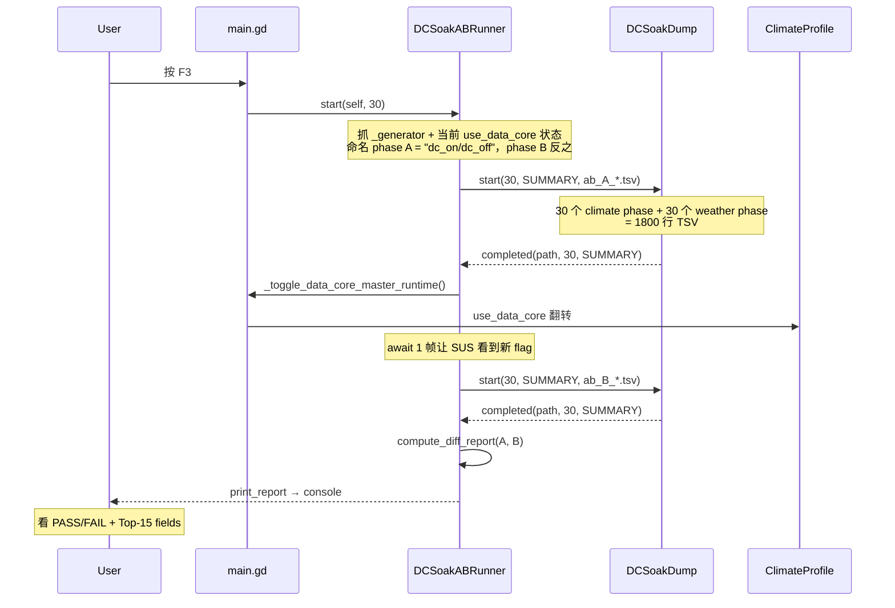

# DCSoakDump — N tick 全字段 Dump 工具使用说明

> dots-storage-同源紧急修复（2026-05-14）配套工具。
> 源码：[Project.Keynes/Project/project-keynes/scripts/tools/dots_soak_dump.gd](../Project/project-keynes/scripts/tools/dots_soak_dump.gd)

## 1. 目的

把 N 个 tick 内**所有 cell** × **38 个 schema 字段**（温度 / 湿度 / 雪盖 / 海冰 / 天气强度 / 云 / 降水 / 风 / 洋流 / 陈旧字段……）写到一份文件，让以下场景"开/关 DataCore"或"修复前后"的回归变成一行 `diff` 命令：

- **storage A/B 同源 bug 排查**（开启 `use_gdext_*` 与关闭跑同一 seed N tick → 应 bit-equal；不一致即说明 C++ pass 与 GDScript fallback 哪个 sub-pass 漂了）
- **修复前/后回归验证**（修 A 修 B 上线后回归"温度逐日累积异常""UI 极寒"两条 bug 是否复现）
- **Soak 时间序列可视化**（每 tick 38 字段 min/max/mean/std → Excel/Pandas 折线图，找出"哪个字段哪一天开始漂"）
- **Phase 4.3 Soak-test 夹具的 dump 子模块原型**（dots-phase4-followup.md 计划项的提前实现）

## 2. 启动方式

### 2.1 CLI 启动（推荐用于回归 / A-B 桶）

```bash
# SUMMARY mode，30 tick → user://soak/auto.tsv
godot --no-data-core --soak-dump=30
godot --data-core    --soak-dump=30

# FULL mode，30 tick → user://soak/auto.jsonl
godot --data-core --soak-dump=30:full

# 完全自定义路径（路径中含 ":" 也兼容）
godot --data-core --soak-dump=30:summary:user://soak/with_dc_run1.tsv
godot --data-core --soak-dump=10:full:user://soak/full_diag.jsonl
```

CLI arg 形式：

```text
--soak-dump=N                        → SUMMARY，自动路径 user://soak/auto_<timestamp>.tsv
--soak-dump=N:full                   → FULL，自动路径 user://soak/auto_<timestamp>.jsonl
--soak-dump=N:summary                → SUMMARY，自动路径
--soak-dump=N:summary:<path>         → SUMMARY，自定义路径（path 可含 :// 协议）
--soak-dump=N:full:<path>            → FULL，自定义路径
```

启动后日志会打：

```text
[DCSoakDump] started: n_ticks=30 mode=SUMMARY path=user://soak/auto_2026-05-14T11-55-23.tsv
```

到点自动停（不需手动 stop）：

```text
[DCSoakDump] completed: 30 ticks dumped → user://soak/auto_...tsv
```

### 2.2 F2 Hotkey（运行期一键启动单 phase dump）

> Plan 原文要求 F10，但 F10 已绑 `_toggle_data_core_master_runtime`；实际改用 **F2**（F1 inspector / F8 ocean / F12 weather / F2 soak 一列）。

启动游戏后随时按 **F2** → 30 tick SUMMARY，写到 `user://soak/manual_<timestamp>.tsv`。已在跑期间再按 F2 会被忽略（不打断当前会话）。

```text
[soak-dump] F2 started: 30 ticks → user://soak/manual_2026-05-14T11-55-23.tsv
```

### 2.3 F3 Hotkey（**推荐**·一键完整 A/B + 内置 diff 报告）

> 不会用 godot CLI / 不想跑两次进程 / 嫌写 pandas 麻烦 → 直接按 **F3**。
> 由 [DCSoakABRunner](../Project/project-keynes/scripts/tools/dots_soak_ab_runner.gd) 实现。

按 **F3** 一次，自动跑完整 A/B 对比并打印 console 报告。流程：



**总耗时**：60 sim-ticks × 当前游戏速度
- x1 档 ≈ 60s
- x5 档 ≈ 12s
- **x20 档 ≈ 3s**（推荐 A/B 时切到 x20）

**console 报告样例**：

```text
[soak-ab] ────── A/B run start ──────
[soak-ab]   n_ticks=30  phaseA=dc_on  phaseB=dc_off
[soak-ab]   path A: user://soak/ab_A_2026-05-14T12-30-15.tsv
[soak-ab]   path B: user://soak/ab_B_2026-05-14T12-30-15.tsv
[soak-ab] phase A 启动（当前状态 dc_on 跑 30 tick）...
[DCSoakDump] started: n_ticks=30 mode=SUMMARY path=user://soak/ab_A_...tsv
... (30 ticks 自然过去 ≈ 3s @ x20) ...
[DCSoakDump] completed: 30 ticks dumped → user://soak/ab_A_...tsv
[soak-ab] phase A 完成（实际 30 ticks）→ user://soak/ab_A_...tsv
[soak-ab] toggle DataCore master → 进入 phase B 状态 dc_off
[DataCore] F10 toggle: use_data_core=false use_data_core_weather=false
[soak-ab] phase B 启动（切换后状态 dc_off 跑 30 tick）...
... (30 ticks ≈ 3s) ...
[soak-ab] phase B 完成（实际 30 ticks）→ user://soak/ab_B_...tsv
[soak-ab] computing diff...

══════════════════ DCSoakABRunner Report ══════════════════
  A: [dc_on] user://soak/ab_A_2026-05-14T12-30-15.tsv
  B: [dc_off] user://soak/ab_B_2026-05-14T12-30-15.tsv
  paired entries: 1740   unpaired A:60  B:60
  max mean_diff (across all paired ticks/fields): 0.000034
  worst field: cell.temp
  threshold: 0.000100
  verdict: PASS ✓ (storage A/B 同源)
  ─── Top-15 fields by max mean_diff ───
        cell.temp                                 0.000034
        cell.moisture                             0.000019
        cell.snow_cover                           0.000012
        cell.weather_intensity                    0.000007
        cell.weather_cloud                        0.000004
        ...
═══════════════════════════════════════════════════════════

[soak-ab] ────── A/B run done in 6.42s ──────
```

**FAIL 场景**：

```text
══════════════════ DCSoakABRunner Report ══════════════════
  ...
  max mean_diff: 0.082451
  worst field: cell.temp
  verdict: FAIL ✗ (存在 storage 漂移)
  ─── Top-15 fields by max mean_diff ───
    *** cell.temp                                 0.082451
    *** cell.moisture                             0.041100
    *** cell.snow_cover                           0.028740
    *** cell.sea_ice_frac                         0.012003
        cell.weather_intensity                    0.000023
        ...
═══════════════════════════════════════════════════════════
```

`***` 标记的字段差异超过阈值（默认 1e-4），按差异从大到小排列。最大差异字段就是诊断起点——查 [`docs/dots-f4-validation.md` §2.2.b storage A/B 同源契约](dots-f4-validation.md#22b-storage-ab-同源契约critical-dots-pass-写者-读者纪律) 4 条规则定位是哪个 sub-pass 漂了。

> **重要语义**：F3 不重 generate world——phase A/B 在同一进程内顺序跑，phase B 起点的 SoA 状态是 phase A 跑完 30 天的累积状态。这是务实折中（避免完整重 generate 的 SUS bootstrap 开销）。在两 phase 内部各自跑 30 天达到统计稳态后，diff mean 仍然能反映 storage 同源是否对齐。如果你需要"绝对从 day=0 开始的对比"，仍可走 [§2.1 CLI 启动](#21-cli-启动推荐用于回归--a-b-桶) 跑两次独立进程。

### 2.4 仅做 diff（已有两份 dump 文件）

DCSoakABRunner 暴露了静态 API，直接调即可（在 console / 调试脚本里用）：

```gdscript
var report: Dictionary = DCSoakABRunner.compute_diff_report(
    "user://soak/ab_A_xxx.tsv",
    "user://soak/ab_B_xxx.tsv",
    "dc_on", "dc_off",  # 可选 label
    1e-4                # 可选 threshold
)
DCSoakABRunner.print_report(report, "user://soak/ab_A_xxx.tsv", "user://soak/ab_B_xxx.tsv")
```

或自动找 `user://soak/` 下最近两份 .tsv：

```gdscript
var pair: Array = DCSoakABRunner.find_two_latest_tsv("user://soak/")
if pair.size() == 2:
    var rep = DCSoakABRunner.compute_diff_report(pair[0], pair[1])
    DCSoakABRunner.print_report(rep, pair[0], pair[1])
```

## 3. SUMMARY vs FULL 选型

| 维度 | SUMMARY (TSV) | FULL (JSONL) |
| ---- | ------------- | ------------ |
| 文件大小 / tick @ 2400 cells | ~5 KB | ~250 KB |
| 30 tick 总大小 | ~150 KB | ~7.5 MB |
| 适合排查的问题 | 字段统计漂移 / 时间序列趋势 | 单 cell × 字段精确 diff |
| 后处理工具 | Excel / Pandas / awk | jq / pandas / Python |
| diff 命令 | `diff a.tsv b.tsv` | `diff <(jq -S . a.jsonl) <(jq -S . b.jsonl)` |
| 推荐用法 | 默认（90% 排查需求） | SUMMARY 已显示漂移，下钻找根因 cell |

**经验法则**：先 SUMMARY 跑两份，diff 看哪个字段哪一天 mean 偏了；若需要定位"是哪个 cell 触发的"再换 FULL 跑同样 30 tick。

## 4. 输出格式

### 4.1 SUMMARY (TSV)

```text
# DCSoakDump v1 | 2026-05-14T11:55:23 | mode=SUMMARY | seed=986892373 | n_cells=2400
tick	day	phase	phase_kind	field	min	max	mean	std
1	1	0.0000	climate	cell.temp	0.000000	0.941400	0.404900	0.183200
1	1	0.0000	climate	cell.moisture	0.123400	0.987600	0.532100	0.102400
1	1	0.0000	climate	cell.snow_cover	0.000000	1.000000	0.102300	0.281400
... (37 字段 / climate phase)
1	1	0.0000	weather	cell.weather_intensity	0.000000	0.456000	0.123400	0.087600
... (37 字段 / weather phase)
2	2	0.3670	climate	cell.temp	0.000000	0.955000	0.413000	0.172100
...
```

每 tick 36 climate-phase 行 + 36 weather-phase 行（demo 字段过滤掉）。`phase_kind` 列让你按 phase 分桶 diff（例如对比"climate 写完温度 vs weather 写完温度"）。

### 4.2 FULL (JSONL)

```jsonl
{"tick":1,"day":1,"phase":0.0,"phase_kind":"climate","cells":[{"idx":0,"cell.temp":0.43,"cell.moisture":0.55,...},{"idx":1,...}]}
{"tick":1,"day":1,"phase":0.0,"phase_kind":"weather","fronts_count":12,"cells":[{"idx":0,"cell.weather_intensity":0.12,...}]}
{"tick":2,"day":2,"phase":0.367,"phase_kind":"climate","cells":[...]}
```

每行一条完整 phase 记录，self-describing（无需 header）。`extra` 字典字段（如 `fronts_count`）顶层展开，方便 jq 查询。

## 5. 后处理 Recipe

### 5.1 用 awk diff SUMMARY 中 mean 列差异（>1e-4 视作可疑）

```bash
diff <(awk -F'\t' 'NR>2{print $1,$4,$5,$8}' a.tsv | sort) \
     <(awk -F'\t' 'NR>2{print $1,$4,$5,$8}' b.tsv | sort) \
  | head -40
```

### 5.2 用 Python pandas 找出"第 N 天开始漂"的字段

```python
import pandas as pd
a = pd.read_csv('a.tsv', sep='\t', skiprows=1)
b = pd.read_csv('b.tsv', sep='\t', skiprows=1)
m = a.merge(b, on=['tick','day','phase_kind','field'], suffixes=('_a','_b'))
m['mean_diff'] = (m['mean_a'] - m['mean_b']).abs()
print(m[m['mean_diff'] > 1e-4].sort_values(['tick','field']).head(40))
```

### 5.3 用 jq 在 FULL 中找 "tick=5 cell=42 cell.temp 在 a/b 之间的差"

```bash
jq -r 'select(.tick==5 and .phase_kind=="climate") | .cells[42]' a.jsonl
jq -r 'select(.tick==5 and .phase_kind=="climate") | .cells[42]' b.jsonl
```

## 6. 修复 A/B 验收建议

`dots-storage-同源紧急修复` 修 A（DCViewAdapter.World 不缓存）+ 修 B（C++ pass 入口 refresh_slots_from_map）上线后做的回归：

### 6.1 推荐路径：游戏内一键 F3

1. 启动游戏（不传任何 CLI 参数）
2. 等地图生成完，确认 `[DataCore] flags after CLI: use_data_core=true ...`
3. **切到 x20 速度档**（A/B 跑 60 tick，x20 ≈ 3s 完成；其他档会更慢）
4. 按 **F3** 一键启动 A/B
5. 等 console 打 `══════ DCSoakABRunner Report ══════` 看 `verdict: PASS ✓` 或 `FAIL ✗`

**通过条件**：报告 `verdict: PASS ✓`（最大字段 mean_diff ≤ 1e-4）。
**不通过**：进入 [dots-f4-validation.md §2.2.b 同源契约](dots-f4-validation.md#22b-storage-ab-同源契约critical-dots-pass-写者-读者纪律) 排查报告里 `***` 标记的字段。

### 6.2 备选路径：CLI 两次进程（适合 CI / 严格 day=0 对比）

如果你有命令行环境且想要"绝对从 day=0 开始的对比"（F3 是从游戏当前 tick 顺序对比，phase A/B 不共享 day=0 起点）：

```bash
# 关 DataCore 跑 baseline
godot --no-data-core --soak-dump=30:summary:user://soak/baseline.tsv

# 开 DataCore + 全部 use_gdext_* flag
godot --data-core --soak-dump=30:summary:user://soak/with_gdext.tsv
```

然后用 GDScript 在游戏内直接 diff 两份文件（不需要 pandas / Python）：

```gdscript
# 任意 GDScript 上下文（debug console / tools 脚本）
var report: Dictionary = DCSoakABRunner.compute_diff_report(
    "user://soak/baseline.tsv",
    "user://soak/with_gdext.tsv",
    "no_dc", "with_gdext"
)
DCSoakABRunner.print_report(report, "user://soak/baseline.tsv", "user://soak/with_gdext.tsv")
```

或者继续用 pandas 走纯外部分析：

```python
import pandas as pd
a = pd.read_csv('user_data/soak/baseline.tsv', sep='\t', skiprows=1)
b = pd.read_csv('user_data/soak/with_gdext.tsv', sep='\t', skiprows=1)
m = a.merge(b, on=['tick','day','phase_kind','field'], suffixes=('_a','_b'))
m['mean_diff'] = (m['mean_a'] - m['mean_b']).abs()
print('Max mean_diff per field:')
print(m.groupby('field')['mean_diff'].max().sort_values(ascending=False).head(15))
```

## 7. 实现细节

- **schema 自动遍历**：源码读 `DCComponentSchema.entries_production()`，新加的 schema 字段自动出现在 dump 里（不需要改 dump 工具代码）。Demo 字段 (`demo: true`) 自动跳过。
- **数据源**：直接读 `MapData.<map_field>[idx]`（不绕 DCWorld view），与 SoA 真值源同步——任何 GDScript 直写或 C++ flush 都会立刻反映。
- **flush 频率**：每 tick `_file.flush()` 一次，crash 不丢前 N-1 tick。
- **N tick 计数**：仅 `phase_kind == "climate"` 视为一 tick 完成（递减剩余）。weather phase 是同一 tick 的子段，附加写入但不计数。
- **越界保护**：`map_field` 缺失 / dtype 不匹配 → 该字段当前 tick 跳过（不写 line），不报错。
- **性能**：SUMMARY mode 每 tick ~0.6ms (2400 cells × 36 fields × 单 for-loop)；FULL mode 每 tick ~12ms（生成 2400 个 dict + JSON.stringify）。SUMMARY 几乎不影响游戏帧率；FULL 30 tick 下游戏会有"轻微一卡一卡"感觉但能接受。

## 8. 与 Phase 4.3 Soak-test 的关系

`dots-phase4-followup.md` 的 4.3 Soak-test 夹具计划：

> 长跑 1000-day fixture，每 30 tick dump SoA 一次，跑后用 numpy 验证：
> 1. mean / std 漂移在合理范围
> 2. 与 baseline run 字段级 bit-equal
> 3. 极端字段（如 temp）无 NaN / Inf

DCSoakDump 已经实现了 dump 子模块（schema 自动遍历 + summary/full 双格式 + flush 防 crash 丢数据）。Phase 4.3 上线时只需：
- 包一层 fixture runner（30 tick 触发一次 dump，跑 1000-day 共 ~33 次 dump，文件 ~150 KB × 33 ≈ 5 MB）
- 加 baseline 比对脚本（已在 §5 列出 pandas 模板）
- 把 DCSoakDump.start_from_arg 改造支持 "stride" 参数（每 N tick dump 一次）

后续扩展工单见 dots-phase4-followup.md PR-4.3.x。

## 9. 已知限制 / 后续

- 不支持 Vec2/Vec3 schema 字段的"组合 norm" 输出（当前 lat_norm 等已是标量；若未来加 cell.position: Vec2 → 需要 two-axis split），只 dump 各分量
- weather front / weather grid 等"非 cell-level component"暂未 dump（plan §4.3 阶段会扩到 front + atlas 全字段）
- FULL mode JSONL 文件超 100 MB 会让 jq 处理变慢，30 tick 内问题不大；上 1000-day soak 时建议加 stride 参数（每 30 tick 一次 dump 而非 1 tick 一次）
