> **DEPRECATED 2026-05-14**：本文档已被
> [`dots-master-execution-handbook.md`](./dots-master-execution-handbook.md) 替代。
> 主权威文档现为 master 手册（28 周完整方案，含 Phase 2 + ocean wind + Phase 4 + Phase 3 + Phase IV 预案）。
> 本文档保留以便 git history 追溯，**不再维护**，新增工作不要回写到本文件。

# DOTS 阶段 II / III 落地实施 Plan（2026-Q3，~10 周）

> 创建：2026-05-14（DOTS storage 同源紧急修复 PR 之后）
> 关联：[`dots-migration-roadmap.md`](./dots-migration-roadmap.md) §4.4 / §4.5、
> [`dots-stage-ii-data-ownership-plan.md`](./dots-stage-ii-data-ownership-plan.md)、
> [`dots-phase2-followup.md`](./dots-phase2-followup.md)、
> [`dots-phase3-followup.md`](./dots-phase3-followup.md)、
> [`dots-phase4-followup.md`](./dots-phase4-followup.md)
>
> 本文档定位：把现有 follow-up 设计文档**串联成 10 周可执行 timeline**。
> 不重复设计细节（去 follow-up 文档读），只回答三个问题：
>   1. 顺序怎么排？（why this order）
>   2. 每周做什么？（mile­stones）
>   3. 中途出状况怎么办？（risk register + abort criteria）

---

## 0. 现状盘点（诚实交代）

26 周路线图（[`完全dots化路线规划`](file:///C:/Users/hkinghuang/.cursor/plans/完全dots化路线规划_6669955a.plan.md)）所有 todo 标了
`completed`，但实际进度如下：

| Phase | Plan 标注 | 实际进度 | 差距 |
|---|---|---|---|
| Phase 1 C++ hot loops（F.1-F.6）| ✅ | ✅ **真完成** | — |
| Phase 1.4 DCSystemScheduler 接入 main | ✅ | ✅ **真完成** | — |
| Phase 1.5 wrapper inline 化 | ✅ | ✅ **真完成** | — |
| **Phase 2.1 写路径下移** | ✅ | ⚠ skeleton + follow-up 文档 | **未实施** |
| **Phase 2.2 删除 flush_soa_to_cells** | ✅ | ⚠ 设计文档 | **未实施** |
| **Phase 2.3 HexCell facade** | ✅ | ⚠ 设计文档 | **未实施** |
| **Phase 3.1-3.4 巨石拆分** | ✅ | ⚠ skeleton + follow-up 文档 | **未实施**，map_generator 4639 / weather_system 2142 / map_baker 2583 / main 2114 行原样 |
| **Phase 4.1 DCWorld.serialize/deserialize** | ✅ | ⚠ 设计文档 | **未实施** |
| Phase 4.2 schema migration 钩子 | ✅ | ⚠ 设计文档 | **未实施** |
| Phase 4.3 soak-test 夹具 | ✅ | ⏳ **DCSoakDump 已交付**（2026-05-14 紧急修复时插入），剩夹具化 | 部分实施 |
| Phase 4.4 FeatureFlag hot-reload | ✅ | ⚠ 设计文档 | **未实施** |
| **DOTS storage 同源紧急修复**（不在原 plan）| — | ✅ **已完成** | — |
| **DCSoakDump + DCSoakABRunner**（不在原 plan）| — | ✅ **已完成** | — |

**结论**：阶段 II + 阶段 III 的实质实施工作都还没真正做。本 plan 把它们串成 10 周 timeline。

---

## 1. 优先级与排序逻辑

### 1.1 排序

```
W01-W06  Phase 2 数据所有权下移（阶段 II 全部）
W07-W08  Phase 4.1+4.2 序列化 + migration 钩子
W09      Phase 4.3+4.4 soak 夹具 + FeatureFlag hot-reload
W10      整体验收 + 文档收尾
```

**Phase 3 巨石拆分不在本 plan 内**——理由见 §1.3。

### 1.2 为什么 Phase 2 优先

| 痛点 | 修复路径 | 不做 Phase 2 的代价 |
|---|---|---|
| 2026-05-14 这次的"0.4 极寒"漂移 | DCViewAdapter 不缓存 + 5 处 refresh_slots_from_map | **每次新增 hot pass 都要再担心一次**——CoW 漏写 / slot 失同步是 Phase 2 没做留下的常驻雷 |
| 标量字段 SAME_SOURCE A/B 仍有 0.01-0.03 残差 | hot pass 写路径全部下移到 `world.write_f32` 单一 SoA | 残差永远收敛不到 < 1e-3，storage 同源契约口头存在但没硬保证 |
| `flush_soa_to_cells` 每天 O(N) 同步税 | 删除该 API + map_data 退化 IO 容器 | 加任何新 component 都要付一次同步开销 |
| `cell.<field> = X` 还能编译 | HexCell facade 化 | 任何新写一个 `cell.temp = X` 的 PR 立刻又制造 CoW 风险 |

**Phase 2 是这次紧急修复的"根治版"**——本周做的 5 处 `refresh_slots_from_map` 是症状治疗，
Phase 2 才是病因治疗。

### 1.3 为什么 Phase 3 推后

巨石拆分（map_generator 4639 / map_baker 2583 / weather_system 2142 / main 2114 行）总工作量：

- 估算 100+ PR，跨越 10000+ 行业务代码
- bit-equal 验收每个 PR 都要跑 30-day soak（已经有 DCSoakDump 加持）
- 需要团队评审带宽（不是一个人能消化的量）

如果 Phase 3 在 Phase 2 之前做，会出现：
1. 拆完之后 hot pass 的写路径仍是 `cell.field=`，Phase 2 还得在拆出的新文件里再改一遍
2. Phase 2 改的写路径模板要套到一个 4639 行的文件里——审查难度大
3. 中途的紧急修复（像本周这种）改的是哪个版本要扯皮

**正确顺序**：
```
Phase 2 写路径下移（在原巨石文件里改）
  ↓
Phase 4 序列化（紧凑 schema 已就位，serialize 是 schema 自动遍历，与文件位置无关）
  ↓
（独立工作流）Phase 3 巨石拆分（拆分时所有写路径已是 world.write_*，机械搬迁）
```

Phase 3 的细化 plan 留到本 10 周完成、QA 稳定之后单独立项（届时人手 / 时间盒按
[`dots-phase3-followup.md`](./dots-phase3-followup.md) 已有的设计开整）。

### 1.4 ocean_currents wind C++ 化（可选插队）

不在 Phase 2/3/4 范围内。本周用户反馈 35ms spike，根因是 `solve_wind_field`
（`physical_circulation_solver.gd`）纯 GDScript。Phase 2/3 完成前**不建议**插队，
理由：

- 不触发 fast tick warning（不破玩家体验，是周期性预计算）
- Phase 2 完成后写路径标准化，再 C++ 化更稳（templates 复用）
- 临时减负：`earth_like.tres` 把 `terrain_aware_wind = false` 直接降到 ~5ms

如果用户决定立刻处理，单独走 1-2 周窗口，按 `performance-charter §12.4` 7 步操作清单。

---

## 2. 10 周 timeline

```mermaid
gantt
    title DOTS 阶段 II/III 落地实施（W = Week）
    dateFormat  X
    axisFormat  W%w

    section Phase2_DataOwnership
    PR-2.1.5 transpiration（模板 PR）  :p21t, 0, 1w
    PR-2.1.1 climate Pass-A             :p21a, after p21t, 1w
    PR-2.1.2 climate Pass-B             :p21b, after p21a, 0.5w
    PR-2.1.3 ocean water+land           :p21c, after p21b, 0.5w
    PR-2.1.4 sea_ice                    :p21d, after p21c, 0.5w
    PR-2.1.6 weather field              :p21e, after p21d, 1w
    PR-2.2 删除 flush_soa_to_cells       :p22, after p21e, 1w
    PR-2.3 HexCell facade               :p23, after p22, 1w

    section Phase4_StageIII
    PR-4.1 DCWorld.serialize/deserialize :p41, after p23, 1w
    PR-4.2 schema migration 钩子         :p42, after p41, 0.5w
    PR-4.3 soak 夹具化                  :p43, after p42, 0.5w
    PR-4.4 FeatureFlag hot-reload       :p44, after p43, 1w

    section Wrap
    Final acceptance + docs              :w, after p44, 1w
```



---

## 3. 周分解

### W01 — Phase 2.1 模板 PR：transpiration（最简）

**为什么先做 transpiration**：写路径仅 ~2 处，是最低风险的"模板 PR"。
做完后其余 5 个 hot pass 套同一模板。

**任务**：
- [ ] 在 `transpiration_pass.gd` 把 `cell.moisture = X` / `map.moisture_arr[i] = X` 改成 `_world.write_f32_indexed(_cid_moisture, dirty_idx, new_vals)`
- [ ] `_cid_moisture = world.component_id(&"cell.moisture")` 在 setup 一次性 cache
- [ ] **保留双写**：`cell.moisture = X` 仍写一份（HexCell facade 化之前 UI 要读）
- [ ] 跑 30-day SoakAB（F3 / Shift+F3）验收 SAME_SOURCE PASS + VS_LEGACY 内 mean_diff ≤ 0.05

**验收**：
- DCSoakABRunner SAME_SOURCE PASS（scalar threshold 0.05 / long-term 0.01）
- ripgrep `cell\.moisture\s*=` 在 transpiration_pass.gd 应**新增 0 处**（只保留旧的双写位置）

**风险**：低。transpiration 写点最少。

---

### W02 — PR-2.1.1 climate Pass-A（25 写点）

**任务**：参考 W01 模板，改 `pass_a.gd` 的 6 个字段（temp / temp_baseline / temp_30d / temp_365d / temp_anomaly / temp_season_offset）

**风险**：中。25 处 write，且 temp_30d / temp_365d 是长期均值，bit-equal 容差严格。

**验收**：
- DCSoakABRunner SAME_SOURCE PASS
- 长期均值字段 mean_diff ≤ 0.005（比通用 0.01 更严，因为是长期累积）

---

### W03 上半 — PR-2.1.2 climate Pass-B（12 写点）

**任务**：改 `pass_b.gd` 的 cell.temp / cell.moisture 写路径。

**风险**：中。Pass-B 是局部气候耦合，依赖 Pass-A 的 temp 输出，写路径下移要保证读 SoA 而非 cell.temp。

---

### W03 下半 — PR-2.1.3 ocean water + land（8 写点）

**任务**：改 `water_pass.gd` + `land_pass.gd`，cell.temp / temperature_transport_anomaly。

**风险**：低。已经 C++ 化（F.2a / F.2b），GDScript fallback 路径写点少。

---

### W04 上半 — PR-2.1.4 sea_ice daily（3 写点）

**任务**：改 `daily_pass.gd` 的 cell.sea_ice_fraction 写路径。

**风险**：低。terrain 翻转走 apply_terrain（ECB），不在本 PR；只有 fraction 标量。

---

### W04 下半 — W05 — PR-2.1.6 weather field（30 写点）

**任务**：改 `weather_system.gd` 的 7 个 weather_* 字段写路径。

**风险**：高。weather_system.gd 2142 行，30 处 write 散落各处；需仔细排查
field_solver / front_advect / spawn / decay 各段。

**验收**：
- DCSoakABRunner SAME_SOURCE PASS（weather 字段在白名单不计 verdict，但要肉眼检查 stats 不暴涨）
- VS_LEGACY 模式 weather_type mean_diff 应**降低**（CoW 不再漏写）

**Buffer**：留 W05 全周给这个 PR，因为它可能要拆 2 个子 PR。

---

### W06 — PR-2.2 删除 flush_soa_to_cells

**前置**：PR-2.1.1-2.1.6 全部合入 + 稳一周 SUS 日志正常。

**任务**：
- 删除 `map_data.gd::flush_soa_to_cells` (~30 行)
- 删除 `refresh_climate_daily_job._finalize_round` 末尾的 flush 调用
- 删除 `rebuild_soa_from_cells` 调用方（generate 末尾）
- ripgrep `flush_soa_to_cells|rebuild_soa_from_cells` = 0

**验收**：
- DCSoakABRunner SAME_SOURCE PASS
- SUS `refresh_climate_daily` avg 应**下降 1-3ms**（每天省一次 O(N=2400) flush）

---

### W07 — PR-2.3 HexCell facade 化

**任务**：参考 [`dots-phase2-followup.md` §Phase 2.3](./dots-phase2-followup.md)：
- `HexCell` 30 个强类型字段改成 `get_temperature() -> float: return _world.read_f32(_cid_temp, _index)`
- 保留 `_world` / `_index` 注入
- ripgrep `cell\.\w+\s*=` 在所有 .gd 文件（除 generate / IO 段）= 0

**风险**：中-高。30 字段大量调用点要改。但 ViewAdapter 已经在用，UI / overlay 改动应当少。

**验收**：
- DCSoakABRunner SAME_SOURCE PASS
- 所有 `cell.field = X` 写法只在以下场景允许：generate 阶段（map_baker 之前）/ 序列化反序列化路径

---

### W08 — PR-4.1 DCWorld.serialize / deserialize

**任务**：[`dots-phase4-followup.md` §4.1](./dots-phase4-followup.md)
- `DCWorld.serialize() -> Dictionary`：按 `CELL_SCHEMA` 自动遍历 38 字段
- `DCWorld.deserialize(d)` round-trip
- 版本号字段（schema_version: int = 1）
- demo 字段命名空间过滤（`cell.demo.*` skip）

**验收**：
- 跑 1000-day soak → save → load → 再跑 100-day → 与原 1100-day soak bit-equal

---

### W09 上半 — PR-4.2 schema migration 钩子

**任务**：[`dots-phase4-followup.md` §4.2](./dots-phase4-followup.md)
- `tools/schema_migrations/` 目录
- add / rename / delete 三种迁移类型
- 单测：旧版本存档 → 新版本读取自动迁移

---

### W09 下半 — PR-4.3 soak 夹具化

**任务**：DCSoakDump 已经存在，本 PR 把它包装成"标准 fixture"：
- `tools/migration_harness/template_soak_test.gd`
- 接口：random map / 1000-day soak / save-load round-trip / DOTS-A vs DOTS-B 对照
- 接入 CI（如果项目有）

---

### W10 — PR-4.4 FeatureFlag hot-reload + 验收

**任务**：
- `feature_flags.gd::toggle()` 加 hot-reload hook
- `world.unbind_map_data` / `rebind_map_data` 路径
- 编辑器改 flag → 自动重 bind World，无需重启
- 文档：`dots-framework-status.md` 标记"完全 DOTS 化达成"

---

## 4. 风险登记 + 中断处理

| 风险 | 触发 | 应对 |
|---|---|---|
| W02 Pass-A 长期均值 bit-equal 不通过 | mean_diff > 0.01 | 暂停后续 PR，回 plan 检查 temp_30d/365d 写时机 |
| W04 weather PR 拆分爆炸 | 单 PR 超 800 行 diff | 拆成 2 个子 PR：field_solver / front_lifecycle |
| W06 删 flush 后某 baker 读不到数据 | overlay 显示 0 / NaN | 临时回滚 PR-2.2，先确认所有 baker 走 ViewAdapter，再重做 |
| W07 HexCell facade 性能下降 | SUS 日志 avg 上涨 > 5% | facade 内 cache `_index` 减少 dict lookup；或退回"selective facade"——仅热字段 facade，冷字段保留 |
| W08 serialize 跑 1000-day OOM | 序列化产物 > 100MB | 分块序列化，每 100 day 一个 chunk |

### 中断处理

如果中途出现紧急 bug（像本周的 0.4 极寒）：

1. **立即开 hotfix 分支**，不要在 plan PR 上修
2. hotfix 必须用 DCSoakABRunner SAME_SOURCE PASS 验证
3. hotfix 合入主线后，**rebase 当前 plan PR**，重跑 SAME_SOURCE 看是否还过
4. 把本次 hotfix 添加到 [`dots-framework-status.md`](./dots-framework-status.md) 的 incident log

---

## 5. 验收红线（Definition of Done）

完成本 plan 全部 10 周后，必须满足：

| 项 | 验收方法 | 红线 |
|---|---|---|
| **storage 同源** | F3 SAME_SOURCE A/B | scalar < 0.01（比当前 0.05 严 5 倍）/ long-term < 0.005 |
| **flush 删除** | ripgrep | `flush_soa_to_cells` 在 .gd 文件中 = 0 |
| **HexCell 写位** | ripgrep | `cell\.\w+\s*=` 在 hot-loop 文件 = 0；只允许 generate / serialize 路径 |
| **存档 round-trip** | 单测 | 1000-day soak → save → load → 100-day → bit-equal |
| **FeatureFlag hot-reload** | 编辑器手动 | 改 flag 后无需重启，数值正确 |
| **性能** | SUS 30-tick 日志 | 各 system avg / p95 / slices 与 plan 启动时 ±5% 内 |
| **文档** | docs/ 目录 | dots-framework-status.md 标记"阶段 II + III 完成" |

---

## 6. 不在本 plan 范围内但可能要做的事

下面这些**不属于本 10 周 plan**，但用户/团队可能并行启动：

| 项 | 工作量 | 触发条件 |
|---|---|---|
| Phase 3 巨石拆分（map_generator / map_baker / weather_system / main）| 6-10 周 | 本 plan W10 完成稳一周 |
| ocean_currents wind C++ 化 | 1-2 周 | 用户决定立即处理 35ms spike |
| Phase IV.1 D-async 接入 production | 1-2 周 | 单 pass > 5ms（charter §3.1.1）|
| Phase IV.2 chunk_remap | 2-3 周 | 出现 4ms/帧瓶颈（charter §3.2）|
| Phase IV.3 SIMD | 4-6 周 | charter §3.1 6 条全满足 |

如果 Phase 3 与本 plan 并行启动，注意：
- Phase 3 拆分时碰到的写路径若与本 plan 当前 PR 冲突 → **本 plan 优先**，Phase 3 等本 plan 当前 PR 合入再 rebase
- Phase 3 不能修改 hot pass 算法，仅做"按职责搬迁文件位置"

---

## 7. 启动信号

本 plan 启动条件：

- [ ] 用户确认 plan 内容并锁定优先级
- [ ] 当前所有 use_gdext_*=true 默认开 + DCSoakABRunner SAME_SOURCE PASS 至少跑稳 3 天
- [ ] W01 transpiration PR 的 owner 确定（个人 / AI 协作模式）

启动后：把每个 PR 加进 [`dots-framework-status.md`](./dots-framework-status.md) "in-flight" 表，
完成移到"shipped"表，每周 W{N} 末写一段周报附在文档里。
