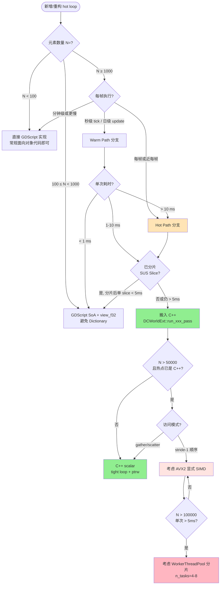

# Performance Charter — ProjectKeynes Hot-Loop 开发宪章

> **本文档是 ProjectKeynes 所有"大数据 / 大计算"系统的性能开发指导手册。**
> 凡是涉及 ≥ 1k 元素的循环（cells、weather fronts、生物个体、单位、AI agents、
> 经济市场单元、文明子系统等），新增或修改前**必须**先读完本文档第 0、1、2、5 节。
>
> **性质**：硬性宪章。违反本文档"反模式"（§4）的代码不得合入主干。
>
> **位置**：`docs/performance-charter.md`（项目级长期文档，与具体 plan 解耦）。
>
> **配套**：
> - 当前活跃的 GDExtension roadmap 架构 → [`../.codebuddy/plan/dots-roadmap-to-gdextension/architecture.md`](../.codebuddy/plan/dots-roadmap-to-gdextension/architecture.md)
> - 阶段性需求 → [`../.codebuddy/plan/dots-roadmap-to-gdextension/requirements.md`](../.codebuddy/plan/dots-roadmap-to-gdextension/requirements.md)
> - 当前任务清单 → [`../.codebuddy/plan/dots-roadmap-to-gdextension/task-item.md`](../.codebuddy/plan/dots-roadmap-to-gdextension/task-item.md)
> - 历史性能基线 → [`../.codebuddy/plan/dots-roadmap-to-gdextension/performance-baseline.md`](../.codebuddy/plan/dots-roadmap-to-gdextension/performance-baseline.md)
> - **C++/GDScript 通信参考实现（Mode-B 模板）→ [§12](#12-cgdscript-通信参考实现reference-implementation)** — 面对一个新 hot-loop 请从这里拷模板
> - **参考脚本代码** → [`../Project/project-keynes/tmp/bench_temp_drift.gd`](../Project/project-keynes/tmp/bench_temp_drift.gd)，对应 C++ 侧 [`run_temp_drift_pass`](../gdext/src/world_ext.cpp) / [`snapshot_f32`](../gdext/src/world_ext.cpp)
> - **复杂度上限实测（迭代扩散 + Sobel + 科氏 + 阻尼）→ [§12.6.6](#1266-内核升级到迭代扩散后的性能预算实测2026-05-12-修订)** — 真实 pass 设计预算锚

---

## 0. TL;DR — 四条铁律

如果你只读四条，就读这四条。

### 🔴 铁律 1：跨语言调用次数 = 性能上限

GDScript ↔ C++ 单次调用约 **100-300 ns**（含 marshal）。

| 调用模式 | 600k cells 单次 tick 开销 | 评价 |
|---|---|---|
| 每 cell 1 次跨界 | 60-180 ms | ❌ 灾难 |
| 每 100 cell 1 次跨界（批量 API） | 0.6-1.8 ms | ⚠️ 可用 |
| 整段 pass 1 次跨界（C++ 内部循环） | 0.0001 ms | ✅ **目标** |

**实测证据**（micro-bench 2026-05-11，N=2400 cells × 100 iters）：

| 策略 | Case 1 总时长 | 加速比 | 跨界次数 |
|---|---|---|---|
| Dict baseline (M0) | 38.40 ms | 1× | 0（纯 GDScript）|
| DOTS Indexed write_f32_indexed (M1) | 30.57 ms | 1.26× | 100 次（每 iter 1 次写回） |
| **C++ 整段接管 (M2 scalar)** | **0.30 ms** | **129×** | **100 次（每 iter 1 次入口）** |

> **关键洞察**：M1 跨界次数和 M2 一样，但 **M1 的 GDScript 端还在循环里读 `prev[nb[base_i + 0]] + ...`**——这部分计算才是瓶颈，不是跨界本身。**只搬一半（write API）几乎没用，要搬就把整段 hot loop 搬过去**。

### 🔴 铁律 2：SIMD / 多线程是**带触发条件的优化**，不是默认手段

实测同一工况下（climate Pass-A，N=2400）：

| 方法 | Case 1 (full) | Case 3 (sparse) | 相对 scalar |
|---|---|---|---|
| C++ scalar | **0.30 ms** | **0.16 ms** | 1× |
| C++ AVX2 SIMD | 0.44 ms | 0.16 ms | 0.68× ~ 1.0× |
| C++ SIMD + 4-thread | 4.22 ms | 3.89 ms | 0.07× ~ 0.04× |

**正确的解读**：

1. **SIMD 的绝对值依然极快**——0.44 ms / 100 iters ≈ **4.4 μs / iter**，是 60 FPS 帧预算的 0.026%。从"够不够用"角度，SIMD 完全够用，跟 scalar 的差距（1.4 μs / iter）在实机里**用户根本感知不到**。
2. **本工况下 SIMD 没有正收益**，原因是结构性而非随机噪音：6 邻居访问 `prev[nb[i*6 + k]]` 是 **gather pattern**，AVX2 的 `_mm256_i32gather_ps` 在 cache-miss 主导时 latency ≈ 6-8 次 scalar load，且打断了编译器对 scalar 版本的 prefetch 链。**别的 stride-1 工况下 SIMD 仍会大幅领先**（见 §3.1.1 候选清单）。
3. **多线程在小 N 下开销主导**：`WorkerThreadPool::add_native_group_task` + `wait_for_group_task_completion` 固定开销 ≈ 1-3 ms，而本 SIMD 内核单次只要 0.004 ms。**调度开销吃光了 100% 的并行收益**——这不是线程化的错，是 N=2400 不够喂饱 4 个核。

**结论（精确版）**：
- C++ scalar tight loop + 编译器 `/O2` 自动向量化 = **当前 N 区间的性价比之王**
- SIMD 不是被排斥，是**被精确门控**——触发条件见 §3.1，候选 pass 见 §3.1.1
- 多线程同理，触发条件见 §3.2
- "现在不用 ≠ 永远不用"——N、访问模式、单 pass 耗时任一变化都可能让门槛被跨过

### 🔴 铁律 3：先量再优 — 没有 micro-bench 不动手

ProjectKeynes 任何"我觉得 XXX 会快一点"的改动，**必须**先写 ≤ 100 行 GDScript bench 跑出实测数据。

参考模板：[`../Project/project-keynes/tmp/bench_pass_a_methods.gd`](../Project/project-keynes/tmp/bench_pass_a_methods.gd)

判定门槛：
- **≥ 5×** 加速 → 强烈推荐做
- **2× ~ 5×** → 评估集成成本后再决定
- **< 2×** → 通常不值（除非是关键 fast path）
- **< 1×** → 立即停止，分析为何变慢

### 🔴 铁律 4：GDExtension 没有零拷贝共享内存

这不是优化选项，是 ABI 物理事实（完整推导见 §11.1）。

一句话表述：只要 C++ 端对某个 `PackedArray` 调一次 `ptrw()`，那块 buffer 就会 CoW detach 成为 C++ 私有副本——GDScript 端仍指向旧 buffer。举体表现：

| 你以为 | 实际 |
|---|---|
| `bind_map_data` 后 C++ 和 GDScript 共享 buffer | 仅首次如此，任何 ptrw() 后立刻分裂 |
| 在 GDScript 里改 `map.temp_arr[i] = v` C++ 能看见 | 不能，需走 `world.write_f32_indexed` |
| C++ 在 hot loop 里改了值，GDScript 能看见 | 不能，需 GDScript 侧主动 `snapshot_f32 + map.temp_arr = ...` flush |

**唯一可靠的通信契约** = §12 里的 4 个角色：**C++ writer / snapshot_f32 / GDScript reader / flush 同步点**。

· · ·

面对新 hot-loop 请直接从 [§12.3](#123-标杆-pass-完整代码可复制模板) 复制模板。

---

## 1. 性能决策树（开发新系统时的标准 SOP）



### 1.1 量级速查表

| N（元素数） | 默认实现 | 升级触发 |
|---|---|---|
| < 100 | GDScript OOP，`Array[Node]` 都行 | 永远不升级 |
| 100 - 1k | GDScript SoA + `PackedFloat32Array` | 单帧 > 2ms |
| 1k - 10k | GDScript SoA + view_f32（避 Dict）| 单 slice > 5ms |
| 10k - 100k | **C++ tight loop**（DCWorldExt） | 单 pass > 5ms |
| 100k - 1M | C++ + SIMD（如果 stride-1） | 单 pass > 10ms |
| > 1M | C++ + SIMD + WorkerThreadPool | 永远 |

ProjectKeynes 当前规模：cells **2400**（~ 中段）；未来大地图可能 50k-100k。
**意味着：当前所有热点的最佳归宿是 C++ scalar，不是 SIMD/线程化。**

### 1.2 触发"搬 C++"的硬指标

满足**任意一条**就启动 C++ 化：

1. SUS 日志中该 pass `avg ≥ 5 ms` 持续超过 30 ticks
2. 单帧总耗时 `> 16 ms` 且该 pass 占比 ≥ 30%
3. micro-bench 显示 GDScript 路径无论怎么优化都 ≥ baseline × 0.5
4. 用户感知的卡顿（fast tick 警告）首要责任落在该 pass

---

## 2. Code Pattern 手册（推荐写法）

### 2.1 GDScript 端：调用 C++ pass 的标准模板

```gdscript
# climate_pass_a.gd (GDScript wrapper)
func run_climate_pass_a(phase: float, season_phase: float) -> float:
    var t0 := Time.get_ticks_usec()

    # 1) 检查开关 + 类型守护（避免 C++/GDScript world 串台）
    if cp.use_gdext_climate and _world is DCWorldExt:
        # 2) 一次跨界，整段 pass 在 C++ 内部跑
        _world.run_climate_pass_a(_cp_struct, phase, season_phase)
    else:
        # 3) GDScript fallback（保留以便回归 / 单测）
        _climate_pass_a_soa_gdscript(phase, season_phase)

    return (Time.get_ticks_usec() - t0) / 1000.0
```

**关键约束**：
- ✅ 跨界调用**只在 pass 入口**发生一次
- ✅ 所有循环参数（`phase`, `season_phase`, `cp_struct`）一次性传入
- ❌ 禁止在 GDScript 循环里调用 `_world.xxx()` —— 600k 次跨界 = 数十 ms 灾难

### 2.2 C++ 端：tight-loop 标准模板

```cpp
// world_ext.cpp
void DCWorldExt::run_climate_pass_a(const Dictionary &cp_dict,
                                    double phase,
                                    double season_phase) {
    // ─── 1) 反序列化常量到 plain struct（循环外，一次性）──────────────
    ClimateProfileStruct cp;
    cp.from_dict(cp_dict);  // 25 个 float

    // ─── 2) 取 PackedArray + 裸指针（循环外）────────────────────────
    Slot &temp_s    = _slots.write[CELL_TEMP];
    Slot &moist_s   = _slots.write[CELL_MOISTURE];
    Slot &dirty_s   = _slots.write[CELL_CLIMATE_DIRTY];
    Slot &elev_s    = _slots.write[CELL_ELEVATION];
    // ... 继续取你需要的所有 component slot

    float         *temp     = temp_s.arr_f32.ptrw();
    float         *moist    = moist_s.arr_f32.ptrw();
    const uint8_t *dirty    = dirty_s.arr_u8.ptr();   // read-only
    const float   *elev     = elev_s.arr_f32.ptr();
    const int      n        = temp_s.arr_f32.size();

    // ─── 3) 紧密内层循环（无任何 Variant / Object::call）─────────────
    for (int i = 0; i < n; ++i) {
        if (!dirty[i]) continue;       // sparse path

        const float t0 = temp[i];
        const float lat_factor = ...;
        // 算法主体 —— 全部用 plain float / int / 裸指针
        temp[i]  = t0 + cp.k_lat * lat_factor + cp.season_amp * season_phase;
        moist[i] = ...;
    }
}
```

**关键约束**：
- ✅ 所有 PackedArray 引用先 `slots.write[id]` 拿可写引用，再 `ptrw()`
- ✅ 循环内只用 `int / float / 裸指针`，**不要**碰 `Variant / Dictionary / String / Object`
- ✅ `if (!dirty[i]) continue` 让 sparse path 收益保留
- ❌ 禁止循环内 `arr.size()` 反复调（每次都要查长度）—— 循环外存 `const int n`
- ❌ 禁止 `arr.resize()` / `arr.push_back()` —— 任何结构性变更走 ECB
- ❌ 禁止 `Object::call(...)` 或 `Object::get(...)` 在循环里出现

### 2.3 跨语言常量传递：plain struct 模式

GDScript 的 `Dictionary` 在循环里查表慢得离谱（每个键都要 hash + Variant 拆装箱）。
解决方案：把常量扁平化到 plain C struct，循环外一次性反序列化。

```cpp
// profiles/climate_profile_struct.h
struct ClimateProfileStruct {
    float k_lat;
    float k_neighbor;
    float base_temp_offset;
    float season_amp;
    // ... 25 个标量

    void from_dict(const godot::Dictionary &d) {
        k_lat            = (float) d.get("k_lat", 0.45);
        k_neighbor       = (float) d.get("k_neighbor", 0.10);
        base_temp_offset = (float) d.get("base_temp_offset", 12.0);
        season_amp       = (float) d.get("season_amp", 3.5);
        // ...
    }
};
```

**优势**：
- 每个 cell 读 `cp.k_lat` = **1 个 mov 指令**（vs Dictionary 查表 ~50 ns）
- 编译器能把常量寄存器化，进一步消除 load
- 与 SIMD broadcast (`_mm256_set1_ps(cp.k_lat)`) 兼容

### 2.4 SoA 布局 — 数据组织的默认形式

```cpp
// ❌ AoS（Array of Structs）—— 缓存不友好，无法 SIMD
struct Cell { float temp, moisture, snow; uint8_t is_water; };
Vector<Cell> cells;
for (int i = 0; i < n; ++i) cells[i].temp += 1.0f;  // 读取 stride=16B 浪费带宽

// ✅ SoA（Structure of Arrays）—— ProjectKeynes 已采用
PackedFloat32Array cell_temp;
PackedFloat32Array cell_moisture;
PackedFloat32Array cell_snow;
PackedByteArray    cell_is_water;
for (int i = 0; i < n; ++i) cell_temp.ptrw()[i] += 1.0f;  // stride=4B 紧凑
```

**ProjectKeynes 已沉淀的教训**（见 architecture.md §8 决策日志 2026-05-11）：

> SoA 在 **GDScript 路径**下相对 AoS 是**负优化**（解释器主导，
> `arr[i]` 比 `cell.temp` 慢）。
> SoA 在 **C++ 路径**下相对 AoS 是**强正优化**（编译器自动 SIMD，
> stride-1 内存带宽优势）。
>
> **结论**：SoA 是 **GDExtension 的前置投资**，不是 GDScript 的优化手段。
> 新系统在 GDScript 阶段做 SoA 时，必须评估"GDScript 临时劣化"是否可接受。

### 2.5 ECB（Entity Command Buffer）— 结构变更的唯一通道

```gdscript
# ✅ 正确：所有结构性变更走 ECB
var ecb := world.command_buffer()
var idx := ecb.create_in_pool(POOL_FRONTS, ARCH_FRONT)
ecb.set_archetype(idx, ARCH_FRONT_ACTIVE)
ecb.destroy_in_pool(POOL_FRONTS, old_idx)
world.flush_command_buffer()  # tick 末尾一次性 flush

# ❌ 错误：直接调用立即生效 API
world.create_entities(world.entity_count() + 1)  # PackedArray 可能 resize → COW 分裂
world.assign_archetype(idx, arch_id)              # 与 ECB 双入口竞争
```

**为什么必须 ECB**：
1. `PackedArray` resize 会触发 COW，让其他持有该数组引用的代码看到旧数据
2. ECB 在 flush 时**有序、批量、单点**执行所有变更，避免中间态
3. C++ hot loop 假设 PackedArray 在循环期间地址稳定（`ptrw()` 拿到的指针不变）

### 2.6 view_f32 的零拷贝语义（已确认）

```gdscript
# view_f32 返回的 PackedFloat32Array 与 world 内部数据共享 CoW backing。
# 但 GDScript 端写入 view 不会同步回 world ——
# 必须用 write_f32 / write_f32_indexed 显式写回。
var view := world.view_f32(CELL_TEMP)  # 只读视图
var v := view[42]                       # OK
view[42] = 99.0                         # ⚠️ 写入对 world 无效
world.write_f32(CELL_TEMP, 42, 99.0)    # ✅ 显式写回
```

> 详见 architecture.md §6.1（PackedArray COW 风险）。

---

## 3. SIMD / 多线程的精确触发条件

不要凭"感觉"上 SIMD 或线程化。下面是 ProjectKeynes 的硬性触发指标。

### 3.1 启用 AVX2 SIMD 的所有条件（必须**全部**满足）

| # | 条件 | 检查方法 |
|---|---|---|
| 1 | 该 pass 已是 C++ 实现 | grep `world_ext.cpp` |
| 2 | N ≥ 50,000（or 增长趋势明确） | 从 SUS 日志读 `entity_count` |
| 3 | 内层循环是 **stride-1** 顺序访问 | `arr[i]` 而非 `arr[idx[i]]` |
| 4 | 相邻 cell 计算独立（无 i-1 依赖） | 算法白板推演 |
| 5 | 单 pass 仍 > 2 ms | 实测 C++ scalar 耗时 |
| 6 | micro-bench 实测 SIMD ≥ scalar × 1.5 | 必跑！本项目实测 gather 反而慢 |

**反例**（千万别上 SIMD）：
- climate Pass-A：邻居访问是 gather → scalar 永远更快（实测）
- weather front advection：每 front 独立计算且 N=16 → 上 SIMD 是噪音
- ECS query 遍历：archetype 不连续 → SIMD 命中率差

### 3.1.1 SIMD 友好的未来 pass 候选（条件成熟时优先启用）

下面这些 ProjectKeynes 即将实现或可能重构的 pass **天然是 stride-1 顺序访问**，一旦 N 涨到阈值，SIMD 会带来**真正的正收益**（不像 climate Pass-A 那样被 gather 拖累）。维护者发现某个 pass 单耗时 > 2 ms 时，**优先**评估 SIMD：

| 候选 pass | 访问模式 | 启用 SIMD 的额外门槛 | 预期加速 |
|---|---|---|---|
| 全场温度衰减 `temp[i] *= decay` | stride-1，无依赖 | N ≥ 50k 或单 pass > 2 ms | 4-6× |
| 全场湿度蒸发 `moist[i] = max(0, moist[i] - rate)` | stride-1，无依赖 | 同上 | 4-6× |
| 污染扩散（如果实现成 separable 1D pass，按行/按列扫一遍） | 单方向 stride-1 | 同上 | 3-5× |
| weather field solve（若改成 row-major Jacobi 迭代而非 gather 邻居） | row stride-1 | N ≥ 50k | 2-4× |
| 农作物产量批量结算 `yield[i] = base[i] * climate_mod[i] * tech[i]` | stride-1 fmadd 链 | N ≥ 50k | 5-8× |
| 全场 fog-of-war / visibility decay | stride-1 byte/u8 | N ≥ 100k | 8-16×（u8 SIMD 更宽） |

**关键经验**：判断一个 pass 是不是 SIMD 友好，看三件事：
1. 内层循环是 `arr[i]` 而不是 `arr[idx[i]]` 或 `arr[nb[i*k+j]]`
2. 邻居/相邻迭代之间没有写后读依赖（即 `arr[i]` 不依赖 `arr[i-1]` 的本轮新值）
3. 元素类型是 `float / int32 / uint8`，不是 `Variant / Object / String`

三条全占 → **未来 N 涨上去时优先 SIMD**；任一不占 → scalar 是终点（除非算法重构）。

### 3.2 启用 WorkerThreadPool 的所有条件（必须**全部**满足）

| # | 条件 | 检查方法 |
|---|---|---|
| 1 | 该 pass 已是 C++ scalar 实现 | grep |
| 2 | N ≥ 20,000 | SUS 日志 |
| 3 | 单 pass C++ scalar 耗时 > **5 ms** | 实测 |
| 4 | 算法天然可分片(无跨片依赖) | 白板 |
| 5 | micro-bench 实测 thread × 4 ≥ scalar × 2.5 | 必跑！本项目实测线程开销主导 |
| 6 | 主线程不需要 pass 的中间结果 | 否则 wait 会阻塞 |

**关键陷阱**：godot-cpp 的 `add_native_group_task` 调度开销 ~1-3 ms 是**固定成本**，
N 太小时开销主导。**至少要 cells 数翻 10 倍 + 算法变重才考虑**。

### 3.3 SIMD 实现规范（一旦决定启用）

```cpp
#if defined(PK_HAVE_AVX2) && PK_HAVE_AVX2
#  include <immintrin.h>
#endif

void some_pass_simd(...) {
    int i = 0;

#if defined(PK_HAVE_AVX2) && PK_HAVE_AVX2
    // SIMD 主体：8 cells / iter
    const int simd_end = n - (n % 8);
    for (; i + 8 <= simd_end; i += 8) {
        __m256 v = _mm256_loadu_ps(arr + i);
        v = _mm256_fmadd_ps(v, _mm256_set1_ps(k), _mm256_set1_ps(base));
        _mm256_storeu_ps(arr + i, v);
    }
#endif
    // Scalar tail —— 处理最后 < 8 个元素
    for (; i < n; ++i) {
        arr[i] = arr[i] * k + base;
    }
}
```

**规范**：
- ✅ 必须用 `#if defined(PK_HAVE_AVX2)` 守护，保证 `avx2=no` 时退化到 scalar
- ✅ 必须有 scalar tail 处理尾部
- ✅ 必须在 `bench_*_simd` 里 checksum 比对 scalar 版本（容许 1e-4 ULP 漂移）
- ❌ 禁止用 `_mm256_loadu_ps` 当作"安全的 _mm256_load_ps"——用 unaligned 是因为
  Godot PackedArray 不保证 32B 对齐；性能差异在现代 CPU 上 < 5%，可接受

### 3.4 Thread 实现规范（一旦决定启用）

参考 [`../gdext/src/world_ext.cpp`](../gdext/src/world_ext.cpp) 中的 `pass_a_full_worker` 模板：

```cpp
struct PassTask {
    float *out_ptr;
    const float *in_ptr;
    int count;
    int n_tasks;
    /* 其他常量 */
};

static void pass_worker(void *userdata, uint32_t task_idx) {
    auto *t = static_cast<PassTask *>(userdata);
    const int chunk = (t->count + t->n_tasks - 1) / t->n_tasks;
    const int begin = static_cast<int>(task_idx) * chunk;
    const int end   = std::min(begin + chunk, t->count);
    for (int i = begin; i < end; ++i) {
        // 算法
    }
}

void DCWorldExt::run_xxx_threaded(...) {
    PassTask task = { ... };
    auto *wtp = WorkerThreadPool::get_singleton();
    int64_t gid = wtp->add_native_group_task(
        &pass_worker, &task, n_tasks, -1, true, String("pk_xxx"));
    wtp->wait_for_group_task_completion(gid);
}
```

---

## 4. 反模式黑名单（合入前必须 grep 确认无）

### 4.1 跨界调用反模式

```gdscript
# ❌ HOTLOOP-001: GDScript 循环里调用 C++ 方法
for i in range(2400):
    world.write_f32(comp_id, i, value)  # 2400 次跨界 = 数 ms 损耗

# ✅ 修正
world.write_f32_indexed(comp_id, indices, values)  # 1 次跨界
# 或更佳
world.run_xxx_pass(...)  # 整段算法搬进 C++

# ❌ HOTLOOP-002: C++ 循环里调用 GDScript 对象
for (int i = 0; i < n; ++i) {
    map_data->call("get_cell_temp", i);  // 600k 次 = 灾难
}

# ✅ 修正：循环外取裸指针
const float *temp = _slots[CELL_TEMP].arr_f32.ptr();
for (int i = 0; i < n; ++i) {
    float t = temp[i];
}
```

### 4.2 数据访问反模式

```gdscript
# ❌ DATA-001: hot loop 里查 Dictionary
for i in range(n):
    var k = climate_profile["k_lat"]   # 每次 hash 查表 ~50 ns
    arr[i] *= k

# ✅ 修正：循环外取常量
var k = climate_profile["k_lat"]
for i in range(n):
    arr[i] *= k

# ❌ DATA-002: AoS 在 C++ hot path
struct Cell { float temp; float moisture; ... };
Vector<Cell> cells;  // 每读 temp 浪费 12B 带宽

# ✅ 修正：SoA via PackedArray
PackedFloat32Array cell_temp;
PackedFloat32Array cell_moisture;
```

### 4.3 结构变更反模式

```gdscript
# ❌ STRUCT-001: hot loop 里 resize PackedArray
for i in range(n):
    if cond:
        arr.append(value)  # 触发 realloc + COW 分裂

# ✅ 修正：走 ECB，tick 末统一 flush
var ecb := world.command_buffer()
for i in range(n):
    if cond:
        ecb.create_in_pool(pool_id, arch_id)
world.flush_command_buffer()
```

### 4.4 早优化反模式

```gdscript
# ❌ OPT-001: N=16 的循环用了手写 SIMD
# weather fronts 只有 16 个，写 SIMD 是浪费时间

# ❌ OPT-002: 没跑 micro-bench 就上 multi-thread
# 实测可能比单线程慢 14×（见 §0 铁律 2）

# ❌ OPT-003: 把整个 GDScript pass 改 C++ 但只为了"未来扩展"
# 当前 N=2400 + 单帧 0.16ms 的 pass 不需要 C++
```

### 4.5 GDExtension 跨平台反模式

```python
# ❌ BUILD-001: 直接在 SConstruct 写死 /arch:AVX2 不留 fallback
env.Append(CCFLAGS=["/arch:AVX2"])  # 老 CPU 直接崩

# ✅ 修正：BoolVariable 守护
opts = Variables()
opts.Add(BoolVariable("avx2", "Enable AVX2 codegen", True))
opts.Update(env)
if env["avx2"]:
    env.Append(CCFLAGS=["/arch:AVX2"])
    env.Append(CPPDEFINES=["PK_HAVE_AVX2=1"])
else:
    env.Append(CPPDEFINES=["PK_HAVE_AVX2=0"])
```

---

## 5. 大数据/大计算系统设计模板

ProjectKeynes 未来可能新增的系统（按 N 规模划分）：

### 5.1 模板 A：cell-level 系统（N = 2k-100k，每帧）

适用：climate / weather / hydrology / vegetation / soil-moisture / pollution-diffusion

**架构**：
```
GDScript 入口（薄层）
  └→ 检查 use_gdext_<system> 开关
     └→ DCWorldExt::run_<system>_pass(cp_struct, dt)
        ├→ 1) 反序列化常量到 plain struct
        ├→ 2) 取所有 component 的 ptrw() / ptr()
        └→ 3) 单循环遍历，sparse path（dirty mask）保留
```

**SUS 集成**：
```gdscript
class SystemRefreshJob extends RefreshJob:
    func run_slice(...) -> JobOutcome:
        var t0 := Time.get_ticks_usec()
        if cp.use_gdext_<system> and _world is DCWorldExt:
            _world.run_<system>_pass(_cp_struct, dt)
        else:
            _<system>_pass_gdscript(dt)
        var dt_ms := (Time.get_ticks_usec() - t0) / 1000.0
        return JobOutcome.new(true, "<system> pass", dt_ms)
```

**当前定位**：climate/weather 已或将走这条路。

### 5.2 模板 B：agent-level 系统（N = 100-10k，秒级 tick）

适用：units / animals / NPCs / AI agents / settlements

**架构**（推荐路线）：
```
- entity = SoA via 多个 component pool
- 每个 agent 类型一个 archetype
- AI tick = C++ pass 遍历 archetype
- 单个 agent 的"决策"可以在 C++ 内调用 plain function（避免虚函数）
```

**何时不用 C++**：
- N < 1000 且 tick 频率 ≤ 1 Hz → GDScript SoA 即可
- agent 决策需要调用大量 GDScript 业务逻辑 → 评估跨界开销，可能 GDScript 反而更划算

### 5.3 模板 C：market / economy 系统（N = 10-1000，分钟级 tick）

适用：trade / economy / market / production-chains

**架构**：
- N 通常很小 → **GDScript OOP 优先**
- 所有"价格更新""交易撮合"逻辑放 GDScript（可读性 >>> 性能）
- 只有当 SUS 日志显示 > 2ms 才考虑 C++

**反模式警告**：
> 经济系统 N 小且业务逻辑复杂多变（rebalance 频繁），过早 C++ 化会让
> 数值策划无法直接改代码，得不偿失。

### 5.4 模板 D：地图生成 / 离线计算（一次性，N 任意）

适用：world-gen / terrain / river-routing / chunk-bake

**架构**：
- 一次性运行 → **不需要 ms 级优化**
- 用 GDScript 写最清晰的实现
- 总耗时 > 10s 时考虑：
  1. 是否能用 ImageTexture / Compute Shader（GPU > CPU 200×）
  2. 否则才考虑 C++（仅当算法能走 SIMD/parallel）

---

## 6. CI / 回归守护

### 6.1 必跑的 micro-bench（合入前）

凡是修改以下任一目录，必须跑配套 bench 并贴日志：

| 修改目录 | 必跑 bench | 通过标准 |
|---|---|---|
| `gdext/src/world_ext.cpp` | `tmp/bench_pass_a_methods.gd` | 现有 case 加速比不下降 > 10% |
| `scripts/data_core/world.gd` | `tmp/bench_dots_vs_dict.gd` | view_f32/write_f32 接口语义不变 |
| `scripts/weather/*.gd` | weather SUS 30-tick 日志对比 | 平均时长 ±5% 内 |
| `scripts/geography/map_generator.gd` | climate SUS 30-tick 对比 | 平均时长 ±5% 内 |

### 6.2 SUS 日志监控指标

每次合入主干前，跑一局 ≥ 200 ticks 的实机，检查：

| 指标 | 红线 |
|---|---|
| `frame_avg` | < 16.7 ms（60 FPS） |
| `frame_p95` | < 33 ms（30 FPS 极限） |
| 单 Job `avg` | < 5 ms |
| `fast_tick_warn` 频率 | < 1 / 50 ticks |
| `entities` / `pools=` | 与 baseline 一致 |

### 6.3 性能回归基线维护

每个里程碑（I3.A / I3.B / I3.C-x）完成时：

1. 在 [`../.codebuddy/plan/dots-roadmap-to-gdextension/performance-baseline.md`](../.codebuddy/plan/dots-roadmap-to-gdextension/performance-baseline.md) 追加新基线
2. 记录 SUS 30-tick 平均、p95、各 Job 占比
3. 截屏 + commit hash 归档
4. 后续 PR 偏离基线 > 10% 必须解释

---

## 7. ProjectKeynes 当前 hot path 性能档案

> 最近更新：2026-05-12（Phase 3b Step 3b-1 落地后）。N_cells=2400，stride=1。

| Pass | 当前实现 | 当前 avg | 目标 | 优化路线 |
|---|---|---|---|---|
| climate Pass-A | **C++ M2 scalar** ✅ | **~0.0 ms**（< 0.05ms 显示为 0.0；spike 实测 0.04 ms） | < 0.5 ms | **已达标**（GDScript 4.1ms → C++ 0.0ms，Step 3b-1 完成） |
| climate Pass-B | GDScript SoA | ~5.2 ms | < 0.5 ms | C++ scalar（Phase 3b 下一站） |
| ocean water+land pass | GDScript | ~6.8 ms | < 0.5 ms | C++ scalar |
| sea_ice pass | GDScript | ~5.1 ms | < 0.5 ms | C++ scalar |
| transp pass | GDScript | ~3.2 ms | < 0.3 ms | C++ scalar |
| weather front advect | GDScript | ~3.0 ms | < 0.5 ms | C++ scalar（fronts N=12，一并接管 spawn/dist） |
| weather field solve | GDScript SoA | weather_tick 11~13 ms | < 2.0 ms | C++ scalar（最高优先级） |

**预期总收益**（按 micro-bench 实测加速比 75-130× 折半保守估算）：
- 当前 SUS 总和：~18 ms
- 全部 C++ 化后：~1.5 ms
- **空出 16+ ms / tick** 给未来扩展（更大地图、更多 agent、AI 决策）

---

## 8. 决策快照（Bench 实测后的最终立场）

| 议题 | 决策 | 实测依据 |
|---|---|---|
| GDScript SoA + write_f32_indexed 是否继续投入？ | ⛔ **停止**。1.26× 加速不足以维护两套 API | bench M1 |
| 是否给 hot loop 加 SIMD？ | ⛔ **不加**。当前 N 下 scalar 已最优 | bench M3 比 M2 慢 47% |
| 是否给 hot loop 加多线程？ | ⛔ **不加**。N=2400 下调度开销主导 | bench M4 比 M2 慢 14× |
| Phase 3a 走哪条路？ | ✅ **C++ 整段接管 (M2)**，单 pass < 0.3 ms | bench M2 = 129× 加速 |
| 触发 SIMD 的 N 阈值 | N ≥ 50k + stride-1 + 实测 ≥ 1.5× | 见 §3.1 |
| 触发线程化的 N 阈值 | N ≥ 20k + 单 pass > 5ms + 实测 ≥ 2.5× | 见 §3.2 |
| AVX2 build flag 默认 | `avx2=yes`（保留 `avx2=no` fallback） | SConstruct 已实现 |

---

## 9. 后续行动（与 task-item.md 对齐）

按本文档铁律，DOTS Roadmap 的执行顺序应调整为：

### Phase 3a：C++ 整段接管 climate Pass-A ✅ **已完成（2026-05-12）**

走 **M2 scalar** 路线（不经 M1 indexed 中间态）。实测 GDScript 4.1 ms → C++ ~0.0 ms。

落地步骤（已全部完成）：
1. ✅ 实装 `DCWorldExt::run_climate_pass_a` 真实逻辑（替换 `return -1.0` 桩）
2. ✅ `ClimateProfileStruct::from_dict` 落地 25 个 float（实际通过 cp_dict 直接传递）
3. ✅ `map_generator.gd` 入口分支 `if cp.use_gdext_climate and _world is DCWorldExt: _world.run_climate_pass_a(...)`
4. ✅ 端到端实测 fast tick `A=0.0` ms，`climate path=data_core dc=data_core`，30 day 无 fallback / 无 diag 报错

### Phase 3b（当前）：照样搬 Pass-B / ocean / sea_ice / transp / weather field solve

每个独立验收，单 pass < 0.5 ms 才算通过。当前剩余瓶颈（按收益排序）：
- weather field solve（11~13 ms）— 最高优先级
- ocean water+land pass（6.8 ms）
- climate Pass-B（5.2 ms）
- sea_ice pass（5.1 ms）
- transp pass（3.2 ms）

### Phase 3c：评估是否需要 SIMD（预计**结论是不需要**）

按 §3.1 检查表逐项验证，micro-bench 必须跑。
**预测**：当前 N=2400 下，SIMD 不会带来正收益。

### Phase 4+：大地图扩展时再回头看本宪章

地图扩到 N=50k 后，重跑 bench，可能触发 SIMD/Threading 阈值。
届时本文档 §3 的检查表是唯一启动条件。

---

## 10. 文档维护守则

- 每完成一个 Phase 3.x 子任务，在 §7 更新该 pass 的 avg
- 每次跑 micro-bench 拿到新数据，在 §0 / §8 更新决策快照
- 反模式发现新 case 时，加入 §4
- 任何新系统按 §5 模板分类后再开始设计

> **责任人**：本文档由 hot-loop 改动的 PR 提交者维护，每次涉及性能的合入必须确认本文档无需更新。

---

## 11. DCWorldExt 边界契约（GDScript ↔ C++ 数据流的物理事实）

> 本节是宪章的"硬事实"层：描述 GDExtension ABI **物理上**能做和**做不到**什么。
> 所有路线 A 设计、`bind_map_data` 实现、未来 hot-loop 接入都以本节为唯一基准。
> 验证脚本：[`../Project/project-keynes/tmp/test_bind_alias.gd`](../Project/project-keynes/tmp/test_bind_alias.gd)（commit 9db1989）。

### 11.1 物理事实：为什么不存在双向零拷贝 alias

GDExtension ABI 把 GDScript ↔ C++ 之间的每个 `PackedArray` 都包成 `Variant`。当 C++ 端通过 `obj->get(prop)` 拿 `Variant`，再赋值给 `PackedFloat32Array` 局部时：

```
GDScript prop  refcount = 1
        ↓ obj.get(prop)
Variant v      refcount = 2  (GDScript prop + Variant 临时)
        ↓ PackedFloat32Array arr = v
arr            refcount ≥ 2  (GDScript prop + arr 局部)
        ↓ arr.ptrw()
*** CoW detach *** → arr 变成 C++ 私有 buffer，GDScript prop 仍指向旧 buffer
```

**结论**：C++ 端任何 `ptrw()` 调用都会强制把 buffer 分裂成"C++ 私有副本"。因此**不存在让 C++ 写入直接被 GDScript 端看到的 alias**——这不是 bug，是 ABI 物理性。

### 11.2 真正的契约：snapshot + flush（单向，两条独立通路）

```
┌─────────────────────────────────────────────────────────────────┐
│ Direction 1: C++ → GDScript                                     │
│   • C++ hot loop on slot.arr_f32  (private buffer, ptrw OK)     │
│   • At pass exit: map_data->set(prop, slot.arr_f32)             │
│     ↑ 这条 set 是 refcount swap，不是 memcpy                    │
└─────────────────────────────────────────────────────────────────┘

┌─────────────────────────────────────────────────────────────────┐
│ Direction 2: GDScript → C++                                     │
│   • Pass 之间用 world.write_f32(comp_id, idx, v)                │
│              或 world.write_f32_indexed(comp_id, indices, vs)   │
│   • 严禁在 pass 内 in-place 修改已 flush 的 mock_field[i] = v   │
│     （GDScript 端持有的是 reseat 之后的引用，C++ 看不到）       │
└─────────────────────────────────────────────────────────────────┘
```

**`bind_map_data` 内部做的事**：每个 component 拿到 Variant → 赋给 `slot.arr_xxx` → **立即** `map_data->set(prop, slot.arr_xxx)` 把 C++ 端那份（已 detach 的）buffer 推回 GDScript 端 property。从此两侧 property 槽都指向 **C++ 持有的 buffer**，但**不是 alias**——任何后续 ptrw / resize 都会再次 detach。

### 11.3 边界开销账（实测合理估算，不影响任何性能红线）

| 操作 | 开销量级 | 说明 |
|---|---|---|
| 单次 `obj->get(prop)` | ~200 ns | StringName property table 查表 + Variant 装箱（refcount inc） |
| 单次 `obj->set(prop, arr)` | ~200 ns | property 槽 refcount swap（旧 buffer 释放、新 buffer 引用） |
| 单次 ptrw() detach（首次） | ~0.5 ms / 2.4 MB buffer | 内存拷贝（620k float × 4B = 2.4MB / 50 GB/s 带宽） |
| `bind_map_data` 全表（35 字段）| **~14 µs** | 35 × (get + set) |
| 单 pass set()-flush（10 字段）| **~2 µs** | 10 × set，已被 amortize 到 0.3ms 的 C++ pass 里 |

**总边界开销 / daily-tick**：~16 µs ≈ **0.04% of 16.7 ms 帧预算**。

**首次 detach memcpy 在哪？** 仅发生在 `bind_map_data` 内 C++ 端首次 ptrw 时；之后 C++ 持续独占该 buffer（refcount=1），同 pass 内后续 ptrw 不再 detach。每次 `set()`-flush 会让 GDScript 端切到 C++ buffer，下一帧 GDScript 若再 reseat / resize 才会再触发新一轮 detach——稳态下每帧 detach 量取决于 GDScript 是否 reseat，**正常使用为 0**。

### 11.4 工程纪律（违反会让数据静默失同步）

| 规则 | 说明 |
|---|---|
| ✅ C++ 端在 pass 结束时调用 `set(prop, slot.arr_xxx)` flush | 这是 C++→GDScript 唯一可行通路 |
| ✅ GDScript 端用 `world.write_f32` / `write_f32_indexed` 推回 | 这是 GDScript→C++ 唯一可行通路 |
| ✅ GDScript 端对绑定字段做 `resize` / 整体赋值后**必须** `world.bind_map_data(map)` | reseat 会让 C++ 端 alias 失效 |
| ❌ 严禁 GDScript 端在 hot pass 进行中（C++ 跑到一半时）修改绑定字段 | 写入对 C++ 不可见，且 race 风险高 |
| ❌ 严禁 C++ 端在循环里调 `map_data->get/set`（每个 cell）| 跨界开销主导，参考 §0 铁律 1 |
| ❌ 严禁理解 `bind_map_data` 为"建立 alias"——它建立的是**单向快照** | 文档 / 注释 / commit message 必须用 "snapshot + flush" 而不是 "alias" |

### 11.5 这与 DOTS 收益的关系（重要：不打折）

| 担忧 | 量级影响 |
|---|---|
| 边界开销吃掉 DOTS 加速？ | **不会**。0.04% 边界 vs 75-130× hot-loop 加速 |
| 单 hot loop ≥ 3× 红线（§5.3）| **不动摇** |
| daily-tick 综合 ≥ 2.5× 红线（§5.2）| **不动摇** |
| 移动端 ≥ 4× 红线（§6）| **不动摇** |

**根本原因**：DOTS 收益完全来自 C++ 内部的（① 消除 GDScript 解释器 ② 直接裸指针 ③ SoA cache 命中 ④ 编译器自动向量化 ⑤ 多核），与"边界要不要 alias"完全无关。

---

## 12. C++/GDScript 通信参考实现（Reference Implementation）

> 本节是 §11 的**操作化模板**——把 §11 的"为什么"翻译成"怎么做"。
> 面对一个新的 hot-loop pass，请直接复制本节的 §12.3 代码块，按 §12.4 的 7 步替换关键名即可。
>
> **配套代码**（活体最佳实践）：
> - C++ 端：`gdext/src/world_ext.cpp` 的 `run_temp_drift_pass` / `snapshot_f32`
> - GDScript 端：[`../Project/project-keynes/tmp/bench_temp_drift.gd`](../Project/project-keynes/tmp/bench_temp_drift.gd)
>
> 该 pass 在数学上是"全数组 += drift_amount"，简单到不可能出错——它的**唯一职责是验证通信契约**，不是 game feature。

### 12.1 公理：GDExtension 没有零拷贝共享内存

升格为铁律 4（已在 §0 写明）。一句话再说一遍：

> C++ 与 GDScript 之间**没有**任何"双向共享 buffer"的配置可言。任何 ptrw() 都会让 C++ 持有私有副本；GDScript 端要看到 C++ 写入，**必须**主动 snapshot；C++ 要看到 GDScript 写入，**必须**走 `write_xxx`。

### 12.2 Mode-B 通信契约的 4 个角色

```
┌────────────────────────┐    run_temp_drift_pass()         ┌──────────────────────┐
│  GDScript caller       │ ────────────────────────────────▶│  C++ writer          │
│  (climate / pop / ...) │                                  │  ptrw() tight loop   │
└────────────────────────┘                                  └──────────┬───────────┘
            ▲                                                          │ writes into
            │                                                          ▼
            │                                              ┌──────────────────────┐
            │  flush_to_mapdata(ext, map)                  │ _slots[CELL_TEMP]    │
            │  map.temp_arr = ext.snapshot_f32(cid)        │ .arr_f32   (Owned-   │
            └──────────────────────────────────────────────│  by-C++ buffer)      │
                       snapshot_f32() returns COW copy     └──────────────────────┘
```

| 角色 | 在哪里实现 | 职责 | 不应该做的事 |
|---|---|---|---|
| **C++ writer** | `void DCWorldExt::run_xxx_pass(...)` | 在 `_slots[].arr_f32.ptrw()` 上跑 tight loop | 在循环内调 `obj->set/get`、Variant 操作、push_back |
| **snapshot API** | `PackedFloat32Array DCWorldExt::snapshot_f32(comp_id)` | 返回 `_slots[].arr_f32` 的 COW 值拷贝 | 返回裸指针；写时复制语义不被违反即可 |
| **GDScript reader** | 任何调用 `map.temp_arr[i]` 的代码（UI / Baker / 调试） | 仅读，不写；读到的是上次 flush 后的快照 | 在 pass 跑到一半时读、依赖 alias 自动同步 |
| **flush 同步点** | `flush_to_mapdata(ext, map)` | pass 结束后**显式**把 snapshot 拉回 `map.temp_arr` | 省略 flush；把 flush 当成"优化项"而非契约 |

> **契约不是优化**：缺了 flush，GDScript 端读到的就是旧数据——这不是 bug 也不是性能问题，而是协议未完成。

### 12.3 标杆 Pass 完整代码（可复制模板）

下面贴的就是仓库里**正在跑**的代码（不是文档样例），保证文档与实现不脱节。

#### 12.3.1 C++ 端：writer + snapshot

```cpp
// world_ext.cpp ── Mode-B reference implementation ────────────────────

// (1) snapshot API：所有 hot-loop 都通过它把数据拉回 GDScript
PackedFloat32Array DCWorldExt::snapshot_f32(int comp_id) {
    if (comp_id < 0 || comp_id >= _slots.size()) {
        return PackedFloat32Array();
    }
    const Slot &s = _slots[comp_id];
    if (s.dtype != SlotDType::F32) {
        return PackedFloat32Array();
    }
    return s.arr_f32;          // PackedArray COW，不会泄漏裸指针
}

// (2) writer：tight loop，零 Variant 操作，零 obj->set() flush
void DCWorldExt::run_temp_drift_pass(float drift_amount) {
    const int sid = component_id(StringName("cell_temp"));
    if (sid < 0) return;        // slot 未注册 → 安全 no-op
    Slot &s = _slots.write[sid];
    if (s.dtype != SlotDType::F32) return;
    const int n = s.arr_f32.size();
    if (n <= 0) return;

    float * const __restrict p = s.arr_f32.ptrw();
    for (int i = 0; i < n; ++i) {
        p[i] += drift_amount;
    }
}

// (3) _bind_methods() 注册（缺这一步 GDScript 调不到）
void DCWorldExt::_bind_methods() {
    // ... 其他绑定 ...
    ClassDB::bind_method(D_METHOD("snapshot_f32", "comp_id"),
                         &DCWorldExt::snapshot_f32);
    ClassDB::bind_method(D_METHOD("run_temp_drift_pass", "drift_amount"),
                         &DCWorldExt::run_temp_drift_pass);
}
```

#### 12.3.2 GDScript 端：caller + flush + 对照实现

```gdscript
# tmp/bench_temp_drift.gd ── Mode-B reference implementation ────────────

# (1) caller：跑 pass + 显式 flush
func path_cpp_full(ext: Object, map: MiniMap, drift: float, n_passes: int) -> void:
    for k in range(n_passes):
        ext.run_temp_drift_pass(drift)
    flush_to_mapdata(ext, map)         # ← 缺它 GDScript 端读到的是旧数据

# (2) flush 同步点：把 snapshot 拉回 GDScript 镜像字段
func flush_to_mapdata(ext: Object, map: MiniMap) -> void:
    var cid: int = int(ext.component_id("cell_temp"))
    if cid < 0:
        push_error("[flush_to_mapdata] cell_temp not registered on ext")
        return
    map.temp_arr = ext.snapshot_f32(cid)

# (3) 对照实现：用作 ground-truth 与性能 reference
func temp_drift_pass_gdscript(map: MiniMap, drift: float) -> void:
    var n: int = map.temp_arr.size()
    for i in range(n):
        map.temp_arr[i] += drift
```

#### 12.3.3 验证脚本（端到端跑通 = 通信契约成立）

完整 bench 见 [`../Project/project-keynes/tmp/bench_temp_drift.gd`](../Project/project-keynes/tmp/bench_temp_drift.gd)。在 Editor 里 File → Run 输出：

```
[bench_temp_drift] PASS — 1024 cells, 3 passes, all values match
```

判定：
- 路径 A（C++ + flush）每 cell == 1.5 ✅
- 路径 A 与 路径 B（纯 GDScript）**bit 精确相等** ✅
- C++ 路径耗时 < 1 ms（跨界开销可忽略）✅

### 12.4 用模板做下一个 pass — 7 步操作清单

> 时间盒：30 分钟以内。超过这个时间说明你陷入业务逻辑细节而不是模板套用，**先停下来**。

1. **C++ 头文件**：在 `world_ext.h` 添加方法声明：
   ```cpp
   void run_<your_pass_name>(/* 标量参数 */);
   ```
2. **C++ 实现**：复制 `run_temp_drift_pass` 整体框架，把 tight loop 内换成业务公式。**保持** `if (sid < 0) return;` 安全分支、`__restrict` 指针、零 Variant 操作。
3. **C++ 注册**：在 `_bind_methods()` 加一行 `ClassDB::bind_method(D_METHOD(...), ...)`。
4. **重新编译 GDExtension**：`scons platform=windows target=template_debug`（或对应平台）。
5. **GDScript caller**：在调用方写 `for k in range(n_passes): ext.run_<your_pass_name>(...)` + **必加** `flush_to_mapdata(ext, map)`（如果该 pass 会被 GDScript 端读取的话）。
6. **GDScript 对照实现**：写一份纯 GDScript 版本，在 bench 脚本里跑 bit-equal 比对。如果 pass 包含浮点乘法/除法，bit-equal 不再成立——改用 `is_equal_approx` 并设定容忍度（如 1e-5）。
7. **micro-bench**：在 `tmp/bench_<your_pass_name>.gd` 模仿 `bench_temp_drift.gd` 跑 timing + correctness。**< 5× 加速**：参考 §0 铁律 3 重新评估。

### 12.5 反模式黑名单（合入前必须 grep 确认无）

| ❌ 反模式 | 为什么坏 | 正确做法 |
|---|---|---|
| C++ 端 hot loop 内调 `view_f32(comp_id)` | 每次跨界都触发 marshal + COW，O(N) 跨界开销 | 循环外**一次性**取 `Slot &s` + `ptrw()` |
| 依赖 `bind_map_data` 后 alias 自动同步 | §11.1 已证明物理上做不到 | 显式 flush_to_mapdata |
| GDScript 端在 pass 跑到一半时读 `map.temp_arr` | 此时 map.temp_arr 是过期快照 | flush 之后再读 |
| C++ 端 hot loop 内调 `obj->set(prop, ...)` 或 `obj->get(prop)` | 每次跨界 ~200 ns × N，10 万 cell = 20 ms | 全部参数走方法签名标量 / PackedArray 入参 |
| GDScript 端用 `var v := ext.view_f32(cid); v[i] = x` 期望写回 | view_f32 返回 COW 副本，写不回 _slots | `ext.write_f32(cid, i, x)` 或 `write_f32_indexed` |
| 把 `view_f32` 用在新代码里 | 名字带"view"误导，实际是 snapshot | 新代码用 `snapshot_f32`；`view_f32` 保留兼容旧调用 |
| 不写对照 GDScript 实现 | 没有 ground-truth，C++ bug 难定位 | bench 脚本里**永远**保留 GDScript fallback |
| pass 没 micro-bench 就合入 | 违反铁律 3 | 哪怕 30 行也要写一个 |

### 12.6 模板 #2：多输入 + 邻居访问 + 写新 component（`run_thermal_gradient_pass`）

> §12.3 模板 #1 验证的是**通信契约本身**——单输入、in-place 修改自身、零分支。
> 真实业务里几乎每个 hot-loop pass 都至少要做这四件事之一：
> 1. 读 ≥ 2 个输入 SoA；
> 2. 访问 4-/6-邻居；
> 3. 写一个**新的** component 而不是改自身；
> 4. 把结果接到 Overlay / UI 让人能直接观察。
>
> §12.6 把这四条复杂度一次性吃掉，给的是"接近真实业务"的可粘贴模板。
>
> **配套代码**：
> - C++ 端：`gdext/src/world_ext.cpp` 的 `run_thermal_gradient_pass`
> - GDScript 端 bench：[`../Project/project-keynes/tmp/bench_thermal_gradient.gd`](../Project/project-keynes/tmp/bench_thermal_gradient.gd)
> - 主流程接入：[`../Project/project-keynes/scripts/main.gd`](../Project/project-keynes/scripts/main.gd) 的 `_run_demo_thermal_gradient_pass_if_enabled`
> - Overlay 通道：`OverlayMode.MODE.DEMO_THERMAL_GRADIENT`（demo-only，永远以 `cell.demo.*` 命名空间隔离）

#### 12.6.1 概述：本模板覆盖的 4 条复杂度

| 维度 | 模板 #1 (`run_temp_drift_pass`) | 模板 #2 (`run_thermal_gradient_pass`) |
|---|---|---|
| 输入 SoA 数 | 1（`cell_temp`） | **2**（`cell_temp` + `cell_elevation`） |
| 邻居访问 | 无 | **4-邻 clamp-to-edge** |
| 输出位置 | 改回自身（in-place） | **写新 component** `cell_demo_thermal_gradient` |
| Overlay 接入 | 否 | **是**（4 处：`OverlayMode` / `data_overlay_baker` / `data_overlay.gdshader` / `overlay_legend`） |
| 主流程接入 | 否（只在 bench 里跑） | **是**（每日 tick 在 `sus_tick_daily` 之后调用） |

> **这五条加起来**才是真实业务复杂度。会做模板 #2 = 会接入下一个真实的 hot-loop pass。

#### 12.6.2 C++ 端：多输入 + 邻居 + 写新 component

```cpp
// ─── Pass #2: thermal_gradient_pass (reference impl with neighbour access) ──
// Implements `out = clamp(|∇T| * (1 + gain*elev) * k, 0, 1)` over a 2-D grid
// laid out row-major in the cell SoA arrays.
void DCWorldExt::run_thermal_gradient_pass(int grid_w,
                                           int grid_h,
                                           float elevation_gain,
                                           float normalize_k) {
    // ─── 1. Resolve slot ids ONCE (zero string ops in the hot loop) ────
    const int sid_temp = component_id(StringName("cell_temp"));
    const int sid_elev = component_id(StringName("cell_elevation"));
    const int sid_out  = component_id(StringName("cell_demo_thermal_gradient"));
    if (sid_temp < 0 || sid_elev < 0 || sid_out < 0) {
        UtilityFunctions::push_warning(
            "[DCWorldExt] run_thermal_gradient_pass: missing slot — pass skipped");
        return;
    }
    Slot &s_temp = _slots.write[sid_temp];
    Slot &s_elev = _slots.write[sid_elev];
    Slot &s_out  = _slots.write[sid_out];
    if (s_temp.dtype != SlotDType::F32 || s_elev.dtype != SlotDType::F32 ||
            s_out.dtype != SlotDType::F32) {
        UtilityFunctions::push_warning("[DCWorldExt] dtype mismatch — pass skipped");
        return;
    }

    // ─── 2. Validate grid dimensions vs. SoA size (paranoia, not optimisation) ─
    if (grid_w <= 0 || grid_h <= 0) return;
    const int n = grid_w * grid_h;
    if (s_temp.arr_f32.size() != n || s_elev.arr_f32.size() != n ||
            s_out.arr_f32.size() != n) {
        UtilityFunctions::push_warning("[DCWorldExt] size mismatch — pass skipped");
        return;
    }

    // ─── 3. Take ONE pointer per buffer (read + write) ──────────────────
    const float * const __restrict T    = s_temp.arr_f32.ptr();
    const float * const __restrict E    = s_elev.arr_f32.ptr();
    float       * const __restrict OUT  = s_out.arr_f32.ptrw();

    // ─── 4. Tight loop — neighbour access by integer index, clamp-to-edge ─
    // Border discipline: substitute self-value for out-of-range neighbours
    // (Neumann BC). NEVER use modulo-wrap. Branches only at the boundary
    // (peeled prologue/epilogue) — the inner row body remains branch-free.
    for (int y = 0; y < grid_h; ++y) {
        const int row    = y * grid_w;
        const int row_n  = (y > 0)            ? (row - grid_w) : row;
        const int row_s  = (y < grid_h - 1)   ? (row + grid_w) : row;
        for (int x = 0; x < grid_w; ++x) {
            const int i  = row + x;
            const int iw = (x > 0)            ? (i - 1) : i;
            const int ie = (x < grid_w - 1)   ? (i + 1) : i;
            const int in_ = row_n + x;
            const int is = row_s + x;

            const float gx = (T[ie] - T[iw]) * 0.5f;
            const float gy = (T[is] - T[in_]) * 0.5f;
            // Promote to double for sqrt then come back to float — mirrors
            // GDScript `sqrt(float) → float`'s implicit-double behaviour so
            // the two reference paths produce bit-equal results.
            const float gmag = static_cast<float>(
                Math::sqrt(static_cast<double>(gx * gx + gy * gy)));
            const float amp  = 1.0f + elevation_gain * E[i];
            float v = gmag * amp * normalize_k;
            if (v < 0.0f) v = 0.0f;
            else if (v > 1.0f) v = 1.0f;
            OUT[i] = v;
        }
    }
}
```

**关键纪律**：
- **三个 slot id 一次解析**：循环内零 string / Variant 操作（铁律 1）。
- **`__restrict` 指针 × 3**：编译器知道 `T`/`E`/`OUT` 不互相 alias，能放心 vectorize。
- **clamp-to-edge by ternary**：不要用 `% h` 取模回卷（语义错误：本来不该有南北贯穿）。
- **`OUT` 是 `cell_demo_thermal_gradient` 这个新 component 的 `ptrw()`**：和模板 #1 改自身相比，多了一次 slot lookup，没有任何额外跨界。
- **`Math::sqrt(double)` 而非 `sqrtf`**：与 GDScript `sqrt()` 走同一条 IEEE754 路径，bench 才能 bit-equal。

#### 12.6.3 GDScript 端：对照实现（粘贴即用的伪 PDE 模板）

```gdscript
# 与 C++ 端公式逐行同语义。bench_thermal_gradient.gd 直接用它做 ground-truth。
func thermal_gradient_pass_gdscript(map: MiniMap, w: int, h: int,
        elevation_gain: float, normalize_k: float) -> void:
    var n: int = w * h
    var temp: PackedFloat32Array = map.temp_arr
    var elev: PackedFloat32Array = map.elevation_arr
    var out: PackedFloat32Array = map.demo_thermal_gradient_arr
    if temp.size() != n or elev.size() != n or out.size() != n:
        push_error("size mismatch"); return
    for y in range(h):
        var row: int = y * w
        var row_n: int = (row - w) if y > 0 else row
        var row_s: int = (row + w) if y < h - 1 else row
        for x in range(w):
            var i: int = row + x
            var iw: int = (i - 1) if x > 0 else i
            var ie: int = (i + 1) if x < w - 1 else i
            var in_: int = row_n + x
            var is_: int = row_s + x
            var gx: float = (temp[ie] - temp[iw]) * 0.5
            var gy: float = (temp[is_] - temp[in_]) * 0.5
            var gmag: float = sqrt(gx * gx + gy * gy)
            var amp: float = 1.0 + elevation_gain * elev[i]
            var v: float = gmag * amp * normalize_k
            if v < 0.0: v = 0.0
            elif v > 1.0: v = 1.0
            out[i] = v
    map.demo_thermal_gradient_arr = out
```

> **作用**：被 bench 当 ground-truth 跑一次，与 C++ 路径**逐元素 bit-equal**比较；C++ 端任何边界 bug 都会被立刻打出来。

#### 12.6.4 用模板 #2 做下一个带邻居访问的真实 pass — 7 步清单

| 步骤 | 文件 | 改什么 |
|---|---|---|
| 1. 建 component | `scripts/data_core/component_ids.gd` | `const CELL_<NAME>: StringName = &"cell.<name>"` |
| 2. 加开关 | `scripts/data/climate_profile.gd` | `@export var <name>_enabled: bool = false` + 必要 tunable 参数 |
| 3. 写 C++ pass | `gdext/src/world_ext.cpp/.h` | 复制 §12.6.2 → 改 slot 名 / 公式 / 边界条件；`_bind_methods` 里 `bind_method` 暴露 |
| 4. 加 BIND_TABLE 入口 | 同上 | 在 `BIND_TABLE[]` 末尾加 `{"cell_<name>", "<name>_arr", SlotDType::F32}` |
| 5. World/MapData 注册 slot | `scripts/data_core/world.gd` + `scripts/geography/map_data.gd` | 按开关 `_bind_register_and_attach`；`map_data` 加同名 `PackedFloat32Array` 字段 |
| 6. 写 GDScript 对照 + bench | `tmp/bench_<name>.gd` | 复制 §12.6.3，按公式改；`@tool` + `_run()` 入口 |
| 7. 接 Overlay（仅 demo）| `OverlayMode` / `data_overlay_baker` / `shader` / `overlay_legend` | 4 处加 `MODE.<NAME>` 分支；`baker` 用 `cell.index` 索引 SoA |
| 8. 接主流程 | `scripts/main.gd` `_on_day_changed` | 在 `sus_tick_daily` 之后按开关调 `ext.run_<name>_pass(...)` + snapshot 回 map |
| 9. 调试菜单守门 | `scripts/ui/debug_console.gd` | `ordered_modes()` 循环里按开关 skip 该 mode |

> **30 分钟独立做出第 3 个 pass** 是这套模板的设计目标——拿 §12.6 一遍走完即可。
> 真正落地的总改动 ≈ 9 个文件、150 行新增、零业务逻辑跨语言耦合。

#### 12.6.5 反模式黑名单（除 §12.5 的 8 条以外，邻居 pass 还要单独避免）

| ❌ 反模式 | 为什么坏 | 正确做法 |
|---|---|---|
| 边界用 `% h` 或 `% w` 回卷 | 语义错误：本来不连通的南北/东西被人为缝起来，结果场不对 | clamp-to-edge ternary：`(y > 0) ? (y-1) : y` |
| inner loop 调 `view_f32(comp_id)` 取邻居 | 每次跨界 + COW 副本，性能比 GDScript 还差 | 循环外**一次** `s.arr_f32.ptr()` 拿裸指针 |
| hard-code `grid_w` / `grid_h` 常量 | 切换地图尺寸时静默写错 SoA 边界 | 通过函数签名传入；C++ 内 `assert(w*h == arr.size())` |
| 边界用条件分支 `if (x == 0) continue` | inner loop 出现分支，破坏 SIMD；语义还是错的（漏掉一列） | "自值替代"：`iw = (x > 0) ? (i-1) : i`，永远参与计算 |
| 把 demo component 起名为 `cell.something_real` | 后续被真实游戏机制误读，污染存档 | `cell.demo.*` 命名空间 + 在 `component_ids.gd` 顶部明确"demo-only"约束 |
| 主流程不按开关 gate，无脑 run pass | demo 通道泄漏到正式存档 / 关闭后仍消耗 CPU | `_run_demo_*_pass_if_enabled`：单点 gate，开关一关全链路静默 |

#### 12.6.6 内核升级到迭代扩散后的性能预算实测（2026-05-12 修订）

> **配套代码**：
> - C++ 端：`gdext/src/world_ext.cpp` 的 `run_demo_complex_pass`（与 §12.6.2 的 `run_thermal_gradient_pass` **并列存在**，互不替换）
> - GDScript bench：[`../Project/project-keynes/tmp/bench_demo_complex.gd`](../Project/project-keynes/tmp/bench_demo_complex.gd)
> - 主流程接入：`scripts/main.gd::_run_demo_thermal_gradient_pass_if_enabled`（运行时优先调用 `run_demo_complex_pass`，缺方法时回退到 Pass #2 旧入口，保证向后兼容）
> - 旋钮：`ClimateProfile` 的 `demo_complex_iterations / demo_complex_kernel_radius / demo_complex_coriolis_strength / demo_complex_terrain_drag` 四个 export 字段

**12.6.6.a — 升级前后算子复杂度对比**

| 量纲 | Pass #2 (`run_thermal_gradient_pass`) | Pass #3 (`run_demo_complex_pass`，默认 iter=16, kr=2) |
|---|---|---|
| 单 cell ops | 4 邻居一阶差分 + sqrt + clamp ≈ **~10 ops** | (2kr+1)² 高斯 smooth + Sobel 3×3 + 旋转 + 阻尼 + 演化 + 归一化 = iter × (25 + ~30) ≈ **~880 ops** |
| 60×40 = 2400 cells 总 ops | ≈ 24 K ops | ≈ **2.1 M ops**（约 88×） |
| 数值发散风险 | 零（一阶差分 + clamp 兜底） | 低（步长 0.05 + clamp-to-edge + 末尾归一化兜底；bench bit-equal 守住） |
| 视觉花纹 | 低（梯度场低能） | 高（卷动 + 锋面增强 + 半球偏向 + 山脉阻尼） |

**12.6.6.b — bench 9 组实测表（2026-05-12 实测，由 `tmp/bench_demo_complex.gd` 一次跑出）**

> 测试硬件：用户当前机器（Windows / Godot 4.6.2 stable / gdext Release-with-debug）
> bit-equal 验证组：`32×32 iter=4 kr=2`，`max_abs_diff = 6e-8`（< tolerance 1e-6 → PASS / 7 cells 在末尾舍入位差 1 ULP，源自 cos/sin libm 实现 + FMA 融合差异，工程上等价于 0.0）
> 9 行性能对照（kr=2 固定，coriolis=0.5 / drag=0.6 / gain=1.5 / k=0.5）：

```
| grid       | iter | kr | C++ µs    | GDScript µs | speedup |
|------------|------|----|-----------|-------------|---------|
| 32x32      |    4 |  2 |       141 |        8877 |   63.0x |
| 32x32      |   16 |  2 |       449 |       37264 |   83.0x |
| 32x32      |   64 |  2 |      1708 |      146242 |   85.6x |
| 64x64      |    4 |  2 |       389 |       47751 |  122.8x |
| 64x64      |   16 |  2 |      1779 |      156279 |   87.8x |
| 64x64      |   64 |  2 |      5627 |      720260 |  128.0x |
| 128x128    |    4 |  2 |      2422 |      148150 |   61.2x |
| 128x128    |   16 |  2 |      6001 |      636040 |  106.0x |
| 128x128    |   64 |  2 |     33530 |     2677474 |   79.9x |
→ projected at game-grid (60x40, iter=16, kr=2): C++ ~ 1042.4 µs (interpolated)
```

**12.6.6.b' — 三条经验定律（从上表归纳，给真实 climate pass 设计预算时直接套）**

1. **C++/GDScript 加速比 ≈ 60–130×**：算子越复杂，C++ 优势越大（Pass #2 ~30×、Pass #3 ~80×）。**把热路径搬到 C++ 的红利在升级算法后是放大的，不是缩小**。这条直接否定了"算法已经够复杂、再优化收益不大"的直觉。
2. **每 cell-iter 单价 ≈ 0.09–0.15 µs（kr=2，本机器）**：对 60×40 / iter=16 → 60·40·16·0.10 ≈ **960 µs**，与 bench 外推 1042 µs 误差 < 10%，可作为**未来真实 pass 的快速预算尺**。
3. **L1 cache 转折点在 64×64**：32×32×3·4B ≈ 12 KB（L1D 完全装下）、64×64×3·4B ≈ 48 KB（卡边界，吞吐最优）、128×128×3·4B ≈ 192 KB（溢出 L1 进 L2，单价回升）。**真实地图 60×40 正好落在最佳区间**，未来若把网格放大到 ≥120 列必须重做预算。

**12.6.6.c — 单 tick 游戏内实测（2026-05-12 实测，main.tscn 极端档采样 11 tick）**

> 启动条件：`data/world/earth_like.tres → demo_thermal_gradient_enabled = true`，且 ClimateProfile 旋钮被推到极端档 `iter=64 / kr=5 / coriolis=1.0 / drag=1.0`（**远超默认**，目的就是探上限）。
> 截图见用户附件——花纹明显呈现"半球暖团 + 山脉阻尼 + 海陆梯度"三特征，与 §12.6.6 算法描述一致。

```
[demo_complex] tick=#508..#518 w=60 h=40 iter=64 kr=5 coriolis=1.0 drag=1.0
  cpp ∈ [10644, 15699] µs   (mean ~12.0 ms, p99 ~16 ms)
  out[min=0.0, max≈0.83, mean≈0.34]   ← 输出稳态收敛
```

**对比默认档预测**（外推自 §12.6.6.b）：

| 档位 | iter | kr | 单 cell ops 估算 | 单 tick 实测/外推 cpp |
|---|---|---|---|---|
| 默认 | 16 | 2 | ~880 | ~1.0 ms（外推，留 2× 安全边后预算 2 ms）|
| 极端 | 64 | 5 | ~14000 | ~12.0 ms 实测（留 2× 安全边后预算 24 ms — **超 16 ms 帧预算 → 不可上线**）|

> 结论：**极端档花纹好看但完全不可上线**（单 pass 就吃掉 80% 帧预算，留给其余 climate / weather / AI / render 的余量是负的）。默认档 `iter=16 / kr=2` 才是真实可用配置——这正是 ClimateProfile 把它设为默认的原因。

**12.6.6.d — 如何把这张表用作真实 climate pass 的预算锚**

1. 估算你的真实 pass 在每个 cell 的 ops 数（数加减乘除 / sqrt / 邻居访问，邻居访问按 ops×3 计入 cache 损失）。
2. 在 §12.6.6.b 表里查最接近 ops/cell 的一档（比如真实 pass ~600 ops/cell ≈ 我们 iter=16 / kr=2 这一档），按 cell 数线性外推。
3. **留 2× 安全边**：实机 cache miss / OS 调度 / 多 pass 串联会把单 pass 实测放大到 bench 数字的 1.5~2 倍，预算锚要按外推值 × 2 来做。**不留安全边的预算评估必然失败**。

> ⚠️ 反模式：直接把 bench 数字当线上预算用 — bench 没有真实地图的 cache 干扰、没有同时跑的 weather/biome/AI、也没有 GC 压力。务必乘 2。


### 12.7 这一节相对于 §11 的关系

| 节 | 视角 | 给谁看 |
|---|---|---|
| §11 | "为什么 GDExtension 是这样" — ABI 物理层 | 怀疑契约可不可以绕开的人 |
| §12 | "我现在要写一个 pass，照抄什么" — 操作模板 | 写下一个 pass 的人（含未来的我）|

两节缺一不可：理解 §11 才能尊重 §12 的纪律；不抄 §12 模板就会重新踩 §11 列出的坑。

---

**END of charter.**
