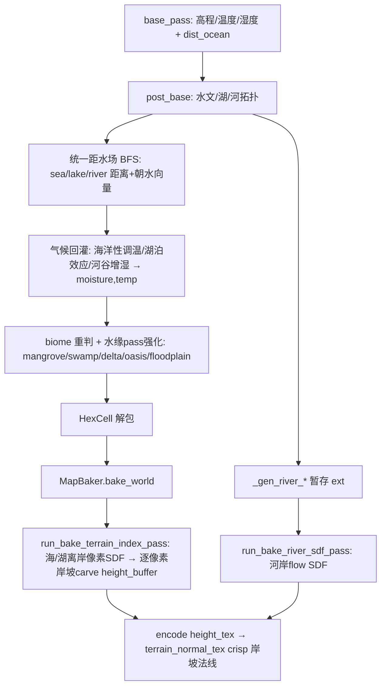

# 水体（海/湖/河）地理·气候·生态系统性影响 — 实施计划（导出版）

> 来源：CodeBuddy plan `e10550d682a04323b5620b2fb048ff41`。
> 本文件供新对话实施使用。**先读「实施备注与行号校正」一节再动手**，里面有经真实工具验证的锚点和踩坑提醒。

---

## 需求确认（用户已拍板的范围）

- **Q1 = A 系统性一版**：岸坡几何 carve + 海/湖/河距水场驱动气候(增湿/调温) + 由此影响 biome 分类，全链路打通（不是只做视觉法线）。
- **Q2**：海/湖/大河统一一套「距水距离场(BFS距离+朝水方向)」，湖泊产生湖滨增湿带、河流产生河谷湿润带(riparian)，影响温/湿；不再用现有简单邻接加成。
- **Q3**：生态群系按地理合理性判断，缺关键类型就补。探索结论：水缘 biome 枚举已较全，**仅缺独立「河岸林 riparian」语义**，优先复用 FLOODPLAIN(29)+VEG.MARSH/SWAMP 表达，不新增 enum。

---

## 产品概述

为程序化世界生成补齐"水体（海洋/湖泊/河流）对地形、气候与生态群系的系统性影响"，让海岸、湖岸获得与河岸同级的立体岸坡法线，并让水体真实驱动周边的湿度、温度与生物群系分布，使地图更符合自然地理规律。

## 核心功能

- **统一距水场**：海洋/湖泊/大河共用一套"到水体距离 + 朝水方向"场，区分水体类型，作为气候与生态的统一信号源。
- **岸坡几何**：海岸/湖岸在烘焙层按距水距离逐像素刻出有宽度的连续岸坡（陆侧上坡、水侧不动），让海岸/湖岸法线像河岸一样清晰。
- **水体气候效应**：
  - 海洋性调温（近海冬暖夏凉、内陆大陆度增强）；
  - 湖泊效应（湖滨局地增湿与温度调节）；
  - 河谷湿润带（沿河 riparian 增湿）。
- **生态群系联动**：湿度/温度变化驱动地形-地貌-植被-覆被分类自然涌现；用新距水场强化现有水缘群系（红树林/沼泽/三角洲/绿洲/泛滥平原），缺关键的"河岸林"语义则补齐。
- **可调与可回退**：所有新增效应参数化（含默认值），并保留旧路径回退与开关。

## 验收要点

- 海岸/湖岸出现可见且连续的岸坡明暗（法线 crisp 度接近河岸）。
- 湖滨/河谷出现合理的湿润带与对应群系，内陆更干、近海更温和。
- 生物群系分布更丰富且地理自洽，无明显失衡或异常斑块。

## 技术栈

- **C++ GDExtension**（`gdext/src/world_ext.cpp` / `world_ext.h` / `world_ext_bind_methods.cpp`）：承载全部 O(n_cells)/O(n_pixels) 热循环（距水 BFS、气候回灌、bake 岸坡 carve）。
- **GDScript**（`scripts/geography/map_generator.gd`、`scripts/rendering/map_baker.gd`）：仅"发请求 + 解包"，native-first 探测 + 旧路径回退。
- **并行设施**：`gdext/src/parallel_dispatcher.h` 的 `pk::parallel_for_range`（bake per-pixel 岸坡并行）。
- **设计文档**：`docs/cpp-dots-runtime/computation-pipelines.md`（改完必须同步状态表/专节/I-O 契约/旋钮表）。

> 架构铁律（map-generation-pipeline）：生成三阶段 = GDScript 发请求 → C++ 算全部 → GDScript 只解包。改 C++ 后必须 rebuild DLL + 重启 Godot；本机不能编译则写好 C++ + wrapper 交用户编译。

## 实现策略

分三层、复用现有钩子、最小爆炸半径：

1. **统一距水场（cell 级，地基）**：在 post_base（湖/河已判定后）用多源 BFS（复用 base pass `dist_ocean` 与 wind pass `coast_dist` 的成熟思路）构建"到最近水体的格距 + 朝水单位向量"，并用 source 标记区分 **海洋 / 湖泊 / 大河（RFLOW 达标）**。这是把"湖/河"提升到与"海洋"同级气候信号的关键——现状湖/河仅靠简单邻接加成。距水场 O(n_cells)、开销可忽略。

2. **气候回灌（moisture/temperature）**：用距水场按"距离指数衰减"叠加：
   - 海洋性调温：沿用/扩展 `land_continentality`(1.55) 与 `coast_dist` 热效应，使近海调温、远海大陆度增强；
   - 湖泊效应：新增湖滨增湿带（类比沿海湿度地板 `floor_m`，但源换成湖）+ 局地温度调节；
   - 河谷 riparian 增湿：沿 `HAS_RIV`/大河距水场抬湿，取代现状仅 +0.012 蒸发钩子。
   - 关键：**理顺与现有 `dist_ocean`/`coast_dist`/沿海湿度地板/大陆度衰减的叠加关系，避免重复计/冲突**，全部参数化 knobs（默认值保守，可一键回退）。

3. **生态联动**：moisture/temp 改变后 biome 经 `pk_decide_terrain_ex`/`pk_derive_*` 自然涌现；同时用新距水场强化现成水缘 pass（mangrove/swamp/delta/oasis/floodplain-riparian）的触发条件。探索确认水缘枚举已较全（MANGROVE/SWAMP/REEF/KELP/DELTA/OASIS/MOOR/FLOODPLAIN），**仅缺独立"河岸林 riparian"语义** → 优先复用 FLOODPLAIN(29)+VEG.MARSH/SWAMP 表达，确有必要再补映射（不新增 enum 值，避免连锁改色表/图集）。

4. **bake 岸坡 carve（per-pixel，决定法线）**：在 `run_bake_terrain_index_pass`（或几何融合 pass）内新增"海/湖统一离岸像素距离 SDF"，按距离以 `notch=smoothstep` 逐像素 carve `height_buffer`（陆侧上坡、止于水线），与河流 #2a（`run_bake_river_sdf_pass`）同法。替换现状仅 1 像素带的 `PK_COAST_BEACH=0.05` 海滩 carve。用 `pk::parallel_for_range` 并行（terrain-index ~517ms 单线程是最大热点）。可顺带调陡双峰 `PK_CONT_MARGIN` 提升海岸 cell 落差到背景之上。

### 性能与可靠性

- 距水 BFS：O(n_cells)，多源队列一次遍历，<5ms 量级。
- bake 岸坡：O(n_pixels)，并行后预计与 terrain-index 同数量级或更低；像素距水 SDF 可限制最大搜索半径（如 ≤8px）控制开销。
- 气候回灌：纯逐格 ALU 叠加，无额外空间采样。
- 全部新增带 knobs 开关与默认回退；融合 pass 保留"融合优先 + 旧路径回退"，DLL 未 rebuild 时仍可跑。

## 架构与数据流



## 目录结构（受影响文件）

```
Project.Keynes/
├── gdext/src/
│   ├── world_ext.cpp              # [MODIFY] ① post_base 新增统一距水场(多源BFS,sea/lake/river source标记,距离+朝水向量)；
│   │                              #         ② 气候回灌(湖滨/河谷增湿带+海洋性/湖泊效应调温,knobs参数化)；
│   │                              #         ③ 强化水缘pass(mangrove/swamp/delta/oasis/floodplain)用新距水场触发；
│   │                              #         ④ bake层(run_bake_terrain_index_pass)新增海/湖离岸像素SDF+逐像素岸坡carve,替换PK_COAST_BEACH；
│   │                              #         按需导出 hydro_fill(湖面高程)供湖滨场。遵循buffer-encoder范式,初始fallback=true。
│   ├── world_ext.h                # [MODIFY] 新增 pass/方法声明 + 距水场ext成员(如_gen_water_dist/_gen_water_dir)。
│   └── world_ext_bind_methods.cpp # [MODIFY] ClassDB::bind_method 绑定新增方法。
├── Project/project-keynes/scripts/
│   ├── geography/map_generator.gd # [MODIFY] base/post_base wrapper 透传距水场/气候 knobs,native-first+解包。
│   └── rendering/map_baker.gd     # [MODIFY] bake wrapper 透传岸坡carve knobs;保留融合优先回退。
└── docs/cpp-dots-runtime/
    └── computation-pipelines.md   # [MODIFY] 状态表新增pass + 专节 + 旋钮表 + I/O契约。
```

## 关键数据契约（距水场，新增 ext 成员/导出）

- `water_dist[i]` (int/float)：cell i 到最近水体的格距（INF=远内陆）。
- `water_dir_x/y[i]` (float)：朝最近水体的单位向量（继承自最近水源）。
- `water_src_kind[i]` (uint8)：最近水源类型（0=海/1=湖/2=大河），区分海洋性 vs 湖泊效应 vs 河谷增湿。
- （可选）导出 `hydro_fill`/湖面高程：当前被丢弃（局部 vector），若湖滨距离场/库容反馈需要则新增导出。
- 新增 knobs：`water_dist_max`、`lake_moist_floor`/`lake_moist_scale`、`river_riparian_gain`/`river_riparian_scale`、`lake_temp_moderation`、`shore_carve_amp`/`shore_carve_band`、`PK_CONT_MARGIN`(调陡)。

---

## Todo 清单（6 项，按依赖排序）

1. **water-dist-field**：在 world_ext.cpp 的 post_base 新增"海/湖/大河统一距水场"：多源 BFS 输出距水格距 + 朝水向量 + 水源类型标记，新增 ext 成员与导出，按需导出 hydro_fill 湖面高程。（无依赖）
2. **climate-reflow**：用距水场回灌 moisture/temperature：湖滨增湿带、河谷 riparian 增湿、海洋性与湖泊效应调温；参数化 knobs+默认值，理顺与 dist_ocean/coast_dist/沿海湿度地板/大陆度衰减的叠加。（依赖 1）
3. **ecology-biome**：强化水缘 pass（mangrove/swamp/delta/oasis/floodplain）以新距水场触发，验证 biome 自然涌现；按地理合理性补"河岸林 riparian"映射（优先复用 FLOODPLAIN+MARSH，不新增 enum）。（依赖 2）
4. **bake-shore-carve**：在 run_bake_terrain_index_pass 新增海/湖统一离岸像素 SDF，按距离逐像素刻连续岸坡 carve height_buffer（对标河流 #2a），替换 1 像素带 PK_COAST_BEACH，用 pk::parallel_for_range 并行；可调陡 PK_CONT_MARGIN。（无依赖，可与 1/2/3 并行）
5. **binding-wrapper**：三处同步绑定新增方法（world_ext.h/.cpp/bind_methods），更新 map_generator.gd 与 map_baker.gd 的 native-first wrapper 透传 knobs 并解包，保留融合优先+旧路径回退。（依赖 1/2/3/4）
6. **doc-lint-verify**：更新 computation-pipelines.md，read_lints 两侧 0 错，grep 校验方法名跨文件对齐，输出验证清单（融合日志/无 fallback/CSV 量化水陆高差与湿度梯度/AB 对比）。（依赖 5）

---

## ⚠️ 实施备注与行号校正（经真实工具验证 / 待核实）

> 上一轮探索中部分行号由我口述、存在偏差。下面把**已用工具真实核对过**的锚点与**需新对话重新核实**的分开列出。所有行号以 `world_ext.cpp` 为准，且**该文件较大**——见下方读取注意事项。

### 已真实验证的锚点（可信）

- **post_base 函数定义**：`DCWorldExt::run_native_world_generate_post_base_pass(int seed, const Dictionary &cfg, ...)` 起始于 **第 14922 行**。
  - ⚠️ 注意：上一轮我曾说过"post_base 从 14186 开始 / 入参是 `const Dictionary &input`"——**那是错的**，请忽略。14186 附近其实是 base pass 的海洋深度/侵蚀逻辑。
- **base pass 统一气候场**：14701–14823。其中：
  - `dist_ocean` 多源 BFS：14706–14724（源 = `E[i] < sea_level`，此阶段湖泊尚未判定）。
  - `gen_temp` lambda（含 `ocean_influence` 海洋调温）：14732–14737。
  - 盛行风纬向湿度平流：14739–14774。
  - 全向沿海湿度地板 `floor_m = moisture_land_base + coastal_moist_floor*exp(-dd/scale)`：14797–14808。
  - 副热带干旱带：14810–14823。
  - 初判地形 `pk_decide_terrain_ex(..., permanent_only=true)`：14826 起。
- **post_base 水文/湖/河关键点**：
  - `hydro_fill`（溢出水位，局部 `std::vector<float>`，**目前用完即弃**）声明 **15272**；`hydro_parent` 15273；`hydro_order` 15274。Priority-Flood 填充在 15281–15299。
  - 湖泊判定 `TERR[v] = 18 (LAKE)` 写入点：**15357**（小水洼排干 reclassify 在 15360–15373）。
  - `BM[i] = M[i]` 基础湿度快照（rain-shadow 前）：**15378**。
  - rain-shadow + biome redecide（用 `gen_temp` 重判）：15392–15433。
  - flow accumulation：15441–15457。河流标记 `RIV[i]=1`（汇水阈值 channel_init）：15463–15479；源头补充 15480 起。
  - 河道下切 incision：15587–15597。
  - 河口 DELTA：15602–15615。
  - 河流穿沙漠 riparian buffer（沿河 DESERT/STEPPE→FLOODPLAIN）：15617–15638（FLOODPLAIN 写入 15661）。
  - 另一段 desert river ecology（SWAMP/FLOODPLAIN/OASIS/STEPPE buffer）：约 15642–15653。
  - 火山标记：15668–15680。
  - **水缘生态群系 pass 注释块起点**：15682–15686（mangrove/reef/kelp/pelagic）。mangrove 循环 15689 起。
  - 河流拓扑暂存到 ext（`_gen_river_*`）：16557–16580；`out[...]` 导出数组在 16540–16556。
  - `return out;`：16582。
- **post_base 工作指针真实命名**（裸指针，hot loop）：`Q,R`(int32_t const*)、`E`(float*)、`TERR`(uint8_t*)、`M`(float*)、`IW`(uint8_t* is_water)、`RIV`(uint8_t* has_river)、`RFLOW_OUT`(float* river_flow)、`RDOWN`(int32_t* downstream)、`HPARENT_OUT`(int32_t*)、`HAS_VOLC`(uint8_t*)、`NB`(int32_t* n*6 邻居)。辅助：`index_for_qr(q,r)`、`DQ/DR`、`gen_temp(i)`、`row_norm(i)`、`land_h(i)`、`sea_level`、`pk_is_water_terrain(t)`、`n`、`land`(vector<int> 陆地索引)。
  - ⚠️ 但**指针声明块的精确行号/逐字文本尚未读到**（在 14922 函数体内、约 15000–15270 某处）。动手前请先真实读出该块，作为新增代码的插入锚点。
- **ext 成员 `_gen_river_*` 声明**：`world_ext.h` 1900–1912（新 `_gen_water_*` 成员并排加在此处）。
- **bake 海岸 carve `PK_COAST_BEACH=0.05`**（1 像素带海滩 carve）：world_ext.cpp 约 20217–20231（`run_bake_terrain_index_pass` 内 #6.6）。

### 待新对话重新核实的行号（上一轮来自子代理报告，可能偏差）

- 水缘各 pass 的精确行号：swamp / delta / oasis / reef-kelp-pelagic 的具体起止（报告给的 15755/15827/15845/15990 等与真实读到的 delta=15602、mangrove≈15689 有出入，**以真实 grep 为准**）。
- `run_bake_river_sdf_pass`（河流 SDF，#2a 参照实现）的行号（报告 19241–19379）。
- 分类纯函数 `pk_decide_terrain_ex`(报告 13570–13615) / `pk_derive_landform`/`pk_derive_vegetation`/`pk_whittaker_vegetation`/`pk_derive_cover` 的行号。
- enum 定义文件：`scripts/geography/terrain_type.gd`、`vegetation_type.gd`、`landform_type.gd`、`cover_type.gd`（成员清单见下）。

### 生态枚举现状（探索结论，新对话可直接用，建议再核一次成员值）

- TerrainType：含 OCEAN0/COAST1/.../SWAMP10/MANGROVE16/LAKE18/REEF19/KELP21/DELTA22/OASIS23/SALT_FLAT24/MOOR28/FLOODPLAIN29 等（共约 31 项）。
- VegetationType：含 MANGROVE19/SWAMP20/MARSH21/KELP_FOREST22/CORAL_REEF23/SEAGRASS26/PEAT_BOG27/OASIS_VEG18 等。
- LandformType：DEEP_OCEAN0/OCEAN1/COAST2/LAKE3 为 is_water。
- **缺口**：无独立 riparian「河岸林」enum，仅作局部修复逻辑 → 计划复用 FLOODPLAIN+MARSH，不新增 enum。

### 读取该文件的注意事项（重要，避免重蹈覆辙）

- `world_ext.cpp` 很大，`read_file` 偶尔会**返回摘要/省略**（出现 `// ...`、`(rest omitted)` 等）——这种结果**不可作为编辑锚点**，需换 offset 重读或缩小范围直到拿到逐字内容。
- 本机 **PowerShell 有 GBK 编码问题**，不要用 PowerShell 读含中文注释的源码；要用命令行核对请用 **python（需先激活 conda 环境）** 以 utf-8 读取。
- 改 C++ 后**本机不一定能编译**：按架构铁律写好 C++ + GDScript wrapper，交用户 rebuild DLL + 重启 Godot 验证。

### 验证清单（交付后看日志）

- `geometry fields (fused C++): Xms` + `[fused] terrain=.. erosion=.. river=.. ...`
- 无 `fallback` / `push_error` / `phys_field_nan_guard>0`。
- 视觉 A/B：海岸/湖岸法线 crisp 度接近河岸；湖滨/河谷湿润带与 biome 分布地理自洽。
- 可复用 `tmp/tile_data_record_*.csv` 重建邻接，量化水陆边界高差与湿度梯度。
